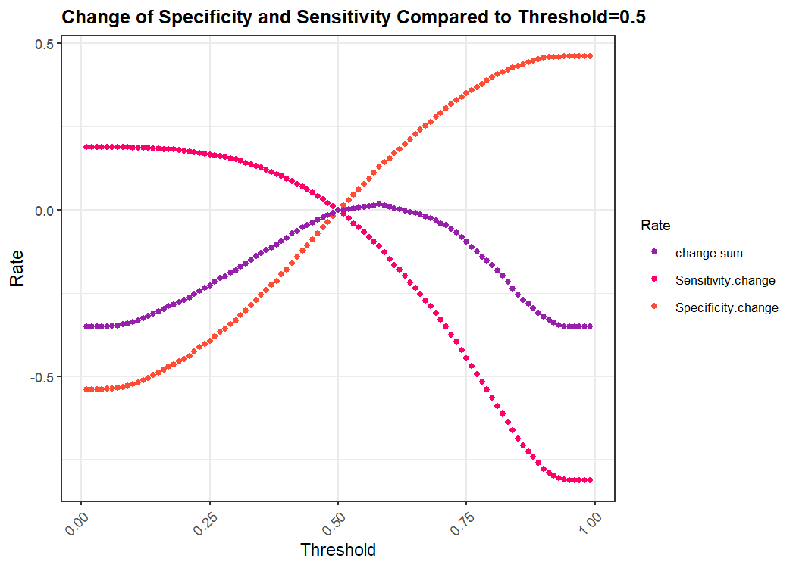

<style>
.kable thead tr th, .table thead tr th {
  text-align: left !important;}
table.kable, table.table {
  width: 100% !important;}
  body {
  line-height: 1.6;
  font-size: 16px
}
</style>


# Discussion

- Sensitivity：high cost, ruin others life
- Specificity：let go of criminals

# Plot of Variables


```r
# Recode dependent variable and reclassify categorical variables
dat <- dat %>%
  mutate(Recidivism_Within_3years = as.character(Recidivism_Within_3years)) %>%
  mutate(Recidivism_Within_3years = as.factor(recode(Recidivism_Within_3years,
    `FALSE` = "0",
    `TRUE` = "1"))) %>%
  mutate(Education_Level = factor(case_when(
    Education_Level %in% c('At least some college') ~ 'At least some college',
    Education_Level %in% c('Less than HS diploma', 'High School Diploma') ~ 'High School or Less'),
    levels = c('High School or Less', 'At least some college'))) %>%
  mutate(Prior_Arrest_Episodes_Felony = factor(case_when(
    Prior_Arrest_Episodes_Felony %in% c('0', '1', '2') ~ '0-2',
    Prior_Arrest_Episodes_Felony %in% c('3', '4', '5', '6', '7', '8', '9') ~ '3 to 9',
    Prior_Arrest_Episodes_Felony %in% c('10 or more') ~ '10 or more'),
    levels = c('0-2', '3 to 9', '10 or more'))) %>%
  mutate(Delinquency_Reports = factor(case_when(
    Delinquency_Reports %in% c('0') ~ '0',
    Delinquency_Reports %in% c('1', '2', '3', '4 or more') ~ '1 or more'))) %>%
  mutate(Program_Attendances = factor(case_when(
    Program_Attendances %in% c('0') ~ '0',
    Program_Attendances %in% c('1', '2', '3', '4', '5', '6', '7', '8', '9') ~ '1 to 9',
    Program_Attendances %in% c('10 or more') ~ '10 or more'))) %>%
  mutate(Program_UnexcusedAbsences = factor(case_when(
    Program_UnexcusedAbsences %in% c('0') ~ '0',
    Program_UnexcusedAbsences %in% c('1', '2', '3 or more') ~ '1 or more')))
```

**Dependent Variable:**  
- Recidivism_Within_3years

**Categorical Variables:**
- Gender  
- Race  
- Age_at_Release  
- Education_Level (Reclassified)  
- Dependents  
- Prior_Arrest_Episodes_Felony (Reclassified)  
- Condition_MH_SA  
- Condition_Cog_Ed  
- Condition_Other  
- Delinquency_Reports (Reclassified)  
- Program_Attendances (Reclassified)  
- Program_UnexcusedAbsences (Reclassified)  
- Employment_Exempt


```r
# Plot categorical variables
## Percent
dat %>%
  select(Recidivism_Within_3years,
         Gender,
         Race,
         Age_at_Release,
         Education_Level,
         Dependents,
         Prior_Arrest_Episodes_Felony,
         Condition_MH_SA,
         Condition_Cog_Ed,
         Condition_Other,
         Delinquency_Reports,
         Program_Attendances,
         Program_UnexcusedAbsences,
         Employment_Exempt) %>%
  gather(Variable, value, -Recidivism_Within_3years) %>%
  count(Variable, value, Recidivism_Within_3years) %>%
  group_by(Variable, value) %>%
  mutate(percent = round(n/sum(n)*100, digits = 2)) %>%
  ungroup() %>%
    ggplot(., aes(value, percent, fill = Recidivism_Within_3years)) +   
        geom_bar(position = "dodge", stat="identity") +
        facet_wrap(~Variable, ncol = 4, scales="free") +
        scale_fill_manual(values = palette2) +
        labs(x="Recidivism", y="Percentage",
             title = "Feature associations with the likelihood of Recidivism Within Three Years",
             subtitle = "Categorical features") +
        theme_bw() +
  theme(plot.title = element_text(size = 12, face = "bold")) +
  theme(legend.title = element_text(size = 9),
        legend.text = element_text(size = 8)) +
        theme(axis.text.x = element_text(angle = 45, hjust = 1))
```

<!-- -->

```r
## Count
dat %>%
  select(Recidivism_Within_3years,
         Gender,
         Race,
         Age_at_Release,
         Education_Level,
         Dependents,
         Prior_Arrest_Episodes_Felony,
         Condition_MH_SA,
         Condition_Cog_Ed,
         Condition_Other,
         Delinquency_Reports,
         Program_Attendances,
         Program_UnexcusedAbsences,
         Employment_Exempt) %>%
  gather(Variable, value, -Recidivism_Within_3years) %>%
  count(Variable, value, Recidivism_Within_3years) %>%
    ggplot(., aes(value, n, fill = Recidivism_Within_3years)) +   
        geom_bar(position = "dodge", stat="identity") +
        facet_wrap(~Variable, ncol = 4, scales="free") +
        scale_fill_manual(values = palette2) +
        labs(x="Recidivism", y="Value",
             title = "Feature associations with the likelihood of Recidivism Within Three Years",
             subtitle = "Categorical features") +
        theme_bw() +
  theme(plot.title = element_text(size = 12, face = "bold")) +
  theme(legend.title = element_text(size = 9),
        legend.text = element_text(size = 8)) +
        theme(axis.text.x = element_text(angle = 45, hjust = 1))
```

<!-- -->

**Continuous Variables:**
- Supervision_Risk_Score_First  
- Percent_Days_Employed  
- Prison_Years (Categorical -> Continuous)  
- Prior_Arrest_Episodes_Misd (Categorical -> Continuous)  
- Prior_Conviction_Episodes_Felony (Categorical -> Continuous)  
- Prior_Conviction_Episodes_Misd (Categorical -> Continuous)


```r
# Transform categorical variables into continuous variables
dat <- dat %>%
  mutate(Percent_Days_Employed = round(Percent_Days_Employed * 100, digit = 2)) %>%
  mutate(Prison_Years = case_when(
    Prison_Years == "Less than 1 year" ~ "1",
    Prison_Years == "1-2 years" ~ "2",
    Prison_Years == "Greater than 2 to 3 years" ~ "3",
    Prison_Years == "More than 3 years" ~ "4")) %>%
  mutate(Prison_Years = as.numeric(Prison_Years)) %>%
  mutate(Prior_Arrest_Episodes_Misd = case_when(
    Prior_Arrest_Episodes_Misd == "6 or more" ~ "6",
    TRUE ~ Prior_Arrest_Episodes_Misd)) %>%
  mutate(Prior_Arrest_Episodes_Misd = as.numeric(Prior_Arrest_Episodes_Misd)) %>%
  mutate(Prior_Conviction_Episodes_Felony = case_when(
    Prior_Conviction_Episodes_Felony == "3 or more" ~ "3",
    TRUE ~ Prior_Conviction_Episodes_Felony)) %>%
  mutate(Prior_Conviction_Episodes_Felony = as.numeric(Prior_Conviction_Episodes_Felony)) %>%
  mutate(Prior_Conviction_Episodes_Misd = case_when(
    Prior_Conviction_Episodes_Misd == "4 or more" ~ "4",
    TRUE ~ Prior_Conviction_Episodes_Misd)) %>%
  mutate(Prior_Conviction_Episodes_Misd = as.numeric(Prior_Conviction_Episodes_Misd))

# Plot continuous variables
## Mean
dat %>%
  select(Supervision_Risk_Score_First,
         Percent_Days_Employed,
         Prison_Years,
         Prior_Arrest_Episodes_Misd,
         Prior_Conviction_Episodes_Felony,
         Prior_Conviction_Episodes_Misd,
         Recidivism_Within_3years) %>%
  filter_all(all_vars(!is.na(.))) %>%
  gather(Variable, value, -Recidivism_Within_3years) %>%
    ggplot(aes(Recidivism_Within_3years, value, fill=Recidivism_Within_3years)) + 
      geom_bar(position = "dodge", stat = "summary", fun = "mean") + 
      facet_wrap(~Variable, scales = "free") +
      scale_fill_manual(values = palette2) +
      labs(x="Recidivism", y="Value", 
           title = "Feature associations with the likelihood of Recidivism Within Three Years",
           subtitle = "Continuous features") +
       theme_bw() +
  theme(plot.title = element_text(size = 12, face = "bold")) +
  theme(legend.title = element_text(size = 9),
        legend.text = element_text(size = 8)) +
        theme(axis.text.x = element_text(angle = 45, hjust = 1))
```

<!-- -->

```r
## Density
dat %>%
   select(Supervision_Risk_Score_First,
         Percent_Days_Employed,
         Prison_Years,
         Prior_Arrest_Episodes_Misd,
         Prior_Conviction_Episodes_Felony,
         Prior_Conviction_Episodes_Misd,
         Recidivism_Within_3years) %>%
    filter_all(all_vars(!is.na(.))) %>%
    gather(Variable, value, -Recidivism_Within_3years) %>%
    ggplot() + 
    geom_density(aes(value, color=Recidivism_Within_3years), fill = "transparent") + 
    facet_wrap(~Variable, scales = "free") +
    scale_fill_manual(values = palette2) +
    labs(title = "Feature distributions of Recidivism Within Three Years vs. NO Recidivism Within Three Years",
         subtitle = "Continuous features") +
  theme_bw() +
  theme(plot.title = element_text(size = 12, face = "bold")) +
  theme(legend.title = element_text(size = 9),
        legend.text = element_text(size = 8)) +
        theme(axis.text.x = element_text(angle = 45, hjust = 1))
```

<!-- -->

# Model Develop


```r
# Initial variable selection
## Build dataset
dat <- dat %>%
  select(Gender, Race, Age_at_Release, Education_Level, Dependents, Prior_Arrest_Episodes_Felony,
         Condition_MH_SA, Condition_Cog_Ed, Condition_Other, Delinquency_Reports, Program_Attendances,
         Program_UnexcusedAbsences, Employment_Exempt, Supervision_Risk_Score_First, Percent_Days_Employed,
         Prison_Years, Prior_Arrest_Episodes_Misd, Prior_Conviction_Episodes_Felony, Prior_Conviction_Episodes_Misd,
         Recidivism_Within_3years) %>%
filter_all(all_vars(!is.na(.)))

## Split dataset
set.seed(1)
trainIndex <- createDataPartition(dat$Recidivism_Within_3years, p = .50,
                                  list = FALSE,
                                  times = 1)
dat.train <- dat[trainIndex,]
dat.test  <- dat[-trainIndex,]

## Remove insignificant variables based on sensitivity and specificity
mod1 <- glm(Recidivism_Within_3years ~ .,
                 data = dat.train,
                 na.action = na.exclude,
                 family = binomial("logit"))

testProbs <- data.frame(Outcome = as.factor(dat.test$Recidivism_Within_3years),
                        Probs = predict(mod1, dat.test, type= "response")) %>% ### Test probabilities
  mutate(predOutcome  = as.factor(ifelse(Probs > 0.5 , "1", "0"))) ### Set thresholds
100 * prop.table(table(Observed = testProbs$Outcome, Predicted = testProbs$predOutcome), margin = 1)

### Remove Race
mod2 <- glm(Recidivism_Within_3years ~ . -Race,
                 data = dat.train,
                 na.action = na.exclude,
                 family = binomial("logit"))

testProbs <- data.frame(Outcome = as.factor(dat.test$Recidivism_Within_3years),
                        Probs = predict(mod2, dat.test, type= "response")) %>% ### Test probabilities
  mutate(predOutcome  = as.factor(ifelse(Probs > 0.5 , "1", "0"))) ### Set thresholds
100 * prop.table(table(Observed = testProbs$Outcome, Predicted = testProbs$predOutcome), margin = 1)

### Remove Delinquency_Reports
mod3 <- glm(Recidivism_Within_3years ~ . -Race -Delinquency_Reports,
                 data = dat.train,
                 na.action = na.exclude,
                 family = binomial("logit"))

testProbs <- data.frame(Outcome = as.factor(dat.test$Recidivism_Within_3years),
                        Probs = predict(mod3, dat.test, type= "response")) %>% ### Test probabilities
  mutate(predOutcome  = as.factor(ifelse(Probs > 0.5 , "1", "0"))) ### Set thresholds
100 * prop.table(table(Observed = testProbs$Outcome, Predicted = testProbs$predOutcome), margin = 1)

### Remove Employment_Exempt
mod4 <- glm(Recidivism_Within_3years ~ . -Race -Delinquency_Reports -Employment_Exempt,
                 data = dat.train,
                 na.action = na.exclude,
                 family = binomial("logit"))

testProbs <- data.frame(Outcome = as.factor(dat.test$Recidivism_Within_3years),
                        Probs = predict(mod4, dat.test, type= "response")) %>% ### Test probabilities
  mutate(predOutcome  = as.factor(ifelse(Probs > 0.5 , "1", "0"))) ### Set thresholds
100 * prop.table(table(Observed = testProbs$Outcome, Predicted = testProbs$predOutcome), margin = 1)

### Remove Prior_Conviction_Episodes_Felony
mod5 <- glm(Recidivism_Within_3years ~ . -Race -Delinquency_Reports -Employment_Exempt
            -Prior_Conviction_Episodes_Felony,
                 data = dat.train,
                 na.action = na.exclude,
                 family = binomial("logit"))

testProbs <- data.frame(Outcome = as.factor(dat.test$Recidivism_Within_3years),
                        Probs = predict(mod5, dat.test, type= "response")) %>% ### Test probabilities
  mutate(predOutcome  = as.factor(ifelse(Probs > 0.5 , 1, 0))) ### Set thresholds
100 * prop.table(table(Observed = testProbs$Outcome, Predicted = testProbs$predOutcome), margin = 1)
```

# Result Interpretation


```r
stargazer(mod5, type = 'text', star.cutoffs = c(0.05, 0.01, 0.001))
```

```
## 
## ====================================================================
##                                             Dependent variable:     
##                                        -----------------------------
##                                          Recidivism_Within_3years   
## --------------------------------------------------------------------
## GenderM                                          0.446***           
##                                                   (0.061)           
##                                                                     
## Age_at_Release23-27                              -0.419***          
##                                                   (0.089)           
##                                                                     
## Age_at_Release28-32                              -0.761***          
##                                                   (0.094)           
##                                                                     
## Age_at_Release33-37                              -0.970***          
##                                                   (0.099)           
##                                                                     
## Age_at_Release38-42                              -1.182***          
##                                                   (0.107)           
##                                                                     
## Age_at_Release43-47                              -1.351***          
##                                                   (0.113)           
##                                                                     
## Age_at_Release48 or older                        -1.708***          
##                                                   (0.112)           
##                                                                     
## Education_LevelAt least some college              -0.105            
##                                                   (0.055)           
##                                                                     
## Dependents1                                        0.094            
##                                                   (0.057)           
##                                                                     
## Dependents2                                        0.005            
##                                                   (0.060)           
##                                                                     
## Dependents3 or more                                0.048            
##                                                   (0.053)           
##                                                                     
## Prior_Arrest_Episodes_Felony3 to 9               0.508***           
##                                                   (0.058)           
##                                                                     
## Prior_Arrest_Episodes_Felony10 or more           1.043***           
##                                                   (0.078)           
##                                                                     
## Condition_MH_SA                                  0.351***           
##                                                   (0.046)           
##                                                                     
## Condition_Cog_Ed                                  -0.042            
##                                                   (0.043)           
##                                                                     
## Condition_Other                                    0.030            
##                                                   (0.045)           
##                                                                     
## Program_Attendances1 to 9                        -0.163***          
##                                                   (0.048)           
##                                                                     
## Program_Attendances10 or more                    -0.644***          
##                                                   (0.072)           
##                                                                     
## Program_UnexcusedAbsences1 or more               0.274***           
##                                                   (0.060)           
##                                                                     
## Supervision_Risk_Score_First                     0.073***           
##                                                   (0.010)           
##                                                                     
## Percent_Days_Employed                            -0.011***          
##                                                  (0.0005)           
##                                                                     
## Prison_Years                                     -0.066**           
##                                                   (0.020)           
##                                                                     
## Prior_Arrest_Episodes_Misd                       0.078***           
##                                                   (0.014)           
##                                                                     
## Prior_Conviction_Episodes_Misd                   0.097***           
##                                                   (0.021)           
##                                                                     
## Constant                                           0.043            
##                                                   (0.130)           
##                                                                     
## --------------------------------------------------------------------
## Observations                                      12,451            
## Log Likelihood                                  -7,283.818          
## Akaike Inf. Crit.                               14,617.640          
## ====================================================================
## Note:                                  *p<0.05; **p<0.01; ***p<0.001
```
1. Model Result 

2. Most Risky Person


# ROC Curve

The ROC curve, gives us another visual "goodness of fit" metric. One that is a bit more tricky. You want to have a curve that is "above" the y=x line, which is where your prediction rates for positives and negatives are "no better than a coin flip". If it's too "square" - you are probably over fit. The Area-Under-The-Curve or "AUC" calculation below will help guide your understanding of the ROC curve


```r
pROC::auc(testProbs$Outcome, testProbs$Probs)
```

```
## Area under the curve: 0.7437
```


```r
# function from the book
iterateThresholds <- function(data, observedClass, predictedProbs, group) {
  observedClass <- enquo(observedClass)
  predictedProbs <- enquo(predictedProbs)
  group <- enquo(group)
  x = .01
  all_prediction <- data.frame()
  
  if (missing(group)) {
  
    while (x <= 1) {
    this_prediction <- data.frame()
    
    this_prediction <-
      data %>%
      mutate(predclass = ifelse(!!predictedProbs > x, 1,0)) %>%
      count(predclass, !!observedClass) %>%
      summarize(Count_TN = sum(n[predclass==0 & !!observedClass==0]),
                Count_TP = sum(n[predclass==1 & !!observedClass==1]),
                Count_FN = sum(n[predclass==0 & !!observedClass==1]),
                Count_FP = sum(n[predclass==1 & !!observedClass==0]),
                Rate_TP = Count_TP / (Count_TP + Count_FN),
                Rate_FP = Count_FP / (Count_FP + Count_TN),
                Rate_FN = Count_FN / (Count_FN + Count_TP),
                Rate_TN = Count_TN / (Count_TN + Count_FP),
                Accuracy = (Count_TP + Count_TN) / 
                           (Count_TP + Count_TN + Count_FN + Count_FP)) %>%
      mutate(Threshold = round(x,2))
    
    all_prediction <- rbind(all_prediction,this_prediction)
    x <- x + .01
  }
  return(all_prediction)
  }
  else if (!missing(group)) { 
   while (x <= 1) {
    this_prediction <- data.frame()
    
    this_prediction <-
      data %>%
      mutate(predclass = ifelse(!!predictedProbs > x, 1,0)) %>%
      group_by(!!group) %>%
      count(predclass, !!observedClass) %>%
      summarize(Count_TN = sum(n[predclass==0 & !!observedClass==0]),
                Count_TP = sum(n[predclass==1 & !!observedClass==1]),
                Count_FN = sum(n[predclass==0 & !!observedClass==1]),
                Count_FP = sum(n[predclass==1 & !!observedClass==0]),
                Rate_TP = Count_TP / (Count_TP + Count_FN),
                Rate_FP = Count_FP / (Count_FP + Count_TN),
                Rate_FN = Count_FN / (Count_FN + Count_TP),
                Rate_TN = Count_TN / (Count_TN + Count_FP),
                Accuracy = (Count_TP + Count_TN) / 
                           (Count_TP + Count_TN + Count_FN + Count_FP)) %>%
      mutate(Threshold = round(x, 2))
    
    all_prediction <- rbind(all_prediction, this_prediction)
    x <- x + .01
  }
  return(all_prediction)
  }
}
```


```r
ggplot(testProbs, aes(d = as.numeric(Outcome), m = Probs)) +
  geom_roc(n.cuts = 50, labels = T, labelsize = 3,labelround = 2,colour = "#FE9900") +
  style_roc(theme = theme_grey) +
  geom_abline(slope = 1, intercept = 0, size = 1.5, color = 'grey') +
  labs(title = "ROC Curve - clickModel") +
    theme_bw() +
  theme(plot.title = element_text(size = 12, face = "bold")) +
  theme(legend.title = element_text(size = 9),
        legend.text = element_text(size = 8)) +
        theme(axis.text.x = element_text(angle = 45, hjust = 1))
```

<!-- -->

```r
# choose the threshold: 
# baseline (threshold =0.5): sensitivity = 0.8120290, specificity = 0.5394175
# a better one: sensitivity increase > specificity decrease
whichThreshold <- 
  iterateThresholds(data=testProbs, observedClass = Outcome, predictedProbs = Probs)

whichThreshold.nocost <- whichThreshold %>%
  dplyr::select(Rate_TP, Rate_TN, Threshold)%>%
  rename(Sensitivity = Rate_TP, Specificity = Rate_TN)%>%
  mutate(
    Sensitivity.change = Sensitivity - 0.8120290,
    Specificity.change = Specificity - 0.5394175
  )%>%
  mutate(change.sum = Sensitivity.change + Specificity.change)

#plot sensitivity and specificity
whichThreshold.nocost %>%
  select(Sensitivity, Specificity, Threshold)%>%
  gather(Variable, Rate, -Threshold) %>%
  ggplot(.,aes(Threshold, Rate, colour = Variable)) +
  geom_point() +
  scale_colour_manual(values = palette2) +    
  labs(title = "Specificity and Sensitivity by threshold",
       y = "Rate") +
  guides(colour=guide_legend(title = "Rate"))+
        theme_bw() +
  theme(plot.title = element_text(size = 12, face = "bold")) +
  theme(legend.title = element_text(size = 9),
        legend.text = element_text(size = 8)) +
        theme(axis.text.x = element_text(angle = 45, hjust = 1)) 
```

<!-- -->

```r
#plot the changes
whichThreshold.nocost %>%
  select(Sensitivity.change, Specificity.change, change.sum, Threshold)%>%
  gather(Variable, Rate, -Threshold) %>%
  ggplot(.,aes(Threshold, Rate, colour = Variable)) +
  geom_point() +
  scale_colour_manual(values = palette3) +    
  labs(title = "Change of Specificity and Sensitivity Compared to Threshold=0.5",
       y = "Rate") +
  guides(colour=guide_legend(title = "Rate"))+
        theme_bw() +
  theme(plot.title = element_text(size = 12, face = "bold")) +
  theme(legend.title = element_text(size = 9),
        legend.text = element_text(size = 8)) +
        theme(axis.text.x = element_text(angle = 45, hjust = 1)) 
```

<!-- -->

```r
# table the change
whichThreshold.nocost %>%
  select(Threshold, Sensitivity.change, Specificity.change, change.sum)%>%
  kable() %>%
    kable_styling(bootstrap_options = c("striped", "hover"),
                full_width = T) %>%
  column_spec(1:3, extra_css = "text-align: left;")
```

<table class="table table-striped table-hover" style="color: black; margin-left: auto; margin-right: auto;">
 <thead>
  <tr>
   <th style="text-align:right;"> Threshold </th>
   <th style="text-align:right;"> Sensitivity.change </th>
   <th style="text-align:right;"> Specificity.change </th>
   <th style="text-align:right;"> change.sum </th>
  </tr>
 </thead>
<tbody>
  <tr>
   <td style="text-align:right;text-align: left;"> 0.01 </td>
   <td style="text-align:right;text-align: left;"> 0.1879710 </td>
   <td style="text-align:right;text-align: left;"> -0.5394175 </td>
   <td style="text-align:right;"> -0.3514465 </td>
  </tr>
  <tr>
   <td style="text-align:right;text-align: left;"> 0.02 </td>
   <td style="text-align:right;text-align: left;"> 0.1879710 </td>
   <td style="text-align:right;text-align: left;"> -0.5394175 </td>
   <td style="text-align:right;"> -0.3514465 </td>
  </tr>
  <tr>
   <td style="text-align:right;text-align: left;"> 0.03 </td>
   <td style="text-align:right;text-align: left;"> 0.1879710 </td>
   <td style="text-align:right;text-align: left;"> -0.5394175 </td>
   <td style="text-align:right;"> -0.3514465 </td>
  </tr>
  <tr>
   <td style="text-align:right;text-align: left;"> 0.04 </td>
   <td style="text-align:right;text-align: left;"> 0.1878340 </td>
   <td style="text-align:right;text-align: left;"> -0.5394175 </td>
   <td style="text-align:right;"> -0.3515835 </td>
  </tr>
  <tr>
   <td style="text-align:right;text-align: left;"> 0.05 </td>
   <td style="text-align:right;text-align: left;"> 0.1878340 </td>
   <td style="text-align:right;text-align: left;"> -0.5380583 </td>
   <td style="text-align:right;"> -0.3502243 </td>
  </tr>
  <tr>
   <td style="text-align:right;text-align: left;"> 0.06 </td>
   <td style="text-align:right;text-align: left;"> 0.1876970 </td>
   <td style="text-align:right;text-align: left;"> -0.5374758 </td>
   <td style="text-align:right;"> -0.3497788 </td>
  </tr>
  <tr>
   <td style="text-align:right;text-align: left;"> 0.07 </td>
   <td style="text-align:right;text-align: left;"> 0.1876970 </td>
   <td style="text-align:right;text-align: left;"> -0.5359224 </td>
   <td style="text-align:right;"> -0.3482254 </td>
  </tr>
  <tr>
   <td style="text-align:right;text-align: left;"> 0.08 </td>
   <td style="text-align:right;text-align: left;"> 0.1874230 </td>
   <td style="text-align:right;text-align: left;"> -0.5324272 </td>
   <td style="text-align:right;"> -0.3450042 </td>
  </tr>
  <tr>
   <td style="text-align:right;text-align: left;"> 0.09 </td>
   <td style="text-align:right;text-align: left;"> 0.1871490 </td>
   <td style="text-align:right;text-align: left;"> -0.5287379 </td>
   <td style="text-align:right;"> -0.3415889 </td>
  </tr>
  <tr>
   <td style="text-align:right;text-align: left;"> 0.10 </td>
   <td style="text-align:right;text-align: left;"> 0.1867380 </td>
   <td style="text-align:right;text-align: left;"> -0.5231068 </td>
   <td style="text-align:right;"> -0.3363689 </td>
  </tr>
  <tr>
   <td style="text-align:right;text-align: left;"> 0.11 </td>
   <td style="text-align:right;text-align: left;"> 0.1859159 </td>
   <td style="text-align:right;text-align: left;"> -0.5188350 </td>
   <td style="text-align:right;"> -0.3329191 </td>
  </tr>
  <tr>
   <td style="text-align:right;text-align: left;"> 0.12 </td>
   <td style="text-align:right;text-align: left;"> 0.1853679 </td>
   <td style="text-align:right;text-align: left;"> -0.5118447 </td>
   <td style="text-align:right;"> -0.3264768 </td>
  </tr>
  <tr>
   <td style="text-align:right;text-align: left;"> 0.13 </td>
   <td style="text-align:right;text-align: left;"> 0.1850939 </td>
   <td style="text-align:right;text-align: left;"> -0.5046602 </td>
   <td style="text-align:right;"> -0.3195663 </td>
  </tr>
  <tr>
   <td style="text-align:right;text-align: left;"> 0.14 </td>
   <td style="text-align:right;text-align: left;"> 0.1839979 </td>
   <td style="text-align:right;text-align: left;"> -0.4957282 </td>
   <td style="text-align:right;"> -0.3117303 </td>
  </tr>
  <tr>
   <td style="text-align:right;text-align: left;"> 0.15 </td>
   <td style="text-align:right;text-align: left;"> 0.1831758 </td>
   <td style="text-align:right;text-align: left;"> -0.4891262 </td>
   <td style="text-align:right;"> -0.3059504 </td>
  </tr>
  <tr>
   <td style="text-align:right;text-align: left;"> 0.16 </td>
   <td style="text-align:right;text-align: left;"> 0.1824908 </td>
   <td style="text-align:right;text-align: left;"> -0.4817476 </td>
   <td style="text-align:right;"> -0.2992568 </td>
  </tr>
  <tr>
   <td style="text-align:right;text-align: left;"> 0.17 </td>
   <td style="text-align:right;text-align: left;"> 0.1818058 </td>
   <td style="text-align:right;text-align: left;"> -0.4722330 </td>
   <td style="text-align:right;"> -0.2904273 </td>
  </tr>
  <tr>
   <td style="text-align:right;text-align: left;"> 0.18 </td>
   <td style="text-align:right;text-align: left;"> 0.1804357 </td>
   <td style="text-align:right;text-align: left;"> -0.4644660 </td>
   <td style="text-align:right;"> -0.2840303 </td>
  </tr>
  <tr>
   <td style="text-align:right;text-align: left;"> 0.19 </td>
   <td style="text-align:right;text-align: left;"> 0.1782436 </td>
   <td style="text-align:right;text-align: left;"> -0.4566991 </td>
   <td style="text-align:right;"> -0.2784554 </td>
  </tr>
  <tr>
   <td style="text-align:right;text-align: left;"> 0.20 </td>
   <td style="text-align:right;text-align: left;"> 0.1772846 </td>
   <td style="text-align:right;text-align: left;"> -0.4481554 </td>
   <td style="text-align:right;"> -0.2708708 </td>
  </tr>
  <tr>
   <td style="text-align:right;text-align: left;"> 0.21 </td>
   <td style="text-align:right;text-align: left;"> 0.1745445 </td>
   <td style="text-align:right;text-align: left;"> -0.4388350 </td>
   <td style="text-align:right;"> -0.2642905 </td>
  </tr>
  <tr>
   <td style="text-align:right;text-align: left;"> 0.22 </td>
   <td style="text-align:right;text-align: left;"> 0.1729004 </td>
   <td style="text-align:right;text-align: left;"> -0.4252427 </td>
   <td style="text-align:right;"> -0.2523423 </td>
  </tr>
  <tr>
   <td style="text-align:right;text-align: left;"> 0.23 </td>
   <td style="text-align:right;text-align: left;"> 0.1702973 </td>
   <td style="text-align:right;text-align: left;"> -0.4133981 </td>
   <td style="text-align:right;"> -0.2431007 </td>
  </tr>
  <tr>
   <td style="text-align:right;text-align: left;"> 0.24 </td>
   <td style="text-align:right;text-align: left;"> 0.1679683 </td>
   <td style="text-align:right;text-align: left;"> -0.4033010 </td>
   <td style="text-align:right;"> -0.2353327 </td>
  </tr>
  <tr>
   <td style="text-align:right;text-align: left;"> 0.25 </td>
   <td style="text-align:right;text-align: left;"> 0.1653652 </td>
   <td style="text-align:right;text-align: left;"> -0.3943690 </td>
   <td style="text-align:right;"> -0.2290038 </td>
  </tr>
  <tr>
   <td style="text-align:right;text-align: left;"> 0.26 </td>
   <td style="text-align:right;text-align: left;"> 0.1630361 </td>
   <td style="text-align:right;text-align: left;"> -0.3796117 </td>
   <td style="text-align:right;"> -0.2165756 </td>
  </tr>
  <tr>
   <td style="text-align:right;text-align: left;"> 0.27 </td>
   <td style="text-align:right;text-align: left;"> 0.1609810 </td>
   <td style="text-align:right;text-align: left;"> -0.3671845 </td>
   <td style="text-align:right;"> -0.2062035 </td>
  </tr>
  <tr>
   <td style="text-align:right;text-align: left;"> 0.28 </td>
   <td style="text-align:right;text-align: left;"> 0.1575559 </td>
   <td style="text-align:right;text-align: left;"> -0.3576699 </td>
   <td style="text-align:right;"> -0.2001141 </td>
  </tr>
  <tr>
   <td style="text-align:right;text-align: left;"> 0.29 </td>
   <td style="text-align:right;text-align: left;"> 0.1544048 </td>
   <td style="text-align:right;text-align: left;"> -0.3440777 </td>
   <td style="text-align:right;"> -0.1896729 </td>
  </tr>
  <tr>
   <td style="text-align:right;text-align: left;"> 0.30 </td>
   <td style="text-align:right;text-align: left;"> 0.1508426 </td>
   <td style="text-align:right;text-align: left;"> -0.3324272 </td>
   <td style="text-align:right;"> -0.1815846 </td>
  </tr>
  <tr>
   <td style="text-align:right;text-align: left;"> 0.31 </td>
   <td style="text-align:right;text-align: left;"> 0.1475545 </td>
   <td style="text-align:right;text-align: left;"> -0.3176699 </td>
   <td style="text-align:right;"> -0.1701154 </td>
  </tr>
  <tr>
   <td style="text-align:right;text-align: left;"> 0.32 </td>
   <td style="text-align:right;text-align: left;"> 0.1415263 </td>
   <td style="text-align:right;text-align: left;"> -0.3034952 </td>
   <td style="text-align:right;"> -0.1619689 </td>
  </tr>
  <tr>
   <td style="text-align:right;text-align: left;"> 0.33 </td>
   <td style="text-align:right;text-align: left;"> 0.1365941 </td>
   <td style="text-align:right;text-align: left;"> -0.2879612 </td>
   <td style="text-align:right;"> -0.1513671 </td>
  </tr>
  <tr>
   <td style="text-align:right;text-align: left;"> 0.34 </td>
   <td style="text-align:right;text-align: left;"> 0.1316619 </td>
   <td style="text-align:right;text-align: left;"> -0.2708738 </td>
   <td style="text-align:right;"> -0.1392119 </td>
  </tr>
  <tr>
   <td style="text-align:right;text-align: left;"> 0.35 </td>
   <td style="text-align:right;text-align: left;"> 0.1260447 </td>
   <td style="text-align:right;text-align: left;"> -0.2563107 </td>
   <td style="text-align:right;"> -0.1302660 </td>
  </tr>
  <tr>
   <td style="text-align:right;text-align: left;"> 0.36 </td>
   <td style="text-align:right;text-align: left;"> 0.1207015 </td>
   <td style="text-align:right;text-align: left;"> -0.2425243 </td>
   <td style="text-align:right;"> -0.1218228 </td>
  </tr>
  <tr>
   <td style="text-align:right;text-align: left;"> 0.37 </td>
   <td style="text-align:right;text-align: left;"> 0.1128922 </td>
   <td style="text-align:right;text-align: left;"> -0.2266020 </td>
   <td style="text-align:right;"> -0.1137097 </td>
  </tr>
  <tr>
   <td style="text-align:right;text-align: left;"> 0.38 </td>
   <td style="text-align:right;text-align: left;"> 0.1072750 </td>
   <td style="text-align:right;text-align: left;"> -0.2135923 </td>
   <td style="text-align:right;"> -0.1063172 </td>
  </tr>
  <tr>
   <td style="text-align:right;text-align: left;"> 0.39 </td>
   <td style="text-align:right;text-align: left;"> 0.1020688 </td>
   <td style="text-align:right;text-align: left;"> -0.1949515 </td>
   <td style="text-align:right;"> -0.0928827 </td>
  </tr>
  <tr>
   <td style="text-align:right;text-align: left;"> 0.40 </td>
   <td style="text-align:right;text-align: left;"> 0.0937115 </td>
   <td style="text-align:right;text-align: left;"> -0.1792233 </td>
   <td style="text-align:right;"> -0.0855118 </td>
  </tr>
  <tr>
   <td style="text-align:right;text-align: left;"> 0.41 </td>
   <td style="text-align:right;text-align: left;"> 0.0867243 </td>
   <td style="text-align:right;text-align: left;"> -0.1588350 </td>
   <td style="text-align:right;"> -0.0721107 </td>
  </tr>
  <tr>
   <td style="text-align:right;text-align: left;"> 0.42 </td>
   <td style="text-align:right;text-align: left;"> 0.0774079 </td>
   <td style="text-align:right;text-align: left;"> -0.1419418 </td>
   <td style="text-align:right;"> -0.0645339 </td>
  </tr>
  <tr>
   <td style="text-align:right;text-align: left;"> 0.43 </td>
   <td style="text-align:right;text-align: left;"> 0.0705577 </td>
   <td style="text-align:right;text-align: left;"> -0.1234952 </td>
   <td style="text-align:right;"> -0.0529375 </td>
  </tr>
  <tr>
   <td style="text-align:right;text-align: left;"> 0.44 </td>
   <td style="text-align:right;text-align: left;"> 0.0605563 </td>
   <td style="text-align:right;text-align: left;"> -0.1067961 </td>
   <td style="text-align:right;"> -0.0462399 </td>
  </tr>
  <tr>
   <td style="text-align:right;text-align: left;"> 0.45 </td>
   <td style="text-align:right;text-align: left;"> 0.0512399 </td>
   <td style="text-align:right;text-align: left;"> -0.0895146 </td>
   <td style="text-align:right;"> -0.0382746 </td>
  </tr>
  <tr>
   <td style="text-align:right;text-align: left;"> 0.46 </td>
   <td style="text-align:right;text-align: left;"> 0.0406906 </td>
   <td style="text-align:right;text-align: left;"> -0.0712622 </td>
   <td style="text-align:right;"> -0.0305716 </td>
  </tr>
  <tr>
   <td style="text-align:right;text-align: left;"> 0.47 </td>
   <td style="text-align:right;text-align: left;"> 0.0315112 </td>
   <td style="text-align:right;text-align: left;"> -0.0539806 </td>
   <td style="text-align:right;"> -0.0224694 </td>
  </tr>
  <tr>
   <td style="text-align:right;text-align: left;"> 0.48 </td>
   <td style="text-align:right;text-align: left;"> 0.0206878 </td>
   <td style="text-align:right;text-align: left;"> -0.0376699 </td>
   <td style="text-align:right;"> -0.0169821 </td>
  </tr>
  <tr>
   <td style="text-align:right;text-align: left;"> 0.49 </td>
   <td style="text-align:right;text-align: left;"> 0.0101384 </td>
   <td style="text-align:right;text-align: left;"> -0.0188350 </td>
   <td style="text-align:right;"> -0.0086966 </td>
  </tr>
  <tr>
   <td style="text-align:right;text-align: left;"> 0.50 </td>
   <td style="text-align:right;text-align: left;"> 0.0000000 </td>
   <td style="text-align:right;text-align: left;"> 0.0000000 </td>
   <td style="text-align:right;"> 0.0000000 </td>
  </tr>
  <tr>
   <td style="text-align:right;text-align: left;"> 0.51 </td>
   <td style="text-align:right;text-align: left;"> -0.0127414 </td>
   <td style="text-align:right;text-align: left;"> 0.0132039 </td>
   <td style="text-align:right;"> 0.0004624 </td>
  </tr>
  <tr>
   <td style="text-align:right;text-align: left;"> 0.52 </td>
   <td style="text-align:right;text-align: left;"> -0.0267159 </td>
   <td style="text-align:right;text-align: left;"> 0.0289320 </td>
   <td style="text-align:right;"> 0.0022161 </td>
  </tr>
  <tr>
   <td style="text-align:right;text-align: left;"> 0.53 </td>
   <td style="text-align:right;text-align: left;"> -0.0406905 </td>
   <td style="text-align:right;text-align: left;"> 0.0452427 </td>
   <td style="text-align:right;"> 0.0045522 </td>
  </tr>
  <tr>
   <td style="text-align:right;text-align: left;"> 0.54 </td>
   <td style="text-align:right;text-align: left;"> -0.0534319 </td>
   <td style="text-align:right;text-align: left;"> 0.0600000 </td>
   <td style="text-align:right;"> 0.0065680 </td>
  </tr>
  <tr>
   <td style="text-align:right;text-align: left;"> 0.55 </td>
   <td style="text-align:right;text-align: left;"> -0.0668584 </td>
   <td style="text-align:right;text-align: left;"> 0.0761165 </td>
   <td style="text-align:right;"> 0.0092581 </td>
  </tr>
  <tr>
   <td style="text-align:right;text-align: left;"> 0.56 </td>
   <td style="text-align:right;text-align: left;"> -0.0819290 </td>
   <td style="text-align:right;text-align: left;"> 0.0935922 </td>
   <td style="text-align:right;"> 0.0116632 </td>
  </tr>
  <tr>
   <td style="text-align:right;text-align: left;"> 0.57 </td>
   <td style="text-align:right;text-align: left;"> -0.0967255 </td>
   <td style="text-align:right;text-align: left;"> 0.1106796 </td>
   <td style="text-align:right;"> 0.0139541 </td>
  </tr>
  <tr>
   <td style="text-align:right;text-align: left;"> 0.58 </td>
   <td style="text-align:right;text-align: left;"> -0.1108371 </td>
   <td style="text-align:right;text-align: left;"> 0.1279611 </td>
   <td style="text-align:right;"> 0.0171241 </td>
  </tr>
  <tr>
   <td style="text-align:right;text-align: left;"> 0.59 </td>
   <td style="text-align:right;text-align: left;"> -0.1289217 </td>
   <td style="text-align:right;text-align: left;"> 0.1421359 </td>
   <td style="text-align:right;"> 0.0132142 </td>
  </tr>
  <tr>
   <td style="text-align:right;text-align: left;"> 0.60 </td>
   <td style="text-align:right;text-align: left;"> -0.1475544 </td>
   <td style="text-align:right;text-align: left;"> 0.1549514 </td>
   <td style="text-align:right;"> 0.0073970 </td>
  </tr>
  <tr>
   <td style="text-align:right;text-align: left;"> 0.61 </td>
   <td style="text-align:right;text-align: left;"> -0.1660501 </td>
   <td style="text-align:right;text-align: left;"> 0.1699029 </td>
   <td style="text-align:right;"> 0.0038528 </td>
  </tr>
  <tr>
   <td style="text-align:right;text-align: left;"> 0.62 </td>
   <td style="text-align:right;text-align: left;"> -0.1812577 </td>
   <td style="text-align:right;text-align: left;"> 0.1821359 </td>
   <td style="text-align:right;"> 0.0008782 </td>
  </tr>
  <tr>
   <td style="text-align:right;text-align: left;"> 0.63 </td>
   <td style="text-align:right;text-align: left;"> -0.1989313 </td>
   <td style="text-align:right;text-align: left;"> 0.1966990 </td>
   <td style="text-align:right;"> -0.0022323 </td>
  </tr>
  <tr>
   <td style="text-align:right;text-align: left;"> 0.64 </td>
   <td style="text-align:right;text-align: left;"> -0.2179750 </td>
   <td style="text-align:right;text-align: left;"> 0.2102912 </td>
   <td style="text-align:right;"> -0.0076838 </td>
  </tr>
  <tr>
   <td style="text-align:right;text-align: left;"> 0.65 </td>
   <td style="text-align:right;text-align: left;"> -0.2349636 </td>
   <td style="text-align:right;text-align: left;"> 0.2260194 </td>
   <td style="text-align:right;"> -0.0089443 </td>
  </tr>
  <tr>
   <td style="text-align:right;text-align: left;"> 0.66 </td>
   <td style="text-align:right;text-align: left;"> -0.2537333 </td>
   <td style="text-align:right;text-align: left;"> 0.2401942 </td>
   <td style="text-align:right;"> -0.0135392 </td>
  </tr>
  <tr>
   <td style="text-align:right;text-align: left;"> 0.67 </td>
   <td style="text-align:right;text-align: left;"> -0.2729141 </td>
   <td style="text-align:right;text-align: left;"> 0.2528155 </td>
   <td style="text-align:right;"> -0.0200985 </td>
  </tr>
  <tr>
   <td style="text-align:right;text-align: left;"> 0.68 </td>
   <td style="text-align:right;text-align: left;"> -0.2896287 </td>
   <td style="text-align:right;text-align: left;"> 0.2634951 </td>
   <td style="text-align:right;"> -0.0261335 </td>
  </tr>
  <tr>
   <td style="text-align:right;text-align: left;"> 0.69 </td>
   <td style="text-align:right;text-align: left;"> -0.3104534 </td>
   <td style="text-align:right;text-align: left;"> 0.2784466 </td>
   <td style="text-align:right;"> -0.0320069 </td>
  </tr>
  <tr>
   <td style="text-align:right;text-align: left;"> 0.70 </td>
   <td style="text-align:right;text-align: left;"> -0.3312782 </td>
   <td style="text-align:right;text-align: left;"> 0.2904854 </td>
   <td style="text-align:right;"> -0.0407928 </td>
  </tr>
  <tr>
   <td style="text-align:right;text-align: left;"> 0.71 </td>
   <td style="text-align:right;text-align: left;"> -0.3515550 </td>
   <td style="text-align:right;text-align: left;"> 0.3046602 </td>
   <td style="text-align:right;"> -0.0468948 </td>
  </tr>
  <tr>
   <td style="text-align:right;text-align: left;"> 0.72 </td>
   <td style="text-align:right;text-align: left;"> -0.3748458 </td>
   <td style="text-align:right;text-align: left;"> 0.3182524 </td>
   <td style="text-align:right;"> -0.0565934 </td>
  </tr>
  <tr>
   <td style="text-align:right;text-align: left;"> 0.73 </td>
   <td style="text-align:right;text-align: left;"> -0.3974517 </td>
   <td style="text-align:right;text-align: left;"> 0.3289320 </td>
   <td style="text-align:right;"> -0.0685196 </td>
  </tr>
  <tr>
   <td style="text-align:right;text-align: left;"> 0.74 </td>
   <td style="text-align:right;text-align: left;"> -0.4218386 </td>
   <td style="text-align:right;text-align: left;"> 0.3392233 </td>
   <td style="text-align:right;"> -0.0826153 </td>
  </tr>
  <tr>
   <td style="text-align:right;text-align: left;"> 0.75 </td>
   <td style="text-align:right;text-align: left;"> -0.4459515 </td>
   <td style="text-align:right;text-align: left;"> 0.3495145 </td>
   <td style="text-align:right;"> -0.0964369 </td>
  </tr>
  <tr>
   <td style="text-align:right;text-align: left;"> 0.76 </td>
   <td style="text-align:right;text-align: left;"> -0.4700643 </td>
   <td style="text-align:right;text-align: left;"> 0.3586408 </td>
   <td style="text-align:right;"> -0.1114236 </td>
  </tr>
  <tr>
   <td style="text-align:right;text-align: left;"> 0.77 </td>
   <td style="text-align:right;text-align: left;"> -0.4944512 </td>
   <td style="text-align:right;text-align: left;"> 0.3679611 </td>
   <td style="text-align:right;"> -0.1264901 </td>
  </tr>
  <tr>
   <td style="text-align:right;text-align: left;"> 0.78 </td>
   <td style="text-align:right;text-align: left;"> -0.5180161 </td>
   <td style="text-align:right;text-align: left;"> 0.3761165 </td>
   <td style="text-align:right;"> -0.1418996 </td>
  </tr>
  <tr>
   <td style="text-align:right;text-align: left;"> 0.79 </td>
   <td style="text-align:right;text-align: left;"> -0.5402109 </td>
   <td style="text-align:right;text-align: left;"> 0.3873786 </td>
   <td style="text-align:right;"> -0.1528323 </td>
  </tr>
  <tr>
   <td style="text-align:right;text-align: left;"> 0.80 </td>
   <td style="text-align:right;text-align: left;"> -0.5641868 </td>
   <td style="text-align:right;text-align: left;"> 0.3972815 </td>
   <td style="text-align:right;"> -0.1669053 </td>
  </tr>
  <tr>
   <td style="text-align:right;text-align: left;"> 0.81 </td>
   <td style="text-align:right;text-align: left;"> -0.5889847 </td>
   <td style="text-align:right;text-align: left;"> 0.4067961 </td>
   <td style="text-align:right;"> -0.1821887 </td>
  </tr>
  <tr>
   <td style="text-align:right;text-align: left;"> 0.82 </td>
   <td style="text-align:right;text-align: left;"> -0.6118646 </td>
   <td style="text-align:right;text-align: left;"> 0.4139806 </td>
   <td style="text-align:right;"> -0.1978840 </td>
  </tr>
  <tr>
   <td style="text-align:right;text-align: left;"> 0.83 </td>
   <td style="text-align:right;text-align: left;"> -0.6370735 </td>
   <td style="text-align:right;text-align: left;"> 0.4205825 </td>
   <td style="text-align:right;"> -0.2164910 </td>
  </tr>
  <tr>
   <td style="text-align:right;text-align: left;"> 0.84 </td>
   <td style="text-align:right;text-align: left;"> -0.6626935 </td>
   <td style="text-align:right;text-align: left;"> 0.4260194 </td>
   <td style="text-align:right;"> -0.2366741 </td>
  </tr>
  <tr>
   <td style="text-align:right;text-align: left;"> 0.85 </td>
   <td style="text-align:right;text-align: left;"> -0.6868064 </td>
   <td style="text-align:right;text-align: left;"> 0.4308738 </td>
   <td style="text-align:right;"> -0.2559326 </td>
  </tr>
  <tr>
   <td style="text-align:right;text-align: left;"> 0.86 </td>
   <td style="text-align:right;text-align: left;"> -0.7080422 </td>
   <td style="text-align:right;text-align: left;"> 0.4370874 </td>
   <td style="text-align:right;"> -0.2709548 </td>
  </tr>
  <tr>
   <td style="text-align:right;text-align: left;"> 0.87 </td>
   <td style="text-align:right;text-align: left;"> -0.7254418 </td>
   <td style="text-align:right;text-align: left;"> 0.4421359 </td>
   <td style="text-align:right;"> -0.2833059 </td>
  </tr>
  <tr>
   <td style="text-align:right;text-align: left;"> 0.88 </td>
   <td style="text-align:right;text-align: left;"> -0.7428414 </td>
   <td style="text-align:right;text-align: left;"> 0.4466019 </td>
   <td style="text-align:right;"> -0.2962395 </td>
  </tr>
  <tr>
   <td style="text-align:right;text-align: left;"> 0.89 </td>
   <td style="text-align:right;text-align: left;"> -0.7613371 </td>
   <td style="text-align:right;text-align: left;"> 0.4510679 </td>
   <td style="text-align:right;"> -0.3102692 </td>
  </tr>
  <tr>
   <td style="text-align:right;text-align: left;"> 0.90 </td>
   <td style="text-align:right;text-align: left;"> -0.7780517 </td>
   <td style="text-align:right;text-align: left;"> 0.4557281 </td>
   <td style="text-align:right;"> -0.3223236 </td>
  </tr>
  <tr>
   <td style="text-align:right;text-align: left;"> 0.91 </td>
   <td style="text-align:right;text-align: left;"> -0.7898342 </td>
   <td style="text-align:right;text-align: left;"> 0.4586408 </td>
   <td style="text-align:right;"> -0.3311934 </td>
  </tr>
  <tr>
   <td style="text-align:right;text-align: left;"> 0.92 </td>
   <td style="text-align:right;text-align: left;"> -0.7990135 </td>
   <td style="text-align:right;text-align: left;"> 0.4594175 </td>
   <td style="text-align:right;"> -0.3395961 </td>
  </tr>
  <tr>
   <td style="text-align:right;text-align: left;"> 0.93 </td>
   <td style="text-align:right;text-align: left;"> -0.8065488 </td>
   <td style="text-align:right;text-align: left;"> 0.4600000 </td>
   <td style="text-align:right;"> -0.3465488 </td>
  </tr>
  <tr>
   <td style="text-align:right;text-align: left;"> 0.94 </td>
   <td style="text-align:right;text-align: left;"> -0.8103849 </td>
   <td style="text-align:right;text-align: left;"> 0.4603883 </td>
   <td style="text-align:right;"> -0.3499966 </td>
  </tr>
  <tr>
   <td style="text-align:right;text-align: left;"> 0.95 </td>
   <td style="text-align:right;text-align: left;"> -0.8118920 </td>
   <td style="text-align:right;text-align: left;"> 0.4605825 </td>
   <td style="text-align:right;"> -0.3513095 </td>
  </tr>
  <tr>
   <td style="text-align:right;text-align: left;"> 0.96 </td>
   <td style="text-align:right;text-align: left;"> -0.8120290 </td>
   <td style="text-align:right;text-align: left;"> 0.4605825 </td>
   <td style="text-align:right;"> -0.3514465 </td>
  </tr>
  <tr>
   <td style="text-align:right;text-align: left;"> 0.97 </td>
   <td style="text-align:right;text-align: left;"> -0.8120290 </td>
   <td style="text-align:right;text-align: left;"> 0.4605825 </td>
   <td style="text-align:right;"> -0.3514465 </td>
  </tr>
  <tr>
   <td style="text-align:right;text-align: left;"> 0.98 </td>
   <td style="text-align:right;text-align: left;"> -0.8120290 </td>
   <td style="text-align:right;text-align: left;"> 0.4605825 </td>
   <td style="text-align:right;"> -0.3514465 </td>
  </tr>
  <tr>
   <td style="text-align:right;text-align: left;"> 0.99 </td>
   <td style="text-align:right;text-align: left;"> -0.8120290 </td>
   <td style="text-align:right;text-align: left;"> 0.4605825 </td>
   <td style="text-align:right;"> -0.3514465 </td>
  </tr>
</tbody>
</table>

```r
# -> result: threshold 0.5
```

# Confusion Matrix

Each threshold (e.g. a probability above which a prediction is a "click" and below which it's a "no click") has it's own rate of error. These errors can be classified in four ways for a binary model.

A "confusion matrix" for the threshold of 50% shows us the rate at which we got True Positives (aka Sensitivity), False Positives, True Negatives (aka Specificity) and False Negatives for that threshold.


```r
testProbs <- 
  testProbs %>%
  mutate(predOutcome  = as.factor(ifelse(testProbs$Probs > 0.5 , 1, 0)))

caret::confusionMatrix(testProbs$predOutcome, testProbs$Outcome, 
                       positive = "1")
```

```
## Confusion Matrix and Statistics
## 
##           Reference
## Prediction    0    1
##          0 2778 1372
##          1 2372 5927
##                                                
##                Accuracy : 0.6993               
##                  95% CI : (0.6911, 0.7073)     
##     No Information Rate : 0.5863               
##     P-Value [Acc > NIR] : < 0.00000000000000022
##                                                
##                   Kappa : 0.3618               
##                                                
##  Mcnemar's Test P-Value : < 0.00000000000000022
##                                                
##             Sensitivity : 0.8120               
##             Specificity : 0.5394               
##          Pos Pred Value : 0.7142               
##          Neg Pred Value : 0.6694               
##              Prevalence : 0.5863               
##          Detection Rate : 0.4761               
##    Detection Prevalence : 0.6666               
##       Balanced Accuracy : 0.6757               
##                                                
##        'Positive' Class : 1                    
## 
```
1. cell meaning

2. accuracy

3. sensitivity and specificity


# Error and Equity Discussion


```r
testProbs2 <- 
  data.frame(class = as.numeric(as.character(dat.test$Recidivism_Within_3years)),
             probs = predict(mod5, dat.test, type = "response"),
             Race = dat.test$Race,
             Gender = dat.test$Gender)%>%
  mutate(Race.Gender = paste(Race, Gender, sep = "-"))

# plot error by race
testProbs.thresholds <- 
  iterateThresholds(data=testProbs2, observedClass = class, 
                    predictedProbs = probs, group = Race)

filter(testProbs.thresholds, Threshold == .5)  %>%
  dplyr::select(Accuracy, Race, starts_with("Rate")) %>%
  gather(Variable, Value, -Race) %>%
  ggplot(aes(Variable, Value, fill = Race)) +
  geom_bar(aes(fill = Race), position = "dodge", stat = "identity",colour = "white") +
  geom_text(aes(label = sprintf("%.2f", Value)),                      # Add labels
            position = position_dodge(width = 0.9), vjust = -0.5, size = 3) +
  scale_fill_manual(values = palette2) +
  labs(title="Confusion matrix rates by race",
       subtitle = "50% threshold", x = "Outcome",y = "Rate") +
  theme(axis.text.x = element_text(angle = 45, hjust = 1)) +
        theme_bw() +
  theme(plot.title = element_text(size = 12, face = "bold")) +
  theme(legend.title = element_text(size = 9),
        legend.text = element_text(size = 8)) +
        theme(axis.text.x = element_text(angle = 45, hjust = 1))
```

<!-- -->

```r
# plot error by race and gender
testProbs.thresholds <- 
  iterateThresholds(data=testProbs2, observedClass = class, 
                    predictedProbs = probs, group = Race.Gender)

filter(testProbs.thresholds, Threshold == .5)  %>%
  dplyr::select(Accuracy, Race.Gender, starts_with("Rate")) %>%
  gather(Variable, Value, -Race.Gender) %>%
  ggplot(aes(Variable, Value, fill = Race.Gender)) +
  geom_bar(aes(fill = Race.Gender), position = "dodge", stat = "identity",colour = "white") +
  geom_text(aes(label = sprintf("%.2f", Value)),
            position = position_dodge(width = 0.9), vjust = -0.5, size = 3) +
  scale_fill_manual(values = palette4) +
  labs(title="Confusion matrix rates by race and gender",
       subtitle = "50% threshold", x = "Outcome",y = "Rate") +
  theme(axis.text.x = element_text(angle = 45, hjust = 1)) +
        theme_bw() +
  theme(plot.title = element_text(size = 12, face = "bold")) +
  theme(legend.title = element_text(size = 9),
        legend.text = element_text(size = 8)) +
        theme(axis.text.x = element_text(angle = 45, hjust = 1))
```

<!-- -->


# Cost-Benifit Analysis

- Average cost of keeping someone in prison for a year: $40,000  
- Average cost of arrest and trial for a recidivist: $10,000   
- Average cost of a crime committed by a recidivist: $50,000
- Average compensation for wrongful incarceration: $50,000

**True negative Cost**: "An individual is predicted not to recidivate and indeed does not recidivate." - No cost
**True positive Cost**: "An individual is predicted to recidivate and then does recidivate." - $40k 
**False negative Cost**: "An individual is predicted not to recidivate but then does recidivate." - $100k
**False positive Cost**: "An individual is predicted to recidivate but does not actually recidivate." - $50k


```r
whichThreshold.cost <- whichThreshold %>%
  dplyr::select(starts_with("Count"), Threshold) %>%
  mutate(Cost.TN = Count_TN*0,
         Cost.TP = Count_TP*40,
         Cost.FN = Count_FN*100,
         Cost.FP = Count_FP*50,
         Cost.all = Cost.TN + Cost.TP + Cost.FN + Cost.FP)%>%
  select(starts_with("Cost"), Threshold)%>%
  gather(Variable, Cost, -Threshold)

whichThreshold.cost %>%
  ggplot(.,aes(Threshold, Cost, colour = Variable)) +
  geom_point() +
  scale_colour_manual(values = palette5) +    
  labs(title = "Cost by confusion matrix type and threshold",
       y = "Cost") +
  guides(colour=guide_legend(title = "Confusion Matrix"))+
        theme_bw() +
  theme(plot.title = element_text(size = 12, face = "bold")) +
  theme(legend.title = element_text(size = 9),
        legend.text = element_text(size = 8)) +
        theme(axis.text.x = element_text(angle = 45, hjust = 1)) 
```

<!-- -->

```r
threshold.cost <- whichThreshold.cost%>%
  filter(Variable == 'Cost.all')

#-> lowest cost when threshold = 0.49
```


# Conclusion


