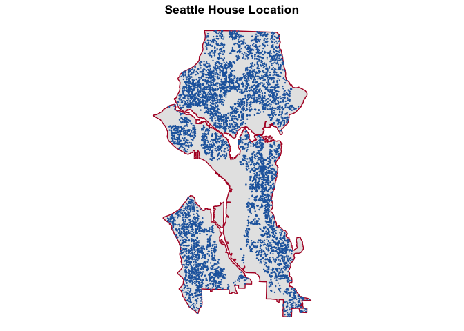
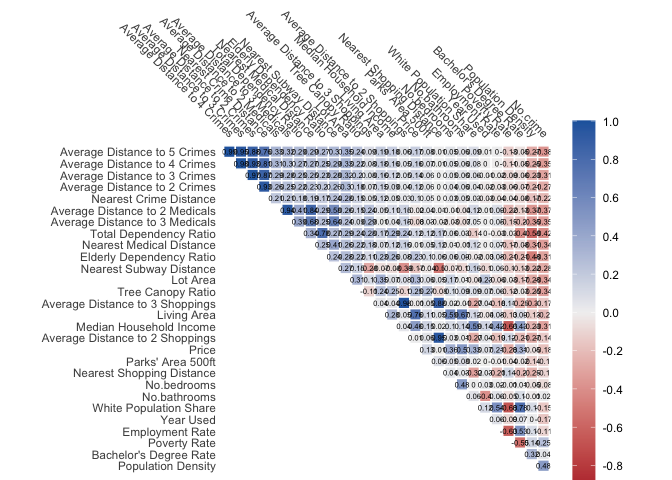
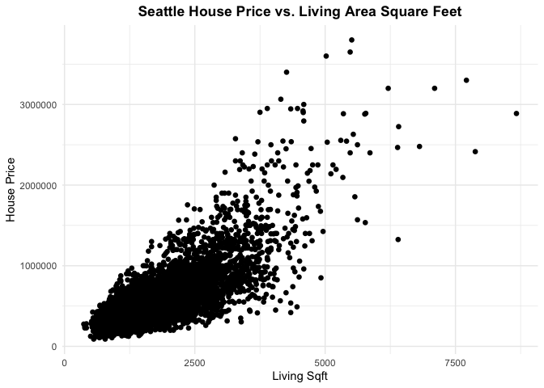
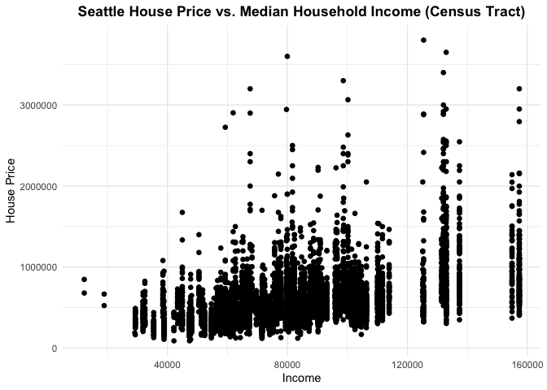
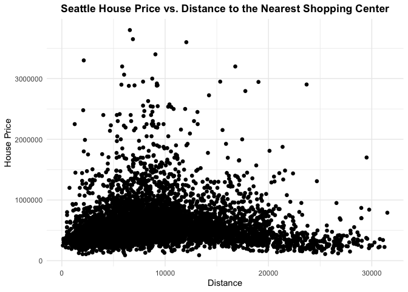
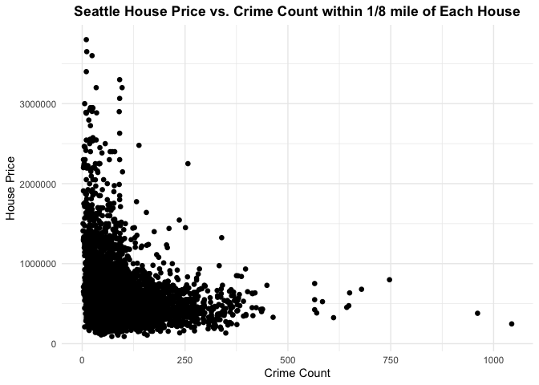
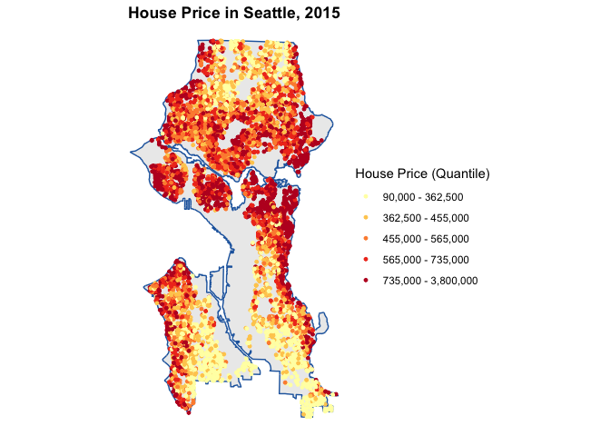
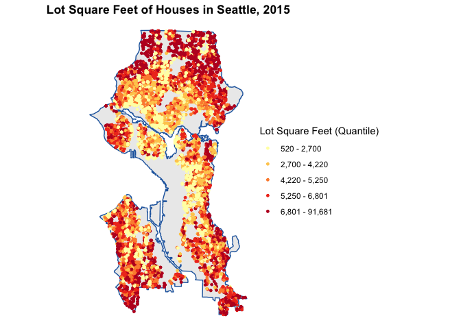

# Introduction

**Viva and Yaohan work together on the scripts, and then finish the write-up separately.**

- Analysis goal:

- Methods for data collection:

- Data source:

- Study area:  
Housing unit in Seattle, exclude one housing unit with an extremely high price over 7 million.

- Import all datasets

```r
# read Seattle boundary
seattle <- st_read(here::here("data/raw/Boundary/Seattle_City.geojson")) %>%
  st_union() %>%
  st_as_sf() 

# import house data
kc_hh<- read_csv(here::here("data/raw/kc_house_data.csv"))

# load census tract data
census_api_key("3ec2bee8c227ff3f9df970d0ffbb11ee1384076e", install = TRUE, overwrite = TRUE)

acs_variable_list.2015 <- load_variables(2015, # year
                                         "acs5", # five year ACS estimates
                                         cache = TRUE)

acs_vars <- c("B01003_001E", # total population
              "B01001A_001E", # white alone
              "B01001_003E", # male under 5
              "B01001_004E", # male 5-9
              "B01001_005E", # male 10-14
              "B01001_020E", # male 65-66
              "B01001_021E", # male 67-69
              "B01001_022E", # male 70-74
              "B01001_023E", # male 75-79
              "B01001_024E", # male 80-84
              "B01001_025E", # male over 85
              "B01001_027E", # female under 5
              "B01001_028E", # female 5-9
              "B01001_029E", # female 10-14
              "B01001_044E", # female 65-66
              "B01001_045E", # female 67-69
              "B01001_046E", # female 70-74
              "B01001_047E", # female 75-79
              "B01001_048E", # female 80-84
              "B01001_049E", # female over 85
              "B15003_001E", # educational attainment over 25
              "B15003_022E", # bachelor's degree
              "B19013_001E", # median household income
              "B23025_004E", # employed labor force
              "B23025_003E", # total labor force
              "B17020_002E") # income below poverty level

# read amenities data
sub <- st_read(here::here("data/raw/Amenities/Metro_Sub_Stations_in_King_County___sub_stations_point.geojson"))

sch <- st_read(here::here("data/raw/Amenities/Seattle_School_Board_Director_Districts___dirdst_area.geojson"))

park<-st_read(here::here("data/raw/Amenities/Parks_in_King_County___park_area.geojson"))

tree_canopy_2016 <- st_read(here::here("data/raw/Amenities/Tree_Canopy.geojson"))

med <- st_read(here::here("data/raw/Amenities/Medical_Facilities_including_Hospitals___medical_facilities_point.geojson"))

mark<- st_read(here::here("data/raw/Amenities/King_County_Landmarks___landmark_point.geojson"))

# read spatial data
neigh_large <- st_read(here::here("data/raw/Boundary/Neighborhood_Map_Atlas_Districts.geojson")) 

neigh_small <- st_read(here::here("data/raw/Boundary/Neighborhood_Map_Atlas_Neighborhoods.geojson"))
```

- Plot house locations in Seattle

```r
# create house location
kc_hh <- kc_hh %>%
  st_as_sf(coords = c("long", "lat"), crs = 4326, agr = "constant") %>%  # convert to sf object with specified CRS
  st_transform(st_crs(seattle)) %>%  # transform coordinate reference system to "Washington State Plane North"
  distinct()  # keep only distinct geometries

hh <- kc_hh %>%
  st_intersection(seattle)

# examine house id
hh.id<-length(unique(hh$id))#6691 < 6740

# add an unique key
hh$key <- 1:nrow(hh)

# exclude outliers with extremely high price
hh <- hh %>%
  filter(!price > 5000000)

ggplot() + 
  geom_sf(data = seattle, aes(fill = "Seattle Boundary"), color = NA) +  # Use fill for polygon, label "Legend"
  geom_sf(data = hh, aes(color = "Housing Units", shape = "Housing Units"), size = 0.5) +  # Use color and shape for points, label "Legend"
  labs(title = "Housing Unit Locations in Seattle", 
       color = "Legend",  # This now acts as the legend title for both fill and color
       fill = NULL,  # Hide separate fill legend
       shape = NULL) +  # Hide separate shape legend, if unnecessary
  scale_fill_manual(values = c("Seattle Boundary" = "grey90")) +  # Set polygon fill color
  scale_color_manual(values = c("Housing Units" = "#2166ac"), name = "Legend") +  # Set point color and unified legend title
  scale_shape_manual(values = c("Housing Units" = 16), guide = FALSE) +  # Set point shape, hide shape guide if it's redundant
  theme_void() +
  theme(plot.title = element_text(hjust = 0.5, face = "bold"),
        legend.position = "right")  # Customize legend position
```

<!-- -->


# Data Description

## Variable Selection
- Four categories
- First selection based on literature theory
- Category reclassification based on plot

**1. Internal Characteristics**  
- Year used (continuous)  
- Renovation (dummy)  
- Bedroom (continuous + category)  
- Bathroom (continuous + category)  
- Floors (continuous + category)  
- Living area (continuous)  
- Lot area (continuous)  
- Waterfront (dummy)  
- View (category)  
- Condition (category)  
- Grade (category)


```r
# add year_used and renovation and ensure categorical data are factor
house <- hh %>% 
  mutate(year_used = 2015 - yr_built, # used year
         reno_dum = as.factor(if_else(yr_renovated>0, 1, 0)),#renovation yes or no
         water_dum = as.factor(waterfront),
         view_cat = as.factor(view),
         condition_cat = as.factor(condition),
         grade_cat = as.factor(grade))

# create categorical data by the mean of price
## bed categories
house$bed.factor <- factor(house$bedrooms, levels =sort(unique(house$bedrooms)))

plotMean.bedrooms <- house %>%
  st_drop_geometry() %>%
  group_by(bed.factor)%>%
  summarize(price_m = mean(price))%>%
  ggplot(aes(x = bed.factor, y = price_m)) +
  geom_col(position = "dodge")+
  plotTheme() + theme(axis.text.x = element_text(angle = 45, hjust = 1)) #0-3,4-7,8+

## bathroom category
house$bath.factor <- factor(house$bathrooms, levels =sort(unique(house$bathrooms)))

plotMean.bathrooms<-house %>%
  st_drop_geometry() %>%
  group_by(bath.factor)%>%
  summarize(price_m = mean(price))%>%
  ggplot(aes(x = bath.factor, y = price_m)) +
  geom_col(position = "dodge")+
  plotTheme() + theme(axis.text.x = element_text(angle = 45, hjust = 1)) #0-4, 4+

## floor category
house$floor.factor <- factor(house$floors, levels =sort(unique(house$floors)))

plotMean.floors <- house %>%
  st_drop_geometry() %>%
  group_by(floor.factor)%>%
  summarize(price_m = mean(price))%>%
  ggplot(aes(x = floor.factor, y = price_m)) +
  geom_col(position = "dodge")+
  plotTheme() + theme(axis.text.x = element_text(angle = 45, hjust = 1)) #1-2+3, 2.5+3.5

## reclassify grade
plotMean.grade <- house %>%
  st_drop_geometry() %>%
  group_by(grade)%>%
  summarize(price_m = mean(price))%>%
  ggplot(aes(x = grade, y = price_m)) +
  geom_col(position = "dodge")+
  plotTheme() + theme(axis.text.x = element_text(angle = 45, hjust = 1))#4-9, 10-14

# add categories
house <- house %>%
  mutate(
    bed_cat = factor(case_when(
    bedrooms <=3 ~ "few",
    bedrooms >3 & bedrooms <= 7 ~ "medium",
    bedrooms >=8 ~ "many"
    )),
    bath_dum = factor(case_when(
    bathrooms <= 4 ~ "few",
    bathrooms > 4 ~ "many"
    )),
    floor_cat = factor(case_when(
    floors <= 2 | floors == 3 ~ "regular",
    floors %in% c(2.5, 3.5) ~ "irregular"
    )),
    grade_dum = factor(ifelse(grade <= 9, "low","high"), 
                       levels = c("low","high")))

# select variables
house <- house %>%
  select("key", "price","year_used","reno_dum",
         "bedrooms", "bed_cat", "bathrooms", "bath_dum",
         "sqft_living", "sqft_lot", "floor_cat",
         "water_dum", "view_cat", "condition_cat", "grade_dum")
```

**2. Socio-economic Characteristics**  
- Population density (continuous)  
- White population share (continuous)  
- Age structure (continuous)  
- Education level (continuous + dummy)  
- Median household income (continuous + dummy)  
- Employment rate (continuous + dummy)  
- Poverty rate (continuous + dummy)  


```r
acsTractsSeattle.2015 <- get_acs(geography = "tract",
                             year = 2015, 
                             variables = acs_vars,
                             geometry = TRUE,
                             state = "Washington", 
                             county = "King",
                             output = "wide") %>%
  st_transform(st_crs(seattle)) %>%
  select(GEOID, NAME, all_of(acs_vars)) %>%
  rename(total_pop = B01003_001E,
          white_pop = B01001A_001E,
          edu_bach = B15003_022E,
          edu_attain = B15003_001E,
          median_hh_income = B19013_001E,
          total_labor = B23025_003E,
          employ_labor = B23025_004E,
          poverty = B17020_002E) %>%
  mutate(area = st_area(.)) %>%
  mutate(pop_den = ifelse(as.numeric(area) > 0, total_pop / area, 0),
         white_share = round(ifelse(total_pop > 0, white_pop / total_pop, 0) * 100, digits = 2),
         pop_under14 = B01001_003E + B01001_004E + B01001_005E + B01001_027E +
            B01001_028E + B01001_029E,
         pop_over65 = B01001_020E + B01001_021E + B01001_022E + B01001_023E +
            B01001_024E + B01001_025E + B01001_044E + B01001_045E + B01001_046E +
            B01001_047E + B01001_048E + B01001_049E,
         total_dep = round((pop_under14 + pop_over65) / (total_pop -
                               (pop_under14 + pop_over65)) * 100, digits = 2),
         elder_dep = round(pop_over65 / (total_pop - (pop_under14 + pop_over65)) * 100, digits = 2),
         bach_share = round(ifelse(edu_attain > 0, edu_bach/edu_attain, 0) * 100, digits = 2),
         employ_rate = round(ifelse(total_labor > 0, employ_labor / total_labor, 0) * 100, digits = 2),
         pover_rate = round(ifelse(total_pop > 0, poverty / total_pop, 0) * 100, digits = 2))

acsTractsSeattle.2015 <- acsTractsSeattle.2015 %>%
  mutate(bach_dum = factor(ifelse(bach_share > mean(acsTractsSeattle.2015$bach_share,
                                                        na.rm = TRUE), "above", "below"),
                           levels = c("below", "above")),
         median_hh_dum = factor(ifelse(median_hh_income > mean(acsTractsSeattle.2015$median_hh_income,
                                                        na.rm = TRUE), "above", "below"),
                           levels = c("below", "above")),
         employ_dum = factor(ifelse(employ_rate > mean(acsTractsSeattle.2015$employ_rate,
                                                        na.rm = TRUE), "above", "below"),
                           levels = c("below", "above")),
         pover_dum = factor(ifelse(pover_rate > mean(acsTractsSeattle.2015$pover_rate,
                                                        na.rm = TRUE), "above", "below"),
                           levels = c("below", "above")))%>%
  select(GEOID, NAME, pop_den, white_share, total_dep, elder_dep, bach_share, bach_dum, median_hh_income,
         median_hh_dum, employ_rate, employ_dum, pover_rate, pover_dum)

# assign census tract characteristics to house
house <- house %>%
  st_join(., acsTractsSeattle.2015) 

# remove NA, one house may outside the boundary of census tracts
house <- house %>%
  filter(!is.na(pop_den)) 

# frequency of dummy variables
table(house$bach_dum)
table(house$median_hh_dum)
table(house$employ_dum)
table(house$pover_dum)
```

**3. Amenities Services**  
- Subway Station (distance + category)  
- School District (category)  
- Park (area + count)  
- Medical Facilities (distance + category)  
- Commercial center (distance + count)  
- Crime rate (distance + )


```r
# subway station
sub <- sub %>%
  st_transform(st_crs(house))

## the distance to the nearest station 
house <-  house %>%
      mutate(sub_dis = nn_function(st_coordinates(house),
                                      st_coordinates(sub), k = 1))

## categories based on distance
house <- house %>%
  mutate(sub_cat = factor(case_when(
    sub_dis <= 2640 ~ "within0.5mile",
    sub_dis > 2640 & sub_dis <= 5280 ~ "0.5-1mile",
    sub_dis > 5280 ~ "1+mile"
  ),levels = c("within0.5mile","0.5-1mile","1+mile")))


# school district
sch <- sch %>%
  st_transform(st_crs(house))

## add the school district variable
house <- house %>% 
  st_join(sch%>%select(DIRDST), join = st_within)%>%
  rename(sch_cat = "DIRDST")%>%
  mutate(sch_cat = factor(sch_cat, levels = c("DD1","DD2","DD3","DD4","DD5","DD6","DD7"))) 


# park
park <- park %>%
  st_transform(st_crs(house))%>%
  st_intersection(seattle)%>%
  mutate(park_area = st_area(.))

## area and count of parks within 500 feet
house_parks <- st_join(st_buffer(house, dist = 500), park, join = st_intersects)%>%
  group_by(key) %>% 
  summarise(park_c = n_distinct(SITENAME, na.rm = TRUE),
            sum_park_area = sum(park_area, na.rm = TRUE))
house_parks$all_park_area <- as.numeric(house_parks$sum_park_area)
house_parks$park_cat <- as.factor(house_parks$park_c)

house <- house %>% 
    left_join(house_parks%>%
                st_drop_geometry()%>%
                select(key,park_cat, all_park_area), by = "key")%>%
  rename(parks_area = all_park_area)

# tree canopy
tree_canopy_2016 <- tree_canopy_2016 %>%
  st_transform(st_crs(house)) %>%
  mutate(tree_canopy = round(TreeCanopy_2016_Percent, digits = 2)) %>%
  select(tree_canopy)

house <- house %>%
  st_join(., tree_canopy_2016)


# medical facilities
med <- med %>%
  st_transform(st_crs(house))%>%
  st_intersection(seattle)

## calculate the distance to the nearest medical facilities 
house <-  house %>%
      mutate(med_dis1 = nn_function(st_coordinates(house),
                                      st_coordinates(med), k = 1),
             med_dis2 = nn_function(st_coordinates(house),
                                      st_coordinates(med), k = 2),
             med_dis3 = nn_function(st_coordinates(house),
                                      st_coordinates(med), k = 3))

## categories based on distance
house <- house %>%
  mutate(med_cat = case_when(
    med_dis1 <= 2640 ~ "within0.5mile",
    med_dis1 > 2640 & med_dis1 <= 5280 ~ "0.5-1mile",
    med_dis1 > 5280 ~ "1+mile"))


# commercial
mark <- mark %>%
  st_transform(st_crs(house))%>%
  st_intersection(seattle)

## select shopping center from landmrak dataset
mark_shop <- mark%>%
  filter(CODE == 690)

## calculate the distance to the nearest 1/2/3 shopping center(s) 
house <- house %>%
      mutate(shop_dis1 = nn_function(st_coordinates(house),
                                      st_coordinates(mark_shop), k = 1),
             shop_dis2 = nn_function(st_coordinates(house),
                                      st_coordinates(mark_shop), k = 2),
             shop_dis3 = nn_function(st_coordinates(house),
                                      st_coordinates(mark_shop), k = 3))

## categories based on distance
house <- house %>%
  mutate(shop_cat = factor(case_when(
    shop_dis1 <= 2640 ~ "within0.5mile",
    shop_dis1 > 2640 & shop_dis1 <= 5280 ~ "0.5-1mile",
    shop_dis1 > 5280 ~ "1+mile"
  ),levels = c("within0.5mile","0.5-1mile","1+mile")))


# crime

# crime <- read.csv(here::here("data/raw/Amenities/SPD_Crime_Data__2008-Present_20240328.csv"))
# get the target crime
# crime_clean <- crime %>%
#   mutate(year = str_sub(Report.Number, 1, 4)) %>%
#   filter(year %in% c("2013", "2014", "2015") )%>% #choose those before and in 2015
#   filter(!Offense %in% c(
#     "Bad Checks",
#     "Bribery",
#     "Embezzlement",
#     "Extortion/Blackmail",
#     "Credit Card/Automated Teller Machine Fraud",
#     "False Pretenses/Swindle/Confidence Game",
#     "Identity Theft",
#     "Impersonation",
#     "Welfare Fraud",
#     "Wire Fraud",
#     "Curfew/Loitering/Vagrancy Violations",
#     "Driving Under the Influence",
#     "Drug Equipment Violations",
#     "Drug/Narcotic Violations",
#     "Betting/Wagering",
#     "Gambling Equipment Violation",
#     "Operating/Promoting/Assisting Gambling",
#     "Liquor Law Violations",
#     "Pornography/Obscene Material",
#     "Assisting or Promoting Prostitution",
#     "Prostitution",
#     "Weapon Law Violations"
#   ))%>% #exclude those with little impact on housing price e.g.Financial Crimes, Public Order Offenses
#   filter(Longitude != 0 & Latitude != 0)# select the valid ones
#
# write.csv(crime_clean , here::here("data/processed/crime_clean.csv"), row.names = FALSE)

## read the cleaned data set
crime <- read.csv(here::here("data/processed/crime_clean.csv")) %>%
  st_as_sf(coords = c("Longitude", "Latitude"), crs = 4326)%>%
  st_transform(st_crs(house))

## count of crime within 1/8 mi
house$crime_c <- house %>%
    st_buffer(660) %>%
    aggregate(mutate(crime, counter = 1)%>%select(counter),., sum) %>%
    pull(counter)

## calculate the distance to the nearest 1/2/3/4/5 crime locations
house <-  house %>%
      mutate(crime_dis1 = nn_function(st_coordinates(house),
                                      st_coordinates(crime), k = 1),
             crime_dis2 = nn_function(st_coordinates(house),
                                      st_coordinates(crime), k = 2),
             crime_dis3 = nn_function(st_coordinates(house),
                                      st_coordinates(crime), k = 3),
             crime_dis4 = nn_function(st_coordinates(house),
                                      st_coordinates(crime), k = 4),
             crime_dis5 = nn_function(st_coordinates(house),
                                      st_coordinates(crime), k = 5))
```

**4. Spatial Structure**  
- Large District  
- Small Neighborhood  
- Census Tract


```r
# large District
neigh_large <- neigh_large%>%
  st_transform(st_crs(house)) %>%
  rename(L_NAME = L_HOOD) %>%
  select(L_NAME)

# small neighborhoods
neigh_small<- neigh_small%>%
  st_transform(st_crs(house)) %>%
  rename(S_NAME = S_HOOD) %>%
  select(S_NAME)

# census tracts
neigh_tract <- acsTractsSeattle.2015 %>%
  select(NAME) %>%
  rename(T_NAME = NAME) %>%
  st_intersection(seattle)
```

## Continuous Variable

- Exclude outliers based on scatter plots

```r
# exclude outlier
house <- house%>%
  filter(bedrooms<30 & crime_dis1 < 750 & bathrooms < 6)

# plot the final continuous variable
st_drop_geometry(house) %>% 
  select(-key)%>%
  select_if(is.numeric) %>%
  gather(Variable, Value, -price) %>% 
   ggplot(aes(Value, price)) +
     geom_point(size = .5) + geom_smooth(method = "lm", se=F, colour = "#FA7800") +
     facet_wrap(~Variable, ncol = 3, scales = "free") +
     labs(title = "Price as a function of continuous variables") +
  theme_minimal() +
  theme(text = element_text(size = 12), # Default text size for all text
          plot.title = element_text(size = 8, face = "bold"), # Title
          axis.text = element_text(size = 8), # Axis text
          axis.title = element_text(size = 8), # Axis titles
          strip.text = element_text(size = 8)) # Facet label text
```

<!-- -->

- Statistical summary
<table class=" lightable-classic" style="font-family: Cambria; width: auto !important; margin-left: auto; margin-right: auto;">
 <thead>
  <tr>
   <th style="text-align:left;"> variables </th>
   <th style="text-align:left;"> category </th>
   <th style="text-align:left;"> description </th>
   <th style="text-align:left;"> unit </th>
   <th style="text-align:right;"> maximum </th>
   <th style="text-align:right;"> minimum </th>
   <th style="text-align:right;"> mean </th>
   <th style="text-align:right;"> standard_deviation </th>
   <th style="text-align:right;"> n </th>
  </tr>
 </thead>
<tbody>
  <tr>
   <td style="text-align:left;"> price </td>
   <td style="text-align:left;"> dependent </td>
   <td style="text-align:left;"> Price: price of each unit </td>
   <td style="text-align:left;"> $ </td>
   <td style="text-align:right;"> 3800000.00 </td>
   <td style="text-align:right;"> 90000.00 </td>
   <td style="text-align:right;"> 589144.15 </td>
   <td style="text-align:right;"> 340388.11 </td>
   <td style="text-align:right;"> 6734 </td>
  </tr>
  <tr>
   <td style="text-align:left;"> year_used </td>
   <td style="text-align:left;"> internal </td>
   <td style="text-align:left;"> Year Used: years from built to 2015 </td>
   <td style="text-align:left;"> year </td>
   <td style="text-align:right;"> 115.00 </td>
   <td style="text-align:right;"> 0.00 </td>
   <td style="text-align:right;"> 61.67 </td>
   <td style="text-align:right;"> 35.10 </td>
   <td style="text-align:right;"> 6734 </td>
  </tr>
  <tr>
   <td style="text-align:left;"> bedrooms </td>
   <td style="text-align:left;"> internal </td>
   <td style="text-align:left;"> No.bedrooms: the number of bedrooms in each unit </td>
   <td style="text-align:left;"> - </td>
   <td style="text-align:right;"> 11.00 </td>
   <td style="text-align:right;"> 0.00 </td>
   <td style="text-align:right;"> 3.13 </td>
   <td style="text-align:right;"> 1.00 </td>
   <td style="text-align:right;"> 6734 </td>
  </tr>
  <tr>
   <td style="text-align:left;"> bathrooms </td>
   <td style="text-align:left;"> internal </td>
   <td style="text-align:left;"> No.bathrooms: the number of bathrooms in each unit </td>
   <td style="text-align:left;"> - </td>
   <td style="text-align:right;"> 5.25 </td>
   <td style="text-align:right;"> 0.00 </td>
   <td style="text-align:right;"> 1.94 </td>
   <td style="text-align:right;"> 0.80 </td>
   <td style="text-align:right;"> 6734 </td>
  </tr>
  <tr>
   <td style="text-align:left;"> sqft_living </td>
   <td style="text-align:left;"> internal </td>
   <td style="text-align:left;"> Living Area: the area of living of each unit </td>
   <td style="text-align:left;"> sqft </td>
   <td style="text-align:right;"> 7880.00 </td>
   <td style="text-align:right;"> 370.00 </td>
   <td style="text-align:right;"> 1799.03 </td>
   <td style="text-align:right;"> 798.66 </td>
   <td style="text-align:right;"> 6734 </td>
  </tr>
  <tr>
   <td style="text-align:left;"> sqft_lot </td>
   <td style="text-align:left;"> internal </td>
   <td style="text-align:left;"> Lot Area: the area of the lot of each unit </td>
   <td style="text-align:left;"> sqft </td>
   <td style="text-align:right;"> 91681.00 </td>
   <td style="text-align:right;"> 520.00 </td>
   <td style="text-align:right;"> 5104.66 </td>
   <td style="text-align:right;"> 3582.56 </td>
   <td style="text-align:right;"> 6734 </td>
  </tr>
  <tr>
   <td style="text-align:left;"> pop_den </td>
   <td style="text-align:left;"> socio-economic </td>
   <td style="text-align:left;"> Population Density: the number of population per square feet in the census tract </td>
   <td style="text-align:left;"> person / sqft </td>
   <td style="text-align:right;"> 0.00 </td>
   <td style="text-align:right;"> 0.00 </td>
   <td style="text-align:right;"> 0.00 </td>
   <td style="text-align:right;"> 0.00 </td>
   <td style="text-align:right;"> 6734 </td>
  </tr>
  <tr>
   <td style="text-align:left;"> white_share </td>
   <td style="text-align:left;"> socio-economic </td>
   <td style="text-align:left;"> White Population Share:the ratio of white people to total population in the census tract </td>
   <td style="text-align:left;"> % </td>
   <td style="text-align:right;"> 94.29 </td>
   <td style="text-align:right;"> 7.92 </td>
   <td style="text-align:right;"> 72.40 </td>
   <td style="text-align:right;"> 18.69 </td>
   <td style="text-align:right;"> 6734 </td>
  </tr>
  <tr>
   <td style="text-align:left;"> total_dep </td>
   <td style="text-align:left;"> socio-economic </td>
   <td style="text-align:left;"> Total Dependency Ratio: the ratio of the number of children (0-14 years old) and older persons (65 years or over) to the working-age population (15-64 years old) in the census tract </td>
   <td style="text-align:left;"> % </td>
   <td style="text-align:right;"> 72.95 </td>
   <td style="text-align:right;"> 3.07 </td>
   <td style="text-align:right;"> 39.02 </td>
   <td style="text-align:right;"> 11.91 </td>
   <td style="text-align:right;"> 6734 </td>
  </tr>
  <tr>
   <td style="text-align:left;"> elder_dep </td>
   <td style="text-align:left;"> socio-economic </td>
   <td style="text-align:left;"> Elderly Dependency Ratio: the ratio of older persons (65 years or over) to the working-age population (15-64 years old) in the census tract </td>
   <td style="text-align:left;"> % </td>
   <td style="text-align:right;"> 48.86 </td>
   <td style="text-align:right;"> 2.25 </td>
   <td style="text-align:right;"> 16.86 </td>
   <td style="text-align:right;"> 7.06 </td>
   <td style="text-align:right;"> 6734 </td>
  </tr>
  <tr>
   <td style="text-align:left;"> bach_share </td>
   <td style="text-align:left;"> socio-economic </td>
   <td style="text-align:left;"> Bachelor's Degree Rate: the percentage of with a bachelor's degree among adults age 25 and older in the census tract </td>
   <td style="text-align:left;"> % </td>
   <td style="text-align:right;"> 52.70 </td>
   <td style="text-align:right;"> 10.12 </td>
   <td style="text-align:right;"> 35.07 </td>
   <td style="text-align:right;"> 8.06 </td>
   <td style="text-align:right;"> 6734 </td>
  </tr>
  <tr>
   <td style="text-align:left;"> median_hh_income </td>
   <td style="text-align:left;"> socio-economic </td>
   <td style="text-align:left;"> Median Household Income: median househhold income in the census tract </td>
   <td style="text-align:left;"> $ </td>
   <td style="text-align:right;"> 157292.00 </td>
   <td style="text-align:right;"> 12269.00 </td>
   <td style="text-align:right;"> 82291.90 </td>
   <td style="text-align:right;"> 26470.52 </td>
   <td style="text-align:right;"> 6734 </td>
  </tr>
  <tr>
   <td style="text-align:left;"> employ_rate </td>
   <td style="text-align:left;"> socio-economic </td>
   <td style="text-align:left;"> Employment Rate: the ratio of the employed to the working age population in the census tract </td>
   <td style="text-align:left;"> % </td>
   <td style="text-align:right;"> 99.04 </td>
   <td style="text-align:right;"> 81.23 </td>
   <td style="text-align:right;"> 94.53 </td>
   <td style="text-align:right;"> 2.87 </td>
   <td style="text-align:right;"> 6734 </td>
  </tr>
  <tr>
   <td style="text-align:left;"> pover_rate </td>
   <td style="text-align:left;"> socio-economic </td>
   <td style="text-align:left;"> Poverty Rate: the ratio of the number of people (in a given age group) whose income falls below the poverty line to total population in the census tract </td>
   <td style="text-align:left;"> % </td>
   <td style="text-align:right;"> 43.42 </td>
   <td style="text-align:right;"> 2.59 </td>
   <td style="text-align:right;"> 10.82 </td>
   <td style="text-align:right;"> 7.76 </td>
   <td style="text-align:right;"> 6734 </td>
  </tr>
  <tr>
   <td style="text-align:left;"> sub_dis </td>
   <td style="text-align:left;"> amenities </td>
   <td style="text-align:left;"> Nearest Subway Distance: the distance to the nearest subway station </td>
   <td style="text-align:left;"> feet </td>
   <td style="text-align:right;"> 27441.29 </td>
   <td style="text-align:right;"> 26.70 </td>
   <td style="text-align:right;"> 9497.27 </td>
   <td style="text-align:right;"> 7439.24 </td>
   <td style="text-align:right;"> 6734 </td>
  </tr>
  <tr>
   <td style="text-align:left;"> parks_area </td>
   <td style="text-align:left;"> amenities </td>
   <td style="text-align:left;"> Parks' Area 500ft: the total area of parks located within a 500-foot radius of each unit </td>
   <td style="text-align:left;"> sqft </td>
   <td style="text-align:right;"> 24096542.96 </td>
   <td style="text-align:right;"> 0.00 </td>
   <td style="text-align:right;"> 546304.72 </td>
   <td style="text-align:right;"> 1951825.22 </td>
   <td style="text-align:right;"> 6734 </td>
  </tr>
  <tr>
   <td style="text-align:left;"> tree_canopy </td>
   <td style="text-align:left;"> amenities </td>
   <td style="text-align:left;"> Tree Canopy Ratio: the ratio of the area of tree canopy to the total area in the measuring space </td>
   <td style="text-align:left;"> % </td>
   <td style="text-align:right;"> 88.67 </td>
   <td style="text-align:right;"> 4.89 </td>
   <td style="text-align:right;"> 29.42 </td>
   <td style="text-align:right;"> 9.13 </td>
   <td style="text-align:right;"> 6734 </td>
  </tr>
  <tr>
   <td style="text-align:left;"> med_dis1 </td>
   <td style="text-align:left;"> amenities </td>
   <td style="text-align:left;"> Nearest Medical Distance: the distance to the nearest medical facility </td>
   <td style="text-align:left;"> feet </td>
   <td style="text-align:right;"> 13892.15 </td>
   <td style="text-align:right;"> 9.03 </td>
   <td style="text-align:right;"> 4384.72 </td>
   <td style="text-align:right;"> 2558.07 </td>
   <td style="text-align:right;"> 6734 </td>
  </tr>
  <tr>
   <td style="text-align:left;"> med_dis2 </td>
   <td style="text-align:left;"> amenities </td>
   <td style="text-align:left;"> Average Distance to 2 Medicals: the average distance to the nearest 2 medical facilities </td>
   <td style="text-align:left;"> feet </td>
   <td style="text-align:right;"> 17742.25 </td>
   <td style="text-align:right;"> 134.19 </td>
   <td style="text-align:right;"> 5616.36 </td>
   <td style="text-align:right;"> 2923.48 </td>
   <td style="text-align:right;"> 6734 </td>
  </tr>
  <tr>
   <td style="text-align:left;"> med_dis3 </td>
   <td style="text-align:left;"> amenities </td>
   <td style="text-align:left;"> Average Distance to 3 Medicals:the average distance to the nearest 3 medical facilities </td>
   <td style="text-align:left;"> feet </td>
   <td style="text-align:right;"> 20699.23 </td>
   <td style="text-align:right;"> 355.16 </td>
   <td style="text-align:right;"> 6726.12 </td>
   <td style="text-align:right;"> 3691.35 </td>
   <td style="text-align:right;"> 6734 </td>
  </tr>
  <tr>
   <td style="text-align:left;"> shop_dis1 </td>
   <td style="text-align:left;"> amenities </td>
   <td style="text-align:left;"> Nearest shopping Distance:the distance to the nearest shopping center </td>
   <td style="text-align:left;"> feet </td>
   <td style="text-align:right;"> 31506.59 </td>
   <td style="text-align:right;"> 99.36 </td>
   <td style="text-align:right;"> 9019.37 </td>
   <td style="text-align:right;"> 5459.49 </td>
   <td style="text-align:right;"> 6734 </td>
  </tr>
  <tr>
   <td style="text-align:left;"> shop_dis2 </td>
   <td style="text-align:left;"> amenities </td>
   <td style="text-align:left;"> Average Distance to 2 Shoppings:the average distance to the nearest 2 shopping center </td>
   <td style="text-align:left;"> feet </td>
   <td style="text-align:right;"> 34370.24 </td>
   <td style="text-align:right;"> 1504.94 </td>
   <td style="text-align:right;"> 10931.03 </td>
   <td style="text-align:right;"> 5148.60 </td>
   <td style="text-align:right;"> 6734 </td>
  </tr>
  <tr>
   <td style="text-align:left;"> shop_dis3 </td>
   <td style="text-align:left;"> amenities </td>
   <td style="text-align:left;"> Average Distance to 3 Shoppings:the average distance to the nearest 3 shopping center </td>
   <td style="text-align:left;"> feet </td>
   <td style="text-align:right;"> 35466.16 </td>
   <td style="text-align:right;"> 1780.90 </td>
   <td style="text-align:right;"> 12166.22 </td>
   <td style="text-align:right;"> 5218.47 </td>
   <td style="text-align:right;"> 6734 </td>
  </tr>
  <tr>
   <td style="text-align:left;"> crime_c </td>
   <td style="text-align:left;"> amenities </td>
   <td style="text-align:left;"> No.crime: the number of crimes within a 1/8-mile radius around each unit </td>
   <td style="text-align:left;"> - </td>
   <td style="text-align:right;"> 1044.00 </td>
   <td style="text-align:right;"> 2.00 </td>
   <td style="text-align:right;"> 82.90 </td>
   <td style="text-align:right;"> 71.92 </td>
   <td style="text-align:right;"> 6734 </td>
  </tr>
  <tr>
   <td style="text-align:left;"> crime_dis1 </td>
   <td style="text-align:left;"> amenities </td>
   <td style="text-align:left;"> Nearest Crime Distance: the distance to the nearest crime </td>
   <td style="text-align:left;"> feet </td>
   <td style="text-align:right;"> 569.05 </td>
   <td style="text-align:right;"> 3.96 </td>
   <td style="text-align:right;"> 133.30 </td>
   <td style="text-align:right;"> 66.67 </td>
   <td style="text-align:right;"> 6734 </td>
  </tr>
  <tr>
   <td style="text-align:left;"> crime_dis2 </td>
   <td style="text-align:left;"> amenities </td>
   <td style="text-align:left;"> Average Distance to 2 Crimes:the average distance to the nearest 2 crime </td>
   <td style="text-align:left;"> feet </td>
   <td style="text-align:right;"> 582.77 </td>
   <td style="text-align:right;"> 3.96 </td>
   <td style="text-align:right;"> 143.77 </td>
   <td style="text-align:right;"> 68.83 </td>
   <td style="text-align:right;"> 6734 </td>
  </tr>
  <tr>
   <td style="text-align:left;"> crime_dis3 </td>
   <td style="text-align:left;"> amenities </td>
   <td style="text-align:left;"> Average Distance to 3 Crimes:the average distance to the nearest 3 crime </td>
   <td style="text-align:left;"> feet </td>
   <td style="text-align:right;"> 598.37 </td>
   <td style="text-align:right;"> 3.96 </td>
   <td style="text-align:right;"> 153.14 </td>
   <td style="text-align:right;"> 71.83 </td>
   <td style="text-align:right;"> 6734 </td>
  </tr>
  <tr>
   <td style="text-align:left;"> crime_dis4 </td>
   <td style="text-align:left;"> amenities </td>
   <td style="text-align:left;"> Average Distance to 4 Crimes:the average distance to the nearest 4 crime </td>
   <td style="text-align:left;"> feet </td>
   <td style="text-align:right;"> 616.76 </td>
   <td style="text-align:right;"> 3.99 </td>
   <td style="text-align:right;"> 162.06 </td>
   <td style="text-align:right;"> 74.75 </td>
   <td style="text-align:right;"> 6734 </td>
  </tr>
  <tr>
   <td style="text-align:left;"> crime_dis5 </td>
   <td style="text-align:left;"> amenities </td>
   <td style="text-align:left;"> Average Distance to 5 Crimes:the average distance to the nearest 5 crime </td>
   <td style="text-align:left;"> feet </td>
   <td style="text-align:right;"> 687.85 </td>
   <td style="text-align:right;"> 3.99 </td>
   <td style="text-align:right;"> 170.93 </td>
   <td style="text-align:right;"> 77.51 </td>
   <td style="text-align:right;"> 6734 </td>
  </tr>
</tbody>
</table>

## Categorical Variable

- Make sure all category variables have significant difference between the means of housing price in different groups

```r
# exclude useless variable
house <- house %>%
  select(-med_cat)

#plot all the mean of price on each final categorical variable
house %>% 
  st_drop_geometry()%>%
  select(-GEOID,-NAME)%>%
  select(price,reno_dum, bed_cat, bath_dum,
                floor_cat,water_dum, view_cat, condition_cat, grade_dum, bach_dum, median_hh_dum, employ_dum, pover_dum, sub_cat, sch_cat, park_cat, shop_cat)%>%
  gather(Variable, Value, -price) %>% 
   ggplot(aes(Value, price)) +
     geom_bar(position = "dodge", stat = "summary", fun.y = "mean") +
     facet_wrap(~Variable, ncol = 3, scales = "free") +
     labs(title = "Price as a function of categorical variables", y = "Mean_Price") +
  theme_minimal() +
  theme(axis.text.x = element_text(angle = 45, hjust = 1))
```

<!-- -->


- Statistical summary

```r
### reno_dum
house %>%
  st_drop_geometry() %>%
  group_by(reno_dum) %>%
  summarise(count = n()) %>%
  mutate(percent = round(count/sum(count) * 100, digits = 2),
         description = c("haven't been renovated", "have been reivated"))%>%
  kable(caption = "Renovation Status") %>%
  kable_classic(full_width = T, html_font = "Cambria")
```

<table class=" lightable-classic" style="font-family: Cambria; margin-left: auto; margin-right: auto;">
<caption>Renovation Status</caption>
 <thead>
  <tr>
   <th style="text-align:left;"> reno_dum </th>
   <th style="text-align:right;"> count </th>
   <th style="text-align:right;"> percent </th>
   <th style="text-align:left;"> description </th>
  </tr>
 </thead>
<tbody>
  <tr>
   <td style="text-align:left;"> 0 </td>
   <td style="text-align:right;"> 6289 </td>
   <td style="text-align:right;"> 93.39 </td>
   <td style="text-align:left;"> haven't been renovated </td>
  </tr>
  <tr>
   <td style="text-align:left;"> 1 </td>
   <td style="text-align:right;"> 445 </td>
   <td style="text-align:right;"> 6.61 </td>
   <td style="text-align:left;"> have been reivated </td>
  </tr>
</tbody>
</table>


```r
### bed_cat, 0-3,4-7,8+
house %>%
  st_drop_geometry() %>%
  group_by(bed_cat) %>%
  summarise(count = n()) %>%
  mutate(percent = round(count/sum(count) * 100, digits = 2))%>%
  mutate(bed_cat = factor(bed_cat, levels = c("few", "medium", "many"))) %>%
  arrange(bed_cat)%>%
  mutate(description = c("the unit has 0-3 bedrooms", 
                         "the unit has 4-7 bedrooms",
                         "the unit has more than 8 bedrooms"))%>%
  kable(caption = "Category of Bedroom Count") %>%
  kable_classic(full_width = T, html_font = "Cambria")
```

<table class=" lightable-classic" style="font-family: Cambria; margin-left: auto; margin-right: auto;">
<caption>Category of Bedroom Count</caption>
 <thead>
  <tr>
   <th style="text-align:left;"> bed_cat </th>
   <th style="text-align:right;"> count </th>
   <th style="text-align:right;"> percent </th>
   <th style="text-align:left;"> description </th>
  </tr>
 </thead>
<tbody>
  <tr>
   <td style="text-align:left;"> few </td>
   <td style="text-align:right;"> 4695 </td>
   <td style="text-align:right;"> 69.72 </td>
   <td style="text-align:left;"> the unit has 0-3 bedrooms </td>
  </tr>
  <tr>
   <td style="text-align:left;"> medium </td>
   <td style="text-align:right;"> 2025 </td>
   <td style="text-align:right;"> 30.07 </td>
   <td style="text-align:left;"> the unit has 4-7 bedrooms </td>
  </tr>
  <tr>
   <td style="text-align:left;"> many </td>
   <td style="text-align:right;"> 14 </td>
   <td style="text-align:right;"> 0.21 </td>
   <td style="text-align:left;"> the unit has more than 8 bedrooms </td>
  </tr>
</tbody>
</table>


```r
### bath_dum, 0-4, 4+
house %>%
  st_drop_geometry() %>%
  group_by(bath_dum) %>%
  summarise(count = n()) %>%
  mutate(percent = round(count/sum(count) * 100, digits = 2))%>%
  mutate(bath_dum = factor(bath_dum, levels = levels(house$bath_dum))) %>%
  arrange(bath_dum)%>%
  mutate(description = c("the unit has 0-4 bathrooms", 
                         "the unit has more than 4 bedrooms"))%>%
  kable(caption = "Category of Bathroom Count") %>%
  kable_classic(full_width = T, html_font = "Cambria")
```

<table class=" lightable-classic" style="font-family: Cambria; margin-left: auto; margin-right: auto;">
<caption>Category of Bathroom Count</caption>
 <thead>
  <tr>
   <th style="text-align:left;"> bath_dum </th>
   <th style="text-align:right;"> count </th>
   <th style="text-align:right;"> percent </th>
   <th style="text-align:left;"> description </th>
  </tr>
 </thead>
<tbody>
  <tr>
   <td style="text-align:left;"> few </td>
   <td style="text-align:right;"> 6680 </td>
   <td style="text-align:right;"> 99.2 </td>
   <td style="text-align:left;"> the unit has 0-4 bathrooms </td>
  </tr>
  <tr>
   <td style="text-align:left;"> many </td>
   <td style="text-align:right;"> 54 </td>
   <td style="text-align:right;"> 0.8 </td>
   <td style="text-align:left;"> the unit has more than 4 bedrooms </td>
  </tr>
</tbody>
</table>


```r
### floor_cat, 1-2+3, 2.5+3.5
house %>%
  st_drop_geometry() %>%
  group_by(floor_cat) %>%
  summarise(count = n()) %>%
  mutate(percent = round(count/sum(count) * 100, digits = 2))%>%
  mutate(floor_cat = factor(floor_cat, levels = levels(house$floor_cat))) %>%
  arrange(floor_cat)%>%
  mutate(description = c("the unit has 2.5/3.5 floors",
                         "the unit has 1/1.5/2/3 floors"))%>%
  kable(caption = "Category by Floors") %>%
  kable_classic(full_width = T, html_font = "Cambria")
```

<table class=" lightable-classic" style="font-family: Cambria; margin-left: auto; margin-right: auto;">
<caption>Category by Floors</caption>
 <thead>
  <tr>
   <th style="text-align:left;"> floor_cat </th>
   <th style="text-align:right;"> count </th>
   <th style="text-align:right;"> percent </th>
   <th style="text-align:left;"> description </th>
  </tr>
 </thead>
<tbody>
  <tr>
   <td style="text-align:left;"> irregular </td>
   <td style="text-align:right;"> 104 </td>
   <td style="text-align:right;"> 1.54 </td>
   <td style="text-align:left;"> the unit has 2.5/3.5 floors </td>
  </tr>
  <tr>
   <td style="text-align:left;"> regular </td>
   <td style="text-align:right;"> 6630 </td>
   <td style="text-align:right;"> 98.46 </td>
   <td style="text-align:left;"> the unit has 1/1.5/2/3 floors </td>
  </tr>
</tbody>
</table>


```r
### water_dum 
house %>%
  st_drop_geometry() %>%
  group_by(water_dum) %>%
  summarise(count = n()) %>%
  mutate(percent = round(count/sum(count) * 100, digits = 2),
         description = c("the unit isn't located at waterfront area", 
                         "the unit is located at waterfront area"))%>%
  kable(caption = "Waterfront Factor") %>%
  kable_classic(full_width = T, html_font = "Cambria")
```

<table class=" lightable-classic" style="font-family: Cambria; margin-left: auto; margin-right: auto;">
<caption>Waterfront Factor</caption>
 <thead>
  <tr>
   <th style="text-align:left;"> water_dum </th>
   <th style="text-align:right;"> count </th>
   <th style="text-align:right;"> percent </th>
   <th style="text-align:left;"> description </th>
  </tr>
 </thead>
<tbody>
  <tr>
   <td style="text-align:left;"> 0 </td>
   <td style="text-align:right;"> 6705 </td>
   <td style="text-align:right;"> 99.57 </td>
   <td style="text-align:left;"> the unit isn't located at waterfront area </td>
  </tr>
  <tr>
   <td style="text-align:left;"> 1 </td>
   <td style="text-align:right;"> 29 </td>
   <td style="text-align:right;"> 0.43 </td>
   <td style="text-align:left;"> the unit is located at waterfront area </td>
  </tr>
</tbody>
</table>


```r
### view_cat, 0,1,2,3,4
house %>%
  st_drop_geometry() %>%
  group_by(view_cat) %>%
  summarise(count = n()) %>%
  mutate(percent = round(count/sum(count) * 100, digits = 2))%>%
  mutate(view_cat = factor(view_cat, levels = levels(house$view_cat))) %>%
  arrange(view_cat)%>%
  mutate(description = c("the unit has a view scoring 0/4", 
                         "the unit has a view scoring 1/4",
                         "the unit has a view scoring 2/4", 
                         "the unit has a view scoring 3/4",
                         "the unit has a view scoring 4/4" ))%>%
  kable(caption = "View Quality") %>%
  kable_classic(full_width = T, html_font = "Cambria")
```

<table class=" lightable-classic" style="font-family: Cambria; margin-left: auto; margin-right: auto;">
<caption>View Quality</caption>
 <thead>
  <tr>
   <th style="text-align:left;"> view_cat </th>
   <th style="text-align:right;"> count </th>
   <th style="text-align:right;"> percent </th>
   <th style="text-align:left;"> description </th>
  </tr>
 </thead>
<tbody>
  <tr>
   <td style="text-align:left;"> 0 </td>
   <td style="text-align:right;"> 5880 </td>
   <td style="text-align:right;"> 87.32 </td>
   <td style="text-align:left;"> the unit has a view scoring 0/4 </td>
  </tr>
  <tr>
   <td style="text-align:left;"> 1 </td>
   <td style="text-align:right;"> 143 </td>
   <td style="text-align:right;"> 2.12 </td>
   <td style="text-align:left;"> the unit has a view scoring 1/4 </td>
  </tr>
  <tr>
   <td style="text-align:left;"> 2 </td>
   <td style="text-align:right;"> 407 </td>
   <td style="text-align:right;"> 6.04 </td>
   <td style="text-align:left;"> the unit has a view scoring 2/4 </td>
  </tr>
  <tr>
   <td style="text-align:left;"> 3 </td>
   <td style="text-align:right;"> 202 </td>
   <td style="text-align:right;"> 3.00 </td>
   <td style="text-align:left;"> the unit has a view scoring 3/4 </td>
  </tr>
  <tr>
   <td style="text-align:left;"> 4 </td>
   <td style="text-align:right;"> 102 </td>
   <td style="text-align:right;"> 1.51 </td>
   <td style="text-align:left;"> the unit has a view scoring 4/4 </td>
  </tr>
</tbody>
</table>


```r
### condition_cat
house %>%
  st_drop_geometry() %>%
  group_by(condition_cat) %>%
  summarise(count = n()) %>%
  mutate(percent = round(count/sum(count) * 100, digits = 2))%>%
  mutate(condition_cat = factor(condition_cat, levels = levels(house$condition_cat))) %>%
  arrange(condition_cat)%>%
  mutate(description = c("the unit's condition scores 1/5", 
                         "the unit's condition scores 2/5",
                         "the unit's condition scores 3/5",
                         "the unit's condition scores 4/5",
                         "the unit's condition scores 5/5"))%>%
  kable(caption = "Condition Level") %>%
  kable_classic(full_width = T, html_font = "Cambria")
```

<table class=" lightable-classic" style="font-family: Cambria; margin-left: auto; margin-right: auto;">
<caption>Condition Level</caption>
 <thead>
  <tr>
   <th style="text-align:left;"> condition_cat </th>
   <th style="text-align:right;"> count </th>
   <th style="text-align:right;"> percent </th>
   <th style="text-align:left;"> description </th>
  </tr>
 </thead>
<tbody>
  <tr>
   <td style="text-align:left;"> 1 </td>
   <td style="text-align:right;"> 12 </td>
   <td style="text-align:right;"> 0.18 </td>
   <td style="text-align:left;"> the unit's condition scores 1/5 </td>
  </tr>
  <tr>
   <td style="text-align:left;"> 2 </td>
   <td style="text-align:right;"> 57 </td>
   <td style="text-align:right;"> 0.85 </td>
   <td style="text-align:left;"> the unit's condition scores 2/5 </td>
  </tr>
  <tr>
   <td style="text-align:left;"> 3 </td>
   <td style="text-align:right;"> 4324 </td>
   <td style="text-align:right;"> 64.21 </td>
   <td style="text-align:left;"> the unit's condition scores 3/5 </td>
  </tr>
  <tr>
   <td style="text-align:left;"> 4 </td>
   <td style="text-align:right;"> 1566 </td>
   <td style="text-align:right;"> 23.26 </td>
   <td style="text-align:left;"> the unit's condition scores 4/5 </td>
  </tr>
  <tr>
   <td style="text-align:left;"> 5 </td>
   <td style="text-align:right;"> 775 </td>
   <td style="text-align:right;"> 11.51 </td>
   <td style="text-align:left;"> the unit's condition scores 5/5 </td>
  </tr>
</tbody>
</table>


```r
### grade_dum
house %>%
  st_drop_geometry() %>%
  group_by(grade_dum) %>%
  summarise(count = n()) %>%
  mutate(percent = round(count/sum(count) * 100, digits = 2))%>%
  mutate(grade_dum = factor(grade_dum, levels = levels(house$grade_dum))) %>%
  arrange(grade_dum)%>%
  mutate(description = c("the unit's grade is 4-9", 
                         "the unit's grade is 10-13"))%>%
  kable(caption = "Grade Level") %>%
  kable_classic(full_width = T, html_font = "Cambria")
```

<table class=" lightable-classic" style="font-family: Cambria; margin-left: auto; margin-right: auto;">
<caption>Grade Level</caption>
 <thead>
  <tr>
   <th style="text-align:left;"> grade_dum </th>
   <th style="text-align:right;"> count </th>
   <th style="text-align:right;"> percent </th>
   <th style="text-align:left;"> description </th>
  </tr>
 </thead>
<tbody>
  <tr>
   <td style="text-align:left;"> low </td>
   <td style="text-align:right;"> 6476 </td>
   <td style="text-align:right;"> 96.17 </td>
   <td style="text-align:left;"> the unit's grade is 4-9 </td>
  </tr>
  <tr>
   <td style="text-align:left;"> high </td>
   <td style="text-align:right;"> 258 </td>
   <td style="text-align:right;"> 3.83 </td>
   <td style="text-align:left;"> the unit's grade is 10-13 </td>
  </tr>
</tbody>
</table>


```r
### bach_dum
house %>%
  st_drop_geometry() %>%
  group_by(bach_dum) %>%
  summarise(count = n()) %>%
  mutate(percent = round(count/sum(count) * 100, digits = 2))%>%
  mutate(bach_dum = factor(bach_dum, levels = levels(house$bach_dum))) %>%
  arrange(bach_dum)%>%
  mutate(description = c("the unit is in a census tract with a bachelor's degree rate below the Seattle average", 
                         "the unit is in a census tract with a bachelor's degree rate above the Seattle average"))%>%
  kable(caption = "Bachelor's Degree Rate Level") %>%
  kable_classic(full_width = T, html_font = "Cambria")
```

<table class=" lightable-classic" style="font-family: Cambria; margin-left: auto; margin-right: auto;">
<caption>Bachelor's Degree Rate Level</caption>
 <thead>
  <tr>
   <th style="text-align:left;"> bach_dum </th>
   <th style="text-align:right;"> count </th>
   <th style="text-align:right;"> percent </th>
   <th style="text-align:left;"> description </th>
  </tr>
 </thead>
<tbody>
  <tr>
   <td style="text-align:left;"> below </td>
   <td style="text-align:right;"> 1462 </td>
   <td style="text-align:right;"> 21.71 </td>
   <td style="text-align:left;"> the unit is in a census tract with a bachelor's degree rate below the Seattle average </td>
  </tr>
  <tr>
   <td style="text-align:left;"> above </td>
   <td style="text-align:right;"> 5272 </td>
   <td style="text-align:right;"> 78.29 </td>
   <td style="text-align:left;"> the unit is in a census tract with a bachelor's degree rate above the Seattle average </td>
  </tr>
</tbody>
</table>


```r
### median_hh_dum
house %>%
  st_drop_geometry() %>%
  group_by(median_hh_dum) %>%
  summarise(count = n()) %>%
  mutate(percent = round(count/sum(count) * 100, digits = 2))%>%
  mutate(median_hh_dum = factor(median_hh_dum, levels = levels(house$median_hh_dum))) %>%
  arrange(median_hh_dum)%>%
  mutate(description = c("the unit is in a census tract with a median household income below the Seattle average", 
                         "the unit is in a census tract with a median household income above the Seattle average"))%>%
  kable(caption = "Median Household Income Level") %>%
  kable_classic(full_width = T, html_font = "Cambria")
```

<table class=" lightable-classic" style="font-family: Cambria; margin-left: auto; margin-right: auto;">
<caption>Median Household Income Level</caption>
 <thead>
  <tr>
   <th style="text-align:left;"> median_hh_dum </th>
   <th style="text-align:right;"> count </th>
   <th style="text-align:right;"> percent </th>
   <th style="text-align:left;"> description </th>
  </tr>
 </thead>
<tbody>
  <tr>
   <td style="text-align:left;"> below </td>
   <td style="text-align:right;"> 3440 </td>
   <td style="text-align:right;"> 51.08 </td>
   <td style="text-align:left;"> the unit is in a census tract with a median household income below the Seattle average </td>
  </tr>
  <tr>
   <td style="text-align:left;"> above </td>
   <td style="text-align:right;"> 3294 </td>
   <td style="text-align:right;"> 48.92 </td>
   <td style="text-align:left;"> the unit is in a census tract with a median household income above the Seattle average </td>
  </tr>
</tbody>
</table>


```r
### employ_dum
house %>%
  st_drop_geometry() %>%
  group_by(employ_dum) %>%
  summarise(count = n()) %>%
  mutate(percent = round(count/sum(count) * 100, digits = 2))%>%
  mutate(employ_dum = factor(employ_dum, levels = levels(house$employ_dum))) %>%
  arrange(employ_dum)%>%
  mutate(description = c("the unit is in a census tract with a employment rate below the Seattle average", 
                         "the unit is in a census tract with a employment rate above the Seattle average"))%>%
  kable(caption = "Employment Rate Level") %>%
  kable_classic(full_width = T, html_font = "Cambria")
```

<table class=" lightable-classic" style="font-family: Cambria; margin-left: auto; margin-right: auto;">
<caption>Employment Rate Level</caption>
 <thead>
  <tr>
   <th style="text-align:left;"> employ_dum </th>
   <th style="text-align:right;"> count </th>
   <th style="text-align:right;"> percent </th>
   <th style="text-align:left;"> description </th>
  </tr>
 </thead>
<tbody>
  <tr>
   <td style="text-align:left;"> below </td>
   <td style="text-align:right;"> 1517 </td>
   <td style="text-align:right;"> 22.53 </td>
   <td style="text-align:left;"> the unit is in a census tract with a employment rate below the Seattle average </td>
  </tr>
  <tr>
   <td style="text-align:left;"> above </td>
   <td style="text-align:right;"> 5217 </td>
   <td style="text-align:right;"> 77.47 </td>
   <td style="text-align:left;"> the unit is in a census tract with a employment rate above the Seattle average </td>
  </tr>
</tbody>
</table>


```r
### pover_dum
house %>%
  st_drop_geometry() %>%
  group_by(pover_dum) %>%
  summarise(count = n()) %>%
  mutate(percent = round(count/sum(count) * 100, digits = 2))%>%
  mutate(pover_dum = factor(pover_dum, levels = levels(house$pover_dum))) %>%
  arrange(pover_dum)%>%
  mutate(description = c("the unit is in a census tract with a poverty rate below the Seattle average", 
                         "the unit is in a census tract with a poverty rate above the Seattle average"))%>%
  kable(caption = "Poverty Rate Level") %>%
  kable_classic(full_width = T, html_font = "Cambria")
```

<table class=" lightable-classic" style="font-family: Cambria; margin-left: auto; margin-right: auto;">
<caption>Poverty Rate Level</caption>
 <thead>
  <tr>
   <th style="text-align:left;"> pover_dum </th>
   <th style="text-align:right;"> count </th>
   <th style="text-align:right;"> percent </th>
   <th style="text-align:left;"> description </th>
  </tr>
 </thead>
<tbody>
  <tr>
   <td style="text-align:left;"> below </td>
   <td style="text-align:right;"> 4366 </td>
   <td style="text-align:right;"> 64.84 </td>
   <td style="text-align:left;"> the unit is in a census tract with a poverty rate below the Seattle average </td>
  </tr>
  <tr>
   <td style="text-align:left;"> above </td>
   <td style="text-align:right;"> 2368 </td>
   <td style="text-align:right;"> 35.16 </td>
   <td style="text-align:left;"> the unit is in a census tract with a poverty rate above the Seattle average </td>
  </tr>
</tbody>
</table>


```r
### sub_cat
house %>%
  st_drop_geometry() %>%
  group_by(sub_cat) %>%
  summarise(count = n()) %>%
  mutate(percent = round(count/sum(count) * 100, digits = 2))%>%
  mutate(sub_cat = factor(sub_cat, levels = levels(house$sub_cat))) %>%
  arrange(sub_cat)%>%
  mutate(description = c("the unit is within a 0.5-mile radius of a subway station", 
                         "the unit is within a 0.5-mile to 1-mile radius of a subway station",
                         "the unit is beyond a 1-mile radius of a subway station"))%>%
  kable(caption = "Category by Subway Distance") %>%
  kable_classic(full_width = T, html_font = "Cambria")
```

<table class=" lightable-classic" style="font-family: Cambria; margin-left: auto; margin-right: auto;">
<caption>Category by Subway Distance</caption>
 <thead>
  <tr>
   <th style="text-align:left;"> sub_cat </th>
   <th style="text-align:right;"> count </th>
   <th style="text-align:right;"> percent </th>
   <th style="text-align:left;"> description </th>
  </tr>
 </thead>
<tbody>
  <tr>
   <td style="text-align:left;"> within0.5mile </td>
   <td style="text-align:right;"> 1505 </td>
   <td style="text-align:right;"> 22.35 </td>
   <td style="text-align:left;"> the unit is within a 0.5-mile radius of a subway station </td>
  </tr>
  <tr>
   <td style="text-align:left;"> 0.5-1mile </td>
   <td style="text-align:right;"> 1388 </td>
   <td style="text-align:right;"> 20.61 </td>
   <td style="text-align:left;"> the unit is within a 0.5-mile to 1-mile radius of a subway station </td>
  </tr>
  <tr>
   <td style="text-align:left;"> 1+mile </td>
   <td style="text-align:right;"> 3841 </td>
   <td style="text-align:right;"> 57.04 </td>
   <td style="text-align:left;"> the unit is beyond a 1-mile radius of a subway station </td>
  </tr>
</tbody>
</table>


```r
### sch_cat
house %>%
  st_drop_geometry() %>%
  group_by(sch_cat) %>%
  summarise(count = n()) %>%
  mutate(percent = round(count/sum(count) * 100, digits = 2))%>%
  mutate(sch_cat = factor(sch_cat, levels = c("DD1","DD2","DD3","DD4","DD5","DD6","DD7"))) %>%
  arrange(sch_cat)%>%
  mutate(description = c("the unit is in school district one",
                         "the unit is in school district two",
                         "the unit is in school district three",
                         "the unit is in school district four",
                         "the unit is in school district five",
                         "the unit is in school district six",
                         "the unit is in school district seven"))%>%
  kable(caption = "School District") %>%
  kable_classic(full_width = T, html_font = "Cambria")
```

<table class=" lightable-classic" style="font-family: Cambria; margin-left: auto; margin-right: auto;">
<caption>School District</caption>
 <thead>
  <tr>
   <th style="text-align:left;"> sch_cat </th>
   <th style="text-align:right;"> count </th>
   <th style="text-align:right;"> percent </th>
   <th style="text-align:left;"> description </th>
  </tr>
 </thead>
<tbody>
  <tr>
   <td style="text-align:left;"> DD1 </td>
   <td style="text-align:right;"> 1172 </td>
   <td style="text-align:right;"> 17.40 </td>
   <td style="text-align:left;"> the unit is in school district one </td>
  </tr>
  <tr>
   <td style="text-align:left;"> DD2 </td>
   <td style="text-align:right;"> 1310 </td>
   <td style="text-align:right;"> 19.45 </td>
   <td style="text-align:left;"> the unit is in school district two </td>
  </tr>
  <tr>
   <td style="text-align:left;"> DD3 </td>
   <td style="text-align:right;"> 758 </td>
   <td style="text-align:right;"> 11.26 </td>
   <td style="text-align:left;"> the unit is in school district three </td>
  </tr>
  <tr>
   <td style="text-align:left;"> DD4 </td>
   <td style="text-align:right;"> 382 </td>
   <td style="text-align:right;"> 5.67 </td>
   <td style="text-align:left;"> the unit is in school district four </td>
  </tr>
  <tr>
   <td style="text-align:left;"> DD5 </td>
   <td style="text-align:right;"> 808 </td>
   <td style="text-align:right;"> 12.00 </td>
   <td style="text-align:left;"> the unit is in school district five </td>
  </tr>
  <tr>
   <td style="text-align:left;"> DD6 </td>
   <td style="text-align:right;"> 1369 </td>
   <td style="text-align:right;"> 20.33 </td>
   <td style="text-align:left;"> the unit is in school district six </td>
  </tr>
  <tr>
   <td style="text-align:left;"> DD7 </td>
   <td style="text-align:right;"> 935 </td>
   <td style="text-align:right;"> 13.88 </td>
   <td style="text-align:left;"> the unit is in school district seven </td>
  </tr>
</tbody>
</table>


```r
### park_cat
house %>%
  st_drop_geometry() %>%
  group_by(park_cat) %>%
  summarise(count = n()) %>%
  mutate(percent = round(count/sum(count) * 100, digits = 2))%>%
  mutate(park_cat = factor(park_cat, levels = levels(house$park_cat))) %>%
  arrange(park_cat)%>%
  mutate(description = c("the unit is beyond a 500-feet radius of any park", 
                         "the unit is within a 500-feet radius of one park",
                         "the unit is within a 500-feet radius of two parks",
                         "the unit is within a 500-feet radius of three park",
                         "the unit is within a 500-feet radius of four park"))%>%
  kable(caption = "Number of nearby Parks") %>%
  kable_classic(full_width = T, html_font = "Cambria")
```

<table class=" lightable-classic" style="font-family: Cambria; margin-left: auto; margin-right: auto;">
<caption>Number of nearby Parks</caption>
 <thead>
  <tr>
   <th style="text-align:left;"> park_cat </th>
   <th style="text-align:right;"> count </th>
   <th style="text-align:right;"> percent </th>
   <th style="text-align:left;"> description </th>
  </tr>
 </thead>
<tbody>
  <tr>
   <td style="text-align:left;"> 0 </td>
   <td style="text-align:right;"> 4679 </td>
   <td style="text-align:right;"> 69.48 </td>
   <td style="text-align:left;"> the unit is beyond a 500-feet radius of any park </td>
  </tr>
  <tr>
   <td style="text-align:left;"> 1 </td>
   <td style="text-align:right;"> 1651 </td>
   <td style="text-align:right;"> 24.52 </td>
   <td style="text-align:left;"> the unit is within a 500-feet radius of one park </td>
  </tr>
  <tr>
   <td style="text-align:left;"> 2 </td>
   <td style="text-align:right;"> 327 </td>
   <td style="text-align:right;"> 4.86 </td>
   <td style="text-align:left;"> the unit is within a 500-feet radius of two parks </td>
  </tr>
  <tr>
   <td style="text-align:left;"> 3 </td>
   <td style="text-align:right;"> 67 </td>
   <td style="text-align:right;"> 0.99 </td>
   <td style="text-align:left;"> the unit is within a 500-feet radius of three park </td>
  </tr>
  <tr>
   <td style="text-align:left;"> 4 </td>
   <td style="text-align:right;"> 10 </td>
   <td style="text-align:right;"> 0.15 </td>
   <td style="text-align:left;"> the unit is within a 500-feet radius of four park </td>
  </tr>
</tbody>
</table>


```r
### shop_cat
house %>%
  st_drop_geometry() %>%
  group_by(shop_cat) %>%
  summarise(count = n()) %>%
  mutate(percent = round(count/sum(count) * 100, digits = 2))%>%
  mutate(shop_cat = factor(shop_cat, levels = levels(house$shop_cat))) %>%
  arrange(shop_cat)%>%
  mutate(description = c("the unit is within a 0.5-mile radius of a shopping center",
                         "the unit is within a 0.5-mile to 1-mile radius of a shopping center",
                         "the unit is beyond a 1-mile radius of a shopping center"))%>%
  kable(caption = "Category by Shopping Center Distance") %>%
  kable_classic(full_width = T, html_font = "Cambria")
```

<table class=" lightable-classic" style="font-family: Cambria; margin-left: auto; margin-right: auto;">
<caption>Category by Shopping Center Distance</caption>
 <thead>
  <tr>
   <th style="text-align:left;"> shop_cat </th>
   <th style="text-align:right;"> count </th>
   <th style="text-align:right;"> percent </th>
   <th style="text-align:left;"> description </th>
  </tr>
 </thead>
<tbody>
  <tr>
   <td style="text-align:left;"> within0.5mile </td>
   <td style="text-align:right;"> 464 </td>
   <td style="text-align:right;"> 6.89 </td>
   <td style="text-align:left;"> the unit is within a 0.5-mile radius of a shopping center </td>
  </tr>
  <tr>
   <td style="text-align:left;"> 0.5-1mile </td>
   <td style="text-align:right;"> 1245 </td>
   <td style="text-align:right;"> 18.49 </td>
   <td style="text-align:left;"> the unit is within a 0.5-mile to 1-mile radius of a shopping center </td>
  </tr>
  <tr>
   <td style="text-align:left;"> 1+mile </td>
   <td style="text-align:right;"> 5025 </td>
   <td style="text-align:right;"> 74.62 </td>
   <td style="text-align:left;"> the unit is beyond a 1-mile radius of a shopping center </td>
  </tr>
</tbody>
</table>


# Exploratory Data Analysis

## Correlation Matrix


```r
# Select only numeric variables and remove rows with missing values
house_numeric <- house %>%
  st_drop_geometry() %>%  # Remove geometry column if present
  select(-key) %>% # delete unrelative column
  select_if(is.numeric) %>%  # Select only numeric variables
  na.omit()%>%  # Remove rows with missing values
  setNames(c("Price","Year Used", "No.bedrooms","No.bathrooms",
           "Living Area","Lot Area","Population Density","White Population Share",
           "Total Dependency Ratio","Elderly Dependency Ratio","Bachelor's Degree Rate","Median Household Income",
           "Employment Rate","Poverty Rate","Nearest Subway Distance","Parks' Area 500ft","Tree Canopy Ratio",
           "Nearest Medical Distance","Average Distance to 2 Medicals","Average Distance to 3 Medicals",
           "Nearest Shopping Distance","Average Distance to 2 Shoppings","Average Distance to 3 Shoppings",
           "No.crime","Nearest Crime Distance","Average Distance to 2 Crimes","Average Distance to 3 Crimes","Average Distance to 4 Crimes","Average Distance to 5 Crimes"))

# Calculate correlation matrix
correlation_matrix <- cor(house_numeric)

#plot the correlation plot using the corrr library
house_numeric %>% 
  corrr::correlate() %>% 
  autoplot() +
  geom_text(aes(label = round(r,digits=2)),size = 1)
```

<!-- -->

## Four Home Price Correlation Scatterplots

**Living Area Square Feet**


```r
ggplot(house) +
  geom_point(aes(x = sqft_living, y = price), color = "black", pch = 16, size = 1.6) +
  labs(title = "Seattle House Price vs. Living Area Square Feet",
       x = "Living Sqft",
       y = "House Price") +
  theme_minimal() +
  theme(plot.title = element_text(hjust = 0.5, face = "bold"))
```

<!-- -->

**Median Household Income (Census Tract)**


```r
ggplot(house) +
  geom_point(aes(x = median_hh_income, y = price), color = "black", pch = 16, size = 1.6) +
  labs(title = "Seattle House Price vs. Median Household Income (Census Tract)",
       x = "Income",
       y = "House Price") +
  theme_minimal() +
  theme(plot.title = element_text(hjust = 0.5, face = "bold"))
```

<!-- -->

**Distance to the Nearest Shopping Center**


```r
ggplot(house) +
  geom_point(aes(x = shop_dis1, y = price), color = "black", pch = 16, size = 1.6) +
  labs(title = "Seattle House Price vs. Distance to the Nearest Shopping Center",
       x = "Distance",
       y = "House Price") +
  theme_minimal() +
  theme(plot.title = element_text(hjust = 0.5, face = "bold"))
```

<!-- -->

**Crime Count within 1/8 mile of Each House**


```r
ggplot(house) +
  geom_point(aes(x = crime_c, y = price), color = "black", pch = 16, size = 1.6) +
  labs(title = "Seattle House Price vs. Crime Count within 1/8 mile of Each House",
       x = "Crime Count",
       y = "House Price") +
  theme_minimal() +
  theme(plot.title = element_text(hjust = 0.5, face = "bold"))
```

<!-- -->

## Map of the Dependent Variable (House Price)


```r
# quantile break and color palette
breaks_quantiles <- classIntervals(house$price, n = 5, style = "quantile")
colors <- brewer.pal(n = 5, name = "YlOrRd")
labels <- paste0(formatC(breaks_quantiles$brks[-length(breaks_quantiles$brks)], format = "f", digits = 0, big.mark = ","), 
                 " - ", 
                 formatC(breaks_quantiles$brks[-1], format = "f", digits = 0, big.mark = ","))

# plot house price
ggplot() +
  geom_sf(data = seattle, fill = "#ECECEC", color = "#2166ac", linewidth = 0.3) +
  geom_sf(data = house,
          aes(color = cut(price, breaks = breaks_quantiles$brks, include.lowest = TRUE)), size = 0.3) +
  scale_color_manual(values = colors,
                    labels = labels,
                    name = "House Price (Quantile)") +
  labs(title = "House Price in Seattle, 2015") +
  theme_void() +
  theme(plot.title = element_text(hjust = 0.5, face = "bold"))
```

<!-- -->

## Three Maps of Independent Variables

**Lot Square Feet**


```r
# quantile break and color palette
breaks_quantiles <- classIntervals(house$sqft_lot, n = 5, style = "quantile")
colors <- brewer.pal(n = 5, name = "YlOrRd")
labels <- paste0(formatC(breaks_quantiles$brks[-length(breaks_quantiles$brks)], format = "f", digits = 0, big.mark = ","), 
                 " - ", 
                 formatC(breaks_quantiles$brks[-1], format = "f", digits = 0, big.mark = ","))

# plot lot square feet
ggplot() +
  geom_sf(data = seattle, fill = "#ECECEC", color = "#2166ac", linewidth = 0.3) +
  geom_sf(data = house, aes(color = cut(sqft_lot, breaks = breaks_quantiles$brks,
                                        include.lowest = TRUE)), size = 0.3) +
  scale_color_manual(values = colors,
                    labels = labels,
                    name = "Lot Square Feet (Quantile)") +
  labs(title = "Lot Square Feet of Houses in Seattle, 2015") +
  theme_void() +
  theme(plot.title = element_text(hjust = 0.5, face = "bold"))
```

<!-- -->

**School District**


```r
# color palette
colors <- brewer.pal(n = 7, name = "Set3")
labels <- c("District One", "District Two", "District Three", "District Four",
            "District Five", "District Six", "District Seven")

# plot school district
ggplot() +
  geom_sf(data = sch, fill = "#ECECEC", color = "#2166ac", linewidth = 0.3) +
  geom_sf(data = house, aes(color = sch_cat), size = 0.3) +
  scale_color_manual(values = colors,
                     labels = labels,
                    name = "School District") +
  labs(title = "School Districts in Seattle, 2015") +
  theme_void() +
  theme(plot.title = element_text(hjust = 0.5, face = "bold"))
```

<!-- -->

**White Population Share**


```r
# quantile break and color palette
breaks_quantiles <- classIntervals(acsTractsSeattle.2015$white_share, n = 5, style = "quantile")
colors <- brewer.pal(n = 5, name = "Blues")
labels <- paste0(formatC(breaks_quantiles$brks[-length(breaks_quantiles$brks)], format = "f", digits = 0, big.mark = ","), 
                 " - ", 
                 formatC(breaks_quantiles$brks[-1], format = "f", digits = 0, big.mark = ","))

# plot white population share
ggplot() +
  geom_sf(data = st_intersection(acsTractsSeattle.2015, seattle),
          aes(fill = cut(white_share, breaks = breaks_quantiles$brks, include.lowest = TRUE)),
          color = "#ECECEC") +
  scale_fill_manual(values = colors,
                    labels = labels,
                    name = "White Share (Quantile)") +
  labs(title = "White Population Share of Census Tracts in Seattle, 2015") +
  theme_void() +
  theme(plot.title = element_text(hjust = 0.5, face = "bold"))
```

<!-- -->


# Modeling

## Initial Variables Selection

1) Whole data set -> run lm -> select one var in each category 
- Selection rule: for each factor, choose only one variable with the significance

```r
# finalize regression dataset
house <- house %>%
  select(-GEOID, -NAME) %>%
  st_drop_geometry()

# select continuous or categorical variable
lm1 <- lm(price ~ .-key, data = house)
lm1.sum <- summary(lm1)

## bedroom
lm2 <- lm(price ~ .-bed_cat-key, data = house)
lm2.2 <- lm(price ~ .-bedrooms-key, data = house)
stargazer(lm2,lm2.2, type="text")

house <- house %>%
  select(-bed_cat)

## bathroom
lm3 <- lm(price ~ .-bathrooms-key, data = house)
lm3.2 <- lm(price ~ .-bath_dum-key, data = house)
stargazer(lm3,lm3.2, type="text")

house <- house %>%
  select(-bathrooms)

## dependency
lm4 <- lm(price ~ .-total_dep-key, data = house)
lm4.2 <- lm(price ~ .-elder_dep-key, data = house)
stargazer(lm4,lm4.2, type="text")

house <- house %>%
  select(-total_dep)

## bachelor degree
lm5 <- lm(price ~ .-bach_dum-key, data = house)
lm5.2 <- lm(price ~ .-bach_share-key, data = house)
stargazer(lm5,lm5.2, type="text")

house <- house %>%
  select(-bach_dum)

## median household income
lm6 <- lm(price ~ .-median_hh_dum-key, data = house)
lm6.2 <- lm(price ~ .-median_hh_income-key, data = house)
stargazer(lm6,lm6.2, type="text")

house <- house %>%
  select(-median_hh_dum)

## employment
lm7 <- lm(price ~ .-employ_dum-key, data = house)
lm7.2 <- lm(price ~ .-employ_rate-key, data = house)
stargazer(lm7,lm7.2, type="text")

house <- house %>%
  select(-employ_dum)

## poverty
lm8 <- lm(price ~ .-pover_dum-key, data = house)
lm8.2 <- lm(price ~ .-pover_rate-key, data = house)
stargazer(lm8,lm8.2, type="text")

house <- house %>%
  select(-pover_dum)

## subway station
lm9 <- lm(price ~ .-sub_cat-key, data = house)
lm9.2 <- lm(price ~ .-sub_dis-key, data = house)
stargazer(lm9,lm9.2, type="text")

house <- house %>%
  select(-sub_cat)

## park
lm10 <- lm(price ~ .-parks_area-key, data = house)
lm10.2 <- lm(price ~ .-park_cat-key, data = house)
stargazer(lm10,lm10.2, type="text")

house <- house %>%
  select(-parks_area)

## medical facility
lm11 <- lm(price ~ .-med_dis2-med_dis3-key, data = house)
lm11.2 <- lm(price ~ .-med_dis1-med_dis2-key, data = house)
lm11.3 <- lm(price ~ .-med_dis1-med_dis3-key, data = house)
stargazer(lm11,lm11.2,lm11.3, type="text")

house <- house %>%
  select(-med_dis2, -med_dis3)

## shopping center
lm12 <- lm(price ~ .-shop_dis2-shop_dis3-shop_cat-key, data = house)
lm12.2 <- lm(price ~ .-shop_dis1-shop_dis2-shop_cat-key, data = house)
lm12.3 <- lm(price ~ .-shop_dis1-shop_dis3-shop_cat-key, data = house)
lm12.4 <- lm(price ~ .-shop_dis1-shop_dis2-shop_dis3-key, data = house)
stargazer(lm12,lm12.2,lm12.3,lm12.4, type="text")

house <- house %>%
  select(-shop_dis2, -shop_dis3,-shop_cat)

## crime
lm13 <- lm(price ~ .-crime_dis1-crime_dis2-crime_dis3-crime_dis4-crime_dis5-key, data = house)
lm13.2 <- lm(price ~ .-crime_dis2-crime_dis3-crime_dis4-crime_dis5-crime_c-key, data = house)
lm13.3 <- lm(price ~ .-crime_dis1-crime_dis3-crime_dis4-crime_dis5-crime_c-key, data = house)
lm13.4 <- lm(price ~ .-crime_dis2-crime_dis1-crime_dis4-crime_dis5-crime_c-key, data = house)
lm13.5 <- lm(price ~ .-crime_dis2-crime_dis3-crime_dis1-crime_dis5-crime_c-key, data = house)
lm13.6 <- lm(price ~ .-crime_dis2-crime_dis3-crime_dis4-crime_dis1-crime_c-key, data = house)
stargazer(lm13,lm13.2,lm13.3,lm13.4,lm13.5,lm13.6, type="text")

house <- house %>%
  select(-crime_dis1,-crime_dis2, -crime_dis3, -crime_dis4, -crime_dis5)

## add fixed effect
house_lm <- house %>%
  left_join(hh%>%select(key), by = "key") %>%
  st_as_sf() %>%
  st_join(., neigh_large) %>%
  st_join(., neigh_small) %>%
  st_join(., neigh_tract) %>%
  st_drop_geometry() %>%
  select(-key)
str(house_lm)
```

## Split Training and Testing Datasets

2) Split data set -> run lm on training data set

```r
# split data 0.7/0.3
set.seed(1)
inTrain <- createDataPartition(
              y = paste(house_lm$reno_dum, house_lm$bath_dum, house_lm$floor_cat,
                        house_lm$water_dum, house_lm$view_cat, house_lm$condition_cat,
                        house_lm$grade_dum, house_lm$sch_cat, house_lm$park_cat, house_lm$L_NAME), 
              p = .70, list = FALSE)  # create a vector for the training set (70%)

# subset the dataset to create the training set
seattle.train.lm <- house_lm[inTrain,] # training set

# subset the dataset to create the testing set
seattle.test.lm <- house_lm[-inTrain,] # testing set

rbind(seattle.train.lm%>%mutate(dataset = "training"),
      seattle.test.lm %>% mutate(dataset = "testing"))%>%
  group_by(dataset)%>%
  summarise(count = n())%>%
  mutate(percent = round(count/sum(count) * 100, digits = 2))%>%
  kable() %>%
  kable_classic(full_width = T, html_font = "Cambria")
```

<table class=" lightable-classic" style="font-family: Cambria; margin-left: auto; margin-right: auto;">
 <thead>
  <tr>
   <th style="text-align:left;"> dataset </th>
   <th style="text-align:right;"> count </th>
   <th style="text-align:right;"> percent </th>
  </tr>
 </thead>
<tbody>
  <tr>
   <td style="text-align:left;"> testing </td>
   <td style="text-align:right;"> 1663 </td>
   <td style="text-align:right;"> 24.7 </td>
  </tr>
  <tr>
   <td style="text-align:left;"> training </td>
   <td style="text-align:right;"> 5071 </td>
   <td style="text-align:right;"> 75.3 </td>
  </tr>
</tbody>
</table>

## Model Diagnostics

### Address Multicollinearity

3) Run vif and cor -> deal with multicollinearity  
-> decision rule: biggest vif -> run cor on continuous variables
4) Exclude insignificance until all varibles significant at P < 0.1

```r
# ignore neighborhood effect first
seattle.train <- seattle.train.lm %>%
  select(-L_NAME, -S_NAME, -T_NAME)

seattle.test <- seattle.test.lm %>%
  select(-L_NAME, -S_NAME, -T_NAME)

# build regression model on training dataset
lm14 <- lm(price ~ ., data = seattle.train)
summary(lm14)
vif(lm14) #sub_dis = 2.664951

## cor on continuous variable
cor.multi <- seattle.train %>% 
  select_if(is.numeric)%>%
  corrr::correlate() %>% 
  autoplot() +
  geom_text(aes(label = round(r,digits=2)),size = 1)
## result:
## sub_dis have low correlation with other numeric variables
## high correlation: white share & bachelor degree
## high correlation: white share & poverty rate

## lm on sub_dis
lm.sub <- lm(sub_dis ~ ., data = seattle.train)
summary(lm.sub) # R^2 = 0.8597 -> highly correlated with other category variables
vif(lm.sub)

lm15 <- lm(price ~ .-sub_dis, data = seattle.train)
stargazer(lm14,lm15, type = "text") #R^2: 0.805->0.803

vif(lm15) #white_share = 2.452959

seattle.train <- seattle.train %>%
  select(-sub_dis)

## high correlation: white share & bachelor degree
lm16 <- lm(price ~ .-bach_share, data = seattle.train)
lm16.2 <- lm(price ~ .-white_share, data = seattle.train)
stargazer(lm16, lm16.2, type="text")
vif(lm16)

seattle.train <- seattle.train %>%
  select(-bach_share)

## high correlation: white share & poverty rate
lm17 <- lm(price ~ .-pover_rate, data = seattle.train)
lm17.2 <- lm(price ~ .-white_share, data = seattle.train)
stargazer(lm17, lm17.2, type="text")

vif(lm17)

seattle.train <- seattle.train %>%
  select(-pover_rate)

## insignificance: tree canopy
lm18 <- lm(price ~ .-tree_canopy, data = seattle.train)
summary(lm18)
vif(lm18)

seattle.train <- seattle.train %>%
  select(-tree_canopy)
```

### Trade Off on Accuracy and Generalizability

- all variables are already significant at p=0.1
- delete var. one by one to balance the accuracy and generalizability: adjusted R^2 and AbsError, APE

```r
# make predictions on the test set and evaluate model performance
lm19 <- lm(price ~ ., data = seattle.train)
summary(lm19) 
# adjusted R-squared = 0.8013

## first regression model from last step
seattle.test1 <-
  seattle.test %>%
  mutate(regression = "baseline regression", # add a column indicating the type of regression model used
         price.predict = predict(lm19, seattle.test), # predict house prices using the trained regression model
         # calculate the difference between predicted and actual house prices
         price.error = price.predict - price,
         # calculate the absolute difference between predicted and actual house prices
         price.AbsError = abs(price.predict - price),
         # calculate the absolute percentage error
         price.APE = round((abs(price.predict - price)) / price * 100, digits = 2))

mean(seattle.test1$price.AbsError) # 93754.08
mean(seattle.test1$price.APE) # 18.97%

## "year_used" p = 0.051837 -> remove
lm20 <- lm(price ~ .-year_used, data = seattle.train)

seattle.test2 <-
  seattle.test %>%
  mutate(regression = "baseline regression", # add a column indicating the type of regression model used
         price.predict = predict(lm20, seattle.test), # predict house prices using the trained regression model
         # calculate the difference between predicted and actual house prices
         price.error = price.predict - price,
         # calculate the absolute difference between predicted and actual house prices
         price.AbsError = abs(price.predict - price),
         # calculate the absolute percentage error
         price.APE = round((abs(price.predict - price)) / price * 100, digits = 2))

summary(lm20) # adjusted R-squared = 0.8012 (-0.0001)
mean(seattle.test2$price.AbsError) # 93637.18 (-116.9)
mean(seattle.test2$price.APE) # 18.93% (-0.04%)
#-> accuracy worse but generalizability better

seattle.train <- seattle.train %>%
  select(-year_used)

## "crime_c" p = 0.002917 -> remove
lm21 <- lm(price ~ .-crime_c, data = seattle.train)

seattle.test3 <-
  seattle.test %>%
  mutate(regression = "baseline regression", # add a column indicating the type of regression model used
         price.predict = predict(lm21, seattle.test), # predict house prices using the trained regression model
         # calculate the difference between predicted and actual house prices
         price.error = price.predict - price,
         # calculate the absolute difference between predicted and actual house prices
         price.AbsError = abs(price.predict - price),
         # calculate the absolute percentage error
         price.APE = round((abs(price.predict - price)) / price * 100, digits = 2))

summary(lm21) # adjusted R-squared = 0.8009 (-0.003)
mean(seattle.test3$price.AbsError) # 93507.13 (-130.05)
mean(seattle.test3$price.APE) # 18.89% (-0.04)
#-> accuracy worse but generalizability better

seattle.train <- seattle.train %>%
  select(-crime_c)

## "employ_rate" -> remove
lm22 <- lm(price ~ .-employ_rate, data = seattle.train)

seattle.test4 <-
  seattle.test %>%
  mutate(regression = "baseline regression", # add a column indicating the type of regression model used
         price.predict = predict(lm22, seattle.test), # predict house prices using the trained regression model
         # calculate the difference between predicted and actual house prices
         price.error = price.predict - price,
         # calculate the absolute difference between predicted and actual house prices
         price.AbsError = abs(price.predict - price),
         # calculate the absolute percentage error
         price.APE = round((abs(price.predict - price)) / price * 100, digits = 2))

summary(lm22) # adjusted R-squared = 0.8004 (-0.0005)
mean(seattle.test4$price.AbsError) # 93339.94 (-167.19)
mean(seattle.test4$price.APE) # 18.85% (-0.04%)
#-> accuracy worse but generalizability better

seattle.train <- seattle.train %>%
  select(-employ_rate)

## "med_dis1" -> remove
lm23 <- lm(price ~ .-med_dis1, data = seattle.train)

seattle.test5 <-
  seattle.test %>%
  mutate(regression = "baseline regression", # add a column indicating the type of regression model used
         price.predict = predict(lm23, seattle.test), # predict house prices using the trained regression model
         # calculate the difference between predicted and actual house prices
         price.error = price.predict - price,
         # calculate the absolute difference between predicted and actual house prices
         price.AbsError = abs(price.predict - price),
         # calculate the absolute percentage error
         price.APE = round((abs(price.predict - price)) / price * 100, digits = 2))

summary(lm23) # adjusted R-squared = 0.7995 (-0.0009)
mean(seattle.test5$price.AbsError) # 93014.7 (-325.24)
mean(seattle.test5$price.APE) # 18.72% (-0.13%)
#-> accuracy worse but generalizability better

seattle.train <- seattle.train %>%
  select(-med_dis1)

## "elder_dep" -> remove
lm24 <- lm(price ~ .-elder_dep, data = seattle.train)

seattle.test6 <-
  seattle.test %>%
  mutate(regression = "baseline regression", # add a column indicating the type of regression model used
         price.predict = predict(lm24, seattle.test), # predict house prices using the trained regression model
         # calculate the difference between predicted and actual house prices
         price.error = price.predict - price,
         # calculate the absolute difference between predicted and actual house prices
         price.AbsError = abs(price.predict - price),
         # calculate the absolute percentage error
         price.APE = round((abs(price.predict - price)) / price * 100, digits = 2))

summary(lm24) # adjusted R-squared = 0.7962 (-0.0033)
mean(seattle.test6$price.AbsError) # 92474.93 (-539.77)
mean(seattle.test6$price.APE) # 18.50% (-0.22%)
#-> accuracy worse but generalizability better

seattle.train <- seattle.train %>%
  select(-elder_dep)

## "pop_den" -> remove
lm25 <- lm(price ~ .-pop_den, data = seattle.train)

seattle.test7 <-
  seattle.test %>%
  mutate(regression = "baseline regression", # add a column indicating the type of regression model used
         price.predict = predict(lm25, seattle.test), # predict house prices using the trained regression model
         # calculate the difference between predicted and actual house prices
         price.error = price.predict - price,
         # calculate the absolute difference between predicted and actual house prices
         price.AbsError = abs(price.predict - price),
         # calculate the absolute percentage error
         price.APE = round((abs(price.predict - price)) / price * 100, digits = 2))

summary(lm25) # adjusted R-squared = 0.7963 (-0.0001)
mean(seattle.test7$price.AbsError) # 92440.65 (-34.28)
mean(seattle.test7$price.APE) # 18.49% (-0.01)
#-> accuracy worse but generalizability better

seattle.train <- seattle.train %>%
  select(-pop_den)

## "reno_dum","bedrooms","bath_dum", "sqft_living", "sqft_lot", "floor_cat", "water_dum", "view_cat", "condition_cat", "grade_dum", "white_share", "median_hh_income", "sch_cat", "park_cat", "shop_dis1" -> keep

#-> both worse
```

### Spatial Autocorrelation


```r
# spatial lag of price
house.sf <- hh %>%
  select(geometry,key)%>%
  right_join(house, by = "key")

coords <- st_coordinates(house.sf)
neighborList <- knn2nb(knearneigh(coords, 5))
spatialWeights <- nb2listw(neighborList, style="W")

house.sf %>%
  mutate(lagPrice = lag.listw(spatialWeights, price))%>%
  ggplot()+
  geom_point(aes(x = lagPrice, y = price))+
  stat_smooth(aes(lagPrice, price), 
             method = "lm", se = FALSE, size = 1, color="#b2182b")+
  labs(title="Price as a Function of the Spatial Lag of Price")
```

<!-- -->

```r
# spatial lag of price error
house.test.sf <- hh %>%
  select(geometry,key)%>%
  right_join(house[-inTrain,], by = "key")

coords.test <- sf::st_coordinates(house.test.sf)
neighborList.test <- knn2nb(knearneigh(coords.test, 5))
spatialWeights.test <- nb2listw(neighborList.test, style="W")

seattle.test7 %>% 
  mutate(lagPriceError = lag.listw(spatialWeights.test, price.error)) %>%
  ggplot()+
  geom_point(aes(x = lagPriceError, y = price.error))+
  stat_smooth(aes(lagPriceError, price.error), 
             method = "lm", se = FALSE, size = 1, color="#b2182b")+
  labs(title="Error as a Function of the Spatial Lag of Error")
```

<!-- -->

```r
# moran's I test
moranTest <- moran.mc(seattle.test7$price.error, 
                      spatialWeights.test, nsim = 999)
#p-value = 0.001, pattern is slight 0.09

ggplot(as.data.frame(moranTest$res[c(1:999)]), aes(moranTest$res[c(1:999)])) +
  geom_histogram(binwidth = 0.01) +
  geom_vline(aes(xintercept = moranTest$statistic), colour = "#FA7800",size=1) +
  scale_x_continuous(limits = c(-1, 1)) +
  labs(title="Observed and permuted Moran's I",
       subtitle= "Observed Moran's I in orange",
       x="Moran's I",
       y="Count") +
  theme_minimal()
```

<!-- -->

```r
moranTest.stats <- moranTest$statistic # 0.2198671
```

### Cross Validation

- Without fixed effect  

**Model results:**  
RMSE: 156295.9  
R-squared: 0.7848814  
MAE: 105016.8

- Choose between different scales of fixed effect  

**Large neighborhoods:**  
RMSE: 153985.8  
R-squared: 0.789073  
MAE: 102216

**Small neighborhoods:**  
RMSE: 143720.6  
R-squared: 0.8175728  
MAE: 95373.4  

**Census tracts:**  
RMSE: 143074.6  
R-squared: 0.8202731  
MAE: 94702.93  


## Final Model

**Dependent variable:**  
House Price

**Independent variable:**  
1.
2.
3.
4.
5.
6.
7.
8.
9.
10.
11.
12.
13.
14.
15.
16.


```r
seattle.train.lm <- seattle.train.lm %>%
  mutate(T_NAME = as.factor(T_NAME))

par(mfrow = c(2, 2))

# with fixed effect
lm.final.nhood <- lm(price ~ reno_dum + bedrooms + bath_dum + sqft_living + sqft_lot +
                 floor_cat + water_dum + view_cat + condition_cat + grade_dum +
                 white_share + median_hh_income + sch_cat + park_cat + shop_dis1 +
                 T_NAME, data = seattle.train.lm)
plot(lm.final.nhood)
mtext("Diagnostic Plots for Linear Model with Fixed Effect", side = 3, line = -2, outer = TRUE, cex = 1.5)
```

<!-- -->

```r
stargazer(lm.final.nhood, type = "text")
```

```
## 
## ==============================================================================
##                                                        Dependent variable:    
##                                                    ---------------------------
##                                                               price           
## ------------------------------------------------------------------------------
## reno_dum1                                                 33,003.620***       
##                                                            (8,383.231)        
##                                                                               
## bedrooms                                                 -13,850.570***       
##                                                            (2,865.708)        
##                                                                               
## bath_dummany                                             142,024.800***       
##                                                           (22,259.890)        
##                                                                               
## sqft_living                                                201.400***         
##                                                              (4.397)          
##                                                                               
## sqft_lot                                                    9.560***          
##                                                              (0.721)          
##                                                                               
## floor_catregular                                         -60,624.410***       
##                                                           (16,031.390)        
##                                                                               
## water_dum1                                               428,379.700***       
##                                                           (33,419.850)        
##                                                                               
## view_cat1                                                 88,418.890***       
##                                                           (14,403.920)        
##                                                                               
## view_cat2                                                 52,595.160***       
##                                                            (8,971.100)        
##                                                                               
## view_cat3                                                126,378.700***       
##                                                           (12,363.630)        
##                                                                               
## view_cat4                                                262,936.000***       
##                                                           (18,838.260)        
##                                                                               
## condition_cat2                                           190,662.300***       
##                                                           (49,244.550)        
##                                                                               
## condition_cat3                                           187,322.000***       
##                                                           (44,341.560)        
##                                                                               
## condition_cat4                                           211,291.900***       
##                                                           (44,489.770)        
##                                                                               
## condition_cat5                                           254,588.000***       
##                                                           (44,749.200)        
##                                                                               
## grade_dumhigh                                            330,564.000***       
##                                                           (12,208.280)        
##                                                                               
## white_share                                               6,799.405***        
##                                                            (1,885.406)        
##                                                                               
## median_hh_income                                             -0.462           
##                                                              (0.743)          
##                                                                               
## sch_catDD2                                                89,972.350***       
##                                                           (29,670.540)        
##                                                                               
## sch_catDD3                                                 17,019.810         
##                                                           (28,070.270)        
##                                                                               
## sch_catDD4                                                79,941.560**        
##                                                           (40,071.700)        
##                                                                               
## sch_catDD5                                                90,855.350**        
##                                                           (45,450.620)        
##                                                                               
## sch_catDD6                                                 -31,665.940        
##                                                           (42,953.640)        
##                                                                               
## sch_catDD7                                               151,240.600***       
##                                                           (38,066.460)        
##                                                                               
## park_cat1                                                  10,464.880*        
##                                                            (5,359.159)        
##                                                                               
## park_cat2                                                 21,941.780**        
##                                                           (10,273.070)        
##                                                                               
## park_cat3                                                113,025.000***       
##                                                           (20,876.600)        
##                                                                               
## park_cat4                                                312,572.700***       
##                                                           (49,455.190)        
##                                                                               
## shop_dis1                                                    -0.733           
##                                                              (1.778)          
##                                                                               
## T_NAMECensus Tract 10, King County, Washington             88,345.270*        
##                                                           (49,997.430)        
##                                                                               
## T_NAMECensus Tract 100.01, King County, Washington         20,469.560         
##                                                           (63,999.490)        
##                                                                               
## T_NAMECensus Tract 100.02, King County, Washington         -51,616.130        
##                                                           (37,928.100)        
##                                                                               
## T_NAMECensus Tract 101, King County, Washington            44,106.100         
##                                                           (39,202.930)        
##                                                                               
## T_NAMECensus Tract 102, King County, Washington           -66,106.730**       
##                                                           (29,528.450)        
##                                                                               
## T_NAMECensus Tract 103, King County, Washington            46,780.060         
##                                                           (42,355.330)        
##                                                                               
## T_NAMECensus Tract 104.01, King County, Washington         114,924.200        
##                                                           (88,853.000)        
##                                                                               
## T_NAMECensus Tract 104.02, King County, Washington         89,441.220         
##                                                           (77,112.960)        
##                                                                               
## T_NAMECensus Tract 105, King County, Washington            -17,113.320        
##                                                           (25,007.500)        
##                                                                               
## T_NAMECensus Tract 106, King County, Washington            17,419.860         
##                                                           (21,365.870)        
##                                                                               
## T_NAMECensus Tract 107.01, King County, Washington         87,428.820         
##                                                           (58,420.770)        
##                                                                               
## T_NAMECensus Tract 107.02, King County, Washington       250,551.200***       
##                                                           (83,765.370)        
##                                                                               
## T_NAMECensus Tract 108, King County, Washington            63,776.480         
##                                                           (60,307.450)        
##                                                                               
## T_NAMECensus Tract 109, King County, Washington          -117,085.800**       
##                                                           (56,937.780)        
##                                                                               
## T_NAMECensus Tract 11, King County, Washington             -30,176.910        
##                                                           (43,961.010)        
##                                                                               
## T_NAMECensus Tract 110.01, King County, Washington         105,682.700        
##                                                           (82,274.930)        
##                                                                               
## T_NAMECensus Tract 110.02, King County, Washington        176,155.100*        
##                                                           (99,808.460)        
##                                                                               
## T_NAMECensus Tract 111.01, King County, Washington         51,146.260         
##                                                           (72,335.710)        
##                                                                               
## T_NAMECensus Tract 111.02, King County, Washington         -33,397.240        
##                                                           (42,981.740)        
##                                                                               
## T_NAMECensus Tract 112, King County, Washington            -68,282.920        
##                                                           (49,115.380)        
##                                                                               
## T_NAMECensus Tract 113, King County, Washington            -3,097.622         
##                                                           (47,178.750)        
##                                                                               
## T_NAMECensus Tract 114.01, King County, Washington         49,506.800         
##                                                           (47,710.560)        
##                                                                               
## T_NAMECensus Tract 114.02, King County, Washington         49,288.230         
##                                                           (47,844.900)        
##                                                                               
## T_NAMECensus Tract 115, King County, Washington            -9,094.443         
##                                                           (25,156.280)        
##                                                                               
## T_NAMECensus Tract 116, King County, Washington           -36,138.390*        
##                                                           (21,856.550)        
##                                                                               
## T_NAMECensus Tract 117, King County, Washington            66,747.000         
##                                                           (88,581.960)        
##                                                                               
## T_NAMECensus Tract 118, King County, Washington            -32,725.910        
##                                                           (56,483.390)        
##                                                                               
## T_NAMECensus Tract 119, King County, Washington            -33,353.150        
##                                                           (77,993.480)        
##                                                                               
## T_NAMECensus Tract 12, King County, Washington             18,047.160         
##                                                           (44,364.160)        
##                                                                               
## T_NAMECensus Tract 120, King County, Washington          -93,597.320***       
##                                                           (24,377.480)        
##                                                                               
## T_NAMECensus Tract 121, King County, Washington          -101,856.400***      
##                                                           (38,751.040)        
##                                                                               
## T_NAMECensus Tract 13, King County, Washington             22,468.260         
##                                                           (36,749.230)        
##                                                                               
## T_NAMECensus Tract 14, King County, Washington             -54,987.830        
##                                                           (50,444.160)        
##                                                                               
## T_NAMECensus Tract 15, King County, Washington           -173,757.500***      
##                                                           (66,641.780)        
##                                                                               
## T_NAMECensus Tract 16, King County, Washington             -12,244.500        
##                                                           (49,993.750)        
##                                                                               
## T_NAMECensus Tract 17.01, King County, Washington          40,991.700         
##                                                           (41,011.810)        
##                                                                               
## T_NAMECensus Tract 17.02, King County, Washington           6,744.200         
##                                                           (42,767.210)        
##                                                                               
## T_NAMECensus Tract 18, King County, Washington             10,596.520         
##                                                           (41,661.750)        
##                                                                               
## T_NAMECensus Tract 19, King County, Washington             41,136.740         
##                                                           (39,213.000)        
##                                                                               
## T_NAMECensus Tract 2, King County, Washington               5,989.388         
##                                                           (31,771.860)        
##                                                                               
## T_NAMECensus Tract 20, King County, Washington             -31,156.970        
##                                                           (48,632.570)        
##                                                                               
## T_NAMECensus Tract 21, King County, Washington             19,190.680         
##                                                           (48,019.340)        
##                                                                               
## T_NAMECensus Tract 22, King County, Washington             54,222.120         
##                                                           (61,900.800)        
##                                                                               
## T_NAMECensus Tract 24, King County, Washington             50,621.800         
##                                                           (59,323.080)        
##                                                                               
## T_NAMECensus Tract 25, King County, Washington              8,345.229         
##                                                           (61,595.660)        
##                                                                               
## T_NAMECensus Tract 26, King County, Washington             39,715.910         
##                                                           (54,622.360)        
##                                                                               
## T_NAMECensus Tract 260.01, King County, Washington         29,181.200         
##                                                           (163,586.700)       
##                                                                               
## T_NAMECensus Tract 27, King County, Washington             57,655.960         
##                                                           (56,590.290)        
##                                                                               
## T_NAMECensus Tract 28, King County, Washington             -71,256.840        
##                                                           (59,313.780)        
##                                                                               
## T_NAMECensus Tract 29, King County, Washington             -46,203.370        
##                                                           (63,160.370)        
##                                                                               
## T_NAMECensus Tract 3, King County, Washington              -48,903.990        
##                                                           (41,666.040)        
##                                                                               
## T_NAMECensus Tract 30, King County, Washington             -65,786.970        
##                                                           (58,012.130)        
##                                                                               
## T_NAMECensus Tract 31, King County, Washington             -99,171.540        
##                                                           (63,908.620)        
##                                                                               
## T_NAMECensus Tract 32, King County, Washington             -15,787.820        
##                                                           (60,005.510)        
##                                                                               
## T_NAMECensus Tract 33, King County, Washington             -31,503.320        
##                                                           (56,863.080)        
##                                                                               
## T_NAMECensus Tract 34, King County, Washington             -49,003.760        
##                                                           (59,776.800)        
##                                                                               
## T_NAMECensus Tract 35, King County, Washington             -9,397.730         
##                                                           (57,298.280)        
##                                                                               
## T_NAMECensus Tract 36, King County, Washington            120,678.000**       
##                                                           (49,076.060)        
##                                                                               
## T_NAMECensus Tract 38, King County, Washington             76,185.250         
##                                                           (62,392.270)        
##                                                                               
## T_NAMECensus Tract 39, King County, Washington             27,112.240         
##                                                           (61,676.770)        
##                                                                               
## T_NAMECensus Tract 4.01, King County, Washington           55,207.110         
##                                                           (42,240.550)        
##                                                                               
## T_NAMECensus Tract 4.02, King County, Washington          -95,082.130**       
##                                                           (46,811.970)        
##                                                                               
## T_NAMECensus Tract 40, King County, Washington           157,157.800***       
##                                                           (55,906.440)        
##                                                                               
## T_NAMECensus Tract 41, King County, Washington           379,497.300***       
##                                                           (65,930.360)        
##                                                                               
## T_NAMECensus Tract 42, King County, Washington             99,487.940*        
##                                                           (58,345.740)        
##                                                                               
## T_NAMECensus Tract 43.01, King County, Washington          96,006.370*        
##                                                           (52,073.720)        
##                                                                               
## T_NAMECensus Tract 43.02, King County, Washington         202,502.500*        
##                                                           (115,645.100)       
##                                                                               
## T_NAMECensus Tract 44, King County, Washington            107,897.700*        
##                                                           (61,135.150)        
##                                                                               
## T_NAMECensus Tract 45, King County, Washington             63,574.180         
##                                                           (57,055.720)        
##                                                                               
## T_NAMECensus Tract 46, King County, Washington             78,515.430         
##                                                           (64,092.880)        
##                                                                               
## T_NAMECensus Tract 47, King County, Washington              3,565.125         
##                                                           (57,575.570)        
##                                                                               
## T_NAMECensus Tract 48, King County, Washington             -60,977.630        
##                                                           (63,501.960)        
##                                                                               
## T_NAMECensus Tract 49, King County, Washington              -320.582          
##                                                           (62,355.860)        
##                                                                               
## T_NAMECensus Tract 5, King County, Washington             -104,445.900*       
##                                                           (59,290.990)        
##                                                                               
## T_NAMECensus Tract 50, King County, Washington             49,065.890         
##                                                           (65,314.480)        
##                                                                               
## T_NAMECensus Tract 51, King County, Washington           166,373.900***       
##                                                           (61,072.850)        
##                                                                               
## T_NAMECensus Tract 52, King County, Washington           221,694.900***       
##                                                           (49,497.250)        
##                                                                               
## T_NAMECensus Tract 53.01, King County, Washington        368,285.100***       
##                                                           (115,150.000)       
##                                                                               
## T_NAMECensus Tract 54, King County, Washington             95,765.720*        
##                                                           (55,357.970)        
##                                                                               
## T_NAMECensus Tract 56, King County, Washington             84,919.440         
##                                                           (76,907.760)        
##                                                                               
## T_NAMECensus Tract 57, King County, Washington             -32,957.390        
##                                                           (56,109.730)        
##                                                                               
## T_NAMECensus Tract 58.01, King County, Washington          -10,813.350        
##                                                           (52,089.760)        
##                                                                               
## T_NAMECensus Tract 58.02, King County, Washington           9,196.485         
##                                                           (52,332.120)        
##                                                                               
## T_NAMECensus Tract 59, King County, Washington             72,483.450         
##                                                           (59,891.820)        
##                                                                               
## T_NAMECensus Tract 6, King County, Washington               -575.046          
##                                                           (33,225.240)        
##                                                                               
## T_NAMECensus Tract 60, King County, Washington             88,273.580         
##                                                           (64,936.400)        
##                                                                               
## T_NAMECensus Tract 61, King County, Washington             93,149.630*        
##                                                           (55,690.480)        
##                                                                               
## T_NAMECensus Tract 62, King County, Washington            125,020.000**       
##                                                           (50,753.100)        
##                                                                               
## T_NAMECensus Tract 63, King County, Washington           552,700.500***       
##                                                           (50,801.220)        
##                                                                               
## T_NAMECensus Tract 64, King County, Washington           163,131.600***       
##                                                           (59,495.030)        
##                                                                               
## T_NAMECensus Tract 65, King County, Washington           259,695.500***       
##                                                           (62,096.680)        
##                                                                               
## T_NAMECensus Tract 66, King County, Washington             33,277.250         
##                                                           (54,080.770)        
##                                                                               
## T_NAMECensus Tract 67, King County, Washington           193,003.300***       
##                                                           (62,281.300)        
##                                                                               
## T_NAMECensus Tract 68, King County, Washington           211,949.400***       
##                                                           (68,931.160)        
##                                                                               
## T_NAMECensus Tract 69, King County, Washington           173,353.200***       
##                                                           (65,902.210)        
##                                                                               
## T_NAMECensus Tract 7, King County, Washington               4,372.451         
##                                                           (39,673.590)        
##                                                                               
## T_NAMECensus Tract 70, King County, Washington           368,079.700***       
##                                                           (65,423.960)        
##                                                                               
## T_NAMECensus Tract 74.01, King County, Washington          41,873.000         
##                                                           (82,756.540)        
##                                                                               
## T_NAMECensus Tract 75, King County, Washington            115,526.400*        
##                                                           (61,700.200)        
##                                                                               
## T_NAMECensus Tract 76, King County, Washington           173,538.400***       
##                                                           (56,767.610)        
##                                                                               
## T_NAMECensus Tract 77, King County, Washington             73,675.140*        
##                                                           (38,528.140)        
##                                                                               
## T_NAMECensus Tract 78, King County, Washington           274,743.200***       
##                                                           (51,414.900)        
##                                                                               
## T_NAMECensus Tract 79, King County, Washington             54,155.720         
##                                                           (53,842.320)        
##                                                                               
## T_NAMECensus Tract 8, King County, Washington              -73,753.020        
##                                                           (48,779.850)        
##                                                                               
## T_NAMECensus Tract 86, King County, Washington             92,800.170         
##                                                           (58,933.470)        
##                                                                               
## T_NAMECensus Tract 87, King County, Washington            84,998.460**        
##                                                           (41,774.840)        
##                                                                               
## T_NAMECensus Tract 88, King County, Washington             59,664.970         
##                                                           (38,556.420)        
##                                                                               
## T_NAMECensus Tract 89, King County, Washington           173,710.300***       
##                                                           (44,174.880)        
##                                                                               
## T_NAMECensus Tract 9, King County, Washington              -99,130.160        
##                                                           (62,969.420)        
##                                                                               
## T_NAMECensus Tract 90, King County, Washington            154,976.400**       
##                                                           (64,354.740)        
##                                                                               
## T_NAMECensus Tract 93, King County, Washington             -91,635.720        
##                                                           (57,553.820)        
##                                                                               
## T_NAMECensus Tract 94, King County, Washington            129,101.000**       
##                                                           (55,232.380)        
##                                                                               
## T_NAMECensus Tract 95, King County, Washington                                
##                                                                               
##                                                                               
## T_NAMECensus Tract 96, King County, Washington            63,605.920**        
##                                                           (25,186.470)        
##                                                                               
## T_NAMECensus Tract 97.01, King County, Washington           8,755.763         
##                                                           (25,095.130)        
##                                                                               
## T_NAMECensus Tract 97.02, King County, Washington                             
##                                                                               
##                                                                               
## T_NAMECensus Tract 98, King County, Washington                                
##                                                                               
##                                                                               
## T_NAMECensus Tract 99, King County, Washington                                
##                                                                               
##                                                                               
## Constant                                                 -491,475.300***      
##                                                           (112,554.200)       
##                                                                               
## ------------------------------------------------------------------------------
## Observations                                                  5,071           
## R2                                                            0.835           
## Adjusted R2                                                   0.830           
## Residual Std. Error                                  150,746.500 (df = 4927)  
## F Statistic                                        174.615*** (df = 143; 4927)
## ==============================================================================
## Note:                                              *p<0.1; **p<0.05; ***p<0.01
```

## Visualize Model Results

### Predicted Prices vs. Observed Prices


```
## 
## Call:
## lm(formula = price ~ reno_dum + bedrooms + bath_dum + sqft_living + 
##     sqft_lot + floor_cat + water_dum + view_cat + condition_cat + 
##     grade_dum + white_share + median_hh_income + sch_cat + park_cat + 
##     shop_dis1, data = seattle.train.lm)
## 
## Residuals:
##      Min       1Q   Median       3Q      Max 
## -1229126   -86037    -3329    68436  1656706 
## 
## Coefficients:
##                      Estimate   Std. Error t value             Pr(>|t|)    
## (Intercept)      -286569.3272   54703.7405  -5.239  0.00000016841205071 ***
## reno_dum1          34856.9959    9071.6739   3.842             0.000123 ***
## bedrooms          -20948.7141    3067.5005  -6.829  0.00000000000954574 ***
## bath_dummany      170942.1946   24074.9153   7.100  0.00000000000141660 ***
## sqft_living          223.8311       4.6563  48.070 < 0.0000000000000002 ***
## sqft_lot               7.4362       0.7414  10.030 < 0.0000000000000002 ***
## floor_catregular  -72632.1095   17260.3554  -4.208  0.00002620834922966 ***
## water_dum1        420985.0486   35676.1741  11.800 < 0.0000000000000002 ***
## view_cat1          82280.9341   15276.7449   5.386  0.00000007530358013 ***
## view_cat2          45195.4749    9450.8673   4.782  0.00000178369114896 ***
## view_cat3         113852.5748   13025.6638   8.741 < 0.0000000000000002 ***
## view_cat4         240859.0491   19843.6564  12.138 < 0.0000000000000002 ***
## condition_cat2    197400.8788   53240.2920   3.708             0.000211 ***
## condition_cat3    183128.9792   47935.7231   3.820             0.000135 ***
## condition_cat4    206351.5368   48095.4166   4.290  0.00001816409555950 ***
## condition_cat5    252082.5968   48376.9641   5.211  0.00000019552355326 ***
## grade_dumhigh     377506.5821   13061.5689  28.902 < 0.0000000000000002 ***
## white_share         2982.3812     243.7071  12.238 < 0.0000000000000002 ***
## median_hh_income       0.9281       0.1262   7.352  0.00000000000022609 ***
## sch_catDD2        119021.8830   10171.9663  11.701 < 0.0000000000000002 ***
## sch_catDD3        143046.2622    9620.6192  14.869 < 0.0000000000000002 ***
## sch_catDD4        225765.4148   12433.6697  18.158 < 0.0000000000000002 ***
## sch_catDD5        211261.4901   10011.4475  21.102 < 0.0000000000000002 ***
## sch_catDD6        -16522.9466    7826.1818  -2.111             0.034801 *  
## sch_catDD7        108418.9372   13559.7108   7.996  0.00000000000000159 ***
## park_cat1           9436.0524    5532.2012   1.706             0.088133 .  
## park_cat2          28771.5397   10474.7415   2.747             0.006040 ** 
## park_cat3          99089.3190   21725.6136   4.561  0.00000521310165426 ***
## park_cat4         325864.1146   52989.6809   6.150  0.00000000083679575 ***
## shop_dis1             -4.7866       0.6987  -6.850  0.00000000000824537 ***
## ---
## Signif. codes:  0 '***' 0.001 '**' 0.01 '*' 0.05 '.' 0.1 ' ' 1
## 
## Residual standard error: 165200 on 5041 degrees of freedom
## Multiple R-squared:  0.7974,	Adjusted R-squared:  0.7963 
## F-statistic: 684.4 on 29 and 5041 DF,  p-value: < 0.00000000000000022
```

<!-- --><!-- --><!-- --><!-- --><!-- -->

### Map of Residuals

<!-- --><!-- -->


# Conclusion
balabalbala


# Appendix: Variable Selection Reference

## Socio-economic characteristics

### age structure
- variable
1)  
2)  
- reference: "total dependency ratio and elderly dependency ratio are on an inverse relationship towards ordinary residence price." https://www.scirp.org/journal/paperinformation?paperid=74919

### education level
- variable: 
- reference: "The findings show that higher education does have a positive relationship to the house prices in Sweden."
https://www.diva-portal.org/smash/get/diva2:1346009/FULLTEXT01.pdf

## Amenities Characteristics

Amenities impact: https://www.rentseattle.com/blog/how-local-amenities-help-seattle-investors-find-good-properties  

### subway station

- variable  
1) distance to the nearest station
2) categories based on distance (0-0.5/0.5-1/1+ mile) (0.5mile = 2640ft)  

- reference: "houses within a quarter mile to a half mile of a Metro station sold for 7.5% more, and houses within a half mile to a mile sold for 3.9% more." https://www.freddiemac.com/research/insight/20191002-metro-station-impact#:~:text=Similarly%2C%20houses%20within%20a%20quarter,mile%20sold%20for%203.9%25%20more.

- source: https://gis-kingcounty.opendata.arcgis.com/datasets/7fb1b64925db450e8f024940f697823e_390/explore?location=47.584121%2C-122.115870%2C10.45

### school district

- variable: the name of the school district

- reference: "the price differentials for similar homes — same square footage, number of bedrooms and baths — that are located near each other but served by different school districts can range from tens of thousands to hundreds of thousands of dollars." https://www.seattletimes.com/business/how-much-do-good-schools-boost-home-prices/  

- source: https://gis-kingcounty.opendata.arcgis.com/datasets/94eb521c71f2401586c6ce6a34d68166_406/explore?location=47.672575%2C-122.604064%2C18.86

### parks

- variable: 
1) area of parks within 500 feet radius
2) count of parks within 500 feet radius

- reference: "Most community-sized parks (~40 acres) had a substantial impact on home prices up to a distance of 500 to 600 feet. While the influence of larger parks extended out to 2,000 feet, beyond 500 feet the influence was relatively small." https://www.naturequant.com/blog/Impact-of-Parks-on-Property-Value/  

- source: https://gis-kingcounty.opendata.arcgis.com/datasets/a0c94c33228146c5ad95a1dff3b6963d_228/explore?location=47.557674%2C-122.213839%2C11.45

### tree canopy

- variable:
1) percent of existing tree canopy (2016, hexagons)

- reference: "a city facing major development pressure — trees were associated with an increase in single family home values"
https://www.vibrantcitieslab.com/resources/urban-trees-increase-home-values/

- source: https://data-seattlecitygis.opendata.arcgis.com/datasets/SeattleCityGIS::seattle-tree-canopy-2016-2021-50-acre-hexagons/explore?layer=1&location=47.580733%2C-122.309741%2C11.26

### medical facilities

- variable: 
1) average distance to the nearest 1/2/3 medical facilities
2) categories based on distance (0-0.5/0.5-1/1+ mile)

- reference: "hospitals would only be highly evaluated in a ‘close-but-not-too-close’ geographic location" https://www.researchgate.net/publication/282942128_The_non-linearity_of_hospitals'_proximity_on_property_prices_experiences_from_Taipei_Taiwan

- source: https://gis-kingcounty.opendata.arcgis.com/datasets/1b7f0fb5179a400f91a35c0b6bfd77c9_733/explore

### commercial

- variable:  
1) average distance to the nearest 1/2/3 shops
2) categories based on distance (0-0.5/0.5-1/1+ mile)

- reference: 
1) "an inverse relationship between the housing price and its distance from the shopping mall" https://www.diva-portal.org/smash/get/diva2:1450713/FULLTEXT01.pdf  
2) "Notwithstanding the negative externalities of shopping centres, residential
properties within 100-metre radius of shopping centres command a higher premium
than those farther away although the price-distance relationship is not monotonic
while the proximity factor varies from housing estate to housing estate." https://www.prres.org/uploads/746/1752/Addae-Dapaah_Shopping_Centres_Proximate_Residential_Properties.pdf

- source:https://gis-kingcounty.opendata.arcgis.com/datasets/4fdb4709874b46cf8dbb284182ca0094_383/explore?showTable=true  
Select type by "CODE": https://www.arcgis.com/sharing/rest/content/items/4fdb4709874b46cf8dbb284182ca0094/info/metadata/metadata.xml?format=default&output=html
- 690 Shopping Centers

### crime

- variable:
1) count of crimes within a 1/8 mi
2) average distance to the nearest 1/2/3/4/5 crimes (robbery and  assault only)

- reference:"only robbery and aggravated assault crimes (per acre) exert a meaningful influence upon neighborhood housing values." https://sciencedirect.com/science/article/pii/S0166046210000086#aep-abstract-id3
"The overall effect on house prices of crime (measured as crime rates) is relatively small, but if its impact is measured by distance to a crime hot spot, the effect is non-negligible." https://www.researchgate.net/publication/335773241_Do_crime_hot_spots_affect_housing_prices_Do_crime_hot_spots_affect_housing_prices

- source:https://data.seattle.gov/Public-Safety/SPD-Crime-Data-2008-Present/tazs-3rd5/about_data
