# Introduction

This report elaborate on the process of developing and refining a comprehensive predictive model that accurately forecasts housing prices for King County, Washington (Seattle).

???by integrating both structural and locational attributes. The model aims to discern how various housing characteristics, such as size, age, and amenities, along with locational factors, including proximity to services, neighborhood quality, and accessibility, collectively impact property values.


# Data Wrangling

## Data Selection

**1. Internal Characteristics**
- Year used (continuous)
- Renovation (dummy)
- Bedroom (continuous + category)
- Bathroom (continuous + category)
- Floors (continuous + category)
- Living area (continuous)
- Lot area (continuous)
- Waterfront (dummy)
- View (category)
- Condition (category)
- Grade (category)

**2. Socio-economic Characteristics**
- Population density (continuous)
- White population share (continuous)
- Age structure (continuous)
- Education level (continuous + dummy)
- Median household income (continuous + dummy)
- Employment rate (continuous + dummy)
- Poverty rate (continuous + dummy)

**3. Amenities Services**
- Subway Station (distance + category)
- School District (category)
- Park (area + count)
- Medical Facilities (distance + category)
- Commercial center (distance + count)
- Crime rate (distance + )

reference: https://www.rentseattle.com/blog/how-local-amenities-help-seattle-investors-find-good-properties

**4. Spatial Structure**
- Large district
- Small district

## Boundary and House


```r
# read Seattle boundary
seattle <- st_read(here::here("data/raw/Boundary/Seattle_City.geojson")) %>%
  st_union() %>%
  st_as_sf() 
```

```
## Reading layer `Seattle_City' from data source 
##   `/Users/Viva Wan/Documents/GitHub/508-midterm/data/raw/Boundary/Seattle_City.geojson' 
##   using driver `GeoJSON'
## Simple feature collection with 7 features and 7 fields
## Geometry type: MULTIPOLYGON
## Dimension:     XY
## Bounding box:  xmin: 1245523 ymin: 184055.5 xmax: 1293772 ymax: 271529.3
## Projected CRS: NAD83(HARN) / Washington North (ftUS)
```

```r
ggplot() + 
    geom_sf(data = seattle, color = "#d7191c", linewidth = 0.4) +  # add Seattle boundary
    labs(title = "Seattle, King County") +  # set plot title
    theme_void() +
    theme(plot.title = element_text(hjust = 0.5, face = "bold"))
```

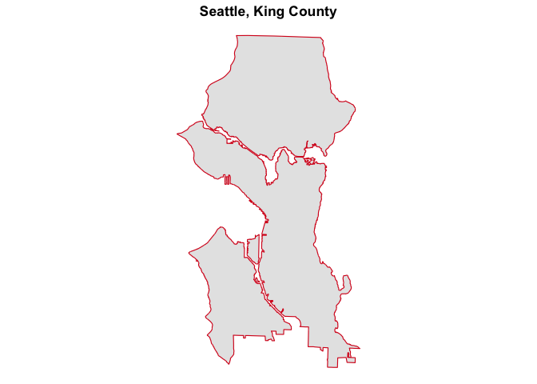<!-- -->


```r
# import house data
kc_hh<- read_csv(here::here("data/raw/kc_house_data.csv"))

# quick check of house data
str(kc_hh)
```

```
## spc_tbl_ [21,613 × 21] (S3: spec_tbl_df/tbl_df/tbl/data.frame)
##  $ id           : chr [1:21613] "7129300520" "6414100192" "5631500400" "2487200875" ...
##  $ date         : POSIXct[1:21613], format: "2014-10-13" "2014-12-09" ...
##  $ price        : num [1:21613] 221900 538000 180000 604000 510000 ...
##  $ bedrooms     : num [1:21613] 3 3 2 4 3 4 3 3 3 3 ...
##  $ bathrooms    : num [1:21613] 1 2.25 1 3 2 4.5 2.25 1.5 1 2.5 ...
##  $ sqft_living  : num [1:21613] 1180 2570 770 1960 1680 ...
##  $ sqft_lot     : num [1:21613] 5650 7242 10000 5000 8080 ...
##  $ floors       : num [1:21613] 1 2 1 1 1 1 2 1 1 2 ...
##  $ waterfront   : num [1:21613] 0 0 0 0 0 0 0 0 0 0 ...
##  $ view         : num [1:21613] 0 0 0 0 0 0 0 0 0 0 ...
##  $ condition    : num [1:21613] 3 3 3 5 3 3 3 3 3 3 ...
##  $ grade        : num [1:21613] 7 7 6 7 8 11 7 7 7 7 ...
##  $ sqft_above   : num [1:21613] 1180 2170 770 1050 1680 ...
##  $ sqft_basement: num [1:21613] 0 400 0 910 0 1530 0 0 730 0 ...
##  $ yr_built     : num [1:21613] 1955 1951 1933 1965 1987 ...
##  $ yr_renovated : num [1:21613] 0 1991 0 0 0 ...
##  $ zipcode      : num [1:21613] 98178 98125 98028 98136 98074 ...
##  $ lat          : num [1:21613] 47.5 47.7 47.7 47.5 47.6 ...
##  $ long         : num [1:21613] -122 -122 -122 -122 -122 ...
##  $ sqft_living15: num [1:21613] 1340 1690 2720 1360 1800 ...
##  $ sqft_lot15   : num [1:21613] 5650 7639 8062 5000 7503 ...
##  - attr(*, "spec")=
##   .. cols(
##   ..   id = col_character(),
##   ..   date = col_datetime(format = ""),
##   ..   price = col_double(),
##   ..   bedrooms = col_double(),
##   ..   bathrooms = col_double(),
##   ..   sqft_living = col_double(),
##   ..   sqft_lot = col_double(),
##   ..   floors = col_double(),
##   ..   waterfront = col_double(),
##   ..   view = col_double(),
##   ..   condition = col_double(),
##   ..   grade = col_double(),
##   ..   sqft_above = col_double(),
##   ..   sqft_basement = col_double(),
##   ..   yr_built = col_double(),
##   ..   yr_renovated = col_double(),
##   ..   zipcode = col_double(),
##   ..   lat = col_double(),
##   ..   long = col_double(),
##   ..   sqft_living15 = col_double(),
##   ..   sqft_lot15 = col_double()
##   .. )
##  - attr(*, "problems")=<externalptr>
```

```r
anyNA(kc_hh$lat)
```

```
## [1] FALSE
```

```r
anyNA(kc_hh$long)
```

```
## [1] FALSE
```

```r
# create house location
kc_hh <- kc_hh %>%
  st_as_sf(coords = c("long", "lat"), crs = 4326, agr = "constant") %>%  # convert to sf object with specified CRS
  st_transform(st_crs(seattle)) %>%  # transform coordinate reference system to "Washington State Plane North"
  distinct()  # keep only distinct geometries

hh <- kc_hh %>%
  st_intersection(seattle)

# plot Seattle house location
ggplot() + 
    geom_sf(data = seattle, color = "#b2182b", linewidth = 0.5) +  # add Seattle boundary
    geom_sf(data = hh, color = "#2166ac", size = 0.5, pch = 16) +  # add house location
    labs(title = "Seattle House Location") +  # set plot title
    theme_void() +
    theme(plot.title = element_text(hjust = 0.5, face = "bold"))
```

<!-- -->

```r
#examine house id
length(unique(hh$id))#6691 < 6740
```

```
## [1] 6691
```

```r
#add an unique key
hh$key <- 1:nrow(hh)

#exclude outliers with extremely high price
hist(hh$price)
```

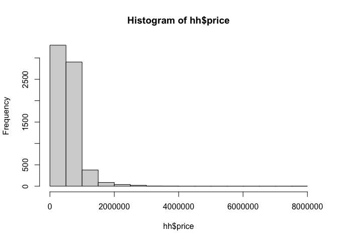<!-- -->

```r
hh[hh$price > 3000000,]
```

```
## Simple feature collection with 9 features and 20 fields
## Geometry type: POINT
## Dimension:     XY
## Bounding box:  xmin: 1252271 ymin: 219511.6 xmax: 1284618 ymax: 269908.9
## Projected CRS: NAD83(HARN) / Washington North (ftUS)
## # A tibble: 9 × 21
##   id         date                  price bedrooms bathrooms sqft_living sqft_lot
##   <chr>      <dttm>                <dbl>    <dbl>     <dbl>       <dbl>    <dbl>
## 1 4114601570 2014-11-18 00:00:00 3600000        3      3.25        5020    12431
## 2 4217402115 2015-04-21 00:00:00 3650000        6      4.75        5480    19401
## 3 7159200005 2014-05-07 00:00:00 3200000        7      4.5         6210     8856
## 4 6762700020 2014-10-13 00:00:00 7700000        6      8          12050    27600
## 5 1068000375 2014-09-23 00:00:00 3200000        6      5           7100    18200
## 6 1118000320 2015-05-08 00:00:00 3400000        4      4           4260    11765
## 7 1732800780 2015-02-12 00:00:00 3065000        5      3           4150     7500
## 8 1346300150 2014-10-20 00:00:00 3300000        8      4           7710    11750
## 9 2303900100 2014-09-11 00:00:00 3800000        3      4.25        5510    35000
## # ℹ 14 more variables: floors <dbl>, waterfront <dbl>, view <dbl>,
## #   condition <dbl>, grade <dbl>, sqft_above <dbl>, sqft_basement <dbl>,
## #   yr_built <dbl>, yr_renovated <dbl>, zipcode <dbl>, sqft_living15 <dbl>,
## #   sqft_lot15 <dbl>, geometry <POINT [US_survey_foot]>, key <int>
```

```r
hh <- hh %>%
  filter(!price > 5000000)
```

## Internal Characteristics


```r
# add year_used and renovation and ensure categorical data are factor
house <- hh %>% 
  mutate(year_used = 2015 - yr_built, # used year
         reno_dum = as.factor(if_else(yr_renovated>0, 1, 0)),#renovation yes or no
         water_dum = as.factor(waterfront),
         view_cat = as.factor(view),
         condition_cat = as.factor(condition),
         grade_cat = as.factor(grade))

# bed categories
house$bed.factor <- factor(house$bedrooms, levels =sort(unique(house$bedrooms)))
house %>%
  st_drop_geometry() %>%
  group_by(bed.factor)%>%
  summarize(price_m = mean(price))%>%
  ggplot(aes(x = bed.factor, y = price_m)) +
  geom_col(position = "dodge")+
  plotTheme() + theme(axis.text.x = element_text(angle = 45, hjust = 1)) #0-3,4-7,8+
```

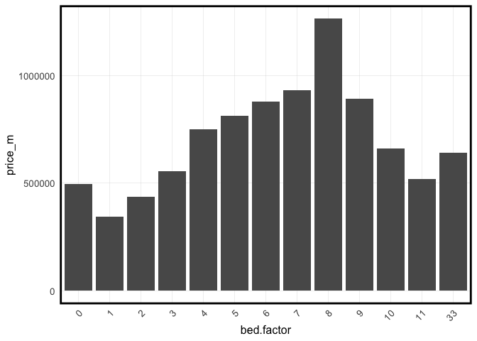<!-- -->

```r
# group by mean
house <- house %>%
  mutate(bed_cat = factor(case_when(
    bedrooms <=3 ~ "few",
    bedrooms >3 & bedrooms <= 7 ~ "medium",
    bedrooms >=8 ~ "many"
  )))%>%
  select(-bed.factor)
# check the numbers of each category
table(house$bed_cat)
```

```
## 
##    few   many medium 
##   4696     16   2027
```

```r
# bathroom category
house$bath.factor <- factor(house$bathrooms, levels =sort(unique(house$bathrooms)))
house %>%
  st_drop_geometry() %>%
  group_by(bath.factor)%>%
  summarize(price_m = mean(price))%>%
  ggplot(aes(x = bath.factor, y = price_m)) +
  geom_col(position = "dodge")+
  plotTheme() + theme(axis.text.x = element_text(angle = 45, hjust = 1)) #0-4, 4+
```

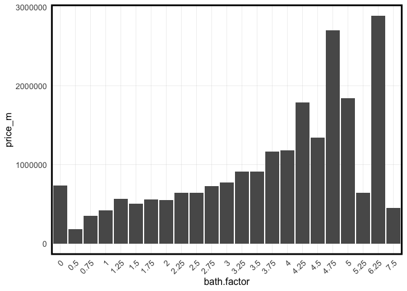<!-- -->

```r
house <- house %>%
  mutate(bath_dum = factor(case_when(
    bathrooms <= 4 ~ "few",
    bathrooms > 4 ~ "many"
  )))%>%
  select(-bath.factor)
# check the numbers of each category
table(house$bath_dum)
```

```
## 
##  few many 
## 6683   56
```

```r
# floor category
house$floor.factor <- factor(house$floors, levels =sort(unique(house$floors)))
house %>%
  st_drop_geometry() %>%
  group_by(floor.factor)%>%
  summarize(price_m = mean(price))%>%
  ggplot(aes(x = floor.factor, y = price_m)) +
  geom_col(position = "dodge")+
  plotTheme() + theme(axis.text.x = element_text(angle = 45, hjust = 1)) #1-2+3, 2.5+3.5
```

<!-- -->

```r
house <- house %>%
  mutate(floor_cat = factor(case_when(
    floors <= 2 | floors == 3 ~ "regular",
    floors %in% c(2.5, 3.5) ~ "irregular"
  )))%>%
  select(-floor.factor)
# check the numbers of each category
table(house$floor_cat)
```

```
## 
## irregular   regular 
##       104      6635
```

```r
#reclassify
house <- house%>%
  mutate(grade_dum = factor(ifelse(grade <= 9, "low","high"), levels = c("low","high")))

#other category variables
colnames(house)
```

```
##  [1] "id"            "date"          "price"         "bedrooms"     
##  [5] "bathrooms"     "sqft_living"   "sqft_lot"      "floors"       
##  [9] "waterfront"    "view"          "condition"     "grade"        
## [13] "sqft_above"    "sqft_basement" "yr_built"      "yr_renovated" 
## [17] "zipcode"       "sqft_living15" "sqft_lot15"    "geometry"     
## [21] "key"           "year_used"     "reno_dum"      "water_dum"    
## [25] "view_cat"      "condition_cat" "grade_cat"     "bed_cat"      
## [29] "bath_dum"      "floor_cat"     "grade_dum"
```

```r
str(house)
```

```
## sf [6,739 × 31] (S3: sf/tbl_df/tbl/data.frame)
##  $ id           : chr [1:6739] "7129300520" "6414100192" "2487200875" "9212900260" ...
##  $ date         : POSIXct[1:6739], format: "2014-10-13" "2014-12-09" ...
##  $ price        : num [1:6739] 221900 538000 604000 468000 530000 ...
##  $ bedrooms     : num [1:6739] 3 3 4 2 5 4 4 4 3 3 ...
##  $ bathrooms    : num [1:6739] 1 2.25 3 1 2 3 1 1.75 1.75 1 ...
##  $ sqft_living  : num [1:6739] 1180 2570 1960 1160 1810 2950 1600 1620 2450 1400 ...
##  $ sqft_lot     : num [1:6739] 5650 7242 5000 6000 4850 ...
##  $ floors       : num [1:6739] 1 2 1 1 1.5 2 1.5 1 2 1.5 ...
##  $ waterfront   : num [1:6739] 0 0 0 0 0 0 0 0 0 0 ...
##  $ view         : num [1:6739] 0 0 0 0 0 3 0 0 0 0 ...
##  $ condition    : num [1:6739] 3 3 5 4 3 3 4 4 3 5 ...
##  $ grade        : num [1:6739] 7 7 7 7 7 9 7 7 8 8 ...
##  $ sqft_above   : num [1:6739] 1180 2170 1050 860 1810 1980 1600 860 1750 1400 ...
##  $ sqft_basement: num [1:6739] 0 400 910 300 0 970 0 760 700 0 ...
##  $ yr_built     : num [1:6739] 1955 1951 1965 1942 1900 ...
##  $ yr_renovated : num [1:6739] 0 1991 0 0 0 ...
##  $ zipcode      : num [1:6739] 98178 98125 98136 98115 98107 ...
##  $ sqft_living15: num [1:6739] 1340 1690 1360 1330 1360 2140 1610 1400 1760 1860 ...
##  $ sqft_lot15   : num [1:6739] 5650 7639 5000 6000 4850 ...
##  $ geometry     :sfc_POINT of length 6739; first list element:  'XY' num [1:2] 1288600 189723
##  $ key          : int [1:6739] 1 2 3 4 5 6 7 8 9 10 ...
##  $ year_used    : num [1:6739] 60 64 50 73 115 36 99 68 100 106 ...
##  $ reno_dum     : Factor w/ 2 levels "0","1": 1 2 1 1 1 1 1 1 1 1 ...
##  $ water_dum    : Factor w/ 2 levels "0","1": 1 1 1 1 1 1 1 1 1 1 ...
##  $ view_cat     : Factor w/ 5 levels "0","1","2","3",..: 1 1 1 1 1 4 1 1 1 1 ...
##  $ condition_cat: Factor w/ 5 levels "1","2","3","4",..: 3 3 5 4 3 3 4 4 3 5 ...
##  $ grade_cat    : Factor w/ 10 levels "4","5","6","7",..: 4 4 4 4 4 6 4 4 5 5 ...
##  $ bed_cat      : Factor w/ 3 levels "few","many","medium": 1 1 3 1 3 3 3 3 1 1 ...
##  $ bath_dum     : Factor w/ 2 levels "few","many": 1 1 1 1 1 1 1 1 1 1 ...
##  $ floor_cat    : Factor w/ 2 levels "irregular","regular": 2 2 2 2 2 2 2 2 2 2 ...
##  $ grade_dum    : Factor w/ 2 levels "low","high": 1 1 1 1 1 1 1 1 1 1 ...
##  - attr(*, "sf_column")= chr "geometry"
##  - attr(*, "agr")= Factor w/ 3 levels "constant","aggregate",..: NA NA NA NA NA NA NA NA NA NA ...
##   ..- attr(*, "names")= chr [1:30] "id" "date" "price" "bedrooms" ...
```

```r
house %>% 
  st_drop_geometry()%>%
  dplyr::select(price, reno_dum, bed_cat, bath_dum,floor_cat,
                water_dum,view_cat,condition_cat, grade_dum) %>%
  gather(Variable, Value, -price) %>% 
   ggplot(aes(Value, price)) +
     geom_bar(position = "dodge", stat = "summary", fun.y = "mean") +
     facet_wrap(~Variable, ncol = 4, scales = "free") +
     labs(title = "Price as a function of categorical variables", y = "Mean_Price") +
     plotTheme() + theme(axis.text.x = element_text(angle = 45, hjust = 1))
```

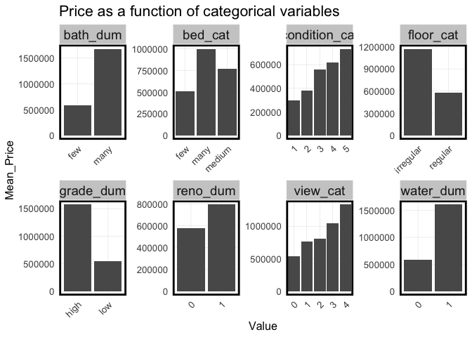<!-- -->

```r
# select variables
house <- house %>%
  select("key", "price","year_used","reno_dum",
         "bedrooms", "bed_cat", "bathrooms", "bath_dum",
         "sqft_living", "sqft_lot", "floor_cat",
         "water_dum", "view_cat", "condition_cat", "grade_dum")
```

## Socio-economic Characteristics


```r
census_api_key("3ec2bee8c227ff3f9df970d0ffbb11ee1384076e", install = TRUE, overwrite = TRUE)

acs_variable_list.2015 <- load_variables(2015, # year
                                         "acs5", # five year ACS estimates
                                         cache = TRUE)

acs_vars <- c("B01003_001E", # total population
              "B01001A_001E", # white alone
              "B01001_003E", # male under 5
              "B01001_004E", # male 5-9
              "B01001_005E", # male 10-14
              "B01001_020E", # male 65-66
              "B01001_021E", # male 67-69
              "B01001_022E", # male 70-74
              "B01001_023E", # male 75-79
              "B01001_024E", # male 80-84
              "B01001_025E", # male over 85
              "B01001_027E", # female under 5
              "B01001_028E", # female 5-9
              "B01001_029E", # female 10-14
              "B01001_044E", # female 65-66
              "B01001_045E", # female 67-69
              "B01001_046E", # female 70-74
              "B01001_047E", # female 75-79
              "B01001_048E", # female 80-84
              "B01001_049E", # female over 85
              "B15003_001E", # educational attainment over 25
              "B15003_022E", # bachelor's degree
              "B19013_001E", # median household income
              "B23025_004E", # employed labor force
              "B23025_003E", # total labor force
              "B17020_002E") # income below poverty level
```

- age structure
- reference: "total dependency ratio and elderly dependency ratio are on an inverse relationship towards ordinary residence price." https://www.scirp.org/journal/paperinformation?paperid=74919

- education level
- reference: "The findings show that higher education does have a positive relationship to the house prices in Sweden."
https://www.diva-portal.org/smash/get/diva2:1346009/FULLTEXT01.pdf


```r
acsTractsSeattle.2015 <- get_acs(geography = "tract",
                             year = 2015, 
                             variables = acs_vars,
                             geometry = TRUE,
                             state = "Washington", 
                             county = "King",
                             output = "wide") %>%
  st_transform(st_crs(seattle)) %>%
  select(GEOID, NAME, all_of(acs_vars)) %>%
  rename(total_pop = B01003_001E,
          white_pop = B01001A_001E,
          edu_bach = B15003_022E,
          edu_attain = B15003_001E,
          median_hh_income = B19013_001E,
          total_labor = B23025_003E,
          employ_labor = B23025_004E,
          poverty = B17020_002E) %>%
  mutate(area = st_area(.)) %>%
  mutate(pop_den = ifelse(as.numeric(area) > 0, total_pop / area, 0),
         white_share = round(ifelse(total_pop > 0, white_pop / total_pop, 0) * 100, digits = 2),
         pop_under14 = B01001_003E + B01001_004E + B01001_005E + B01001_027E +
            B01001_028E + B01001_029E,
         pop_over65 = B01001_020E + B01001_021E + B01001_022E + B01001_023E +
            B01001_024E + B01001_025E + B01001_044E + B01001_045E + B01001_046E +
            B01001_047E + B01001_048E + B01001_049E,
         total_dep = round((pop_under14 + pop_over65) / (total_pop -
                               (pop_under14 + pop_over65)) * 100, digits = 2),
         elder_dep = round(pop_over65 / (total_pop - (pop_under14 + pop_over65)) * 100, digits = 2),
         bach_share = round(ifelse(edu_attain > 0, edu_bach/edu_attain, 0) * 100, digits = 2),
         employ_rate = round(ifelse(total_labor > 0, employ_labor / total_labor, 0) * 100, digits = 2),
         pover_rate = round(ifelse(total_pop > 0, poverty / total_pop, 0) * 100, digits = 2))
```

```
## 
  |                                                                            
  |                                                                      |   0%
  |                                                                            
  |=                                                                     |   1%
  |                                                                            
  |==                                                                    |   3%
  |                                                                            
  |===                                                                   |   4%
  |                                                                            
  |====                                                                  |   5%
  |                                                                            
  |=====                                                                 |   7%
  |                                                                            
  |======                                                                |   8%
  |                                                                            
  |======                                                                |   9%
  |                                                                            
  |=======                                                               |  11%
  |                                                                            
  |========                                                              |  12%
  |                                                                            
  |=========                                                             |  13%
  |                                                                            
  |==========                                                            |  15%
  |                                                                            
  |===========                                                           |  16%
  |                                                                            
  |=============                                                         |  19%
  |                                                                            
  |==============                                                        |  20%
  |                                                                            
  |===============                                                       |  21%
  |                                                                            
  |================                                                      |  22%
  |                                                                            
  |================                                                      |  23%
  |                                                                            
  |=================                                                     |  25%
  |                                                                            
  |==================                                                    |  26%
  |                                                                            
  |===================                                                   |  27%
  |                                                                            
  |====================                                                  |  29%
  |                                                                            
  |==========================                                            |  37%
  |                                                                            
  |==============================                                        |  43%
  |                                                                            
  |================================                                      |  46%
  |                                                                            
  |=================================                                     |  47%
  |                                                                            
  |==================================                                    |  48%
  |                                                                            
  |====================================                                  |  51%
  |                                                                            
  |=====================================                                 |  52%
  |                                                                            
  |=======================================                               |  55%
  |                                                                            
  |=========================================                             |  59%
  |                                                                            
  |==========================================                            |  60%
  |                                                                            
  |=======================================================               |  79%
  |                                                                            
  |===========================================================           |  84%
  |                                                                            
  |=============================================================         |  87%
  |                                                                            
  |==============================================================        |  88%
  |                                                                            
  |================================================================      |  92%
  |                                                                            
  |==================================================================    |  94%
  |                                                                            
  |===================================================================   |  96%
  |                                                                            
  |===================================================================== |  98%
  |                                                                            
  |======================================================================| 100%
```

```r
acsTractsSeattle.2015 <- acsTractsSeattle.2015 %>%
  mutate(bach_dum = factor(ifelse(bach_share > mean(acsTractsSeattle.2015$bach_share,
                                                        na.rm = TRUE), "above", "below"),
                           levels = c("below", "above")),
         median_hh_dum = factor(ifelse(median_hh_income > mean(acsTractsSeattle.2015$median_hh_income,
                                                        na.rm = TRUE), "above", "below"),
                           levels = c("below", "above")),
         employ_dum = factor(ifelse(employ_rate > mean(acsTractsSeattle.2015$employ_rate,
                                                        na.rm = TRUE), "above", "below"),
                           levels = c("below", "above")),
         pover_dum = factor(ifelse(pover_rate > mean(acsTractsSeattle.2015$pover_rate,
                                                        na.rm = TRUE), "above", "below"),
                           levels = c("below", "above")))%>%
  select(GEOID, NAME, pop_den, white_share, total_dep, elder_dep, bach_share, bach_dum, median_hh_income,
         median_hh_dum, employ_rate, employ_dum, pover_rate, pover_dum)

house <- house %>%
  st_join(., acsTractsSeattle.2015) %>%
  filter(!is.na(pop_den)) # remove NA, one house may outside the boundary of census tracts

# frequency of dummy variables
table(house$bach_dum)
```

```
## 
## below above 
##  1462  5276
```

```r
table(house$median_hh_dum)
```

```
## 
## below above 
##  3441  3297
```

```r
table(house$employ_dum)
```

```
## 
## below above 
##  1517  5221
```

```r
table(house$pover_dum)
```

```
## 
## below above 
##  4370  2368
```

```r
## plot mean house price of bach_dum
ggplot(house %>% st_drop_geometry() %>% group_by(bach_dum) %>%
  summarise(aver_price = mean(price))) +
  geom_col(aes(bach_dum,aver_price))
```

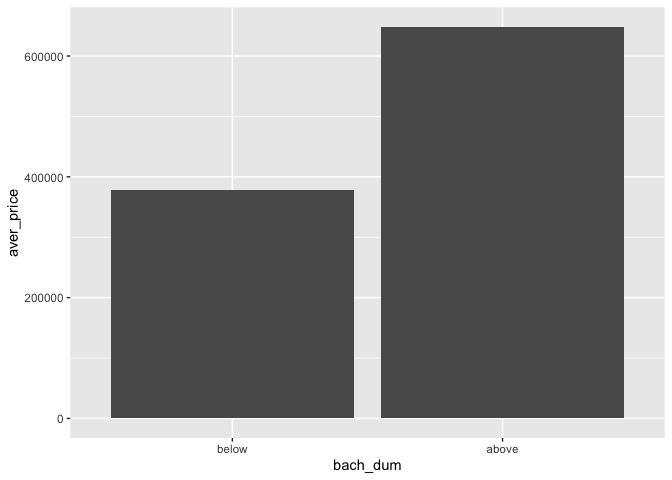<!-- -->

```r
## plot mean price of median_hh_dum
ggplot(house %>% st_drop_geometry() %>% group_by(median_hh_dum) %>%
  summarise(aver_price = mean(price))) +
  geom_col(aes(median_hh_dum,aver_price))
```

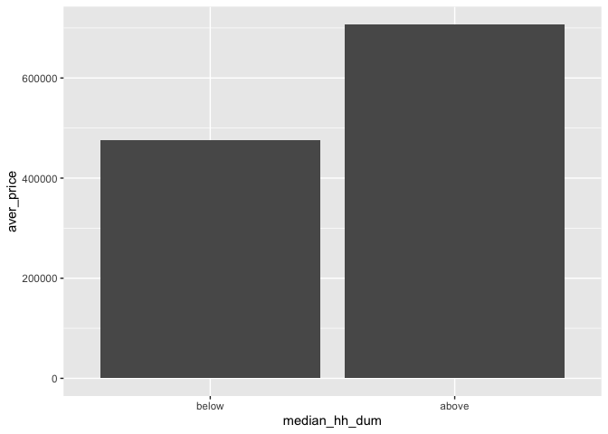<!-- -->

```r
## plot mean price of employ_dum
ggplot(house %>% st_drop_geometry() %>% group_by(employ_dum) %>%
  summarise(aver_price = mean(price))) +
  geom_col(aes(employ_dum,aver_price))
```

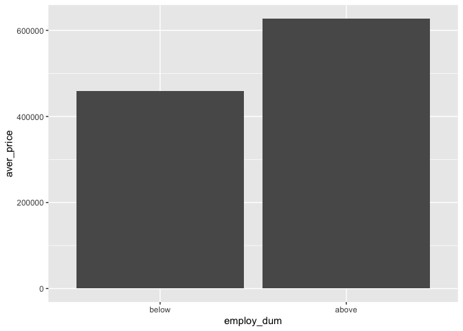<!-- -->

```r
## plot mean price of pover_dum
ggplot(house %>% st_drop_geometry() %>% group_by(pover_dum) %>%
  summarise(aver_price = mean(price))) +
  geom_col(aes(pover_dum,aver_price))
```

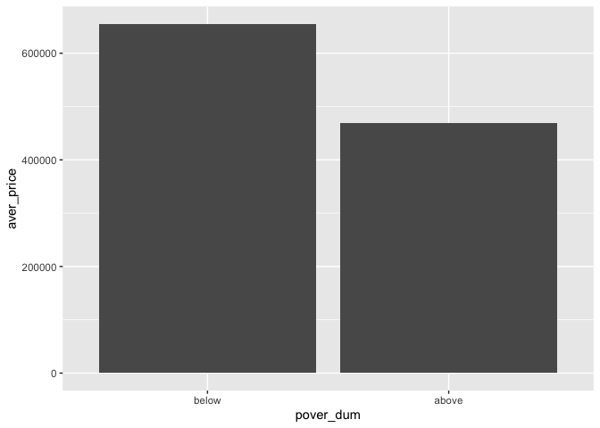<!-- -->

```r
## plot all the mean of dummy variables
house %>% 
  st_drop_geometry()%>%
  dplyr::select(price, bach_dum, median_hh_dum, employ_dum, pover_dum) %>%
  gather(Variable, Value, -price) %>% 
   ggplot(aes(Value, price)) +
     geom_bar(position = "dodge", stat = "summary", fun.y = "mean") +
     facet_wrap(~Variable, ncol = 2, scales = "free") +
     labs(title = "Price as a function of dummy variables", y = "Mean_Price") +
     plotTheme() + theme(axis.text.x = element_text(angle = 45, hjust = 1))
```

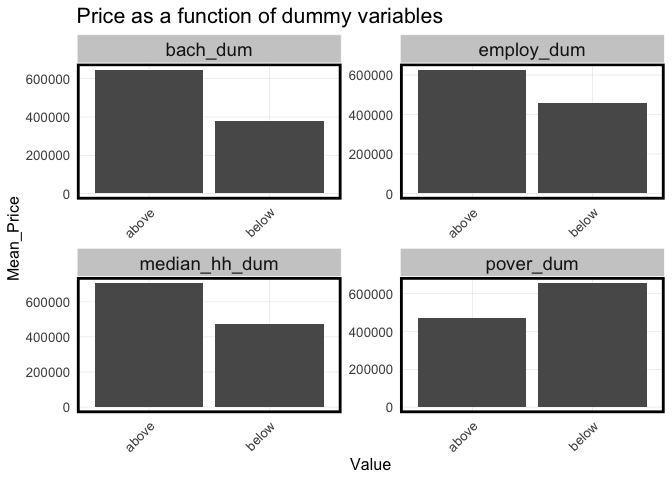<!-- -->

## Amenities Characteristics

### subway station

- variable  
1) distance to the nearest station
2) categories based on distance (0-0.5/0.5-1/1+ mile) (0.5mile = 2640ft)  

- reference: "houses within a quarter mile to a half mile of a Metro station sold for 7.5% more, and houses within a half mile to a mile sold for 3.9% more." https://www.freddiemac.com/research/insight/20191002-metro-station-impact#:~:text=Similarly%2C%20houses%20within%20a%20quarter,mile%20sold%20for%203.9%25%20more.

- source: https://gis-kingcounty.opendata.arcgis.com/datasets/7fb1b64925db450e8f024940f697823e_390/explore?location=47.584121%2C-122.115870%2C10.45


```r
#read station point data
sub <- st_read(here::here("data/raw/Amenities/Metro_Sub_Stations_in_King_County___sub_stations_point.geojson"))%>%
  st_transform(st_crs(house))
```

```
## Reading layer `Metro_Sub_Stations_in_King_County___sub_stations_point' from data source `/Users/Viva Wan/Documents/GitHub/508-midterm/data/raw/Amenities/Metro_Sub_Stations_in_King_County___sub_stations_point.geojson' 
##   using driver `GeoJSON'
## Simple feature collection with 40 features and 11 fields
## Geometry type: POINT
## Dimension:     XY
## Bounding box:  xmin: -122.3931 ymin: 47.51374 xmax: -122.2561 ymax: 47.66882
## Geodetic CRS:  WGS 84
```

```r
# the distance to the nearest station 
house <-  house %>%
      mutate(sub_dis = nn_function(st_coordinates(house),
                                      st_coordinates(sub), k = 1))

# categories based on distance
house <- house %>%
  mutate(sub_cat = factor(case_when(
    sub_dis <= 2640 ~ "within0.5mile",
    sub_dis > 2640 & sub_dis <= 5280 ~ "0.5-1mile",
    sub_dis > 5280 ~ "1+mile"
  ),levels = c("within0.5mile","0.5-1mile","1+mile")))
```

### school district

- variable: the name of the school district

- reference: "the price differentials for similar homes — same square footage, number of bedrooms and baths — that are located near each other but served by different school districts can range from tens of thousands to hundreds of thousands of dollars." https://www.seattletimes.com/business/how-much-do-good-schools-boost-home-prices/  

- source: https://gis-kingcounty.opendata.arcgis.com/datasets/94eb521c71f2401586c6ce6a34d68166_406/explore?location=47.672575%2C-122.604064%2C18.86


```r
sch <- st_read(here::here("data/raw/Amenities/Seattle_School_Board_Director_Districts___dirdst_area.geojson"))%>%
  st_transform(st_crs(house))
```

```
## Reading layer `Seattle_School_Board_Director_Districts___dirdst_area' from data source `/Users/Viva Wan/Documents/GitHub/508-midterm/data/raw/Amenities/Seattle_School_Board_Director_Districts___dirdst_area.geojson' 
##   using driver `GeoJSON'
## Simple feature collection with 7 features and 5 fields
## Geometry type: MULTIPOLYGON
## Dimension:     XY
## Bounding box:  xmin: -122.4412 ymin: 47.49523 xmax: -122.236 ymax: 47.73417
## Geodetic CRS:  WGS 84
```

```r
# add the school district variable
house <- house %>% 
  st_join(sch%>%select(DIRDST), join = st_within)%>%
  rename(sch_cat = "DIRDST")
```

### parks

- variable: 
1) area of parks within 500 feet radius
2) count of parks within 500 feet radius

- reference: "Most community-sized parks (~40 acres) had a substantial impact on home prices up to a distance of 500 to 600 feet. While the influence of larger parks extended out to 2,000 feet, beyond 500 feet the influence was relatively small." https://www.naturequant.com/blog/Impact-of-Parks-on-Property-Value/  

- source: https://gis-kingcounty.opendata.arcgis.com/datasets/a0c94c33228146c5ad95a1dff3b6963d_228/explore?location=47.557674%2C-122.213839%2C11.45


```r
park<-st_read(here::here("data/raw/Amenities/Parks_in_King_County___park_area.geojson"))%>%
  st_transform(st_crs(house))%>%
  st_intersection(seattle)%>%
  mutate(park_area = st_area(.))
```

```
## Reading layer `Parks_in_King_County___park_area' from data source 
##   `/Users/Viva Wan/Documents/GitHub/508-midterm/data/raw/Amenities/Parks_in_King_County___park_area.geojson' 
##   using driver `GeoJSON'
## Simple feature collection with 1456 features and 13 fields
## Geometry type: MULTIPOLYGON
## Dimension:     XY
## Bounding box:  xmin: -122.5279 ymin: 47.14237 xmax: -121.0659 ymax: 47.78058
## Geodetic CRS:  WGS 84
```

```r
# area and count of parks within 500 feet
house_parks <- st_join(st_buffer(house, dist = 500), park, join = st_intersects)%>%
  group_by(key) %>% 
  summarise(park_c = n_distinct(SITENAME, na.rm = TRUE),
            sum_park_area = sum(park_area, na.rm = TRUE))
house_parks$all_park_area <- as.numeric(house_parks$sum_park_area)
house_parks$park_cat <- as.factor(house_parks$park_c)

house <- house %>% 
    left_join(house_parks%>%
                st_drop_geometry()%>%
                select(key,park_cat, all_park_area), by = "key")%>%
  rename(parks_area = all_park_area)
```

### tree canopy

- variable:
1) percent of existing tree canopy (2016, hexagons)

- reference: "a city facing major development pressure — trees were associated with an increase in single family home values"
https://www.vibrantcitieslab.com/resources/urban-trees-increase-home-values/

- source: https://data-seattlecitygis.opendata.arcgis.com/datasets/SeattleCityGIS::seattle-tree-canopy-2016-2021-50-acre-hexagons/explore?layer=1&location=47.580733%2C-122.309741%2C11.26


```r
tree_canopy_2016 <- st_read(here::here("data/raw/Amenities/Tree_Canopy.geojson"))%>%
  st_transform(st_crs(house)) %>%
  mutate(tree_canopy = round(TreeCanopy_2016_Percent, digits = 2)) %>%
  select(tree_canopy)
```

```
## Reading layer `Seattle_Tree_Canopy_2016_2021_50_Acre_Hexagons' from data source 
##   `/Users/Viva Wan/Documents/GitHub/508-midterm/data/raw/Amenities/Tree_Canopy.geojson' 
##   using driver `GeoJSON'
## Simple feature collection with 1241 features and 61 fields
## Geometry type: MULTIPOLYGON
## Dimension:     XY
## Bounding box:  xmin: -122.4379 ymin: 47.49552 xmax: -122.2312 ymax: 47.73418
## Geodetic CRS:  WGS 84
```

```r
house <- house %>%
  st_join(., tree_canopy_2016)
```

### medical facilities

- variable: 
1) average distance to the nearest 1/2/3 medical facilities
2) categories based on distance (0-0.5/0.5-1/1+ mile)

- reference: "hospitals would only be highly evaluated in a ‘close-but-not-too-close’ geographic location" https://www.researchgate.net/publication/282942128_The_non-linearity_of_hospitals'_proximity_on_property_prices_experiences_from_Taipei_Taiwan

- source: https://gis-kingcounty.opendata.arcgis.com/datasets/1b7f0fb5179a400f91a35c0b6bfd77c9_733/explore


```r
med <- st_read(here::here("data/raw/Amenities/Medical_Facilities_including_Hospitals___medical_facilities_point.geojson"))%>%
  st_transform(st_crs(house))%>%
  st_intersection(seattle)
```

```
## Reading layer `Medical_Facilities_including_Hospitals___medical_facilities_point' from data source `/Users/Viva Wan/Documents/GitHub/508-midterm/data/raw/Amenities/Medical_Facilities_including_Hospitals___medical_facilities_point.geojson' 
##   using driver `GeoJSON'
## Simple feature collection with 210 features and 12 fields
## Geometry type: POINT
## Dimension:     XY
## Bounding box:  xmin: -122.3994 ymin: 47.19964 xmax: -121.8383 ymax: 47.77734
## Geodetic CRS:  WGS 84
```

```r
# calculate the distance to the nearest medical facilities 
house <-  house %>%
      mutate(med_dis1 = nn_function(st_coordinates(house),
                                      st_coordinates(med), k = 1),
             med_dis2 = nn_function(st_coordinates(house),
                                      st_coordinates(med), k = 2),
             med_dis3 = nn_function(st_coordinates(house),
                                      st_coordinates(med), k = 3))

# categories based on distance
house <- house %>%
  mutate(med_cat = case_when(
    med_dis1 <= 2640 ~ "within0.5mile",
    med_dis1 > 2640 & med_dis1 <= 5280 ~ "0.5-1mile",
    med_dis1 > 5280 ~ "1+mile"
  ))
```

### commercial

- variable:  
1) average distance to the nearest 1/2/3 shops
2) categories based on distance (0-0.5/0.5-1/1+ mile)

- reference: 
1) "an inverse relationship between the housing price and its distance from the shopping mall" https://www.diva-portal.org/smash/get/diva2:1450713/FULLTEXT01.pdf  
2) "Notwithstanding the negative externalities of shopping centres, residential
properties within 100-metre radius of shopping centres command a higher premium
than those farther away although the price-distance relationship is not monotonic
while the proximity factor varies from housing estate to housing estate." https://www.prres.org/uploads/746/1752/Addae-Dapaah_Shopping_Centres_Proximate_Residential_Properties.pdf

- source:https://gis-kingcounty.opendata.arcgis.com/datasets/4fdb4709874b46cf8dbb284182ca0094_383/explore?showTable=true  
Select type by "CODE": https://www.arcgis.com/sharing/rest/content/items/4fdb4709874b46cf8dbb284182ca0094/info/metadata/metadata.xml?format=default&output=html
- 690 Shopping Centers


```r
mark<- st_read(here::here("data/raw/Amenities/King_County_Landmarks___landmark_point.geojson"))%>%
  st_transform(st_crs(house))%>%
  st_intersection(seattle)
```

```
## Reading layer `King_County_Landmarks___landmark_point' from data source 
##   `/Users/Viva Wan/Documents/GitHub/508-midterm/data/raw/Amenities/King_County_Landmarks___landmark_point.geojson' 
##   using driver `GeoJSON'
## Simple feature collection with 3373 features and 21 fields
## Geometry type: POINT
## Dimension:     XY
## Bounding box:  xmin: -122.6238 ymin: 47.14405 xmax: -121.1298 ymax: 47.94934
## Geodetic CRS:  WGS 84
```

```r
#select shopping center
mark_shop <- mark%>%
  filter(CODE == 690)

# calculate the distance to the nearest 1/2/3 shopping center(s) 
house <- house %>%
      mutate(shop_dis1 = nn_function(st_coordinates(house),
                                      st_coordinates(mark_shop), k = 1),
             shop_dis2 = nn_function(st_coordinates(house),
                                      st_coordinates(mark_shop), k = 2),
             shop_dis3 = nn_function(st_coordinates(house),
                                      st_coordinates(mark_shop), k = 3))

# categories based on distance
house <- house %>%
  mutate(shop_cat = factor(case_when(
    shop_dis1 <= 2640 ~ "within0.5mile",
    shop_dis1 > 2640 & shop_dis1 <= 5280 ~ "0.5-1mile",
    shop_dis1 > 5280 ~ "1+mile"
  ),levels = c("within0.5mile","0.5-1mile","1+mile")))
```

### crime

- variable:
1) count of crimes within a 1/8 mi
2) average distance to the nearest 1/2/3/4/5 crimes (robbery and  assault only)

- reference:"only robbery and aggravated assault crimes (per acre) exert a meaningful influence upon neighborhood housing values." https://sciencedirect.com/science/article/pii/S0166046210000086#aep-abstract-id3
"The overall effect on house prices of crime (measured as crime rates) is relatively small, but if its impact is measured by distance to a crime hot spot, the effect is non-negligible." https://www.researchgate.net/publication/335773241_Do_crime_hot_spots_affect_housing_prices_Do_crime_hot_spots_affect_housing_prices

- source:https://data.seattle.gov/Public-Safety/SPD-Crime-Data-2008-Present/tazs-3rd5/about_data

**To avoid rerunning the huge dataset:**

```r
# crime <- read.csv(here::here("data/raw/Amenities/SPD_Crime_Data__2008-Present_20240328.csv"))

# get the target crime
# crime_clean <- crime %>%
#   mutate(year = str_sub(Report.Number, 1, 4)) %>%
#   filter(year %in% c("2013", "2014", "2015") )%>% #choose those before and in 2015
#   filter(!Offense %in% c(
#     "Bad Checks",
#     "Bribery",
#     "Embezzlement",
#     "Extortion/Blackmail",
#     "Credit Card/Automated Teller Machine Fraud",
#     "False Pretenses/Swindle/Confidence Game",
#     "Identity Theft",
#     "Impersonation",
#     "Welfare Fraud",
#     "Wire Fraud",
#     "Curfew/Loitering/Vagrancy Violations",
#     "Driving Under the Influence",
#     "Drug Equipment Violations",
#     "Drug/Narcotic Violations",
#     "Betting/Wagering",
#     "Gambling Equipment Violation",
#     "Operating/Promoting/Assisting Gambling",
#     "Liquor Law Violations",
#     "Pornography/Obscene Material",
#     "Assisting or Promoting Prostitution",
#     "Prostitution",
#     "Weapon Law Violations"
#   ))%>% #exclude those with little impact on housing price e.g.Financial Crimes, Public Order Offenses
#   filter(Longitude != 0 & Latitude != 0)# select the valid ones
#
# write.csv(crime_clean , here::here("data/processed/crime_clean.csv"), row.names = FALSE)

# read the cleaned data set
crime <- read.csv(here::here("data/processed/crime_clean.csv")) %>%
  st_as_sf(coords = c("Longitude", "Latitude"), crs = 4326)%>%
  st_transform(st_crs(house))

# count of crime within 1/8 mi
house$crime_c <- house %>%
    st_buffer(660) %>%
    aggregate(mutate(crime, counter = 1)%>%select(counter),., sum) %>%
    pull(counter)

# calculate the distance to the nearest 1/2/3/4/5 crime locations
house <-  house %>%
      mutate(crime_dis1 = nn_function(st_coordinates(house),
                                      st_coordinates(crime), k = 1),
             crime_dis2 = nn_function(st_coordinates(house),
                                      st_coordinates(crime), k = 2),
             crime_dis3 = nn_function(st_coordinates(house),
                                      st_coordinates(crime), k = 3),
             crime_dis4 = nn_function(st_coordinates(house),
                                      st_coordinates(crime), k = 4),
             crime_dis5 = nn_function(st_coordinates(house),
                                      st_coordinates(crime), k = 5))
```

### inspect categories


```r
#plot all the mean of categorical variables
house %>% 
  st_drop_geometry()%>%
  dplyr::select(price ,sub_cat, park_cat, med_cat,shop_cat,sch_cat) %>%
  gather(Variable, Value, -price) %>% 
   ggplot(aes(Value, price)) +
     geom_bar(position = "dodge", stat = "summary", fun.y = "mean") +
     facet_wrap(~Variable, ncol = 2, scales = "free") +
     labs(title = "Price as a function of categorical variables", y = "Mean_Price") +
     plotTheme() + theme(axis.text.x = element_text(angle = 45, hjust = 1))
```

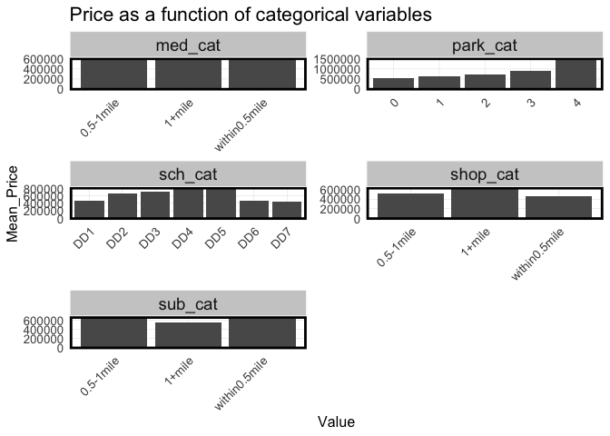<!-- -->

```r
#-> med_cat not useful

house <- house %>%
  select(-med_cat)
```

## Spatial Structure


```r
# large neighborhoods
neigh_large <- st_read(here::here("data/raw/Boundary/Neighborhood_Map_Atlas_Districts.geojson")) %>%
  st_transform(st_crs(house)) %>%
  rename(L_NAME = L_HOOD) %>%
  select(L_NAME)
```

```
## Reading layer `Neighborhood_Map_Atlas_Districts' from data source 
##   `/Users/Viva Wan/Documents/GitHub/508-midterm/data/raw/Boundary/Neighborhood_Map_Atlas_Districts.geojson' 
##   using driver `GeoJSON'
## Simple feature collection with 20 features and 5 fields
## Geometry type: MULTIPOLYGON
## Dimension:     XY
## Bounding box:  xmin: -122.436 ymin: 47.49551 xmax: -122.236 ymax: 47.73416
## Geodetic CRS:  WGS 84
```

```r
# small neighborhoods
neigh_small <- st_read(here::here("data/raw/Boundary/Neighborhood_Map_Atlas_Neighborhoods.geojson")) %>%
  st_transform(st_crs(house)) %>%
  rename(S_NAME = S_HOOD) %>%
  select(S_NAME)
```

```
## Reading layer `Neighborhood_Map_Atlas_Neighborhoods' from data source 
##   `/Users/Viva Wan/Documents/GitHub/508-midterm/data/raw/Boundary/Neighborhood_Map_Atlas_Neighborhoods.geojson' 
##   using driver `GeoJSON'
## Simple feature collection with 94 features and 6 fields
## Geometry type: MULTIPOLYGON
## Dimension:     XY
## Bounding box:  xmin: -122.436 ymin: 47.49551 xmax: -122.236 ymax: 47.73416
## Geodetic CRS:  WGS 84
```

```r
# census tracts
neigh_tract <- acsTractsSeattle.2015 %>%
  select(NAME) %>%
  rename(T_NAME = NAME) %>%
  st_intersection(seattle)
```


# Data Description

## Continuous Variable


```r
# continuous variables
continuous_summary <- house %>%
  st_drop_geometry() %>%
  select(- key)%>%
  summarise(across(where(is.numeric),
                   list(maximum = ~ max(., na.rm = TRUE),
                        minimum = ~ min(., na.rm = TRUE),
                        mean = ~ mean(., na.rm = TRUE),
                        standard_deviation = ~ sd(., na.rm = TRUE),
                        n = ~ sum(!is.na(.x))),
                   .names = "{.col}:{.fn}")) %>%
  pivot_longer(cols = everything(), names_to = c("variables", "statistic"),
               names_sep = ":", values_to = "value") %>%
  mutate(value = round(value, digits = 2)) %>%
  pivot_wider(names_from = statistic, values_from = value)


continuous_description <- data.frame(
  variables = continuous_summary$variables,
  category = rep(c("dependent","internal", "socio-economic", "amenities"),
                 times = c(1, 5, 8, 15)),
  description = c("Price: price of each unit",
                  "Year Used: years from built to 2015",
                  "No.bedrooms: the number of bedrooms in each unit",
                  "No.bathrooms: the number of bathrooms in each unit",
                  "Living Area: the area of living of each unit",
                  "Lot Area: the area of the lot of each unit",
                  "Population Density: the number of population per square feet in the census tract",
                  "White Population Share:the ratio of white people to total population in the census tract",
                  "Total Dependency Ratio: the ratio of the number of children (0-14 years old) and older persons (65 years or over) to the working-age population (15-64 years old) in the census tract",
                  "Elderly Dependency Ratio: the ratio of older persons (65 years or over) to the working-age population (15-64 years old) in the census tract",
                  "Bachelor's Degree Rate: the percentage of with a bachelor's degree among adults age 25 and older in the census tract",
                  "Median Household Income: median househhold income in the census tract",
                  "Employment Rate: the ratio of the employed to the working age population in the census tract",
                  "Poverty Rate: the ratio of the number of people (in a given age group) whose income falls below the poverty line to total population in the census tract",
                  "Nearest Subway Distance: the distance to the nearest subway station",
                  "Parks' Area 500ft: the total area of parks located within a 500-foot radius of each unit",
                  "Tree Canopy Ratio: the ratio of the area of tree canopy to the total area in the measuring space",
                  "Nearest Medical Distance: the distance to the nearest medical facility",
                  "Average Distance to 2 Medicals: the average distance to the nearest 2 medical facilities",
                  "Average Distance to 3 Medicals:the average distance to the nearest 3 medical facilities",
                  "Nearest shopping Distance:the distance to the nearest shopping center",
                  "Average Distance to 2 Shoppings:the average distance to the nearest 2 shopping center",
                  "Average Distance to 3 Shoppings:the average distance to the nearest 3 shopping center",
                  "No.crime: the number of crimes within a 1/8-mile radius around each unit",
                  "Nearest Crime Distance: the distance to the nearest crime",
                  "Average Distance to 2 Crimes:the average distance to the nearest 2 crime",
                  "Average Distance to 3 Crimes:the average distance to the nearest 3 crime",
                  "Average Distance to 4 Crimes:the average distance to the nearest 4 crime",
                  "Average Distance to 5 Crimes:the average distance to the nearest 5 crime"),
  unit = c("$",
           "year", "-","-","sqft","sqft",
           "person / sqft", "%","%","%","%","$","%","%",
           "feet","sqft","%","feet","feet","feet","feet","feet","feet",
           "-", "feet","feet","feet","feet","feet"
           ))
continuous_description %>%
  left_join(continuous_summary, by = "variables")%>%
  kable() %>%
  kable_classic(full_width = F, html_font = "Cambria")
```

<table class=" lightable-classic" style="font-family: Cambria; width: auto !important; margin-left: auto; margin-right: auto;">
 <thead>
  <tr>
   <th style="text-align:left;"> variables </th>
   <th style="text-align:left;"> category </th>
   <th style="text-align:left;"> description </th>
   <th style="text-align:left;"> unit </th>
   <th style="text-align:right;"> maximum </th>
   <th style="text-align:right;"> minimum </th>
   <th style="text-align:right;"> mean </th>
   <th style="text-align:right;"> standard_deviation </th>
   <th style="text-align:right;"> n </th>
  </tr>
 </thead>
<tbody>
  <tr>
   <td style="text-align:left;"> price </td>
   <td style="text-align:left;"> dependent </td>
   <td style="text-align:left;"> Price: price of each unit </td>
   <td style="text-align:left;"> $ </td>
   <td style="text-align:right;"> 3800000.00 </td>
   <td style="text-align:right;"> 90000.00 </td>
   <td style="text-align:right;"> 589529.49 </td>
   <td style="text-align:right;"> 341474.62 </td>
   <td style="text-align:right;"> 6738 </td>
  </tr>
  <tr>
   <td style="text-align:left;"> year_used </td>
   <td style="text-align:left;"> internal </td>
   <td style="text-align:left;"> Year Used: years from built to 2015 </td>
   <td style="text-align:left;"> year </td>
   <td style="text-align:right;"> 115.00 </td>
   <td style="text-align:right;"> 0.00 </td>
   <td style="text-align:right;"> 61.67 </td>
   <td style="text-align:right;"> 35.10 </td>
   <td style="text-align:right;"> 6738 </td>
  </tr>
  <tr>
   <td style="text-align:left;"> bedrooms </td>
   <td style="text-align:left;"> internal </td>
   <td style="text-align:left;"> No.bedrooms: the number of bedrooms in each unit </td>
   <td style="text-align:left;"> - </td>
   <td style="text-align:right;"> 33.00 </td>
   <td style="text-align:right;"> 0.00 </td>
   <td style="text-align:right;"> 3.14 </td>
   <td style="text-align:right;"> 1.07 </td>
   <td style="text-align:right;"> 6738 </td>
  </tr>
  <tr>
   <td style="text-align:left;"> bathrooms </td>
   <td style="text-align:left;"> internal </td>
   <td style="text-align:left;"> No.bathrooms: the number of bathrooms in each unit </td>
   <td style="text-align:left;"> - </td>
   <td style="text-align:right;"> 7.50 </td>
   <td style="text-align:right;"> 0.00 </td>
   <td style="text-align:right;"> 1.94 </td>
   <td style="text-align:right;"> 0.80 </td>
   <td style="text-align:right;"> 6738 </td>
  </tr>
  <tr>
   <td style="text-align:left;"> sqft_living </td>
   <td style="text-align:left;"> internal </td>
   <td style="text-align:left;"> Living Area: the area of living of each unit </td>
   <td style="text-align:left;"> sqft </td>
   <td style="text-align:right;"> 8670.00 </td>
   <td style="text-align:right;"> 370.00 </td>
   <td style="text-align:right;"> 1800.47 </td>
   <td style="text-align:right;"> 803.32 </td>
   <td style="text-align:right;"> 6738 </td>
  </tr>
  <tr>
   <td style="text-align:left;"> sqft_lot </td>
   <td style="text-align:left;"> internal </td>
   <td style="text-align:left;"> Lot Area: the area of the lot of each unit </td>
   <td style="text-align:left;"> sqft </td>
   <td style="text-align:right;"> 91681.00 </td>
   <td style="text-align:right;"> 520.00 </td>
   <td style="text-align:right;"> 5121.02 </td>
   <td style="text-align:right;"> 3701.34 </td>
   <td style="text-align:right;"> 6738 </td>
  </tr>
  <tr>
   <td style="text-align:left;"> pop_den </td>
   <td style="text-align:left;"> socio-economic </td>
   <td style="text-align:left;"> Population Density: the number of population per square feet in the census tract </td>
   <td style="text-align:left;"> person / sqft </td>
   <td style="text-align:right;"> 0.00 </td>
   <td style="text-align:right;"> 0.00 </td>
   <td style="text-align:right;"> 0.00 </td>
   <td style="text-align:right;"> 0.00 </td>
   <td style="text-align:right;"> 6738 </td>
  </tr>
  <tr>
   <td style="text-align:left;"> white_share </td>
   <td style="text-align:left;"> socio-economic </td>
   <td style="text-align:left;"> White Population Share:the ratio of white people to total population in the census tract </td>
   <td style="text-align:left;"> % </td>
   <td style="text-align:right;"> 94.29 </td>
   <td style="text-align:right;"> 7.92 </td>
   <td style="text-align:right;"> 72.40 </td>
   <td style="text-align:right;"> 18.69 </td>
   <td style="text-align:right;"> 6738 </td>
  </tr>
  <tr>
   <td style="text-align:left;"> total_dep </td>
   <td style="text-align:left;"> socio-economic </td>
   <td style="text-align:left;"> Total Dependency Ratio: the ratio of the number of children (0-14 years old) and older persons (65 years or over) to the working-age population (15-64 years old) in the census tract </td>
   <td style="text-align:left;"> % </td>
   <td style="text-align:right;"> 72.95 </td>
   <td style="text-align:right;"> 3.07 </td>
   <td style="text-align:right;"> 39.02 </td>
   <td style="text-align:right;"> 11.91 </td>
   <td style="text-align:right;"> 6738 </td>
  </tr>
  <tr>
   <td style="text-align:left;"> elder_dep </td>
   <td style="text-align:left;"> socio-economic </td>
   <td style="text-align:left;"> Elderly Dependency Ratio: the ratio of older persons (65 years or over) to the working-age population (15-64 years old) in the census tract </td>
   <td style="text-align:left;"> % </td>
   <td style="text-align:right;"> 48.86 </td>
   <td style="text-align:right;"> 2.25 </td>
   <td style="text-align:right;"> 16.86 </td>
   <td style="text-align:right;"> 7.07 </td>
   <td style="text-align:right;"> 6738 </td>
  </tr>
  <tr>
   <td style="text-align:left;"> bach_share </td>
   <td style="text-align:left;"> socio-economic </td>
   <td style="text-align:left;"> Bachelor's Degree Rate: the percentage of with a bachelor's degree among adults age 25 and older in the census tract </td>
   <td style="text-align:left;"> % </td>
   <td style="text-align:right;"> 52.70 </td>
   <td style="text-align:right;"> 10.12 </td>
   <td style="text-align:right;"> 35.08 </td>
   <td style="text-align:right;"> 8.05 </td>
   <td style="text-align:right;"> 6738 </td>
  </tr>
  <tr>
   <td style="text-align:left;"> median_hh_income </td>
   <td style="text-align:left;"> socio-economic </td>
   <td style="text-align:left;"> Median Household Income: median househhold income in the census tract </td>
   <td style="text-align:left;"> $ </td>
   <td style="text-align:right;"> 157292.00 </td>
   <td style="text-align:right;"> 12269.00 </td>
   <td style="text-align:right;"> 82306.43 </td>
   <td style="text-align:right;"> 26472.47 </td>
   <td style="text-align:right;"> 6738 </td>
  </tr>
  <tr>
   <td style="text-align:left;"> employ_rate </td>
   <td style="text-align:left;"> socio-economic </td>
   <td style="text-align:left;"> Employment Rate: the ratio of the employed to the working age population in the census tract </td>
   <td style="text-align:left;"> % </td>
   <td style="text-align:right;"> 99.04 </td>
   <td style="text-align:right;"> 81.23 </td>
   <td style="text-align:right;"> 94.53 </td>
   <td style="text-align:right;"> 2.87 </td>
   <td style="text-align:right;"> 6738 </td>
  </tr>
  <tr>
   <td style="text-align:left;"> pover_rate </td>
   <td style="text-align:left;"> socio-economic </td>
   <td style="text-align:left;"> Poverty Rate: the ratio of the number of people (in a given age group) whose income falls below the poverty line to total population in the census tract </td>
   <td style="text-align:left;"> % </td>
   <td style="text-align:right;"> 43.42 </td>
   <td style="text-align:right;"> 2.59 </td>
   <td style="text-align:right;"> 10.81 </td>
   <td style="text-align:right;"> 7.76 </td>
   <td style="text-align:right;"> 6738 </td>
  </tr>
  <tr>
   <td style="text-align:left;"> sub_dis </td>
   <td style="text-align:left;"> amenities </td>
   <td style="text-align:left;"> Nearest Subway Distance: the distance to the nearest subway station </td>
   <td style="text-align:left;"> feet </td>
   <td style="text-align:right;"> 27441.29 </td>
   <td style="text-align:right;"> 26.70 </td>
   <td style="text-align:right;"> 9500.34 </td>
   <td style="text-align:right;"> 7441.75 </td>
   <td style="text-align:right;"> 6738 </td>
  </tr>
  <tr>
   <td style="text-align:left;"> parks_area </td>
   <td style="text-align:left;"> amenities </td>
   <td style="text-align:left;"> Parks' Area 500ft: the total area of parks located within a 500-foot radius of each unit </td>
   <td style="text-align:left;"> sqft </td>
   <td style="text-align:right;"> 24096542.96 </td>
   <td style="text-align:right;"> 0.00 </td>
   <td style="text-align:right;"> 546341.92 </td>
   <td style="text-align:right;"> 1951331.19 </td>
   <td style="text-align:right;"> 6738 </td>
  </tr>
  <tr>
   <td style="text-align:left;"> tree_canopy </td>
   <td style="text-align:left;"> amenities </td>
   <td style="text-align:left;"> Tree Canopy Ratio: the ratio of the area of tree canopy to the total area in the measuring space </td>
   <td style="text-align:left;"> % </td>
   <td style="text-align:right;"> 88.67 </td>
   <td style="text-align:right;"> 4.89 </td>
   <td style="text-align:right;"> 29.42 </td>
   <td style="text-align:right;"> 9.14 </td>
   <td style="text-align:right;"> 6738 </td>
  </tr>
  <tr>
   <td style="text-align:left;"> med_dis1 </td>
   <td style="text-align:left;"> amenities </td>
   <td style="text-align:left;"> Nearest Medical Distance: the distance to the nearest medical facility </td>
   <td style="text-align:left;"> feet </td>
   <td style="text-align:right;"> 13892.15 </td>
   <td style="text-align:right;"> 9.03 </td>
   <td style="text-align:right;"> 4386.21 </td>
   <td style="text-align:right;"> 2560.14 </td>
   <td style="text-align:right;"> 6738 </td>
  </tr>
  <tr>
   <td style="text-align:left;"> med_dis2 </td>
   <td style="text-align:left;"> amenities </td>
   <td style="text-align:left;"> Average Distance to 2 Medicals: the average distance to the nearest 2 medical facilities </td>
   <td style="text-align:left;"> feet </td>
   <td style="text-align:right;"> 18686.08 </td>
   <td style="text-align:right;"> 134.19 </td>
   <td style="text-align:right;"> 5618.18 </td>
   <td style="text-align:right;"> 2927.34 </td>
   <td style="text-align:right;"> 6738 </td>
  </tr>
  <tr>
   <td style="text-align:left;"> med_dis3 </td>
   <td style="text-align:left;"> amenities </td>
   <td style="text-align:left;"> Average Distance to 3 Medicals:the average distance to the nearest 3 medical facilities </td>
   <td style="text-align:left;"> feet </td>
   <td style="text-align:right;"> 21215.55 </td>
   <td style="text-align:right;"> 355.16 </td>
   <td style="text-align:right;"> 6727.83 </td>
   <td style="text-align:right;"> 3694.92 </td>
   <td style="text-align:right;"> 6738 </td>
  </tr>
  <tr>
   <td style="text-align:left;"> shop_dis1 </td>
   <td style="text-align:left;"> amenities </td>
   <td style="text-align:left;"> Nearest shopping Distance:the distance to the nearest shopping center </td>
   <td style="text-align:left;"> feet </td>
   <td style="text-align:right;"> 31506.59 </td>
   <td style="text-align:right;"> 99.36 </td>
   <td style="text-align:right;"> 9018.71 </td>
   <td style="text-align:right;"> 5458.01 </td>
   <td style="text-align:right;"> 6738 </td>
  </tr>
  <tr>
   <td style="text-align:left;"> shop_dis2 </td>
   <td style="text-align:left;"> amenities </td>
   <td style="text-align:left;"> Average Distance to 2 Shoppings:the average distance to the nearest 2 shopping center </td>
   <td style="text-align:left;"> feet </td>
   <td style="text-align:right;"> 34370.24 </td>
   <td style="text-align:right;"> 1504.94 </td>
   <td style="text-align:right;"> 10930.70 </td>
   <td style="text-align:right;"> 5147.84 </td>
   <td style="text-align:right;"> 6738 </td>
  </tr>
  <tr>
   <td style="text-align:left;"> shop_dis3 </td>
   <td style="text-align:left;"> amenities </td>
   <td style="text-align:left;"> Average Distance to 3 Shoppings:the average distance to the nearest 3 shopping center </td>
   <td style="text-align:left;"> feet </td>
   <td style="text-align:right;"> 35466.16 </td>
   <td style="text-align:right;"> 1780.90 </td>
   <td style="text-align:right;"> 12166.18 </td>
   <td style="text-align:right;"> 5218.77 </td>
   <td style="text-align:right;"> 6738 </td>
  </tr>
  <tr>
   <td style="text-align:left;"> crime_c </td>
   <td style="text-align:left;"> amenities </td>
   <td style="text-align:left;"> No.crime: the number of crimes within a 1/8-mile radius around each unit </td>
   <td style="text-align:left;"> - </td>
   <td style="text-align:right;"> 1044.00 </td>
   <td style="text-align:right;"> 2.00 </td>
   <td style="text-align:right;"> 82.89 </td>
   <td style="text-align:right;"> 71.91 </td>
   <td style="text-align:right;"> 6737 </td>
  </tr>
  <tr>
   <td style="text-align:left;"> crime_dis1 </td>
   <td style="text-align:left;"> amenities </td>
   <td style="text-align:left;"> Nearest Crime Distance: the distance to the nearest crime </td>
   <td style="text-align:left;"> feet </td>
   <td style="text-align:right;"> 945.97 </td>
   <td style="text-align:right;"> 3.96 </td>
   <td style="text-align:right;"> 133.48 </td>
   <td style="text-align:right;"> 67.67 </td>
   <td style="text-align:right;"> 6738 </td>
  </tr>
  <tr>
   <td style="text-align:left;"> crime_dis2 </td>
   <td style="text-align:left;"> amenities </td>
   <td style="text-align:left;"> Average Distance to 2 Crimes:the average distance to the nearest 2 crime </td>
   <td style="text-align:left;"> feet </td>
   <td style="text-align:right;"> 945.97 </td>
   <td style="text-align:right;"> 3.96 </td>
   <td style="text-align:right;"> 143.94 </td>
   <td style="text-align:right;"> 69.77 </td>
   <td style="text-align:right;"> 6738 </td>
  </tr>
  <tr>
   <td style="text-align:left;"> crime_dis3 </td>
   <td style="text-align:left;"> amenities </td>
   <td style="text-align:left;"> Average Distance to 3 Crimes:the average distance to the nearest 3 crime </td>
   <td style="text-align:left;"> feet </td>
   <td style="text-align:right;"> 987.73 </td>
   <td style="text-align:right;"> 3.96 </td>
   <td style="text-align:right;"> 153.31 </td>
   <td style="text-align:right;"> 72.78 </td>
   <td style="text-align:right;"> 6738 </td>
  </tr>
  <tr>
   <td style="text-align:left;"> crime_dis4 </td>
   <td style="text-align:left;"> amenities </td>
   <td style="text-align:left;"> Average Distance to 4 Crimes:the average distance to the nearest 4 crime </td>
   <td style="text-align:left;"> feet </td>
   <td style="text-align:right;"> 1008.61 </td>
   <td style="text-align:right;"> 3.99 </td>
   <td style="text-align:right;"> 162.23 </td>
   <td style="text-align:right;"> 75.67 </td>
   <td style="text-align:right;"> 6738 </td>
  </tr>
  <tr>
   <td style="text-align:left;"> crime_dis5 </td>
   <td style="text-align:left;"> amenities </td>
   <td style="text-align:left;"> Average Distance to 5 Crimes:the average distance to the nearest 5 crime </td>
   <td style="text-align:left;"> feet </td>
   <td style="text-align:right;"> 1021.14 </td>
   <td style="text-align:right;"> 3.99 </td>
   <td style="text-align:right;"> 171.09 </td>
   <td style="text-align:right;"> 78.40 </td>
   <td style="text-align:right;"> 6738 </td>
  </tr>
</tbody>
</table>

## Categorical Variable


```r
# categorical variables

### reno_dum
house %>%
  st_drop_geometry() %>%
  group_by(reno_dum) %>%
  summarise(count = n()) %>%
  mutate(percent = round(count/sum(count) * 100, digits = 2),
         description = c("haven't been renovated", "have been reivated"))%>%
  kable() %>%
  kable_classic(full_width = F, html_font = "Cambria")
```

<table class=" lightable-classic" style="font-family: Cambria; width: auto !important; margin-left: auto; margin-right: auto;">
 <thead>
  <tr>
   <th style="text-align:left;"> reno_dum </th>
   <th style="text-align:right;"> count </th>
   <th style="text-align:right;"> percent </th>
   <th style="text-align:left;"> description </th>
  </tr>
 </thead>
<tbody>
  <tr>
   <td style="text-align:left;"> 0 </td>
   <td style="text-align:right;"> 6292 </td>
   <td style="text-align:right;"> 93.38 </td>
   <td style="text-align:left;"> haven't been renovated </td>
  </tr>
  <tr>
   <td style="text-align:left;"> 1 </td>
   <td style="text-align:right;"> 446 </td>
   <td style="text-align:right;"> 6.62 </td>
   <td style="text-align:left;"> have been reivated </td>
  </tr>
</tbody>
</table>

```r
### bed_cat, 0-3,4-7,8+
house %>%
  st_drop_geometry() %>%
  group_by(bed_cat) %>%
  summarise(count = n()) %>%
  mutate(percent = round(count/sum(count) * 100, digits = 2))%>%
  mutate(bed_cat = factor(bed_cat, levels = c("few", "medium", "many"))) %>%
  arrange(bed_cat)%>%
  mutate(description = c("the unit has 0-3 bedrooms", 
                         "the unit has 4-7 bedrooms",
                         "the unit has more than 8 bedrooms"))%>%
  kable() %>%
  kable_classic(full_width = F, html_font = "Cambria")
```

<table class=" lightable-classic" style="font-family: Cambria; width: auto !important; margin-left: auto; margin-right: auto;">
 <thead>
  <tr>
   <th style="text-align:left;"> bed_cat </th>
   <th style="text-align:right;"> count </th>
   <th style="text-align:right;"> percent </th>
   <th style="text-align:left;"> description </th>
  </tr>
 </thead>
<tbody>
  <tr>
   <td style="text-align:left;"> few </td>
   <td style="text-align:right;"> 4695 </td>
   <td style="text-align:right;"> 69.68 </td>
   <td style="text-align:left;"> the unit has 0-3 bedrooms </td>
  </tr>
  <tr>
   <td style="text-align:left;"> medium </td>
   <td style="text-align:right;"> 2027 </td>
   <td style="text-align:right;"> 30.08 </td>
   <td style="text-align:left;"> the unit has 4-7 bedrooms </td>
  </tr>
  <tr>
   <td style="text-align:left;"> many </td>
   <td style="text-align:right;"> 16 </td>
   <td style="text-align:right;"> 0.24 </td>
   <td style="text-align:left;"> the unit has more than 8 bedrooms </td>
  </tr>
</tbody>
</table>

```r
### bath_dum, 0-4, 4+
house %>%
  st_drop_geometry() %>%
  group_by(bath_dum) %>%
  summarise(count = n()) %>%
  mutate(percent = round(count/sum(count) * 100, digits = 2))%>%
  mutate(bath_dum = factor(bath_dum, levels = levels(house$bath_dum))) %>%
  arrange(bath_dum)%>%
  mutate(description = c("the unit has 0-4 bathrooms", 
                         "the unit has more than 4 bedrooms"))%>%
  kable() %>%
  kable_classic(full_width = F, html_font = "Cambria")
```

<table class=" lightable-classic" style="font-family: Cambria; width: auto !important; margin-left: auto; margin-right: auto;">
 <thead>
  <tr>
   <th style="text-align:left;"> bath_dum </th>
   <th style="text-align:right;"> count </th>
   <th style="text-align:right;"> percent </th>
   <th style="text-align:left;"> description </th>
  </tr>
 </thead>
<tbody>
  <tr>
   <td style="text-align:left;"> few </td>
   <td style="text-align:right;"> 6682 </td>
   <td style="text-align:right;"> 99.17 </td>
   <td style="text-align:left;"> the unit has 0-4 bathrooms </td>
  </tr>
  <tr>
   <td style="text-align:left;"> many </td>
   <td style="text-align:right;"> 56 </td>
   <td style="text-align:right;"> 0.83 </td>
   <td style="text-align:left;"> the unit has more than 4 bedrooms </td>
  </tr>
</tbody>
</table>

```r
### floor_cat, 1-2+3, 2.5+3.5
house %>%
  st_drop_geometry() %>%
  group_by(floor_cat) %>%
  summarise(count = n()) %>%
  mutate(percent = round(count/sum(count) * 100, digits = 2))%>%
  mutate(floor_cat = factor(floor_cat, levels = levels(house$floor_cat))) %>%
  arrange(floor_cat)%>%
  mutate(description = c("the unit has 2.5/3.5 floors",
                         "the unit has 1/1.5/2/3 floors"))%>%
  kable() %>%
  kable_classic(full_width = F, html_font = "Cambria")
```

<table class=" lightable-classic" style="font-family: Cambria; width: auto !important; margin-left: auto; margin-right: auto;">
 <thead>
  <tr>
   <th style="text-align:left;"> floor_cat </th>
   <th style="text-align:right;"> count </th>
   <th style="text-align:right;"> percent </th>
   <th style="text-align:left;"> description </th>
  </tr>
 </thead>
<tbody>
  <tr>
   <td style="text-align:left;"> irregular </td>
   <td style="text-align:right;"> 104 </td>
   <td style="text-align:right;"> 1.54 </td>
   <td style="text-align:left;"> the unit has 2.5/3.5 floors </td>
  </tr>
  <tr>
   <td style="text-align:left;"> regular </td>
   <td style="text-align:right;"> 6634 </td>
   <td style="text-align:right;"> 98.46 </td>
   <td style="text-align:left;"> the unit has 1/1.5/2/3 floors </td>
  </tr>
</tbody>
</table>

```r
### water_dum 
house %>%
  st_drop_geometry() %>%
  group_by(water_dum) %>%
  summarise(count = n()) %>%
  mutate(percent = round(count/sum(count) * 100, digits = 2),
         description = c("the unit isn't located at waterfront area", 
                         "the unit is located at waterfront area"))%>%
  kable() %>%
  kable_classic(full_width = F, html_font = "Cambria")
```

<table class=" lightable-classic" style="font-family: Cambria; width: auto !important; margin-left: auto; margin-right: auto;">
 <thead>
  <tr>
   <th style="text-align:left;"> water_dum </th>
   <th style="text-align:right;"> count </th>
   <th style="text-align:right;"> percent </th>
   <th style="text-align:left;"> description </th>
  </tr>
 </thead>
<tbody>
  <tr>
   <td style="text-align:left;"> 0 </td>
   <td style="text-align:right;"> 6708 </td>
   <td style="text-align:right;"> 99.55 </td>
   <td style="text-align:left;"> the unit isn't located at waterfront area </td>
  </tr>
  <tr>
   <td style="text-align:left;"> 1 </td>
   <td style="text-align:right;"> 30 </td>
   <td style="text-align:right;"> 0.45 </td>
   <td style="text-align:left;"> the unit is located at waterfront area </td>
  </tr>
</tbody>
</table>

```r
### view_cat, 0,1,2,3,4
house %>%
  st_drop_geometry() %>%
  group_by(view_cat) %>%
  summarise(count = n()) %>%
  mutate(percent = round(count/sum(count) * 100, digits = 2))%>%
  mutate(view_cat = factor(view_cat, levels = levels(house$view_cat))) %>%
  arrange(view_cat)%>%
  mutate(description = c("the unit has a view scoring 0/4", 
                         "the unit has a view scoring 1/4",
                         "the unit has a view scoring 2/4", 
                         "the unit has a view scoring 3/4",
                         "the unit has a view scoring 4/4" ))%>%
  kable() %>%
  kable_classic(full_width = F, html_font = "Cambria")
```

<table class=" lightable-classic" style="font-family: Cambria; width: auto !important; margin-left: auto; margin-right: auto;">
 <thead>
  <tr>
   <th style="text-align:left;"> view_cat </th>
   <th style="text-align:right;"> count </th>
   <th style="text-align:right;"> percent </th>
   <th style="text-align:left;"> description </th>
  </tr>
 </thead>
<tbody>
  <tr>
   <td style="text-align:left;"> 0 </td>
   <td style="text-align:right;"> 5882 </td>
   <td style="text-align:right;"> 87.30 </td>
   <td style="text-align:left;"> the unit has a view scoring 0/4 </td>
  </tr>
  <tr>
   <td style="text-align:left;"> 1 </td>
   <td style="text-align:right;"> 143 </td>
   <td style="text-align:right;"> 2.12 </td>
   <td style="text-align:left;"> the unit has a view scoring 1/4 </td>
  </tr>
  <tr>
   <td style="text-align:left;"> 2 </td>
   <td style="text-align:right;"> 407 </td>
   <td style="text-align:right;"> 6.04 </td>
   <td style="text-align:left;"> the unit has a view scoring 2/4 </td>
  </tr>
  <tr>
   <td style="text-align:left;"> 3 </td>
   <td style="text-align:right;"> 202 </td>
   <td style="text-align:right;"> 3.00 </td>
   <td style="text-align:left;"> the unit has a view scoring 3/4 </td>
  </tr>
  <tr>
   <td style="text-align:left;"> 4 </td>
   <td style="text-align:right;"> 104 </td>
   <td style="text-align:right;"> 1.54 </td>
   <td style="text-align:left;"> the unit has a view scoring 4/4 </td>
  </tr>
</tbody>
</table>

```r
### condition_cat
house %>%
  st_drop_geometry() %>%
  group_by(condition_cat) %>%
  summarise(count = n()) %>%
  mutate(percent = round(count/sum(count) * 100, digits = 2))%>%
  mutate(condition_cat = factor(condition_cat, levels = levels(house$condition_cat))) %>%
  arrange(condition_cat)%>%
  mutate(description = c("the unit's condition scores 1/5", 
                         "the unit's condition scores 2/5",
                         "the unit's condition scores 3/5",
                         "the unit's condition scores 4/5",
                         "the unit's condition scores 5/5"))%>%
  kable() %>%
  kable_classic(full_width = F, html_font = "Cambria")
```

<table class=" lightable-classic" style="font-family: Cambria; width: auto !important; margin-left: auto; margin-right: auto;">
 <thead>
  <tr>
   <th style="text-align:left;"> condition_cat </th>
   <th style="text-align:right;"> count </th>
   <th style="text-align:right;"> percent </th>
   <th style="text-align:left;"> description </th>
  </tr>
 </thead>
<tbody>
  <tr>
   <td style="text-align:left;"> 1 </td>
   <td style="text-align:right;"> 12 </td>
   <td style="text-align:right;"> 0.18 </td>
   <td style="text-align:left;"> the unit's condition scores 1/5 </td>
  </tr>
  <tr>
   <td style="text-align:left;"> 2 </td>
   <td style="text-align:right;"> 57 </td>
   <td style="text-align:right;"> 0.85 </td>
   <td style="text-align:left;"> the unit's condition scores 2/5 </td>
  </tr>
  <tr>
   <td style="text-align:left;"> 3 </td>
   <td style="text-align:right;"> 4327 </td>
   <td style="text-align:right;"> 64.22 </td>
   <td style="text-align:left;"> the unit's condition scores 3/5 </td>
  </tr>
  <tr>
   <td style="text-align:left;"> 4 </td>
   <td style="text-align:right;"> 1566 </td>
   <td style="text-align:right;"> 23.24 </td>
   <td style="text-align:left;"> the unit's condition scores 4/5 </td>
  </tr>
  <tr>
   <td style="text-align:left;"> 5 </td>
   <td style="text-align:right;"> 776 </td>
   <td style="text-align:right;"> 11.52 </td>
   <td style="text-align:left;"> the unit's condition scores 5/5 </td>
  </tr>
</tbody>
</table>

```r
### grade_dum
house %>%
  st_drop_geometry() %>%
  group_by(grade_dum) %>%
  summarise(count = n()) %>%
  mutate(percent = round(count/sum(count) * 100, digits = 2))%>%
  mutate(grade_dum = factor(grade_dum, levels = levels(house$grade_dum))) %>%
  arrange(grade_dum)%>%
  mutate(description = c("the unit's grade is 4-9", 
                         "the unit's grade is 10-13"))%>%
  kable() %>%
  kable_classic(full_width = F, html_font = "Cambria")
```

<table class=" lightable-classic" style="font-family: Cambria; width: auto !important; margin-left: auto; margin-right: auto;">
 <thead>
  <tr>
   <th style="text-align:left;"> grade_dum </th>
   <th style="text-align:right;"> count </th>
   <th style="text-align:right;"> percent </th>
   <th style="text-align:left;"> description </th>
  </tr>
 </thead>
<tbody>
  <tr>
   <td style="text-align:left;"> low </td>
   <td style="text-align:right;"> 6479 </td>
   <td style="text-align:right;"> 96.16 </td>
   <td style="text-align:left;"> the unit's grade is 4-9 </td>
  </tr>
  <tr>
   <td style="text-align:left;"> high </td>
   <td style="text-align:right;"> 259 </td>
   <td style="text-align:right;"> 3.84 </td>
   <td style="text-align:left;"> the unit's grade is 10-13 </td>
  </tr>
</tbody>
</table>

```r
### bach_dum
house %>%
  st_drop_geometry() %>%
  group_by(bach_dum) %>%
  summarise(count = n()) %>%
  mutate(percent = round(count/sum(count) * 100, digits = 2))%>%
  mutate(bach_dum = factor(bach_dum, levels = levels(house$bach_dum))) %>%
  arrange(bach_dum)%>%
  mutate(description = c("the unit is in a census tract with a bachelor's degree rate below the Seattle average", 
                         "the unit is in a census tract with a bachelor's degree rate above the Seattle average"))%>%
  kable() %>%
  kable_styling()
```

<table class="table" style="margin-left: auto; margin-right: auto;">
 <thead>
  <tr>
   <th style="text-align:left;"> bach_dum </th>
   <th style="text-align:right;"> count </th>
   <th style="text-align:right;"> percent </th>
   <th style="text-align:left;"> description </th>
  </tr>
 </thead>
<tbody>
  <tr>
   <td style="text-align:left;"> below </td>
   <td style="text-align:right;"> 1462 </td>
   <td style="text-align:right;"> 21.7 </td>
   <td style="text-align:left;"> the unit is in a census tract with a bachelor's degree rate below the Seattle average </td>
  </tr>
  <tr>
   <td style="text-align:left;"> above </td>
   <td style="text-align:right;"> 5276 </td>
   <td style="text-align:right;"> 78.3 </td>
   <td style="text-align:left;"> the unit is in a census tract with a bachelor's degree rate above the Seattle average </td>
  </tr>
</tbody>
</table>

```r
### median_hh_dum
house %>%
  st_drop_geometry() %>%
  group_by(median_hh_dum) %>%
  summarise(count = n()) %>%
  mutate(percent = round(count/sum(count) * 100, digits = 2))%>%
  mutate(median_hh_dum = factor(median_hh_dum, levels = levels(house$median_hh_dum))) %>%
  arrange(median_hh_dum)%>%
  mutate(description = c("the unit is in a census tract with a median household income below the Seattle average", 
                         "the unit is in a census tract with a median household income above the Seattle average"))%>%
  kable() %>%
  kable_classic(full_width = F, html_font = "Cambria")
```

<table class=" lightable-classic" style="font-family: Cambria; width: auto !important; margin-left: auto; margin-right: auto;">
 <thead>
  <tr>
   <th style="text-align:left;"> median_hh_dum </th>
   <th style="text-align:right;"> count </th>
   <th style="text-align:right;"> percent </th>
   <th style="text-align:left;"> description </th>
  </tr>
 </thead>
<tbody>
  <tr>
   <td style="text-align:left;"> below </td>
   <td style="text-align:right;"> 3441 </td>
   <td style="text-align:right;"> 51.07 </td>
   <td style="text-align:left;"> the unit is in a census tract with a median household income below the Seattle average </td>
  </tr>
  <tr>
   <td style="text-align:left;"> above </td>
   <td style="text-align:right;"> 3297 </td>
   <td style="text-align:right;"> 48.93 </td>
   <td style="text-align:left;"> the unit is in a census tract with a median household income above the Seattle average </td>
  </tr>
</tbody>
</table>

```r
### employ_dum
house %>%
  st_drop_geometry() %>%
  group_by(employ_dum) %>%
  summarise(count = n()) %>%
  mutate(percent = round(count/sum(count) * 100, digits = 2))%>%
  mutate(employ_dum = factor(employ_dum, levels = levels(house$employ_dum))) %>%
  arrange(employ_dum)%>%
  mutate(description = c("the unit is in a census tract with a employment rate below the Seattle average", 
                         "the unit is in a census tract with a employment rate above the Seattle average"))%>%
  kable() %>%
  kable_classic(full_width = F, html_font = "Cambria")
```

<table class=" lightable-classic" style="font-family: Cambria; width: auto !important; margin-left: auto; margin-right: auto;">
 <thead>
  <tr>
   <th style="text-align:left;"> employ_dum </th>
   <th style="text-align:right;"> count </th>
   <th style="text-align:right;"> percent </th>
   <th style="text-align:left;"> description </th>
  </tr>
 </thead>
<tbody>
  <tr>
   <td style="text-align:left;"> below </td>
   <td style="text-align:right;"> 1517 </td>
   <td style="text-align:right;"> 22.51 </td>
   <td style="text-align:left;"> the unit is in a census tract with a employment rate below the Seattle average </td>
  </tr>
  <tr>
   <td style="text-align:left;"> above </td>
   <td style="text-align:right;"> 5221 </td>
   <td style="text-align:right;"> 77.49 </td>
   <td style="text-align:left;"> the unit is in a census tract with a employment rate above the Seattle average </td>
  </tr>
</tbody>
</table>

```r
### pover_dum
house %>%
  st_drop_geometry() %>%
  group_by(pover_dum) %>%
  summarise(count = n()) %>%
  mutate(percent = round(count/sum(count) * 100, digits = 2))%>%
  mutate(pover_dum = factor(pover_dum, levels = levels(house$pover_dum))) %>%
  arrange(pover_dum)%>%
  mutate(description = c("the unit is in a census tract with a poverty rate below the Seattle average", 
                         "the unit is in a census tract with a poverty rate above the Seattle average"))%>%
  kable() %>%
  kable_classic(full_width = F, html_font = "Cambria")
```

<table class=" lightable-classic" style="font-family: Cambria; width: auto !important; margin-left: auto; margin-right: auto;">
 <thead>
  <tr>
   <th style="text-align:left;"> pover_dum </th>
   <th style="text-align:right;"> count </th>
   <th style="text-align:right;"> percent </th>
   <th style="text-align:left;"> description </th>
  </tr>
 </thead>
<tbody>
  <tr>
   <td style="text-align:left;"> below </td>
   <td style="text-align:right;"> 4370 </td>
   <td style="text-align:right;"> 64.86 </td>
   <td style="text-align:left;"> the unit is in a census tract with a poverty rate below the Seattle average </td>
  </tr>
  <tr>
   <td style="text-align:left;"> above </td>
   <td style="text-align:right;"> 2368 </td>
   <td style="text-align:right;"> 35.14 </td>
   <td style="text-align:left;"> the unit is in a census tract with a poverty rate above the Seattle average </td>
  </tr>
</tbody>
</table>

```r
### sub_cat
house %>%
  st_drop_geometry() %>%
  group_by(sub_cat) %>%
  summarise(count = n()) %>%
  mutate(percent = round(count/sum(count) * 100, digits = 2))%>%
  mutate(sub_cat = factor(sub_cat, levels = levels(house$sub_cat))) %>%
  arrange(sub_cat)%>%
  mutate(description = c("the unit is within a 0.5-mile radius of a subway station", 
                         "the unit is within a 0.5-mile to 1-mile radius of a subway station",
                         "the unit is beyond a 1-mile radius of a subway station"))%>%
  kable() %>%
  kable_classic(full_width = F, html_font = "Cambria")
```

<table class=" lightable-classic" style="font-family: Cambria; width: auto !important; margin-left: auto; margin-right: auto;">
 <thead>
  <tr>
   <th style="text-align:left;"> sub_cat </th>
   <th style="text-align:right;"> count </th>
   <th style="text-align:right;"> percent </th>
   <th style="text-align:left;"> description </th>
  </tr>
 </thead>
<tbody>
  <tr>
   <td style="text-align:left;"> within0.5mile </td>
   <td style="text-align:right;"> 1506 </td>
   <td style="text-align:right;"> 22.35 </td>
   <td style="text-align:left;"> the unit is within a 0.5-mile radius of a subway station </td>
  </tr>
  <tr>
   <td style="text-align:left;"> 0.5-1mile </td>
   <td style="text-align:right;"> 1388 </td>
   <td style="text-align:right;"> 20.60 </td>
   <td style="text-align:left;"> the unit is within a 0.5-mile to 1-mile radius of a subway station </td>
  </tr>
  <tr>
   <td style="text-align:left;"> 1+mile </td>
   <td style="text-align:right;"> 3844 </td>
   <td style="text-align:right;"> 57.05 </td>
   <td style="text-align:left;"> the unit is beyond a 1-mile radius of a subway station </td>
  </tr>
</tbody>
</table>

```r
### sch_cat
house %>%
  st_drop_geometry() %>%
  group_by(sch_cat) %>%
  summarise(count = n()) %>%
  mutate(percent = round(count/sum(count) * 100, digits = 2))%>%
  mutate(sch_cat = factor(sch_cat, levels = c("DD1","DD2","DD3","DD4","DD5","DD6","DD7"))) %>%
  arrange(sch_cat)%>%
  mutate(description = c("the unit is in school district one",
                         "the unit is in school district two",
                         "the unit is in school district three",
                         "the unit is in school district four",
                         "the unit is in school district five",
                         "the unit is in school district six",
                         "the unit is in school district seven"))%>%
  kable() %>%
  kable_classic(full_width = F, html_font = "Cambria")
```

<table class=" lightable-classic" style="font-family: Cambria; width: auto !important; margin-left: auto; margin-right: auto;">
 <thead>
  <tr>
   <th style="text-align:left;"> sch_cat </th>
   <th style="text-align:right;"> count </th>
   <th style="text-align:right;"> percent </th>
   <th style="text-align:left;"> description </th>
  </tr>
 </thead>
<tbody>
  <tr>
   <td style="text-align:left;"> DD1 </td>
   <td style="text-align:right;"> 1173 </td>
   <td style="text-align:right;"> 17.41 </td>
   <td style="text-align:left;"> the unit is in school district one </td>
  </tr>
  <tr>
   <td style="text-align:left;"> DD2 </td>
   <td style="text-align:right;"> 1311 </td>
   <td style="text-align:right;"> 19.46 </td>
   <td style="text-align:left;"> the unit is in school district two </td>
  </tr>
  <tr>
   <td style="text-align:left;"> DD3 </td>
   <td style="text-align:right;"> 758 </td>
   <td style="text-align:right;"> 11.25 </td>
   <td style="text-align:left;"> the unit is in school district three </td>
  </tr>
  <tr>
   <td style="text-align:left;"> DD4 </td>
   <td style="text-align:right;"> 382 </td>
   <td style="text-align:right;"> 5.67 </td>
   <td style="text-align:left;"> the unit is in school district four </td>
  </tr>
  <tr>
   <td style="text-align:left;"> DD5 </td>
   <td style="text-align:right;"> 809 </td>
   <td style="text-align:right;"> 12.01 </td>
   <td style="text-align:left;"> the unit is in school district five </td>
  </tr>
  <tr>
   <td style="text-align:left;"> DD6 </td>
   <td style="text-align:right;"> 1370 </td>
   <td style="text-align:right;"> 20.33 </td>
   <td style="text-align:left;"> the unit is in school district six </td>
  </tr>
  <tr>
   <td style="text-align:left;"> DD7 </td>
   <td style="text-align:right;"> 935 </td>
   <td style="text-align:right;"> 13.88 </td>
   <td style="text-align:left;"> the unit is in school district seven </td>
  </tr>
</tbody>
</table>

```r
### park_cat
house %>%
  st_drop_geometry() %>%
  group_by(park_cat) %>%
  summarise(count = n()) %>%
  mutate(percent = round(count/sum(count) * 100, digits = 2))%>%
  mutate(park_cat = factor(park_cat, levels = levels(house$park_cat))) %>%
  arrange(park_cat)%>%
  mutate(description = c("the unit is beyond a 500-feet radius of any park", 
                         "the unit is within a 500-feet radius of one park",
                         "the unit is within a 500-feet radius of two parks",
                         "the unit is within a 500-feet radius of three park",
                         "the unit is within a 500-feet radius of four park"))%>%
  kable() %>%
  kable_classic(full_width = F, html_font = "Cambria")
```

<table class=" lightable-classic" style="font-family: Cambria; width: auto !important; margin-left: auto; margin-right: auto;">
 <thead>
  <tr>
   <th style="text-align:left;"> park_cat </th>
   <th style="text-align:right;"> count </th>
   <th style="text-align:right;"> percent </th>
   <th style="text-align:left;"> description </th>
  </tr>
 </thead>
<tbody>
  <tr>
   <td style="text-align:left;"> 0 </td>
   <td style="text-align:right;"> 4681 </td>
   <td style="text-align:right;"> 69.47 </td>
   <td style="text-align:left;"> the unit is beyond a 500-feet radius of any park </td>
  </tr>
  <tr>
   <td style="text-align:left;"> 1 </td>
   <td style="text-align:right;"> 1652 </td>
   <td style="text-align:right;"> 24.52 </td>
   <td style="text-align:left;"> the unit is within a 500-feet radius of one park </td>
  </tr>
  <tr>
   <td style="text-align:left;"> 2 </td>
   <td style="text-align:right;"> 328 </td>
   <td style="text-align:right;"> 4.87 </td>
   <td style="text-align:left;"> the unit is within a 500-feet radius of two parks </td>
  </tr>
  <tr>
   <td style="text-align:left;"> 3 </td>
   <td style="text-align:right;"> 67 </td>
   <td style="text-align:right;"> 0.99 </td>
   <td style="text-align:left;"> the unit is within a 500-feet radius of three park </td>
  </tr>
  <tr>
   <td style="text-align:left;"> 4 </td>
   <td style="text-align:right;"> 10 </td>
   <td style="text-align:right;"> 0.15 </td>
   <td style="text-align:left;"> the unit is within a 500-feet radius of four park </td>
  </tr>
</tbody>
</table>

```r
### shop_cat
house %>%
  st_drop_geometry() %>%
  group_by(shop_cat) %>%
  summarise(count = n()) %>%
  mutate(percent = round(count/sum(count) * 100, digits = 2))%>%
  mutate(shop_cat = factor(shop_cat, levels = levels(house$shop_cat))) %>%
  arrange(shop_cat)%>%
  mutate(description = c("the unit is within a 0.5-mile radius of a shopping center",
                         "the unit is within a 0.5-mile to 1-mile radius of a shopping center",
                         "the unit is beyond a 1-mile radius of a shopping center"))%>%
  kable() %>%
  kable_classic(full_width = F, html_font = "Cambria")
```

<table class=" lightable-classic" style="font-family: Cambria; width: auto !important; margin-left: auto; margin-right: auto;">
 <thead>
  <tr>
   <th style="text-align:left;"> shop_cat </th>
   <th style="text-align:right;"> count </th>
   <th style="text-align:right;"> percent </th>
   <th style="text-align:left;"> description </th>
  </tr>
 </thead>
<tbody>
  <tr>
   <td style="text-align:left;"> within0.5mile </td>
   <td style="text-align:right;"> 464 </td>
   <td style="text-align:right;"> 6.89 </td>
   <td style="text-align:left;"> the unit is within a 0.5-mile radius of a shopping center </td>
  </tr>
  <tr>
   <td style="text-align:left;"> 0.5-1mile </td>
   <td style="text-align:right;"> 1245 </td>
   <td style="text-align:right;"> 18.48 </td>
   <td style="text-align:left;"> the unit is within a 0.5-mile to 1-mile radius of a shopping center </td>
  </tr>
  <tr>
   <td style="text-align:left;"> 1+mile </td>
   <td style="text-align:right;"> 5029 </td>
   <td style="text-align:right;"> 74.64 </td>
   <td style="text-align:left;"> the unit is beyond a 1-mile radius of a shopping center </td>
  </tr>
</tbody>
</table>


# Exploratory Data Analysis


## Correlation matrix


```r
# Select only numeric variables and remove rows with missing values
house_numeric <- house %>%
  st_drop_geometry() %>%  # Remove geometry column if present
  select(-key) %>% # delete unrelative column
  select_if(is.numeric) %>%  # Select only numeric variables
  na.omit()%>%  # Remove rows with missing values
  setNames(c("Price","Year Used", "No.bedrooms","No.bathrooms",
           "Living Area","Lot Area","Population Density","White Population Share",
           "Total Dependency Ratio","Elderly Dependency Ratio","Bachelor's Degree Rate","Median Household Income",
           "Employment Rate","Poverty Rate","Nearest Subway Distance","Parks' Area 500ft","Tree Canopy Ratio",
           "Nearest Medical Distance","Average Distance to 2 Medicals","Average Distance to 3 Medicals",
           "Nearest Shopping Distance","Average Distance to 2 Shoppings","Average Distance to 3 Shoppings",
           "No.crime","Nearest Crime Distance","Average Distance to 2 Crimes","Average Distance to 3 Crimes","Average Distance to 4 Crimes","Average Distance to 5 Crimes"))

# Calculate correlation matrix
correlation_matrix <- cor(house_numeric)

#plot the correlation plot using the corrr library
house_numeric %>% 
  corrr::correlate() %>% 
  autoplot() +
  geom_text(aes(label = round(r,digits=2)),size = 2)
```

<!-- -->


## Four Home Price Correlation Scatterplots

### Living Area Square Feet


```r
ggplot(house) +
  geom_point(aes(x = sqft_living, y = price), color = "black", pch = 16, size = 2) +
  labs(title = "Seattle House Price vs. Living Area Square Feet",
       x = "Living Sqft",
       y = "House Price") +
  theme_minimal() +
  theme(plot.title = element_text(hjust = 0.5, face = "bold"))
```

<!-- -->

### Median Household Income (Census Tract)


```r
ggplot(house) +
  geom_point(aes(x = median_hh_income, y = price), color = "black", pch = 16, size = 2) +
  labs(title = "Seattle House Price vs. Median Household Income (Census Tract)",
       x = "Income",
       y = "House Price") +
  theme_minimal() +
  theme(plot.title = element_text(hjust = 0.5, face = "bold"))
```

<!-- -->

### Distance to the Nearest Shopping Center


```r
ggplot(house) +
  geom_point(aes(x = shop_dis1, y = price), color = "black", pch = 16, size = 2) +
  labs(title = "Seattle House Price vs. Distance to the Nearest Shopping Center",
       x = "Distance",
       y = "House Price") +
  theme_minimal() +
  theme(plot.title = element_text(hjust = 0.5, face = "bold"))
```

<!-- -->

### Crime Count within 1/8 mile of Each House


```r
ggplot(house) +
  geom_point(aes(x = crime_c, y = price), color = "black", pch = 16, size = 2) +
  labs(title = "Seattle House Price vs. Crime Count within 1/8 mile of Each House",
       x = "Crime Count",
       y = "House Price") +
  theme_minimal() +
  theme(plot.title = element_text(hjust = 0.5, face = "bold"))
```

<!-- -->

## Map of the Dependent Variable (House Price)


```r
# quantile break and color palette
breaks_quantiles <- classIntervals(house$price, n = 5, style = "quantile")
colors <- brewer.pal(n = 5, name = "YlOrRd")
labels <- paste0(formatC(breaks_quantiles$brks[-length(breaks_quantiles$brks)], format = "f", digits = 0, big.mark = ","), 
                 " - ", 
                 formatC(breaks_quantiles$brks[-1], format = "f", digits = 0, big.mark = ","))

# plot house price
ggplot() +
  geom_sf(data = seattle, fill = "#ECECEC", color = "#2166ac", linewidth = 0.5) +
  geom_sf(data = house,
          aes(color = cut(price, breaks = breaks_quantiles$brks, include.lowest = TRUE)), size = 1) +
  scale_color_manual(values = colors,
                    labels = labels,
                    name = "House Price (Quantile)") +
  labs(title = "House Price in Seattle, 2015") +
  theme_void() +
  theme(plot.title = element_text(hjust = 0.5, face = "bold"))
```

<!-- -->

## Three Maps of Independent Variables

### Lot Square Feet


```r
# quantile break and color palette
breaks_quantiles <- classIntervals(house$sqft_lot, n = 5, style = "quantile")
colors <- brewer.pal(n = 5, name = "YlOrRd")
labels <- paste0(formatC(breaks_quantiles$brks[-length(breaks_quantiles$brks)], format = "f", digits = 0, big.mark = ","), 
                 " - ", 
                 formatC(breaks_quantiles$brks[-1], format = "f", digits = 0, big.mark = ","))

# plot lot square feet
ggplot() +
  geom_sf(data = seattle, fill = "#ECECEC", color = "#2166ac", linewidth = 0.5) +
  geom_sf(data = house, aes(color = cut(sqft_lot, breaks = breaks_quantiles$brks,
                                        include.lowest = TRUE)), size = 1) +
  scale_color_manual(values = colors,
                    labels = labels,
                    name = "Lot Square Feet (Quantile)") +
  labs(title = "Lot Square Feet of Houses in Seattle, 2015") +
  theme_void() +
  theme(plot.title = element_text(hjust = 0.5, face = "bold"))
```

<!-- -->

### School District


```r
# color palette
colors <- brewer.pal(n = 7, name = "Set3")
labels <- c("District One", "District Two", "District Three", "District Four",
            "District Five", "District Six", "District Seven")

# plot school district
ggplot() +
  geom_sf(data = sch, fill = "#ECECEC", color = "#2166ac", linewidth = 0.5) +
  geom_sf(data = house, aes(color = sch_cat), size = 1) +
  scale_color_manual(values = colors,
                     labels = labels,
                    name = "School District") +
  labs(title = "School Districts in Seattle, 2015") +
  theme_void() +
  theme(plot.title = element_text(hjust = 0.5, face = "bold"))
```

<!-- -->

### White Population Share


```r
# quantile break and color palette
breaks_quantiles <- classIntervals(acsTractsSeattle.2015$white_share, n = 5, style = "quantile")
colors <- brewer.pal(n = 5, name = "Blues")
labels <- paste0(formatC(breaks_quantiles$brks[-length(breaks_quantiles$brks)], format = "f", digits = 0, big.mark = ","), 
                 " - ", 
                 formatC(breaks_quantiles$brks[-1], format = "f", digits = 0, big.mark = ","))

# plot white population share
ggplot() +
  geom_sf(data = st_intersection(acsTractsSeattle.2015, seattle),
          aes(fill = cut(white_share, breaks = breaks_quantiles$brks, include.lowest = TRUE)),
          color = "#ECECEC") +
  scale_fill_manual(values = colors,
                    labels = labels,
                    name = "White Population Share (Quantile)") +
  labs(title = "White Population Share of Different Census Tracts in Seattle, 2015") +
  theme_void() +
  theme(plot.title = element_text(hjust = 0.5, face = "bold"))
```

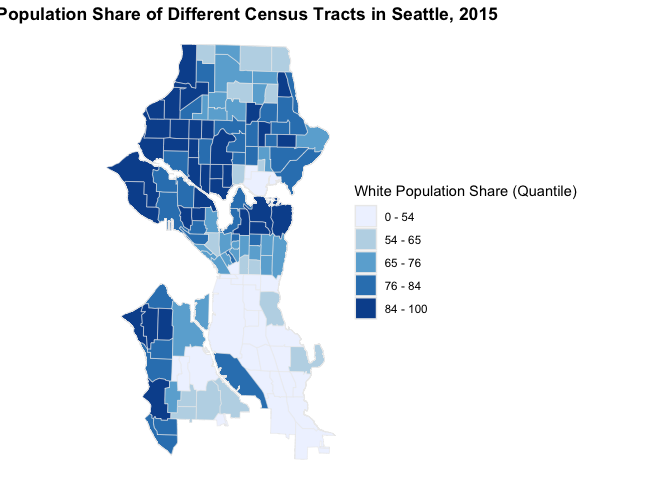<!-- -->


# Modeling

Process:
1) whole data set -> run lm -> select one var in each category
2) split data set -> run lm on training data set -> run vif and cor -> deal with multicollinearity
3) delete insignificant var. until all var at p < 0.05
4) delete var. with large p and examine R^2 & residual

## Initial Variables Selection


```r
# finalize regression dataset
house <- house %>%
  mutate(parks_area_log = log(parks_area + 1)) %>%
  select(-GEOID, -NAME) %>%
  st_drop_geometry()
str(house)
```

```
## tibble [6,738 × 47] (S3: tbl_df/tbl/data.frame)
##  $ key             : int [1:6738] 1 2 3 4 5 6 7 8 9 10 ...
##  $ price           : num [1:6738] 221900 538000 604000 468000 530000 ...
##  $ year_used       : num [1:6738] 60 64 50 73 115 36 99 68 100 106 ...
##  $ reno_dum        : Factor w/ 2 levels "0","1": 1 2 1 1 1 1 1 1 1 1 ...
##  $ bedrooms        : num [1:6738] 3 3 4 2 5 4 4 4 3 3 ...
##  $ bed_cat         : Factor w/ 3 levels "few","many","medium": 1 1 3 1 3 3 3 3 1 1 ...
##  $ bathrooms       : num [1:6738] 1 2.25 3 1 2 3 1 1.75 1.75 1 ...
##  $ bath_dum        : Factor w/ 2 levels "few","many": 1 1 1 1 1 1 1 1 1 1 ...
##  $ sqft_living     : num [1:6738] 1180 2570 1960 1160 1810 2950 1600 1620 2450 1400 ...
##  $ sqft_lot        : num [1:6738] 5650 7242 5000 6000 4850 ...
##  $ floor_cat       : Factor w/ 2 levels "irregular","regular": 2 2 2 2 2 2 2 2 2 2 ...
##  $ water_dum       : Factor w/ 2 levels "0","1": 1 1 1 1 1 1 1 1 1 1 ...
##  $ view_cat        : Factor w/ 5 levels "0","1","2","3",..: 1 1 1 1 1 4 1 1 1 1 ...
##  $ condition_cat   : Factor w/ 5 levels "1","2","3","4",..: 3 3 5 4 3 3 4 4 3 5 ...
##  $ grade_dum       : Factor w/ 2 levels "low","high": 1 1 1 1 1 1 1 1 1 1 ...
##  $ pop_den         : num [1:6738] 0.000152 0.000226 0.000191 0.000285 0.000289 ...
##  $ white_share     : num [1:6738] 25.1 60.8 87.7 82 88.7 ...
##  $ total_dep       : num [1:6738] 48.5 40.5 43.7 45 35.6 ...
##  $ elder_dep       : num [1:6738] 17.6 21.4 20.6 17.7 17.2 ...
##  $ bach_share      : num [1:6738] 19.4 33.2 35.7 31.2 45.2 ...
##  $ bach_dum        : Factor w/ 2 levels "below","above": 1 2 2 2 2 2 2 2 2 2 ...
##  $ median_hh_income: num [1:6738] 71524 56208 102500 103917 79681 ...
##  $ median_hh_dum   : Factor w/ 2 levels "below","above": 1 1 2 2 1 1 1 1 2 1 ...
##  $ employ_rate     : num [1:6738] 94.7 92.4 97.3 94.5 95.3 ...
##  $ employ_dum      : Factor w/ 2 levels "below","above": 2 1 2 2 2 1 2 1 2 2 ...
##  $ pover_rate      : num [1:6738] 16.69 11.65 4.06 5.04 9.53 ...
##  $ pover_dum       : Factor w/ 2 levels "below","above": 2 2 1 1 1 1 1 2 1 2 ...
##  $ sub_dis         : num [1:6738] 953 21264 25695 12654 482 ...
##  $ sub_cat         : Factor w/ 3 levels "within0.5mile",..: 1 3 3 3 1 3 1 3 1 1 ...
##  $ sch_cat         : chr [1:6738] "DD7" "DD1" "DD6" "DD3" ...
##  $ park_cat        : Factor w/ 5 levels "0","1","2","3",..: 1 1 1 1 2 1 2 1 2 1 ...
##  $ parks_area      : num [1:6738] 0 0 0 0 4857 ...
##  $ tree_canopy     : num [1:6738] 21.4 53.3 35.4 32.6 20.9 ...
##  $ med_dis1        : num [1:6738] 6483 4999 8222 8283 3468 ...
##  $ med_dis2        : num [1:6738] 6689 5128 11560 8447 3567 ...
##  $ med_dis3        : num [1:6738] 10014 5376 16427 8556 3908 ...
##  $ shop_dis1       : num [1:6738] 26817 4546 7031 9293 17165 ...
##  $ shop_dis2       : num [1:6738] 29426 5084 10930 9685 19082 ...
##  $ shop_dis3       : num [1:6738] 30348 5281 15974 10028 19881 ...
##  $ shop_cat        : Factor w/ 3 levels "within0.5mile",..: 3 2 3 3 3 2 3 1 3 1 ...
##  $ crime_c         : num [1:6738] 64 69 22 100 166 29 77 67 69 225 ...
##  $ crime_dis1      : num [1:6738] 188 104.1 128.9 78 96.1 ...
##  $ crime_dis2      : num [1:6738] 188 104 129 202 151 ...
##  $ crime_dis3      : num [1:6738] 188 104 129 245 169 ...
##  $ crime_dis4      : num [1:6738] 188 104 129 266 178 ...
##  $ crime_dis5      : num [1:6738] 188 104 129 279 183 ...
##  $ parks_area_log  : num [1:6738] 0 0 0 0 8.49 ...
```

```r
# select continuous or categorical variable
lm1 <- lm(price ~ .-key, data = house)
summary(lm1)
```

```
## 
## Call:
## lm(formula = price ~ . - key, data = house)
## 
## Residuals:
##      Min       1Q   Median       3Q      Max 
## -1202173   -79399    -1193    66314  1513487 
## 
## Coefficients:
##                            Estimate       Std. Error t value
## (Intercept)         -249325.9659871   131807.7683689  -1.892
## year_used               114.5243108       79.4769743   1.441
## reno_dum1             32952.8632999     8294.4720581   3.973
## bedrooms             -14776.3637980     3206.9774616  -4.608
## bed_catmany          -64227.1149660    45334.9781484  -1.417
## bed_catmedium           892.7796770     6736.1834614   0.133
## bathrooms              9907.7198387     4053.0777490   2.444
## bath_dummany         148573.0959401    22506.5466678   6.601
## sqft_living             202.4323443        4.5003103  44.982
## sqft_lot                  6.7768231        0.7133805   9.500
## floor_catregular     -85339.6669204    15907.0119707  -5.365
## water_dum1           457378.0418000    33094.6738198  13.820
## view_cat1             76186.0014050    13424.9963596   5.675
## view_cat2             42518.5401997     8251.5785049   5.153
## view_cat3            123147.2619949    11753.6528306  10.477
## view_cat4            234286.4465629    18172.8830281  12.892
## condition_cat2       179946.9641111    49054.3299238   3.668
## condition_cat3       188896.6709751    44765.6562971   4.220
## condition_cat4       204471.0049720    44802.3873898   4.564
## condition_cat5       245247.8693626    45018.4699511   5.448
## grade_dumhigh        365202.6308665    11730.8761166  31.132
## pop_den            27793440.4609839 19412362.4429670   1.432
## white_share            3409.1299589      275.0159247  12.396
## total_dep              -855.4121586      404.1109604  -2.117
## elder_dep              5670.5388379      549.6117061  10.317
## bach_share             1728.8220272      570.6129121   3.030
## bach_dumabove        -13096.4426859     9160.0736124  -1.430
## median_hh_income          1.7010450        0.1703055   9.988
## median_hh_dumabove   -33188.2808463     7324.7562174  -4.531
## employ_rate           -1595.6579183     1299.9943423  -1.227
## employ_dumabove        2310.8011213     8731.5859360   0.265
## pover_rate             4007.0160762      554.8123058   7.222
## pover_dumabove        -4891.0256966     7465.0904187  -0.655
## sub_dis                  -5.7260479        0.8988838  -6.370
## sub_cat0.5-1mile      10974.7529853     6226.5454200   1.763
## sub_cat1+mile        -26153.9180739    10096.2422436  -2.590
## sch_catDD2            74855.5760380    12476.9061273   6.000
## sch_catDD3            99482.7348147    11616.7016373   8.564
## sch_catDD4           160266.8111117    16260.8848131   9.856
## sch_catDD5           115220.2068680    14785.2914846   7.793
## sch_catDD6              354.2007763    14837.5085527   0.024
## sch_catDD7            27436.9289227    18061.4670614   1.519
## park_cat1             41671.7406194    27056.6270674   1.540
## park_cat2             54452.3571203    29408.7898451   1.852
## park_cat3            134811.1702014    34525.0638698   3.905
## park_cat4            369513.7529177    57503.3195038   6.426
## parks_area                0.0009814        0.0014490   0.677
## tree_canopy              73.8452119      262.6650665   0.281
## med_dis1                  0.9195066        2.1660818   0.425
## med_dis2                 -1.8066608        4.2004319  -0.430
## med_dis3                  2.0632681        4.0259759   0.512
## shop_dis1                -3.6769040        2.1601844  -1.702
## shop_dis2               -10.4344309        4.4316540  -2.355
## shop_dis3                 7.3123552        3.3829855   2.162
## shop_cat0.5-1mile    -12668.4852041     9133.7522571  -1.387
## shop_cat1+mile        -7147.0884977    11125.1071890  -0.642
## crime_c                -155.6926399       35.6678182  -4.365
## crime_dis1              158.9162106       91.7077678   1.733
## crime_dis2               64.0647278      207.9902510   0.308
## crime_dis3             -465.4888610      315.1575898  -1.477
## crime_dis4               84.5094957      384.0113243   0.220
## crime_dis5              225.1928175      221.2339628   1.018
## parks_area_log        -3228.5243414     2215.7644756  -1.457
##                                Pr(>|t|)    
## (Intercept)                    0.058589 .  
## year_used                      0.149639    
## reno_dum1           0.00007175933035836 ***
## bedrooms            0.00000414976726270 ***
## bed_catmany                    0.156611    
## bed_catmedium                  0.894565    
## bathrooms                      0.014531 *  
## bath_dummany        0.00000000004388104 ***
## sqft_living        < 0.0000000000000002 ***
## sqft_lot           < 0.0000000000000002 ***
## floor_catregular    0.00000008371288278 ***
## water_dum1         < 0.0000000000000002 ***
## view_cat1           0.00000001445616008 ***
## view_cat2           0.00000026402322112 ***
## view_cat3          < 0.0000000000000002 ***
## view_cat4          < 0.0000000000000002 ***
## condition_cat2                 0.000246 ***
## condition_cat3      0.00002478923734172 ***
## condition_cat4      0.00000511253290025 ***
## condition_cat5      0.00000005284230803 ***
## grade_dumhigh      < 0.0000000000000002 ***
## pop_den                        0.152265    
## white_share        < 0.0000000000000002 ***
## total_dep                      0.034316 *  
## elder_dep          < 0.0000000000000002 ***
## bach_share                     0.002457 ** 
## bach_dumabove                  0.152841    
## median_hh_income   < 0.0000000000000002 ***
## median_hh_dumabove  0.00000597347620818 ***
## employ_rate                    0.219703    
## employ_dumabove                0.791288    
## pover_rate          0.00000000000056792 ***
## pover_dumabove                 0.512370    
## sub_dis             0.00000000020137761 ***
## sub_cat0.5-1mile               0.078018 .  
## sub_cat1+mile                  0.009606 ** 
## sch_catDD2          0.00000000208246676 ***
## sch_catDD3         < 0.0000000000000002 ***
## sch_catDD4         < 0.0000000000000002 ***
## sch_catDD5          0.00000000000000755 ***
## sch_catDD6                     0.980955    
## sch_catDD7                     0.128788    
## park_cat1                      0.123567    
## park_cat2                      0.064132 .  
## park_cat3           0.00009525938059734 ***
## park_cat4           0.00000000014007737 ***
## parks_area                     0.498242    
## tree_canopy                    0.778613    
## med_dis1                       0.671213    
## med_dis2                       0.667127    
## med_dis3                       0.608326    
## shop_dis1                      0.088779 .  
## shop_dis2                      0.018575 *  
## shop_dis3                      0.030691 *  
## shop_cat0.5-1mile              0.165489    
## shop_cat1+mile                 0.520617    
## crime_c             0.00001289972215633 ***
## crime_dis1                     0.083168 .  
## crime_dis2                     0.758078    
## crime_dis3                     0.139722    
## crime_dis4                     0.825823    
## crime_dis5                     0.308765    
## parks_area_log                 0.145144    
## ---
## Signif. codes:  0 '***' 0.001 '**' 0.01 '*' 0.05 '.' 0.1 ' ' 1
## 
## Residual standard error: 153700 on 6674 degrees of freedom
##   (1 observation deleted due to missingness)
## Multiple R-squared:  0.7993,	Adjusted R-squared:  0.7974 
## F-statistic: 428.6 on 62 and 6674 DF,  p-value: < 0.00000000000000022
```

```r
## bedroom
lm2 <- lm(price ~ .-bed_cat-key, data = house)
summary(lm2)
```

```
## 
## Call:
## lm(formula = price ~ . - bed_cat - key, data = house)
## 
## Residuals:
##      Min       1Q   Median       3Q      Max 
## -1201502   -79577    -1182    66502  1513193 
## 
## Coefficients:
##                           Estimate      Std. Error t value             Pr(>|t|)
## (Intercept)         -246008.858440   131696.818004  -1.868             0.061807
## year_used               114.224599       79.028938   1.445             0.148406
## reno_dum1             33037.851110     8294.661714   3.983  0.00006876656376665
## bedrooms             -15725.848017     2294.665130  -6.853  0.00000000000786655
## bathrooms             10015.754754     4052.613190   2.471             0.013482
## bath_dummany         144627.783588    22372.651330   6.464  0.00000000010881627
## sqft_living             203.126879        4.440542  45.744 < 0.0000000000000002
## sqft_lot                  6.785923        0.713339   9.513 < 0.0000000000000002
## floor_catregular     -84469.636336    15895.570458  -5.314  0.00000011069442063
## water_dum1           457234.570690    33094.713593  13.816 < 0.0000000000000002
## view_cat1             76185.239431    13425.521550   5.675  0.00000001447942743
## view_cat2             42579.475268     8248.667106   5.162  0.00000025140739034
## view_cat3            122970.130659    11753.617195  10.462 < 0.0000000000000002
## view_cat4            234338.838587    18173.008277  12.895 < 0.0000000000000002
## condition_cat2       179655.980555    49055.994155   3.662             0.000252
## condition_cat3       188689.102166    44767.208211   4.215  0.00002531893261331
## condition_cat4       204414.587584    44803.555260   4.562  0.00000514608512881
## condition_cat5       245215.033954    45020.104392   5.447  0.00000005311658270
## grade_dumhigh        364626.368714    11725.342110  31.097 < 0.0000000000000002
## pop_den            27970930.561295 19408409.504395   1.441             0.149582
## white_share            3409.546105      275.023726  12.397 < 0.0000000000000002
## total_dep              -836.737851      403.962164  -2.071             0.038367
## elder_dep              5659.420097      549.560575  10.298 < 0.0000000000000002
## bach_share             1712.975766      570.546689   3.002             0.002689
## bach_dumabove        -13096.710059     9160.471260  -1.430             0.152850
## median_hh_income          1.696394        0.170284   9.962 < 0.0000000000000002
## median_hh_dumabove   -33278.040868     7324.341034  -4.543  0.00000563050495486
## employ_rate           -1611.537825     1299.961223  -1.240             0.215137
## employ_dumabove        2433.310909     8731.433458   0.279             0.780496
## pover_rate             3968.870656      554.249441   7.161  0.00000000000088797
## pover_dumabove        -4548.741848     7461.862359  -0.610             0.542148
## sub_dis                  -5.746379        0.898815  -6.393  0.00000000017331970
## sub_cat0.5-1mile      10964.330441     6226.727027   1.761             0.078310
## sub_cat1+mile        -26191.890087    10096.285404  -2.594             0.009502
## sch_catDD2            74845.745610    12475.643020   5.999  0.00000000208473906
## sch_catDD3            99569.626567    11613.909834   8.573 < 0.0000000000000002
## sch_catDD4           160383.189797    16261.364253   9.863 < 0.0000000000000002
## sch_catDD5           114873.489531    14782.554125   7.771  0.00000000000000897
## sch_catDD6               67.671001    14836.446552   0.005             0.996361
## sch_catDD7            27074.217308    18060.109188   1.499             0.133891
## park_cat1             42906.348432    27042.115262   1.587             0.112639
## park_cat2             55780.584668    29394.103241   1.898             0.057781
## park_cat3            136665.583339    34507.303533   3.960  0.00007557638727573
## park_cat4            371420.955168    57492.656545   6.460  0.00000000011183855
## parks_area                0.001021        0.001449   0.705             0.480904
## tree_canopy              72.552147      262.673147   0.276             0.782398
## med_dis1                  0.842570        2.165621   0.389             0.697240
## med_dis2                 -1.824386        4.200307  -0.434             0.664051
## med_dis3                  2.186548        4.025206   0.543             0.587001
## shop_dis1                -3.547773        2.158757  -1.643             0.100340
## shop_dis2               -10.521750        4.431452  -2.374             0.017609
## shop_dis3                 7.261163        3.382882   2.146             0.031874
## shop_cat0.5-1mile    -12784.168332     9133.434375  -1.400             0.161646
## shop_cat1+mile        -7100.614533    11125.558136  -0.638             0.523349
## crime_c                -156.639426       35.659597  -4.393  0.00001137177033086
## crime_dis1              157.718589       91.703255   1.720             0.085501
## crime_dis2               67.789837      207.982366   0.326             0.744480
## crime_dis3             -471.100295      315.149428  -1.495             0.135002
## crime_dis4               86.832072      383.990266   0.226             0.821107
## crime_dis5              226.904487      221.207876   1.026             0.305046
## parks_area_log        -3336.740476     2214.581092  -1.507             0.131931
##                       
## (Intercept)        .  
## year_used             
## reno_dum1          ***
## bedrooms           ***
## bathrooms          *  
## bath_dummany       ***
## sqft_living        ***
## sqft_lot           ***
## floor_catregular   ***
## water_dum1         ***
## view_cat1          ***
## view_cat2          ***
## view_cat3          ***
## view_cat4          ***
## condition_cat2     ***
## condition_cat3     ***
## condition_cat4     ***
## condition_cat5     ***
## grade_dumhigh      ***
## pop_den               
## white_share        ***
## total_dep          *  
## elder_dep          ***
## bach_share         ** 
## bach_dumabove         
## median_hh_income   ***
## median_hh_dumabove ***
## employ_rate           
## employ_dumabove       
## pover_rate         ***
## pover_dumabove        
## sub_dis            ***
## sub_cat0.5-1mile   .  
## sub_cat1+mile      ** 
## sch_catDD2         ***
## sch_catDD3         ***
## sch_catDD4         ***
## sch_catDD5         ***
## sch_catDD6            
## sch_catDD7            
## park_cat1             
## park_cat2          .  
## park_cat3          ***
## park_cat4          ***
## parks_area            
## tree_canopy           
## med_dis1              
## med_dis2              
## med_dis3              
## shop_dis1             
## shop_dis2          *  
## shop_dis3          *  
## shop_cat0.5-1mile     
## shop_cat1+mile        
## crime_c            ***
## crime_dis1         .  
## crime_dis2            
## crime_dis3            
## crime_dis4            
## crime_dis5            
## parks_area_log        
## ---
## Signif. codes:  0 '***' 0.001 '**' 0.01 '*' 0.05 '.' 0.1 ' ' 1
## 
## Residual standard error: 153700 on 6676 degrees of freedom
##   (1 observation deleted due to missingness)
## Multiple R-squared:  0.7992,	Adjusted R-squared:  0.7974 
## F-statistic: 442.8 on 60 and 6676 DF,  p-value: < 0.00000000000000022
```

```r
house <- house %>%
  select(-bed_cat)

## bathroom
lm3 <- lm(price ~ .-bathrooms-key, data = house)
summary(lm3)
```

```
## 
## Call:
## lm(formula = price ~ . - bathrooms - key, data = house)
## 
## Residuals:
##      Min       1Q   Median       3Q      Max 
## -1208256   -79067    -1359    66373  1519908 
## 
## Coefficients:
##                           Estimate      Std. Error t value             Pr(>|t|)
## (Intercept)         -237322.418846   131700.255866  -1.802             0.071592
## year_used                20.707373       69.407803   0.298             0.765450
## reno_dum1             37143.343264     8129.724264   4.569  0.00000499265475458
## bedrooms             -14628.540431     2252.161680  -6.495  0.00000000008881123
## bath_dummany         154659.582120    22009.759317   7.027  0.00000000000232160
## sqft_living             208.523358        3.868073  53.909 < 0.0000000000000002
## sqft_lot                  6.569130        0.708196   9.276 < 0.0000000000000002
## floor_catregular     -84307.792237    15901.514486  -5.302  0.00000011829807676
## water_dum1           460452.197925    33081.741758  13.919 < 0.0000000000000002
## view_cat1             76321.660636    13430.542377   5.683  0.00000001381804916
## view_cat2             42900.079516     8250.801141   5.200  0.00000020575823224
## view_cat3            123264.127707    11757.509920  10.484 < 0.0000000000000002
## view_cat4            234438.877913    18179.913117  12.895 < 0.0000000000000002
## condition_cat2       180799.428441    49072.572057   3.684             0.000231
## condition_cat3       189229.204277    44783.794999   4.225  0.00002416975202221
## condition_cat4       205504.334850    44818.518925   4.585  0.00000461696636928
## condition_cat5       248263.218679    45020.417240   5.514  0.00000003629560049
## grade_dumhigh        364263.695481    11728.907581  31.057 < 0.0000000000000002
## pop_den            27415236.280115 19414528.926308   1.412             0.157967
## white_share            3407.847813      275.128045  12.386 < 0.0000000000000002
## total_dep              -859.703489      404.009718  -2.128             0.033380
## elder_dep              5674.215963      549.738122  10.322 < 0.0000000000000002
## bach_share             1708.921155      570.762524   2.994             0.002763
## bach_dumabove        -13208.416177     9163.862964  -1.441             0.149530
## median_hh_income          1.708984        0.170273  10.037 < 0.0000000000000002
## median_hh_dumabove   -33539.697686     7326.376574  -4.578  0.00000478087323459
## employ_rate           -1587.029451     1300.420531  -1.220             0.222357
## employ_dumabove        2764.175306     8733.745853   0.316             0.751638
## pover_rate             3985.755402      554.419279   7.189  0.00000000000072338
## pover_dumabove        -4599.423271     7464.687824  -0.616             0.537812
## sub_dis                  -5.752568        0.899155  -6.398  0.00000000016835662
## sub_cat0.5-1mile      10902.550959     6229.058130   1.750             0.080117
## sub_cat1+mile        -26657.813735    10098.385605  -2.640             0.008315
## sch_catDD2            76119.425760    12469.760851   6.104  0.00000000109026333
## sch_catDD3           100436.816915    11613.047547   8.649 < 0.0000000000000002
## sch_catDD4           161730.790471    16258.435109   9.948 < 0.0000000000000002
## sch_catDD5           115418.354496    14786.562727   7.806  0.00000000000000683
## sch_catDD6             2364.399602    14812.976086   0.160             0.873188
## sch_catDD7            27866.411041    18064.170076   1.543             0.122967
## park_cat1             42606.114969    27052.184057   1.575             0.115313
## park_cat2             55984.195331    29405.228984   1.904             0.056968
## park_cat3            135227.186775    34515.589836   3.918  0.00009023097375016
## park_cat4            367841.214773    57496.387866   6.398  0.00000000016847697
## parks_area                0.001030        0.001449   0.711             0.477376
## tree_canopy              73.645175      262.773229   0.280             0.779286
## med_dis1                  1.071750        2.164462   0.495             0.620505
## med_dis2                 -2.017435        4.201187  -0.480             0.631097
## med_dis3                  2.095743        4.026577   0.520             0.602748
## shop_dis1                -3.676466        2.158955  -1.703             0.088635
## shop_dis2               -10.156086        4.430675  -2.292             0.021924
## shop_dis3                 6.983239        3.382306   2.065             0.038996
## shop_cat0.5-1mile    -12898.947307     9136.809169  -1.412             0.158068
## shop_cat1+mile        -6878.676025    11129.450336  -0.618             0.536556
## crime_c                -150.447266       35.585072  -4.228  0.00002391147845724
## crime_dis1              158.344914       91.737975   1.726             0.084384
## crime_dis2               73.271576      208.050073   0.352             0.724713
## crime_dis3             -475.567586      315.264766  -1.508             0.131481
## crime_dis4               79.924142      384.126939   0.208             0.835183
## crime_dis5              233.541574      221.276164   1.055             0.291267
## parks_area_log        -3304.192940     2215.388845  -1.491             0.135885
##                       
## (Intercept)        .  
## year_used             
## reno_dum1          ***
## bedrooms           ***
## bath_dummany       ***
## sqft_living        ***
## sqft_lot           ***
## floor_catregular   ***
## water_dum1         ***
## view_cat1          ***
## view_cat2          ***
## view_cat3          ***
## view_cat4          ***
## condition_cat2     ***
## condition_cat3     ***
## condition_cat4     ***
## condition_cat5     ***
## grade_dumhigh      ***
## pop_den               
## white_share        ***
## total_dep          *  
## elder_dep          ***
## bach_share         ** 
## bach_dumabove         
## median_hh_income   ***
## median_hh_dumabove ***
## employ_rate           
## employ_dumabove       
## pover_rate         ***
## pover_dumabove        
## sub_dis            ***
## sub_cat0.5-1mile   .  
## sub_cat1+mile      ** 
## sch_catDD2         ***
## sch_catDD3         ***
## sch_catDD4         ***
## sch_catDD5         ***
## sch_catDD6            
## sch_catDD7            
## park_cat1             
## park_cat2          .  
## park_cat3          ***
## park_cat4          ***
## parks_area            
## tree_canopy           
## med_dis1              
## med_dis2              
## med_dis3              
## shop_dis1          .  
## shop_dis2          *  
## shop_dis3          *  
## shop_cat0.5-1mile     
## shop_cat1+mile        
## crime_c            ***
## crime_dis1         .  
## crime_dis2            
## crime_dis3            
## crime_dis4            
## crime_dis5            
## parks_area_log        
## ---
## Signif. codes:  0 '***' 0.001 '**' 0.01 '*' 0.05 '.' 0.1 ' ' 1
## 
## Residual standard error: 153800 on 6677 degrees of freedom
##   (1 observation deleted due to missingness)
## Multiple R-squared:  0.799,	Adjusted R-squared:  0.7972 
## F-statistic: 449.9 on 59 and 6677 DF,  p-value: < 0.00000000000000022
```

```r
house <- house %>%
  select(-bathrooms)

## dependency
lm4 <- lm(price ~ .-total_dep-key, data = house)
summary(lm4)
```

```
## 
## Call:
## lm(formula = price ~ . - total_dep - key, data = house)
## 
## Residuals:
##      Min       1Q   Median       3Q      Max 
## -1212895   -79456    -1461    66762  1518366 
## 
## Coefficients:
##                            Estimate       Std. Error t value
## (Intercept)         -249835.7826993   131603.6547721  -1.898
## year_used                21.6786401       69.4246335   0.312
## reno_dum1             37518.4026072     8129.9601255   4.615
## bedrooms             -14629.6526527     2252.7564642  -6.494
## bath_dummany         154457.9286532    22015.3685090   7.016
## sqft_living             208.7609110        3.8674825  53.979
## sqft_lot                  6.5793534        0.7083663   9.288
## floor_catregular     -84388.9267918    15905.6686984  -5.306
## water_dum1           460941.1452339    33089.6811660  13.930
## view_cat1             76778.9902205    13432.3695360   5.716
## view_cat2             42849.2981065     8252.9458365   5.192
## view_cat3            124087.3375187    11754.2474639  10.557
## view_cat4            235290.5002308    18180.3080030  12.942
## condition_cat2       180016.8940375    49084.1548879   3.668
## condition_cat3       188010.0861611    44791.9576541   4.197
## condition_cat4       204201.6848530    44826.1744226   4.555
## condition_cat5       247225.2948382    45029.6650646   5.490
## grade_dumhigh        364627.4186297    11730.7595547  31.083
## pop_den            35011533.5239264 19088551.3605243   1.834
## white_share            3434.5006928      274.9153811  12.493
## elder_dep              4828.0216451      379.6757621  12.716
## bach_share             1952.7077209      559.2940533   3.491
## bach_dumabove        -10917.0213927     9102.7796158  -1.199
## median_hh_income          1.6134632        0.1642925   9.821
## median_hh_dumabove   -35992.1594540     7237.0688970  -4.973
## employ_rate           -1535.3221912     1300.5368944  -1.181
## employ_dumabove        -311.3596367     8615.6000435  -0.036
## pover_rate             3597.9396693      523.7464707   6.870
## pover_dumabove        -3399.3259146     7445.3184809  -0.457
## sub_dis                  -5.9868348        0.8926254  -6.707
## sub_cat0.5-1mile       9785.8570081     6208.5525530   1.576
## sub_cat1+mile        -30798.3059372     9911.7699786  -3.107
## sch_catDD2            70632.1697964    12203.4402879   5.788
## sch_catDD3            97100.4150930    11509.7558080   8.436
## sch_catDD4           156360.6792475    16065.6238771   9.733
## sch_catDD5           109669.3643699    14541.4920774   7.542
## sch_catDD6            -3660.4691565    14543.7104033  -0.252
## sch_catDD7            19914.9890893    17678.1320535   1.127
## park_cat1             42995.5436788    27058.7099304   1.589
## park_cat2             57093.1303672    29408.3760700   1.941
## park_cat3            135491.5238135    34524.4825543   3.925
## park_cat4            367726.1981647    57511.5485023   6.394
## parks_area                0.0009856        0.0014496   0.680
## tree_canopy              54.0884735      262.6818230   0.206
## med_dis1                  0.8853787        2.1632602   0.409
## med_dis2                 -2.5428803        4.1950317  -0.606
## med_dis3                  2.8219381        4.0131490   0.703
## shop_dis1                -2.7976403        2.1196442  -1.320
## shop_dis2               -12.1827664        4.3282414  -2.815
## shop_dis3                 8.0903605        3.3429327   2.420
## shop_cat0.5-1mile    -13741.6396746     9130.6338737  -1.505
## shop_cat1+mile        -8368.5674904    11110.3384326  -0.753
## crime_c                -142.3204826       35.3888836  -4.022
## crime_dis1              157.9443950       91.7620120   1.721
## crime_dis2               74.7123571      208.1039214   0.359
## crime_dis3             -475.5895799      315.3480338  -1.508
## crime_dis4               88.9973325      384.2047238   0.232
## crime_dis5              224.8092719      221.2965428   1.016
## parks_area_log        -3323.3187372     2215.9557404  -1.500
##                                Pr(>|t|)    
## (Intercept)                    0.057687 .  
## year_used                      0.754852    
## reno_dum1            0.0000040076198568 ***
## bedrooms             0.0000000000895291 ***
## bath_dummany         0.0000000000025094 ***
## sqft_living        < 0.0000000000000002 ***
## sqft_lot           < 0.0000000000000002 ***
## floor_catregular     0.0000001159223363 ***
## water_dum1         < 0.0000000000000002 ***
## view_cat1            0.0000000113788097 ***
## view_cat2            0.0000002141931892 ***
## view_cat3          < 0.0000000000000002 ***
## view_cat4          < 0.0000000000000002 ***
## condition_cat2                 0.000247 ***
## condition_cat3       0.0000273491383633 ***
## condition_cat4       0.0000053212043332 ***
## condition_cat5       0.0000000416072362 ***
## grade_dumhigh      < 0.0000000000000002 ***
## pop_den                        0.066674 .  
## white_share        < 0.0000000000000002 ***
## elder_dep          < 0.0000000000000002 ***
## bach_share                     0.000484 ***
## bach_dumabove                  0.230451    
## median_hh_income   < 0.0000000000000002 ***
## median_hh_dumabove   0.0000006746429541 ***
## employ_rate                    0.237832    
## employ_dumabove                0.971173    
## pover_rate           0.0000000000070187 ***
## pover_dumabove                 0.647993    
## sub_dis              0.0000000000214948 ***
## sub_cat0.5-1mile               0.115029    
## sub_cat1+mile                  0.001896 ** 
## sch_catDD2           0.0000000074507853 ***
## sch_catDD3         < 0.0000000000000002 ***
## sch_catDD4         < 0.0000000000000002 ***
## sch_catDD5           0.0000000000000525 ***
## sch_catDD6                     0.801290    
## sch_catDD7                     0.259981    
## park_cat1                      0.112114    
## park_cat2                      0.052253 .  
## park_cat3            0.0000877809924255 ***
## park_cat4            0.0000000001725644 ***
## parks_area                     0.496567    
## tree_canopy                    0.836869    
## med_dis1                       0.682347    
## med_dis2                       0.544426    
## med_dis3                       0.481972    
## shop_dis1                      0.186926    
## shop_dis2                      0.004896 ** 
## shop_dis3                      0.015541 *  
## shop_cat0.5-1mile              0.132370    
## shop_cat1+mile                 0.451342    
## crime_c              0.0000584374188796 ***
## crime_dis1                     0.085254 .  
## crime_dis2                     0.719595    
## crime_dis3                     0.131566    
## crime_dis4                     0.816824    
## crime_dis5                     0.309726    
## parks_area_log                 0.133734    
## ---
## Signif. codes:  0 '***' 0.001 '**' 0.01 '*' 0.05 '.' 0.1 ' ' 1
## 
## Residual standard error: 153800 on 6678 degrees of freedom
##   (1 observation deleted due to missingness)
## Multiple R-squared:  0.7989,	Adjusted R-squared:  0.7971 
## F-statistic: 457.3 on 58 and 6678 DF,  p-value: < 0.00000000000000022
```

```r
house <- house %>%
  select(-total_dep)

## bachelor degree
lm5 <- lm(price ~ .-bach_dum-key, data = house)
summary(lm5)
```

```
## 
## Call:
## lm(formula = price ~ . - bach_dum - key, data = house)
## 
## Residuals:
##      Min       1Q   Median       3Q      Max 
## -1212732   -79714    -1215    66826  1521122 
## 
## Coefficients:
##                            Estimate       Std. Error t value
## (Intercept)         -252074.8545467   131594.7293649  -1.916
## year_used                20.0652909       69.4138767   0.289
## reno_dum1             37375.7794772     8129.3570628   4.598
## bedrooms             -14634.1596495     2252.8272514  -6.496
## bath_dummany         154784.8646398    22014.4030454   7.031
## sqft_living             208.7363561        3.8675552  53.971
## sqft_lot                  6.5954588        0.7082622   9.312
## floor_catregular     -84639.2551912    15904.8209715  -5.322
## water_dum1           460506.7210434    33088.7841983  13.917
## view_cat1             76489.5394151    13430.6418223   5.695
## view_cat2             42608.8162815     8250.7802760   5.164
## view_cat3            123374.2197719    11739.5834007  10.509
## view_cat4            234766.2559877    18175.6486005  12.917
## condition_cat2       180139.5097814    49085.6590502   3.670
## condition_cat3       188162.0150342    44793.2483091   4.201
## condition_cat4       204413.5341414    44827.2972906   4.560
## condition_cat5       247408.0479330    45030.8848217   5.494
## grade_dumhigh        364804.6347695    11730.2137616  31.100
## pop_den            35359064.9464932 19086978.0272244   1.853
## white_share            3361.9686992      268.1894175  12.536
## elder_dep              4754.1972801      374.6648758  12.689
## bach_share             1620.2675695      485.7869733   3.335
## median_hh_income          1.6295230        0.1637512   9.951
## median_hh_dumabove   -37197.2141337     7167.2120258  -5.190
## employ_rate           -1451.1904449     1298.6861920  -1.117
## employ_dumabove        -776.5723804     8607.1457636  -0.090
## pover_rate             3665.0545121      520.7652890   7.038
## pover_dumabove        -4184.7642998     7416.7020497  -0.564
## sub_dis                  -5.8361696        0.8837699  -6.604
## sub_cat0.5-1mile       9755.2761802     6208.7039159   1.571
## sub_cat1+mile        -31524.6138058     9893.5761105  -3.186
## sch_catDD2            72059.3878281    12145.6761591   5.933
## sch_catDD3            97097.2795182    11510.1331914   8.436
## sch_catDD4           158911.8004712    15924.7005081   9.979
## sch_catDD5           109143.6086811    14535.3595418   7.509
## sch_catDD6            -3021.4774869    14534.4246023  -0.208
## sch_catDD7            20755.6466703    17664.8095217   1.175
## park_cat1             42243.0893537    27052.3227900   1.562
## park_cat2             56123.1445954    29398.2169506   1.909
## park_cat3            133525.5653320    34486.6759293   3.872
## park_cat4            366641.2696585    57506.3203035   6.376
## parks_area                0.0009646        0.0014496   0.665
## tree_canopy              62.9142602      262.5873361   0.240
## med_dis1                  0.7161545        2.1587243   0.332
## med_dis2                 -1.6686863        4.1313547  -0.404
## med_dis3                  2.0874050        3.9662682   0.526
## shop_dis1                -2.8500386        2.1192634  -1.345
## shop_dis2               -12.3961274        4.3247256  -2.866
## shop_dis3                 8.4263093        3.3312851   2.529
## shop_cat0.5-1mile    -13185.7663309     9119.1613623  -1.446
## shop_cat1+mile        -7721.6555607    11097.6008385  -0.696
## crime_c                -140.5643667       35.3597374  -3.975
## crime_dis1              157.5614092       91.7644673   1.717
## crime_dis2               76.5889976      208.1048669   0.368
## crime_dis3             -472.5219011      315.3480073  -1.498
## crime_dis4               84.3429638      384.1977293   0.220
## crime_dis5              225.8211661      221.3021959   1.020
## parks_area_log        -3267.4699858     2215.5390841  -1.475
##                                Pr(>|t|)    
## (Intercept)                    0.055466 .  
## year_used                      0.772539    
## reno_dum1            0.0000043519016275 ***
## bedrooms             0.0000000000884727 ***
## bath_dummany         0.0000000000022531 ***
## sqft_living        < 0.0000000000000002 ***
## sqft_lot           < 0.0000000000000002 ***
## floor_catregular     0.0000001061996258 ***
## water_dum1         < 0.0000000000000002 ***
## view_cat1            0.0000000128503826 ***
## view_cat2            0.0000002484321289 ***
## view_cat3          < 0.0000000000000002 ***
## view_cat4          < 0.0000000000000002 ***
## condition_cat2                 0.000245 ***
## condition_cat3       0.0000269579501963 ***
## condition_cat4       0.0000052060115090 ***
## condition_cat5       0.0000000406998568 ***
## grade_dumhigh      < 0.0000000000000002 ***
## pop_den                        0.063995 .  
## white_share        < 0.0000000000000002 ***
## elder_dep          < 0.0000000000000002 ***
## bach_share                     0.000857 ***
## median_hh_income   < 0.0000000000000002 ***
## median_hh_dumabove   0.0000002165964040 ***
## employ_rate                    0.263851    
## employ_dumabove                0.928112    
## pover_rate           0.0000000000021473 ***
## pover_dumabove                 0.572613    
## sub_dis              0.0000000000431804 ***
## sub_cat0.5-1mile               0.116178    
## sub_cat1+mile                  0.001447 ** 
## sch_catDD2           0.0000000031247072 ***
## sch_catDD3         < 0.0000000000000002 ***
## sch_catDD4         < 0.0000000000000002 ***
## sch_catDD5           0.0000000000000674 ***
## sch_catDD6                     0.835326    
## sch_catDD7                     0.240048    
## park_cat1                      0.118445    
## park_cat2                      0.056296 .  
## park_cat3                      0.000109 ***
## park_cat4            0.0000000001943225 ***
## parks_area                     0.505777    
## tree_canopy                    0.810653    
## med_dis1                       0.740089    
## med_dis2                       0.686293    
## med_dis3                       0.598705    
## shop_dis1                      0.178727    
## shop_dis2                      0.004165 ** 
## shop_dis3                      0.011447 *  
## shop_cat0.5-1mile              0.148241    
## shop_cat1+mile                 0.486581    
## crime_c              0.0000710419175430 ***
## crime_dis1                     0.086022 .  
## crime_dis2                     0.712862    
## crime_dis3                     0.134073    
## crime_dis4                     0.826244    
## crime_dis5                     0.307566    
## parks_area_log                 0.140314    
## ---
## Signif. codes:  0 '***' 0.001 '**' 0.01 '*' 0.05 '.' 0.1 ' ' 1
## 
## Residual standard error: 153800 on 6679 degrees of freedom
##   (1 observation deleted due to missingness)
## Multiple R-squared:  0.7988,	Adjusted R-squared:  0.7971 
## F-statistic: 465.3 on 57 and 6679 DF,  p-value: < 0.00000000000000022
```

```r
house <- house %>%
  select(-bach_dum)

## median household income
lm6 <- lm(price ~ .-median_hh_dum-key, data = house)
summary(lm6)
```

```
## 
## Call:
## lm(formula = price ~ . - median_hh_dum - key, data = house)
## 
## Residuals:
##      Min       1Q   Median       3Q      Max 
## -1215472   -77975    -1421    66158  1526190 
## 
## Coefficients:
##                          Estimate      Std. Error t value             Pr(>|t|)
## (Intercept)        -230447.211533   131783.814046  -1.749             0.080393
## year_used               35.550211       69.484218   0.512             0.608927
## reno_dum1            35588.475895     8137.811117   4.373   0.0000124283085191
## bedrooms            -14772.793649     2257.037655  -6.545   0.0000000000638174
## bath_dummany        155627.979809    22056.496712   7.056   0.0000000000018879
## sqft_living            209.599905        3.871468  54.140 < 0.0000000000000002
## sqft_lot                 6.515224        0.709467   9.183 < 0.0000000000000002
## floor_catregular    -84627.923614    15935.666273  -5.311   0.0000001127919801
## water_dum1          458998.964778    33151.677987  13.845 < 0.0000000000000002
## view_cat1            75528.012339    13455.408529   5.613   0.0000000206582466
## view_cat2            43417.349102     8265.307882   5.253   0.0000001542999235
## view_cat3           123603.351200    11762.267706  10.508 < 0.0000000000000002
## view_cat4           236409.427534    18208.134922  12.984 < 0.0000000000000002
## condition_cat2      175130.797205    49171.347951   3.562             0.000371
## condition_cat3      184771.006944    44875.344479   4.117   0.0000387741500494
## condition_cat4      200511.625073    44907.917013   4.465   0.0000081404049600
## condition_cat5      242699.858826    45109.060141   5.380   0.0000000768916433
## grade_dumhigh       365497.356640    11752.202192  31.100 < 0.0000000000000002
## pop_den           34339237.606685 19122981.393687   1.796             0.072587
## white_share           2946.657710      256.468944  11.489 < 0.0000000000000002
## elder_dep             4925.893411      373.925208  13.173 < 0.0000000000000002
## bach_share            1895.382420      483.822587   3.918   0.0000903586558697
## median_hh_income         1.117085        0.130888   8.535 < 0.0000000000000002
## employ_rate          -1086.850693     1299.302366  -0.836             0.402910
## employ_dumabove      -2971.552009     8613.420964  -0.345             0.730112
## pover_rate            3526.523087      521.089396   6.768   0.0000000000142062
## pover_dumabove       -7661.440750     7400.712161  -1.035             0.300599
## sub_dis                 -6.107813        0.883930  -6.910   0.0000000000053006
## sub_cat0.5-1mile      6588.637764     6190.632942   1.064             0.287235
## sub_cat1+mile       -27684.968889     9885.009312  -2.801             0.005114
## sch_catDD2           60863.718238    11975.751327   5.082   0.0000003831306944
## sch_catDD3           86802.268882    11359.901437   7.641   0.0000000000000246
## sch_catDD4          147967.789468    15815.080314   9.356 < 0.0000000000000002
## sch_catDD5          106339.501981    14553.484305   7.307   0.0000000000003054
## sch_catDD6           -2986.135644    14562.610739  -0.205             0.837535
## sch_catDD7            1353.998686    17298.196270   0.078             0.937612
## park_cat1            41683.889335    27104.572463   1.538             0.124123
## park_cat2            52598.565860    29447.370828   1.786             0.074114
## park_cat3           128405.527149    34539.417776   3.718             0.000203
## park_cat4           365092.009732    57617.070469   6.337   0.0000000002503015
## parks_area               0.001405        0.001450   0.969             0.332537
## tree_canopy            105.191971      262.969960   0.400             0.689158
## med_dis1                -1.119954        2.133667  -0.525             0.599673
## med_dis2                 0.710893        4.113796   0.173             0.862808
## med_dis3                 0.166168        3.956614   0.042             0.966502
## shop_dis1               -2.344837        2.121132  -1.105             0.268998
## shop_dis2              -12.149471        4.332851  -2.804             0.005061
## shop_dis3                8.548084        3.337663   2.561             0.010456
## shop_cat0.5-1mile   -14055.641136     9135.303430  -1.539             0.123948
## shop_cat1+mile      -10498.352830    11106.194075  -0.945             0.344555
## crime_c               -146.789079       35.407927  -4.146   0.0000343034195843
## crime_dis1             162.198178       91.938076   1.764             0.077742
## crime_dis2              59.768186      208.483172   0.287             0.774365
## crime_dis3            -444.269261      315.912504  -1.406             0.159680
## crime_dis4              52.016634      384.892242   0.135             0.892501
## crime_dis5             245.721544      221.698098   1.108             0.267746
## parks_area_log       -3266.697186     2219.835846  -1.472             0.141178
##                      
## (Intercept)       .  
## year_used            
## reno_dum1         ***
## bedrooms          ***
## bath_dummany      ***
## sqft_living       ***
## sqft_lot          ***
## floor_catregular  ***
## water_dum1        ***
## view_cat1         ***
## view_cat2         ***
## view_cat3         ***
## view_cat4         ***
## condition_cat2    ***
## condition_cat3    ***
## condition_cat4    ***
## condition_cat5    ***
## grade_dumhigh     ***
## pop_den           .  
## white_share       ***
## elder_dep         ***
## bach_share        ***
## median_hh_income  ***
## employ_rate          
## employ_dumabove      
## pover_rate        ***
## pover_dumabove       
## sub_dis           ***
## sub_cat0.5-1mile     
## sub_cat1+mile     ** 
## sch_catDD2        ***
## sch_catDD3        ***
## sch_catDD4        ***
## sch_catDD5        ***
## sch_catDD6           
## sch_catDD7           
## park_cat1            
## park_cat2         .  
## park_cat3         ***
## park_cat4         ***
## parks_area           
## tree_canopy          
## med_dis1             
## med_dis2             
## med_dis3             
## shop_dis1            
## shop_dis2         ** 
## shop_dis3         *  
## shop_cat0.5-1mile    
## shop_cat1+mile       
## crime_c           ***
## crime_dis1        .  
## crime_dis2           
## crime_dis3           
## crime_dis4           
## crime_dis5           
## parks_area_log       
## ---
## Signif. codes:  0 '***' 0.001 '**' 0.01 '*' 0.05 '.' 0.1 ' ' 1
## 
## Residual standard error: 154100 on 6680 degrees of freedom
##   (1 observation deleted due to missingness)
## Multiple R-squared:  0.798,	Adjusted R-squared:  0.7963 
## F-statistic: 471.3 on 56 and 6680 DF,  p-value: < 0.00000000000000022
```

```r
house <- house %>%
  select(-median_hh_dum)

## employment
lm7 <- lm(price ~ .-employ_dum-key, data = house)
summary(lm7)
```

```
## 
## Call:
## lm(formula = price ~ . - employ_dum - key, data = house)
## 
## Residuals:
##      Min       1Q   Median       3Q      Max 
## -1215162   -77932    -1411    66078  1526134 
## 
## Coefficients:
##                          Estimate      Std. Error t value             Pr(>|t|)
## (Intercept)        -202826.900439   104669.805727  -1.938             0.052692
## year_used               36.070016       69.463300   0.519             0.603592
## reno_dum1            35587.014335     8137.273455   4.373   0.0000124220723950
## bedrooms            -14754.677593     2256.277935  -6.539   0.0000000000663359
## bath_dummany        155575.416980    22054.516237   7.054   0.0000000000019116
## sqft_living            209.584576        3.870958  54.143 < 0.0000000000000002
## sqft_lot                 6.512905        0.709388   9.181 < 0.0000000000000002
## floor_catregular    -84679.778916    15933.906724  -5.314   0.0000001104481099
## water_dum1          458795.532868    33144.247797  13.842 < 0.0000000000000002
## view_cat1            75569.418378    13453.986099   5.617   0.0000000202261783
## view_cat2            43516.067037     8259.808537   5.268   0.0000001419129201
## view_cat3           123623.303042    11761.350004  10.511 < 0.0000000000000002
## view_cat4           236494.921074    18205.248038  12.990 < 0.0000000000000002
## condition_cat2      175146.209447    49168.085593   3.562             0.000370
## condition_cat3      184630.201246    44870.529712   4.115   0.0000392289178827
## condition_cat4      200392.398320    44903.626343   4.463   0.0000082252830865
## condition_cat5      242581.512432    45104.781616   5.378   0.0000000777952016
## grade_dumhigh       365505.889246    11751.401298  31.103 < 0.0000000000000002
## pop_den           33311491.735858 18888266.623774   1.764             0.077844
## white_share           2945.050351      256.409713  11.486 < 0.0000000000000002
## elder_dep             4912.272317      371.810387  13.212 < 0.0000000000000002
## bach_share            1907.941558      482.419250   3.955   0.0000773437361111
## median_hh_income         1.114642        0.130688   8.529 < 0.0000000000000002
## employ_rate          -1398.723107      933.194791  -1.499             0.133959
## pover_rate            3511.983657      519.348090   6.762   0.0000000000147325
## pover_dumabove       -6943.458141     7101.594654  -0.978             0.328242
## sub_dis                 -6.083781        0.881122  -6.905   0.0000000000054993
## sub_cat0.5-1mile      6413.778562     6169.442277   1.040             0.298561
## sub_cat1+mile       -28051.572399     9827.077634  -2.855             0.004323
## sch_catDD2           61244.661362    11923.950046   5.136   0.0000002881742054
## sch_catDD3           87057.431594    11335.050778   7.680   0.0000000000000181
## sch_catDD4          148298.792671    15784.908990   9.395 < 0.0000000000000002
## sch_catDD5          106532.900445    14541.724673   7.326   0.0000000000002650
## sch_catDD6           -2561.257731    14509.483823  -0.177             0.859888
## sch_catDD7            1970.170059    17204.609249   0.115             0.908834
## park_cat1            41606.357776    27101.853710   1.535             0.124786
## park_cat2            52565.042096    29445.268925   1.785             0.074278
## park_cat3           128448.570625    34536.915119   3.719             0.000202
## park_cat4           365497.827021    57601.263253   6.345   0.0000000002365063
## parks_area               0.001418        0.001449   0.978             0.327952
## tree_canopy            107.600259      262.859957   0.409             0.682300
## med_dis1                -1.165263        2.129481  -0.547             0.584256
## med_dis2                 0.918401        4.069318   0.226             0.821450
## med_dis3                 0.036676        3.938510   0.009             0.992570
## shop_dis1               -2.391573        2.116662  -1.130             0.258568
## shop_dis2              -12.093748        4.329554  -2.793             0.005232
## shop_dis3                8.494406        3.333815   2.548             0.010858
## shop_cat0.5-1mile   -14104.988719     9133.581249  -1.544             0.122563
## shop_cat1+mile      -10556.258926    11104.193464  -0.951             0.341814
## crime_c               -146.499281       35.395627  -4.139   0.0000353250806861
## crime_dis1             161.596579       91.915476   1.758             0.078776
## crime_dis2              60.701338      208.451880   0.291             0.770907
## crime_dis3            -445.106922      315.882345  -1.409             0.158855
## crime_dis4              50.962353      384.854733   0.132             0.894656
## crime_dis5             247.185168      221.642887   1.115             0.264787
## parks_area_log       -3260.474635     2219.616209  -1.469             0.141897
##                      
## (Intercept)       .  
## year_used            
## reno_dum1         ***
## bedrooms          ***
## bath_dummany      ***
## sqft_living       ***
## sqft_lot          ***
## floor_catregular  ***
## water_dum1        ***
## view_cat1         ***
## view_cat2         ***
## view_cat3         ***
## view_cat4         ***
## condition_cat2    ***
## condition_cat3    ***
## condition_cat4    ***
## condition_cat5    ***
## grade_dumhigh     ***
## pop_den           .  
## white_share       ***
## elder_dep         ***
## bach_share        ***
## median_hh_income  ***
## employ_rate          
## pover_rate        ***
## pover_dumabove       
## sub_dis           ***
## sub_cat0.5-1mile     
## sub_cat1+mile     ** 
## sch_catDD2        ***
## sch_catDD3        ***
## sch_catDD4        ***
## sch_catDD5        ***
## sch_catDD6           
## sch_catDD7           
## park_cat1            
## park_cat2         .  
## park_cat3         ***
## park_cat4         ***
## parks_area           
## tree_canopy          
## med_dis1             
## med_dis2             
## med_dis3             
## shop_dis1            
## shop_dis2         ** 
## shop_dis3         *  
## shop_cat0.5-1mile    
## shop_cat1+mile       
## crime_c           ***
## crime_dis1        .  
## crime_dis2           
## crime_dis3           
## crime_dis4           
## crime_dis5           
## parks_area_log       
## ---
## Signif. codes:  0 '***' 0.001 '**' 0.01 '*' 0.05 '.' 0.1 ' ' 1
## 
## Residual standard error: 154100 on 6681 degrees of freedom
##   (1 observation deleted due to missingness)
## Multiple R-squared:  0.798,	Adjusted R-squared:  0.7963 
## F-statistic: 479.9 on 55 and 6681 DF,  p-value: < 0.00000000000000022
```

```r
house <- house %>%
  select(-employ_dum)

## poverty
lm8 <- lm(price ~ .-pover_dum-key, data = house)
summary(lm8)
```

```
## 
## Call:
## lm(formula = price ~ . - pover_dum - key, data = house)
## 
## Residuals:
##      Min       1Q   Median       3Q      Max 
## -1215568   -78206    -1593    65985  1524130 
## 
## Coefficients:
##                          Estimate      Std. Error t value             Pr(>|t|)
## (Intercept)        -214040.101657   104039.264454  -2.057             0.039696
## year_used               36.851296       69.458475   0.531             0.595747
## reno_dum1            35555.768182     8137.183885   4.370   0.0000126390671816
## bedrooms            -14753.160642     2256.269966  -6.539   0.0000000000666219
## bath_dummany        155285.235408    22052.446501   7.042   0.0000000000020898
## sqft_living            209.513148        3.870256  54.134 < 0.0000000000000002
## sqft_lot                 6.514364        0.709384   9.183 < 0.0000000000000002
## floor_catregular    -84969.019922    15931.107817  -5.334   0.0000000994828561
## water_dum1          458630.864849    33143.710674  13.838 < 0.0000000000000002
## view_cat1            75613.453022    13453.866381   5.620   0.0000000198426412
## view_cat2            43698.463845     8257.674395   5.292   0.0000001249302818
## view_cat3           123815.067282    11759.675797  10.529 < 0.0000000000000002
## view_cat4           236792.382418    18202.645764  13.009 < 0.0000000000000002
## condition_cat2      175463.599316    49166.851956   3.569             0.000361
## condition_cat3      184939.231755    44869.268639   4.122   0.0000380578569855
## condition_cat4      200738.354908    44902.084257   4.471   0.0000079296228426
## condition_cat5      242943.185877    45103.116114   5.386   0.0000000743369261
## grade_dumhigh       365759.144603    11748.507553  31.132 < 0.0000000000000002
## pop_den           32763402.075706 18879884.146807   1.735             0.082723
## white_share           2981.916779      253.621313  11.757 < 0.0000000000000002
## elder_dep             4999.521037      360.941931  13.851 < 0.0000000000000002
## bach_share            1893.042805      482.176940   3.926   0.0000872263226881
## median_hh_income         1.110772        0.130627   8.503 < 0.0000000000000002
## employ_rate          -1297.053006      927.380094  -1.399             0.161973
## pover_rate            3274.054212      458.805704   7.136   0.0000000000010619
## sub_dis                 -6.228017        0.868682  -7.169   0.0000000000008337
## sub_cat0.5-1mile      6664.071416     6164.108617   1.081             0.279688
## sub_cat1+mile       -28081.012274     9826.999121  -2.858             0.004283
## sch_catDD2           61452.075886    11922.023537   5.155   0.0000002616067016
## sch_catDD3           86967.779728    11334.642546   7.673   0.0000000000000192
## sch_catDD4          147665.037542    15771.542843   9.363 < 0.0000000000000002
## sch_catDD5          104636.743587    14411.777878   7.261   0.0000000000004293
## sch_catDD6           -1409.286197    14461.520300  -0.097             0.922371
## sch_catDD7             345.980220    17124.167886   0.020             0.983881
## park_cat1            41315.254429    27100.128949   1.525             0.127421
## park_cat2            52222.073956    29443.082421   1.774             0.076165
## park_cat3           128072.619766    34534.660779   3.709             0.000210
## park_cat4           364070.808700    57582.579661   6.323   0.0000000002738117
## parks_area               0.001413        0.001449   0.975             0.329697
## tree_canopy             98.808636      262.705250   0.376             0.706840
## med_dis1                -0.929777        2.115810  -0.439             0.660355
## med_dis2                 0.392232        4.033563   0.097             0.922537
## med_dis3                 0.347888        3.925614   0.089             0.929387
## shop_dis1               -2.404234        2.116616  -1.136             0.256045
## shop_dis2              -12.207094        4.327988  -2.821             0.004809
## shop_dis3                8.613337        3.331584   2.585             0.009749
## shop_cat0.5-1mile   -13618.949464     9120.013220  -1.493             0.135405
## shop_cat1+mile      -10233.272767    11099.242074  -0.922             0.356573
## crime_c               -147.371054       35.384279  -4.165   0.0000315446184885
## crime_dis1             159.413777       91.888056   1.735             0.082810
## crime_dis2              63.731567      208.428152   0.306             0.759788
## crime_dis3            -448.209426      315.865366  -1.419             0.155949
## crime_dis4              55.030379      384.830974   0.143             0.886295
## crime_dis5             244.832685      221.629097   1.105             0.269331
## parks_area_log       -3245.082322     2219.553065  -1.462             0.143776
##                      
## (Intercept)       *  
## year_used            
## reno_dum1         ***
## bedrooms          ***
## bath_dummany      ***
## sqft_living       ***
## sqft_lot          ***
## floor_catregular  ***
## water_dum1        ***
## view_cat1         ***
## view_cat2         ***
## view_cat3         ***
## view_cat4         ***
## condition_cat2    ***
## condition_cat3    ***
## condition_cat4    ***
## condition_cat5    ***
## grade_dumhigh     ***
## pop_den           .  
## white_share       ***
## elder_dep         ***
## bach_share        ***
## median_hh_income  ***
## employ_rate          
## pover_rate        ***
## sub_dis           ***
## sub_cat0.5-1mile     
## sub_cat1+mile     ** 
## sch_catDD2        ***
## sch_catDD3        ***
## sch_catDD4        ***
## sch_catDD5        ***
## sch_catDD6           
## sch_catDD7           
## park_cat1            
## park_cat2         .  
## park_cat3         ***
## park_cat4         ***
## parks_area           
## tree_canopy          
## med_dis1             
## med_dis2             
## med_dis3             
## shop_dis1            
## shop_dis2         ** 
## shop_dis3         ** 
## shop_cat0.5-1mile    
## shop_cat1+mile       
## crime_c           ***
## crime_dis1        .  
## crime_dis2           
## crime_dis3           
## crime_dis4           
## crime_dis5           
## parks_area_log       
## ---
## Signif. codes:  0 '***' 0.001 '**' 0.01 '*' 0.05 '.' 0.1 ' ' 1
## 
## Residual standard error: 154100 on 6682 degrees of freedom
##   (1 observation deleted due to missingness)
## Multiple R-squared:  0.798,	Adjusted R-squared:  0.7964 
## F-statistic: 488.8 on 54 and 6682 DF,  p-value: < 0.00000000000000022
```

```r
house <- house %>%
  select(-pover_dum)

## subway station
lm9 <- lm(price ~ .-sub_cat-key, data = house)
summary(lm9)
```

```
## 
## Call:
## lm(formula = price ~ . - sub_cat - key, data = house)
## 
## Residuals:
##      Min       1Q   Median       3Q      Max 
## -1207359   -79188    -1366    66240  1534647 
## 
## Coefficients:
##                          Estimate      Std. Error t value             Pr(>|t|)
## (Intercept)        -270466.802515   103079.839485  -2.624             0.008714
## year_used               49.064552       69.464076   0.706             0.480008
## reno_dum1            35268.189773     8143.064658   4.331 0.000015055494744752
## bedrooms            -14560.606482     2258.080641  -6.448 0.000000000121068132
## bath_dummany        154864.498649    22073.060178   7.016 0.000000000002507750
## sqft_living            209.612933        3.874206  54.105 < 0.0000000000000002
## sqft_lot                 6.481430        0.709988   9.129 < 0.0000000000000002
## floor_catregular    -82743.111503    15930.123068  -5.194 0.000000211761649366
## water_dum1          458582.284558    33170.028686  13.825 < 0.0000000000000002
## view_cat1            75418.660840    13461.705334   5.602 0.000000021974614280
## view_cat2            43942.721357     8265.825605   5.316 0.000000109392497780
## view_cat3           124129.522190    11764.539888  10.551 < 0.0000000000000002
## view_cat4           237993.450919    18208.515732  13.070 < 0.0000000000000002
## condition_cat2      178530.917690    49212.294234   3.628             0.000288
## condition_cat3      188307.125793    44908.193928   4.193 0.000027865088946798
## condition_cat4      203465.553537    44943.999479   4.527 0.000006083772428920
## condition_cat5      245632.914381    45145.331800   5.441 0.000000054881363780
## grade_dumhigh       366391.463604    11750.830389  31.180 < 0.0000000000000002
## pop_den           35957476.055892 18874412.359224   1.905             0.056811
## white_share           3032.103307      252.689783  11.999 < 0.0000000000000002
## elder_dep             4930.140010      360.891619  13.661 < 0.0000000000000002
## bach_share            2102.281615      479.458402   4.385 0.000011792521369879
## median_hh_income         1.012486        0.127959   7.913 0.000000000000002931
## employ_rate          -1009.251694      925.533885  -1.090             0.275553
## pover_rate            3226.176604      459.018388   7.028 0.000000000002295725
## sub_dis                 -6.783450        0.836366  -8.111 0.000000000000000594
## sch_catDD2           60582.752879    11885.039895   5.097 0.000000353816864188
## sch_catDD3           83053.953483    11216.173819   7.405 0.000000000000147445
## sch_catDD4          160763.514517    15443.162438  10.410 < 0.0000000000000002
## sch_catDD5          120285.795506    13789.325345   8.723 < 0.0000000000000002
## sch_catDD6            1243.470840    14460.678221   0.086             0.931477
## sch_catDD7           13999.788678    16745.571272   0.836             0.403168
## park_cat1            43442.678405    27113.806574   1.602             0.109151
## park_cat2            56113.746140    29437.644622   1.906             0.056668
## park_cat3           133704.952184    34533.034538   3.872             0.000109
## park_cat4           367839.368029    57631.983586   6.383 0.000000000185820004
## parks_area               0.001442        0.001450   0.994             0.320060
## tree_canopy            190.460224      261.800481   0.728             0.466944
## med_dis1                -1.134484        2.116724  -0.536             0.592003
## med_dis2                 1.314577        4.028429   0.326             0.744189
## med_dis3                -1.813343        3.892280  -0.466             0.641315
## shop_dis1               -1.780943        2.111065  -0.844             0.398910
## shop_dis2              -15.380876        4.251799  -3.617             0.000300
## shop_dis3               11.992081        3.207911   3.738             0.000187
## shop_cat0.5-1mile   -13807.196181     9124.372396  -1.513             0.130271
## shop_cat1+mile       -7285.897989    11054.137249  -0.659             0.509848
## crime_c               -147.954618       35.409150  -4.178 0.000029726950707277
## crime_dis1             162.256366       91.981632   1.764             0.077776
## crime_dis2              38.614089      208.540361   0.185             0.853106
## crime_dis3            -432.255957      316.170560  -1.367             0.171621
## crime_dis4              64.595308      385.211322   0.168             0.866834
## crime_dis5             239.512602      221.853137   1.080             0.280359
## parks_area_log       -3415.244129     2221.015230  -1.538             0.124171
##                      
## (Intercept)       ** 
## year_used            
## reno_dum1         ***
## bedrooms          ***
## bath_dummany      ***
## sqft_living       ***
## sqft_lot          ***
## floor_catregular  ***
## water_dum1        ***
## view_cat1         ***
## view_cat2         ***
## view_cat3         ***
## view_cat4         ***
## condition_cat2    ***
## condition_cat3    ***
## condition_cat4    ***
## condition_cat5    ***
## grade_dumhigh     ***
## pop_den           .  
## white_share       ***
## elder_dep         ***
## bach_share        ***
## median_hh_income  ***
## employ_rate          
## pover_rate        ***
## sub_dis           ***
## sch_catDD2        ***
## sch_catDD3        ***
## sch_catDD4        ***
## sch_catDD5        ***
## sch_catDD6           
## sch_catDD7           
## park_cat1            
## park_cat2         .  
## park_cat3         ***
## park_cat4         ***
## parks_area           
## tree_canopy          
## med_dis1             
## med_dis2             
## med_dis3             
## shop_dis1            
## shop_dis2         ***
## shop_dis3         ***
## shop_cat0.5-1mile    
## shop_cat1+mile       
## crime_c           ***
## crime_dis1        .  
## crime_dis2           
## crime_dis3           
## crime_dis4           
## crime_dis5           
## parks_area_log       
## ---
## Signif. codes:  0 '***' 0.001 '**' 0.01 '*' 0.05 '.' 0.1 ' ' 1
## 
## Residual standard error: 154300 on 6684 degrees of freedom
##   (1 observation deleted due to missingness)
## Multiple R-squared:  0.7975,	Adjusted R-squared:  0.7959 
## F-statistic: 506.2 on 52 and 6684 DF,  p-value: < 0.00000000000000022
```

```r
house <- house %>%
  select(-sub_cat)

## park
lm10 <- lm(price ~ .-parks_area-parks_area_log-key, data = house)
summary(lm10)
```

```
## 
## Call:
## lm(formula = price ~ . - parks_area - parks_area_log - key, data = house)
## 
## Residuals:
##      Min       1Q   Median       3Q      Max 
## -1209701   -79393    -1473    66809  1533551 
## 
## Coefficients:
##                        Estimate    Std. Error t value             Pr(>|t|)    
## (Intercept)        -275657.0189   103012.1923  -2.676             0.007470 ** 
## year_used               51.3499       69.4378   0.740             0.459624    
## reno_dum1            35324.7631     8142.5569   4.338 0.000014570820684484 ***
## bedrooms            -14513.8343     2257.8615  -6.428 0.000000000138081107 ***
## bath_dummany        155797.7279    22064.1650   7.061 0.000000000001818394 ***
## sqft_living            209.4300        3.8725  54.082 < 0.0000000000000002 ***
## sqft_lot                 6.5149        0.7097   9.180 < 0.0000000000000002 ***
## floor_catregular    -82299.7824    15927.4503  -5.167 0.000000244552840392 ***
## water_dum1          458711.6036    33159.5302  13.833 < 0.0000000000000002 ***
## view_cat1            75553.9779    13454.8307   5.615 0.000000020401020788 ***
## view_cat2            43769.8967     8259.3525   5.299 0.000000119876371878 ***
## view_cat3           123449.0734    11755.5193  10.501 < 0.0000000000000002 ***
## view_cat4           237168.0236    18196.5666  13.034 < 0.0000000000000002 ***
## condition_cat2      178831.4032    49212.3576   3.634             0.000281 ***
## condition_cat3      188722.8738    44906.8696   4.203 0.000026737423934151 ***
## condition_cat4      203931.9855    44942.5433   4.538 0.000005788841864534 ***
## condition_cat5      246263.3230    45142.9427   5.455 0.000000050673587875 ***
## grade_dumhigh       366984.9551    11744.0533  31.249 < 0.0000000000000002 ***
## pop_den           37819235.6117 18835255.3721   2.008             0.044694 *  
## white_share           3049.5448      252.3941  12.082 < 0.0000000000000002 ***
## elder_dep             4941.1964      360.8052  13.695 < 0.0000000000000002 ***
## bach_share            2100.7485      479.4563   4.382 0.000011965324100085 ***
## median_hh_income         1.0205        0.1275   8.003 0.000000000000001423 ***
## employ_rate           -986.9785      925.4394  -1.066             0.286237    
## pover_rate            3222.1668      459.0120   7.020 0.000000000002441046 ***
## sub_dis                 -6.7444        0.8359  -8.068 0.000000000000000838 ***
## sch_catDD2           60753.3619    11884.7510   5.112 0.000000327833700325 ***
## sch_catDD3           82607.0397    11211.4095   7.368 0.000000000000193870 ***
## sch_catDD4          159838.1442    15416.0059  10.368 < 0.0000000000000002 ***
## sch_catDD5          121108.9679    13770.5701   8.795 < 0.0000000000000002 ***
## sch_catDD6            1821.5748    14456.1818   0.126             0.899730    
## sch_catDD7           14267.8219    16723.7269   0.853             0.393608    
## park_cat1             2501.6255     4615.4265   0.542             0.587827    
## park_cat2            13567.7268     9299.9174   1.459             0.144637    
## park_cat3            90794.6229    19544.7790   4.645 0.000003458030694304 ***
## park_cat4           323709.1489    49521.4750   6.537 0.000000000067508226 ***
## tree_canopy            156.0942      257.5565   0.606             0.544497    
## med_dis1                -1.1135        2.1165  -0.526             0.598833    
## med_dis2                 1.4302        4.0251   0.355             0.722360    
## med_dis3                -2.0136        3.8887  -0.518             0.604614    
## shop_dis1               -1.7408        2.1046  -0.827             0.408182    
## shop_dis2              -15.3186        4.2354  -3.617             0.000300 ***
## shop_dis3               11.9683        3.1965   3.744             0.000183 ***
## shop_cat0.5-1mile   -14293.8007     9116.5548  -1.568             0.116953    
## shop_cat1+mile       -7889.4243    11032.7590  -0.715             0.474578    
## crime_c               -145.2804       35.3662  -4.108 0.000040406146059495 ***
## crime_dis1             168.1624       91.8998   1.830             0.067318 .  
## crime_dis2              27.1214      208.4118   0.130             0.896465    
## crime_dis3            -424.5599      316.1395  -1.343             0.179333    
## crime_dis4              57.7684      385.1870   0.150             0.880789    
## crime_dis5             244.6756      221.8084   1.103             0.270026    
## ---
## Signif. codes:  0 '***' 0.001 '**' 0.01 '*' 0.05 '.' 0.1 ' ' 1
## 
## Residual standard error: 154300 on 6686 degrees of freedom
##   (1 observation deleted due to missingness)
## Multiple R-squared:  0.7974,	Adjusted R-squared:  0.7959 
## F-statistic: 526.4 on 50 and 6686 DF,  p-value: < 0.00000000000000022
```

```r
house <- house %>%
  select(-parks_area, -parks_area_log)

## medical facility
lm11 <- lm(price ~ .-med_dis2-med_dis3-key, data = house)
summary(lm11)
```

```
## 
## Call:
## lm(formula = price ~ . - med_dis2 - med_dis3 - key, data = house)
## 
## Residuals:
##      Min       1Q   Median       3Q      Max 
## -1210377   -79022    -1535    66480  1532608 
## 
## Coefficients:
##                        Estimate    Std. Error t value             Pr(>|t|)    
## (Intercept)        -269986.6230   102151.1284  -2.643             0.008236 ** 
## year_used               49.1737       69.1945   0.711             0.477320    
## reno_dum1            35370.2582     8140.9772   4.345 0.000014151602390422 ***
## bedrooms            -14498.2527     2257.3630  -6.423 0.000000000143114768 ***
## bath_dummany        155557.3237    22055.5464   7.053 0.000000000001927170 ***
## sqft_living            209.4351        3.8701  54.116 < 0.0000000000000002 ***
## sqft_lot                 6.5273        0.7092   9.204 < 0.0000000000000002 ***
## floor_catregular    -82427.5953    15919.6190  -5.178 0.000000231148395046 ***
## water_dum1          458217.2435    33138.2340  13.827 < 0.0000000000000002 ***
## view_cat1            75391.7336    13449.5702   5.606 0.000000021592034528 ***
## view_cat2            43586.7385     8248.4136   5.284 0.000000130205376615 ***
## view_cat3           123259.3493    11716.8189  10.520 < 0.0000000000000002 ***
## view_cat4           237333.4831    18190.4148  13.047 < 0.0000000000000002 ***
## condition_cat2      178597.3020    49200.5523   3.630             0.000286 ***
## condition_cat3      188224.0115    44887.6534   4.193 0.000027856643503301 ***
## condition_cat4      203423.1037    44922.2416   4.528 0.000006048013902284 ***
## condition_cat5      245667.0866    45119.8227   5.445 0.000000053716480978 ***
## grade_dumhigh       366874.7862    11737.1380  31.258 < 0.0000000000000002 ***
## pop_den           37242968.7958 18764329.7546   1.985             0.047210 *  
## white_share           3049.9484      252.2686  12.090 < 0.0000000000000002 ***
## elder_dep             4959.1576      354.4848  13.990 < 0.0000000000000002 ***
## bach_share            2082.1711      477.8499   4.357 0.000013359999378665 ***
## median_hh_income         1.0075        0.1249   8.066 0.000000000000000852 ***
## employ_rate          -1000.2331      922.4344  -1.084             0.278253    
## pover_rate            3215.7596      447.6799   7.183 0.000000000000754910 ***
## sub_dis                 -6.9847        0.6994  -9.987 < 0.0000000000000002 ***
## sch_catDD2           60303.4690    11801.0611   5.110 0.000000331081623897 ***
## sch_catDD3           82597.3563    11205.0297   7.371 0.000000000000189118 ***
## sch_catDD4          157658.2361    14789.6614  10.660 < 0.0000000000000002 ***
## sch_catDD5          119384.7374    13374.8581   8.926 < 0.0000000000000002 ***
## sch_catDD6           -3639.2056     9304.2181  -0.391             0.695710    
## sch_catDD7           11369.8956    15643.4908   0.727             0.467366    
## park_cat1             2496.3486     4613.7047   0.541             0.588476    
## park_cat2            13232.8197     9274.0550   1.427             0.153666    
## park_cat3            90624.3983    19539.2371   4.638 0.000003583615604667 ***
## park_cat4           323697.6717    49512.5357   6.538 0.000000000067082942 ***
## tree_canopy            168.3383      256.0994   0.657             0.511000    
## med_dis1                -1.3108        1.0501  -1.248             0.211971    
## shop_dis1               -1.7238        2.0074  -0.859             0.390534    
## shop_dis2              -14.9120        4.0233  -3.706             0.000212 ***
## shop_dis3               11.3333        2.9219   3.879             0.000106 ***
## shop_cat0.5-1mile   -13974.9460     9076.7194  -1.540             0.123694    
## shop_cat1+mile       -7630.4175    10948.3872  -0.697             0.485862    
## crime_c               -145.0732       35.2801  -4.112 0.000039687002720637 ***
## crime_dis1             168.6827       91.8156   1.837             0.066226 .  
## crime_dis2              26.8348      208.3778   0.129             0.897536    
## crime_dis3            -426.0523      316.0140  -1.348             0.177637    
## crime_dis4              58.1681      385.0248   0.151             0.879920    
## crime_dis5             245.2386      221.7400   1.106             0.268778    
## ---
## Signif. codes:  0 '***' 0.001 '**' 0.01 '*' 0.05 '.' 0.1 ' ' 1
## 
## Residual standard error: 154200 on 6688 degrees of freedom
##   (1 observation deleted due to missingness)
## Multiple R-squared:  0.7974,	Adjusted R-squared:  0.796 
## F-statistic: 548.5 on 48 and 6688 DF,  p-value: < 0.00000000000000022
```

```r
house <- house %>%
  select(-med_dis2, -med_dis3)

## shopping center
lm12 <- lm(price ~ .-shop_dis2-shop_dis3-key, data = house)
summary(lm12)
```

```
## 
## Call:
## lm(formula = price ~ . - shop_dis2 - shop_dis3 - key, data = house)
## 
## Residuals:
##      Min       1Q   Median       3Q      Max 
## -1212193   -79845     -335    66612  1548403 
## 
## Coefficients:
##                        Estimate    Std. Error t value             Pr(>|t|)    
## (Intercept)        -267382.6093   102216.6746  -2.616             0.008921 ** 
## year_used               47.0043       69.2533   0.679             0.497332    
## reno_dum1            35518.3707     8148.9283   4.359 0.000013282225818516 ***
## bedrooms            -14598.4091     2259.4402  -6.461 0.000000000111270649 ***
## bath_dummany        153111.8719    22066.2414   6.939 0.000000000004327722 ***
## sqft_living            209.3256        3.8736  54.038 < 0.0000000000000002 ***
## sqft_lot                 6.6580        0.7082   9.401 < 0.0000000000000002 ***
## floor_catregular    -83462.0220    15932.8757  -5.238 0.000000166963571340 ***
## water_dum1          461867.3268    33122.0021  13.944 < 0.0000000000000002 ***
## view_cat1            76421.0346    13460.2388   5.678 0.000000014237620630 ***
## view_cat2            42673.8803     8252.9800   5.171 0.000000239956226457 ***
## view_cat3           122705.9623    11727.3695  10.463 < 0.0000000000000002 ***
## view_cat4           236430.8380    18201.3506  12.990 < 0.0000000000000002 ***
## condition_cat2      181431.6659    49243.7068   3.684             0.000231 ***
## condition_cat3      192711.5517    44915.4070   4.291 0.000018074638672732 ***
## condition_cat4      208144.3225    44947.5902   4.631 0.000003710984425088 ***
## condition_cat5      250018.0878    45148.3286   5.538 0.000000031810689728 ***
## grade_dumhigh       366464.9818    11746.7020  31.197 < 0.0000000000000002 ***
## pop_den           36929962.3998 18772850.5157   1.967             0.049201 *  
## white_share           3136.7521      251.2347  12.485 < 0.0000000000000002 ***
## elder_dep             4945.5570      353.4650  13.992 < 0.0000000000000002 ***
## bach_share            1870.3727      473.3554   3.951 0.000078525089034156 ***
## median_hh_income         1.0223        0.1245   8.213 0.000000000000000257 ***
## employ_rate          -1126.8004      922.6673  -1.221             0.222037    
## pover_rate            3136.8698      447.4107   7.011 0.000000000002595047 ***
## sub_dis                 -6.3023        0.6770  -9.309 < 0.0000000000000002 ***
## sch_catDD2           66832.4683    11304.0016   5.912 0.000000003540132321 ***
## sch_catDD3           88079.8162    10130.3560   8.695 < 0.0000000000000002 ***
## sch_catDD4          165442.8755    14425.0256  11.469 < 0.0000000000000002 ***
## sch_catDD5          128686.3767    12990.5473   9.906 < 0.0000000000000002 ***
## sch_catDD6           10482.6488     6675.4798   1.570             0.116388    
## sch_catDD7           30516.2050    14784.9486   2.064             0.039056 *  
## park_cat1             1621.8012     4612.5992   0.352             0.725147    
## park_cat2            11012.5502     9261.9718   1.189             0.234479    
## park_cat3            87198.1820    19530.7138   4.465 0.000008150864088412 ***
## park_cat4           321924.8741    49559.1603   6.496 0.000000000088543965 ***
## tree_canopy            127.1650      255.6466   0.497             0.618906    
## med_dis1                -1.9834        1.0280  -1.929             0.053739 .  
## shop_dis1               -5.6924        0.6803  -8.367 < 0.0000000000000002 ***
## shop_cat0.5-1mile   -10820.2868     8965.2666  -1.207             0.227509    
## shop_cat1+mile         219.6014    10024.1386   0.022             0.982523    
## crime_c               -139.3261       35.2837  -3.949 0.000079369376857208 ***
## crime_dis1             165.1542       91.9014   1.797             0.072368 .  
## crime_dis2              42.6680      208.5420   0.205             0.837890    
## crime_dis3            -462.3473      316.1879  -1.462             0.143718    
## crime_dis4              75.5774      385.3792   0.196             0.844529    
## crime_dis5             249.7666      221.9556   1.125             0.260502    
## ---
## Signif. codes:  0 '***' 0.001 '**' 0.01 '*' 0.05 '.' 0.1 ' ' 1
## 
## Residual standard error: 154400 on 6690 degrees of freedom
##   (1 observation deleted due to missingness)
## Multiple R-squared:  0.797,	Adjusted R-squared:  0.7956 
## F-statistic: 570.8 on 46 and 6690 DF,  p-value: < 0.00000000000000022
```

```r
house <- house %>%
  select(-shop_dis2, -shop_dis3)

lm13 <- lm(price ~ .-shop_cat-key, data = house)
summary(lm13)
```

```
## 
## Call:
## lm(formula = price ~ . - shop_cat - key, data = house)
## 
## Residuals:
##      Min       1Q   Median       3Q      Max 
## -1212250   -80235     -436    66543  1547964 
## 
## Coefficients:
##                       Estimate    Std. Error t value             Pr(>|t|)    
## (Intercept)       -256273.7146   102030.3671  -2.512             0.012037 *  
## year_used              49.0685       69.2525   0.709             0.478632    
## reno_dum1           35509.6592     8148.4304   4.358     0.00001333082720 ***
## bedrooms           -14664.4288     2259.2209  -6.491     0.00000000009142 ***
## bath_dummany       153419.0792    22065.0101   6.953     0.00000000000391 ***
## sqft_living           209.5702        3.8718  54.127 < 0.0000000000000002 ***
## sqft_lot                6.6433        0.7082   9.381 < 0.0000000000000002 ***
## floor_catregular   -83053.6115    15928.8509  -5.214     0.00000019031364 ***
## water_dum1         460922.8817    33105.3789  13.923 < 0.0000000000000002 ***
## view_cat1           76702.4598    13450.3330   5.703     0.00000001229955 ***
## view_cat2           42798.0531     8249.6786   5.188     0.00000021899407 ***
## view_cat3          122810.3298    11726.7664  10.473 < 0.0000000000000002 ***
## view_cat4          237125.6601    18197.2102  13.031 < 0.0000000000000002 ***
## condition_cat2     180163.1670    49236.4952   3.659             0.000255 ***
## condition_cat3     191884.1810    44918.0791   4.272     0.00001965254053 ***
## condition_cat4     206993.4678    44948.4859   4.605     0.00000419836921 ***
## condition_cat5     248918.1050    45149.9381   5.513     0.00000003656361 ***
## grade_dumhigh      366262.7700    11743.6080  31.188 < 0.0000000000000002 ***
## pop_den          35779788.7645 18660198.4428   1.917             0.055225 .  
## white_share          3123.5845      249.4995  12.519 < 0.0000000000000002 ***
## elder_dep            4955.7763      352.1889  14.071 < 0.0000000000000002 ***
## bach_share           1858.3098      464.9666   3.997     0.00006493475737 ***
## median_hh_income        1.0263        0.1239   8.284 < 0.0000000000000002 ***
## employ_rate         -1282.7565      917.4015  -1.398             0.162084    
## pover_rate           3108.7272      445.8120   6.973     0.00000000000340 ***
## sub_dis                -6.3802        0.6748  -9.455 < 0.0000000000000002 ***
## sch_catDD2          69454.8019    11156.0992   6.226     0.00000000050835 ***
## sch_catDD3          90732.3214     9874.2061   9.189 < 0.0000000000000002 ***
## sch_catDD4         168980.2017    14139.3564  11.951 < 0.0000000000000002 ***
## sch_catDD5         130910.2912    12838.3669  10.197 < 0.0000000000000002 ***
## sch_catDD6          11312.2351     6609.3044   1.712             0.087024 .  
## sch_catDD7          31449.2440    14738.9759   2.134             0.032900 *  
## park_cat1            2254.4185     4600.6369   0.490             0.624134    
## park_cat2           10797.5541     9262.1479   1.166             0.243748    
## park_cat3           87378.4459    19532.0253   4.474     0.00000781857304 ***
## park_cat4          323933.8839    49539.0864   6.539     0.00000000006652 ***
## tree_canopy           103.9995      254.4274   0.409             0.682730    
## med_dis1               -1.5910        0.9486  -1.677             0.093555 .  
## shop_dis1              -5.5142        0.6521  -8.456 < 0.0000000000000002 ***
## crime_c              -138.0092       35.1385  -3.928     0.00008666960753 ***
## crime_dis1            160.8745       91.8835   1.751             0.080017 .  
## crime_dis2             43.6818      208.5240   0.209             0.834079    
## crime_dis3           -457.5915      316.2131  -1.447             0.147916    
## crime_dis4             68.5468      385.4013   0.178             0.858840    
## crime_dis5            253.4792      221.9739   1.142             0.253523    
## ---
## Signif. codes:  0 '***' 0.001 '**' 0.01 '*' 0.05 '.' 0.1 ' ' 1
## 
## Residual standard error: 154400 on 6692 degrees of freedom
##   (1 observation deleted due to missingness)
## Multiple R-squared:  0.7968,	Adjusted R-squared:  0.7955 
## F-statistic: 596.6 on 44 and 6692 DF,  p-value: < 0.00000000000000022
```

```r
house <- house %>%
  select(-shop_cat)

## crime
lm14 <- lm(price ~ .-crime_dis2-crime_dis3-crime_dis4-crime_dis5-key, data = house)
summary(lm14)
```

```
## 
## Call:
## lm(formula = price ~ . - crime_dis2 - crime_dis3 - crime_dis4 - 
##     crime_dis5 - key, data = house)
## 
## Residuals:
##      Min       1Q   Median       3Q      Max 
## -1200132   -79901     -807    66121  1543700 
## 
## Coefficients:
##                       Estimate    Std. Error t value             Pr(>|t|)    
## (Intercept)       -246407.9256   101898.1896  -2.418             0.015625 *  
## year_used              51.9799       69.2323   0.751             0.452797    
## reno_dum1           34657.7846     8145.4549   4.255     0.00002120295754 ***
## bedrooms           -14702.7163     2259.8707  -6.506     0.00000000008275 ***
## bath_dummany       152167.1678    22063.7960   6.897     0.00000000000581 ***
## sqft_living           209.6162        3.8721  54.135 < 0.0000000000000002 ***
## sqft_lot                6.7645        0.7050   9.595 < 0.0000000000000002 ***
## floor_catregular   -84456.9546    15925.1258  -5.303     0.00000011731963 ***
## water_dum1         458961.3169    33095.1388  13.868 < 0.0000000000000002 ***
## view_cat1           78784.3195    13422.5773   5.870     0.00000000457904 ***
## view_cat2           43123.7554     8249.8050   5.227     0.00000017725963 ***
## view_cat3          123015.9675    11712.5252  10.503 < 0.0000000000000002 ***
## view_cat4          238828.0448    18179.4999  13.137 < 0.0000000000000002 ***
## condition_cat2     177928.9384    49243.3725   3.613             0.000305 ***
## condition_cat3     188503.5278    44922.3975   4.196     0.00002749346863 ***
## condition_cat4     203439.8695    44950.4892   4.526     0.00000611882695 ***
## condition_cat5     245200.6483    45150.8270   5.431     0.00000005810624 ***
## grade_dumhigh      367031.1647    11728.7419  31.293 < 0.0000000000000002 ***
## pop_den          36488478.8193 18662656.9994   1.955             0.050606 .  
## white_share          3120.6756      249.5028  12.508 < 0.0000000000000002 ***
## elder_dep            5003.3286      351.4008  14.238 < 0.0000000000000002 ***
## bach_share           1900.2586      464.5522   4.091     0.00004354596686 ***
## median_hh_income        1.0457        0.1234   8.476 < 0.0000000000000002 ***
## employ_rate         -1343.5555      916.1580  -1.467             0.142556    
## pover_rate           3121.9329      445.8975   7.001     0.00000000000278 ***
## sub_dis                -6.3469        0.6746  -9.409 < 0.0000000000000002 ***
## sch_catDD2          69298.5528    11156.4472   6.212     0.00000000055618 ***
## sch_catDD3          90750.7937     9876.1237   9.189 < 0.0000000000000002 ***
## sch_catDD4         167894.0564    14136.7633  11.876 < 0.0000000000000002 ***
## sch_catDD5         130427.7348    12842.0490  10.156 < 0.0000000000000002 ***
## sch_catDD6          11362.0712     6596.9259   1.722             0.085056 .  
## sch_catDD7          31226.3681    14741.8197   2.118             0.034193 *  
## park_cat1            2488.7054     4600.8488   0.541             0.588579    
## park_cat2           10954.1125     9265.4724   1.182             0.237148    
## park_cat3           87285.8105    19526.0933   4.470     0.00000794289887 ***
## park_cat4          322400.4461    49532.9888   6.509     0.00000000008123 ***
## tree_canopy           127.4000      253.8331   0.502             0.615751    
## med_dis1               -1.4624        0.9472  -1.544             0.122676    
## shop_dis1              -5.4816        0.6516  -8.412 < 0.0000000000000002 ***
## crime_c              -147.7346       34.6744  -4.261     0.00002066531759 ***
## crime_dis1             52.6881       30.3649   1.735             0.082758 .  
## ---
## Signif. codes:  0 '***' 0.001 '**' 0.01 '*' 0.05 '.' 0.1 ' ' 1
## 
## Residual standard error: 154500 on 6696 degrees of freedom
##   (1 observation deleted due to missingness)
## Multiple R-squared:  0.7966,	Adjusted R-squared:  0.7953 
## F-statistic: 655.4 on 40 and 6696 DF,  p-value: < 0.00000000000000022
```

```r
house <- house %>%
  select(-crime_dis2, -crime_dis3, -crime_dis4, -crime_dis5)

lm15 <- lm(price ~ .-crime_dis1-key, data = house)
summary(lm15)
```

```
## 
## Call:
## lm(formula = price ~ . - crime_dis1 - key, data = house)
## 
## Residuals:
##      Min       1Q   Median       3Q      Max 
## -1201187   -79575     -902    66670  1550111 
## 
## Coefficients:
##                       Estimate    Std. Error t value             Pr(>|t|)    
## (Intercept)       -232269.2891   101587.1246  -2.286             0.022262 *  
## year_used              43.0760       69.0522   0.624             0.532768    
## reno_dum1           35177.2973     8141.1724   4.321     0.00001576315347 ***
## bedrooms           -14775.8694     2259.8166  -6.539     0.00000000006671 ***
## bath_dummany       152210.6104    22067.0939   6.898     0.00000000000577 ***
## sqft_living           209.7297        3.8721  54.164 < 0.0000000000000002 ***
## sqft_lot                6.9358        0.6982   9.934 < 0.0000000000000002 ***
## floor_catregular   -84528.2091    15927.4635  -5.307     0.00000011497604 ***
## water_dum1         459645.7409    33097.7559  13.888 < 0.0000000000000002 ***
## view_cat1           79231.2746    13422.1200   5.903     0.00000000374318 ***
## view_cat2           43142.5367     8251.0363   5.229     0.00000017583636 ***
## view_cat3          123012.7239    11714.2833  10.501 < 0.0000000000000002 ***
## view_cat4          240084.0368    18167.8105  13.215 < 0.0000000000000002 ***
## condition_cat2     177657.8801    49250.5169   3.607             0.000312 ***
## condition_cat3     188256.8893    44928.9161   4.190     0.00002824086176 ***
## condition_cat4     203351.6855    44957.2082   4.523     0.00000619536581 ***
## condition_cat5     245076.7211    45157.5483   5.427     0.00000005926884 ***
## grade_dumhigh      367139.3622    11730.3368  31.298 < 0.0000000000000002 ***
## pop_den          36960004.7075 18663479.6867   1.980             0.047706 *  
## white_share          3121.6028      249.5396  12.509 < 0.0000000000000002 ***
## elder_dep            5029.3310      351.1339  14.323 < 0.0000000000000002 ***
## bach_share           1894.5647      464.6103   4.078     0.00004600046218 ***
## median_hh_income        1.0472        0.1234   8.486 < 0.0000000000000002 ***
## employ_rate         -1431.1032      914.9049  -1.564             0.117816    
## pover_rate           3116.7391      445.9544   6.989     0.00000000000304 ***
## sub_dis                -6.3166        0.6744  -9.365 < 0.0000000000000002 ***
## sch_catDD2          69076.6556    11157.3888   6.191     0.00000000063274 ***
## sch_catDD3          90581.9454     9877.1268   9.171 < 0.0000000000000002 ***
## sch_catDD4         166946.4632    14128.3316  11.816 < 0.0000000000000002 ***
## sch_catDD5         129721.2522    12837.5198  10.105 < 0.0000000000000002 ***
## sch_catDD6          11603.8863     6596.4438   1.759             0.078604 .  
## sch_catDD7          30117.9479    14730.1838   2.045             0.040929 *  
## park_cat1            2286.1571     4600.0581   0.497             0.619216    
## park_cat2           10836.2916     9266.6145   1.169             0.242288    
## park_cat3           86916.6661    19527.8653   4.451     0.00000868947397 ***
## park_cat4          321725.2594    49538.8958   6.494     0.00000000008934 ***
## tree_canopy           143.2786      253.7062   0.565             0.572268    
## med_dis1               -1.4454        0.9473  -1.526             0.127121    
## shop_dis1              -5.4340        0.6512  -8.345 < 0.0000000000000002 ***
## crime_c              -151.8554       34.5982  -4.389     0.00001155616229 ***
## ---
## Signif. codes:  0 '***' 0.001 '**' 0.01 '*' 0.05 '.' 0.1 ' ' 1
## 
## Residual standard error: 154500 on 6697 degrees of freedom
##   (1 observation deleted due to missingness)
## Multiple R-squared:  0.7965,	Adjusted R-squared:  0.7953 
## F-statistic:   672 on 39 and 6697 DF,  p-value: < 0.00000000000000022
```

```r
house <- house %>%
  select(-crime_dis1)

## add fixed effect
house_lm <- house %>%
  left_join(hh%>%select(key), by = "key") %>%
  st_as_sf() %>%
  st_join(., neigh_large) %>%
  st_join(., neigh_small) %>%
  st_join(., neigh_tract) %>%
  st_drop_geometry() %>%
  select(-key)
str(house_lm)
```

```
## tibble [6,738 × 29] (S3: tbl_df/tbl/data.frame)
##  $ price           : num [1:6738] 221900 538000 604000 468000 530000 ...
##  $ year_used       : num [1:6738] 60 64 50 73 115 36 99 68 100 106 ...
##  $ reno_dum        : Factor w/ 2 levels "0","1": 1 2 1 1 1 1 1 1 1 1 ...
##  $ bedrooms        : num [1:6738] 3 3 4 2 5 4 4 4 3 3 ...
##  $ bath_dum        : Factor w/ 2 levels "few","many": 1 1 1 1 1 1 1 1 1 1 ...
##  $ sqft_living     : num [1:6738] 1180 2570 1960 1160 1810 2950 1600 1620 2450 1400 ...
##  $ sqft_lot        : num [1:6738] 5650 7242 5000 6000 4850 ...
##  $ floor_cat       : Factor w/ 2 levels "irregular","regular": 2 2 2 2 2 2 2 2 2 2 ...
##  $ water_dum       : Factor w/ 2 levels "0","1": 1 1 1 1 1 1 1 1 1 1 ...
##  $ view_cat        : Factor w/ 5 levels "0","1","2","3",..: 1 1 1 1 1 4 1 1 1 1 ...
##  $ condition_cat   : Factor w/ 5 levels "1","2","3","4",..: 3 3 5 4 3 3 4 4 3 5 ...
##  $ grade_dum       : Factor w/ 2 levels "low","high": 1 1 1 1 1 1 1 1 1 1 ...
##  $ pop_den         : num [1:6738] 0.000152 0.000226 0.000191 0.000285 0.000289 ...
##  $ white_share     : num [1:6738] 25.1 60.8 87.7 82 88.7 ...
##  $ elder_dep       : num [1:6738] 17.6 21.4 20.6 17.7 17.2 ...
##  $ bach_share      : num [1:6738] 19.4 33.2 35.7 31.2 45.2 ...
##  $ median_hh_income: num [1:6738] 71524 56208 102500 103917 79681 ...
##  $ employ_rate     : num [1:6738] 94.7 92.4 97.3 94.5 95.3 ...
##  $ pover_rate      : num [1:6738] 16.69 11.65 4.06 5.04 9.53 ...
##  $ sub_dis         : num [1:6738] 953 21264 25695 12654 482 ...
##  $ sch_cat         : chr [1:6738] "DD7" "DD1" "DD6" "DD3" ...
##  $ park_cat        : Factor w/ 5 levels "0","1","2","3",..: 1 1 1 1 2 1 2 1 2 1 ...
##  $ tree_canopy     : num [1:6738] 21.4 53.3 35.4 32.6 20.9 ...
##  $ med_dis1        : num [1:6738] 6483 4999 8222 8283 3468 ...
##  $ shop_dis1       : num [1:6738] 26817 4546 7031 9293 17165 ...
##  $ crime_c         : num [1:6738] 64 69 22 100 166 29 77 67 69 225 ...
##  $ L_NAME          : chr [1:6738] "Rainier Valley" "Northgate" "West Seattle" "Northeast" ...
##  $ S_NAME          : chr [1:6738] "Rainier Beach" "Pinehurst" "Fauntleroy" "Wedgwood" ...
##  $ T_NAME          : chr [1:6738] "Census Tract 119, King County, Washington" "Census Tract 2, King County, Washington" "Census Tract 116, King County, Washington" "Census Tract 24, King County, Washington" ...
```

## Split Training and Testing Datasets


```r
# check frequency of categorical variables
table(house_lm$reno_dum)
```

```
## 
##    0    1 
## 6292  446
```

```r
table(house_lm$bath_dum)
```

```
## 
##  few many 
## 6682   56
```

```r
table(house_lm$floor_cat)
```

```
## 
## irregular   regular 
##       104      6634
```

```r
table(house_lm$water_dum)
```

```
## 
##    0    1 
## 6708   30
```

```r
table(house_lm$view_cat)
```

```
## 
##    0    1    2    3    4 
## 5882  143  407  202  104
```

```r
table(house_lm$condition_cat)
```

```
## 
##    1    2    3    4    5 
##   12   57 4327 1566  776
```

```r
table(house_lm$grade_dum)
```

```
## 
##  low high 
## 6479  259
```

```r
table(house_lm$sch_cat)
```

```
## 
##  DD1  DD2  DD3  DD4  DD5  DD6  DD7 
## 1173 1311  758  382  809 1370  935
```

```r
table(house_lm$park_cat)
```

```
## 
##    0    1    2    3    4 
## 4681 1652  328   67   10
```

```r
table(house_lm$L_NAME)
```

```
## 
##             Ballard         Beacon Hill        Capitol Hill             Cascade 
##                 529                 278                 292                  36 
##        Central Area            Delridge            Downtown    Greater Duwamish 
##                 480                 479                   2                  39 
##            Interbay           Lake City            Magnolia       North Central 
##                   5                 338                 311                 564 
##           Northeast           Northgate           Northwest          Queen Anne 
##                 556                 422                 575                 287 
##      Rainier Valley         Seward Park University District        West Seattle 
##                 546                 114                  32                 852
```

```r
# split data 0.7/0.3
set.seed(1)
inTrain <- createDataPartition(
              y = paste(house_lm$reno_dum, house_lm$bath_dum, house_lm$floor_cat,
                        house_lm$water_dum, house_lm$view_cat, house_lm$condition_cat,
                        house_lm$grade_dum, house_lm$sch_cat, house_lm$park_cat, house_lm$L_NAME), 
              p = .70, list = FALSE)  # create a vector for the training set (70%)

# subset the dataset to create the training set
seattle.train.lm <- house_lm[inTrain,] # training set

# subset the dataset to create the testing set
seattle.test.lm <- house_lm[-inTrain,] # testing set
```

## Build Multiple Linear Regression Model


```r
# ignore neighborhood effect first
seattle.train <- seattle.train.lm %>%
  select(-L_NAME, -S_NAME, -T_NAME)

seattle.test <- seattle.test.lm %>%
  select(-L_NAME, -S_NAME, -T_NAME)

# build regression model on training dataset
lm16 <- lm(price ~ ., data = seattle.train)
summary(lm16)
```

```
## 
## Call:
## lm(formula = price ~ ., data = seattle.train)
## 
## Residuals:
##      Min       1Q   Median       3Q      Max 
## -1212489   -81245    -1527    68571  1539334 
## 
## Coefficients:
##                       Estimate    Std. Error t value             Pr(>|t|)    
## (Intercept)       -146805.5872   119512.0260  -1.228             0.219364    
## year_used              98.6582       83.0355   1.188             0.234832    
## reno_dum1           30550.6126     9302.3099   3.284             0.001030 ** 
## bedrooms           -19103.6576     3021.6907  -6.322 0.000000000280185264 ***
## bath_dummany       143581.5172    23297.1992   6.163 0.000000000769222303 ***
## sqft_living           215.9284        4.7439  45.517 < 0.0000000000000002 ***
## sqft_lot                7.0016        0.7841   8.930 < 0.0000000000000002 ***
## floor_catregular   -82912.2984    17003.0982  -4.876 0.000001114184046207 ***
## water_dum1         459940.7325    34943.3652  13.162 < 0.0000000000000002 ***
## view_cat1           89688.2204    15047.4219   5.960 0.000000002688020532 ***
## view_cat2           45523.2956     9289.1217   4.901 0.000000984878380807 ***
## view_cat3          118300.7260    12811.4178   9.234 < 0.0000000000000002 ***
## view_cat4          241037.4600    19566.3806  12.319 < 0.0000000000000002 ***
## condition_cat2     188721.0006    52271.9656   3.610             0.000309 ***
## condition_cat3     182895.4470    47176.7471   3.877             0.000107 ***
## condition_cat4     199914.8151    47215.3529   4.234 0.000023355336617978 ***
## condition_cat5     247668.2567    47474.0321   5.217 0.000000189217767898 ***
## grade_dumhigh      368494.9457    12874.7274  28.622 < 0.0000000000000002 ***
## pop_den          39081524.1788 22072258.8882   1.771             0.076685 .  
## white_share          3151.6655      300.2525  10.497 < 0.0000000000000002 ***
## elder_dep            5217.1701      426.6888  12.227 < 0.0000000000000002 ***
## bach_share           1618.8543      560.1891   2.890             0.003871 ** 
## median_hh_income        1.0677        0.1490   7.165 0.000000000000891717 ***
## employ_rate         -2124.7443     1103.1347  -1.926             0.054149 .  
## pover_rate           2788.5376      548.7056   5.082 0.000000386935274192 ***
## sub_dis                -6.2361        0.8175  -7.628 0.000000000000028333 ***
## sch_catDD2          69073.8473    13386.2641   5.160 0.000000256361315728 ***
## sch_catDD3          95092.4839    11916.4257   7.980 0.000000000000001799 ***
## sch_catDD4         169874.3952    16942.7210  10.026 < 0.0000000000000002 ***
## sch_catDD5         126949.5140    15495.3846   8.193 0.000000000000000321 ***
## sch_catDD6           6607.4627     8017.1716   0.824             0.409886    
## sch_catDD7          28215.4492    17743.8059   1.590             0.111862    
## park_cat1            4858.8214     5547.2138   0.876             0.381125    
## park_cat2           12965.2735    10468.2896   1.239             0.215578    
## park_cat3           99532.7441    21553.8158   4.618 0.000003973535344905 ***
## park_cat4          320491.8337    51985.5300   6.165 0.000000000759718759 ***
## tree_canopy           -97.5778      303.1995  -0.322             0.747597    
## med_dis1               -2.7841        1.1416  -2.439             0.014771 *  
## shop_dis1              -5.5854        0.7886  -7.082 0.000000000001613078 ***
## crime_c              -160.6638       41.7066  -3.852             0.000118 ***
## ---
## Signif. codes:  0 '***' 0.001 '**' 0.01 '*' 0.05 '.' 0.1 ' ' 1
## 
## Residual standard error: 161900 on 5033 degrees of freedom
##   (1 observation deleted due to missingness)
## Multiple R-squared:  0.8072,	Adjusted R-squared:  0.8057 
## F-statistic: 540.3 on 39 and 5033 DF,  p-value: < 0.00000000000000022
```

```r
vif(lm16)
```

```
##                       GVIF Df GVIF^(1/(2*Df))
## year_used         1.636683  1        1.279329
## reno_dum          1.163703  1        1.078751
## bedrooms          1.822259  1        1.349911
## bath_dum          1.147142  1        1.071047
## sqft_living       3.098587  1        1.760280
## sqft_lot          1.828929  1        1.352379
## floor_cat         1.102751  1        1.050120
## water_dum         1.343631  1        1.159151
## view_cat          1.771919  4        1.074127
## condition_cat     1.429452  4        1.045674
## grade_dum         1.497822  1        1.223855
## pop_den           2.203978  1        1.484580
## white_share       6.011679  1        2.451872
## elder_dep         1.755699  1        1.325028
## bach_share        3.920749  1        1.980088
## median_hh_income  3.037509  1        1.742845
## employ_rate       1.957022  1        1.398936
## pover_rate        3.485600  1        1.866976
## sub_dis           7.140922  1        2.672250
## sch_cat          54.438966  6        1.395273
## park_cat          1.265919  4        1.029914
## tree_canopy       1.522063  1        1.233719
## med_dis1          1.673466  1        1.293625
## shop_dis1         3.559688  1        1.886714
## crime_c           1.762800  1        1.327705
```

```r
str(seattle.train)
```

```
## tibble [5,074 × 26] (S3: tbl_df/tbl/data.frame)
##  $ price           : num [1:5074] 221900 538000 604000 530000 650000 ...
##  $ year_used       : num [1:5074] 60 64 50 115 36 99 100 106 67 10 ...
##  $ reno_dum        : Factor w/ 2 levels "0","1": 1 2 1 1 1 1 1 1 1 1 ...
##  $ bedrooms        : num [1:5074] 3 3 4 5 4 4 3 3 3 2 ...
##  $ bath_dum        : Factor w/ 2 levels "few","many": 1 1 1 1 1 1 1 1 1 1 ...
##  $ sqft_living     : num [1:5074] 1180 2570 1960 1810 2950 1600 2450 1400 1520 1190 ...
##  $ sqft_lot        : num [1:5074] 5650 7242 5000 4850 5000 ...
##  $ floor_cat       : Factor w/ 2 levels "irregular","regular": 2 2 2 2 2 2 2 2 2 2 ...
##  $ water_dum       : Factor w/ 2 levels "0","1": 1 1 1 1 1 1 1 1 1 1 ...
##  $ view_cat        : Factor w/ 5 levels "0","1","2","3",..: 1 1 1 1 4 1 1 1 1 1 ...
##  $ condition_cat   : Factor w/ 5 levels "1","2","3","4",..: 3 3 5 3 3 4 3 5 3 3 ...
##  $ grade_dum       : Factor w/ 2 levels "low","high": 1 1 1 1 1 1 1 1 1 1 ...
##  $ pop_den         : num [1:5074] 0.000152 0.000226 0.000191 0.000289 0.000063 ...
##  $ white_share     : num [1:5074] 25.1 60.8 87.7 88.7 71.8 ...
##  $ elder_dep       : num [1:5074] 17.63 21.36 20.63 17.21 9.81 ...
##  $ bach_share      : num [1:5074] 19.4 33.2 35.7 45.2 41.7 ...
##  $ median_hh_income: num [1:5074] 71524 56208 102500 79681 67277 ...
##  $ employ_rate     : num [1:5074] 94.7 92.4 97.3 95.3 92.2 ...
##  $ pover_rate      : num [1:5074] 16.69 11.65 4.06 9.53 6.73 ...
##  $ sub_dis         : num [1:5074] 953 21264 25695 482 14672 ...
##  $ sch_cat         : chr [1:5074] "DD7" "DD1" "DD6" "DD2" ...
##  $ park_cat        : Factor w/ 5 levels "0","1","2","3",..: 1 1 1 2 1 2 2 1 1 1 ...
##  $ tree_canopy     : num [1:5074] 21.4 53.3 35.4 20.9 28.2 ...
##  $ med_dis1        : num [1:5074] 6483 4999 8222 3468 4379 ...
##  $ shop_dis1       : num [1:5074] 26817 4546 7031 17165 4480 ...
##  $ crime_c         : num [1:5074] 64 69 22 166 29 77 69 225 62 121 ...
```

```r
cor(seattle.train%>%select(-price, -reno_dum, -bath_dum, -floor_cat, -water_dum,
                           -view_cat, -condition_cat, -grade_dum, -sch_cat, -park_cat))
```

```
##                    year_used      bedrooms sqft_living    sqft_lot     pop_den
## year_used         1.00000000  0.0367077196 -0.03145085  0.20537329  0.01636769
## bedrooms          0.03670772  1.0000000000  0.63084733  0.18324212 -0.05481181
## sqft_living      -0.03145085  0.6308473255  1.00000000  0.35707623 -0.13533785
## sqft_lot          0.20537329  0.1832421169  0.35707623  1.00000000 -0.26297716
## pop_den           0.01636769 -0.0548118127 -0.13533785 -0.26297716  1.00000000
## white_share       0.11619357 -0.0027193162  0.12100085 -0.03489127  0.09950643
## elder_dep        -0.02170501  0.0700121651  0.24916154  0.28097983 -0.47199527
## bach_share        0.07289083  0.0008631752  0.08334264 -0.15793977  0.31304929
## median_hh_income  0.13795982  0.1032797530  0.29421491  0.08364483 -0.23407675
## employ_rate       0.05730772  0.0114281640  0.08400094 -0.06061792  0.09375929
## pover_rate       -0.07732589 -0.0114721238 -0.13839917 -0.03182678  0.14150688
## sub_dis          -0.09820322 -0.0723800611 -0.06624714  0.26583584 -0.21986581
## tree_canopy       0.06476367  0.1137520598  0.24924967  0.31913399 -0.25163809
## med_dis1         -0.01162100  0.0080708467  0.06601131  0.25902020 -0.31895227
## shop_dis1         0.01665400  0.0472385102  0.06088753  0.04793056 -0.25546140
## crime_c                   NA            NA          NA          NA          NA
##                   white_share   elder_dep    bach_share median_hh_income
## year_used         0.116193573 -0.02170501  0.0728908330       0.13795982
## bedrooms         -0.002719316  0.07001217  0.0008631752       0.10327975
## sqft_living       0.121000849  0.24916154  0.0833426445       0.29421491
## sqft_lot         -0.034891271  0.28097983 -0.1579397692       0.08364483
## pop_den           0.099506431 -0.47199527  0.3130492879      -0.23407675
## white_share       1.000000000 -0.01033911  0.7747905173       0.57950121
## elder_dep        -0.010339107  1.00000000 -0.2050447638       0.28061852
## bach_share        0.774790517 -0.20504476  1.0000000000       0.41830475
## median_hh_income  0.579501209  0.28061852  0.4183047465       1.00000000
## employ_rate       0.550463635  0.07990778  0.5319306008       0.42498040
## pover_rate       -0.681882041 -0.21735916 -0.5552691939      -0.65904270
## sub_dis           0.165968002  0.24311100 -0.1262642548      -0.06386003
## tree_canopy       0.092165830  0.22490975 -0.0318990654       0.25463383
## med_dis1          0.114818192  0.25632879 -0.0814228649       0.11105942
## shop_dis1        -0.327776370  0.06883194 -0.2043904128       0.01401370
## crime_c                    NA          NA            NA               NA
##                  employ_rate  pover_rate     sub_dis tree_canopy     med_dis1
## year_used         0.05730772 -0.07732589 -0.09820322  0.06476367 -0.011621000
## bedrooms          0.01142816 -0.01147212 -0.07238006  0.11375206  0.008070847
## sqft_living       0.08400094 -0.13839917 -0.06624714  0.24924967  0.066011307
## sqft_lot         -0.06061792 -0.03182678  0.26583584  0.31913399  0.259020199
## pop_den           0.09375929  0.14150688 -0.21986581 -0.25163809 -0.318952270
## white_share       0.55046364 -0.68188204  0.16596800  0.09216583  0.114818192
## elder_dep         0.07990778 -0.21735916  0.24311100  0.22490975  0.256328794
## bach_share        0.53193060 -0.55526919 -0.12626425 -0.03189907 -0.081422865
## median_hh_income  0.42498040 -0.65904270 -0.06386003  0.25463383  0.111059420
## employ_rate       1.00000000 -0.64144260  0.05234453  0.05646336  0.063280507
## pover_rate       -0.64144260  1.00000000 -0.11832455 -0.11808400 -0.172895725
## sub_dis           0.05234453 -0.11832455  1.00000000  0.14585694  0.414357845
## tree_canopy       0.05646336 -0.11808400  0.14585694  1.00000000  0.214640059
## med_dis1          0.06328051 -0.17289573  0.41435784  0.21464006  1.000000000
## shop_dis1        -0.20664649  0.14983401 -0.48836190 -0.08490509  0.126892709
## crime_c                   NA          NA          NA          NA           NA
##                    shop_dis1 crime_c
## year_used         0.01665400      NA
## bedrooms          0.04723851      NA
## sqft_living       0.06088753      NA
## sqft_lot          0.04793056      NA
## pop_den          -0.25546140      NA
## white_share      -0.32777637      NA
## elder_dep         0.06883194      NA
## bach_share       -0.20439041      NA
## median_hh_income  0.01401370      NA
## employ_rate      -0.20664649      NA
## pover_rate        0.14983401      NA
## sub_dis          -0.48836190      NA
## tree_canopy      -0.08490509      NA
## med_dis1          0.12689271      NA
## shop_dis1         1.00000000      NA
## crime_c                   NA       1
```

```r
## sub_dis
lm17 <- lm(sub_dis ~ reno_dum + bath_dum + floor_cat + water_dum + view_cat +
             condition_cat + grade_dum + sch_cat + park_cat, data = seattle.train)
summary(lm17)
```

```
## 
## Call:
## lm(formula = sub_dis ~ reno_dum + bath_dum + floor_cat + water_dum + 
##     view_cat + condition_cat + grade_dum + sch_cat + park_cat, 
##     data = seattle.train)
## 
## Residuals:
##    Min     1Q Median     3Q    Max 
## -12327  -1790     19   1909  10100 
## 
## Coefficients:
##                  Estimate Std. Error t value             Pr(>|t|)    
## (Intercept)       14344.4     1004.9  14.274 < 0.0000000000000002 ***
## reno_dum1           256.3      175.7   1.459             0.144742    
## bath_dummany        177.3      454.3   0.390             0.696343    
## floor_catregular    577.9      333.4   1.733             0.083127 .  
## water_dum1         2189.9      674.8   3.245             0.001181 ** 
## view_cat1          2413.1      295.0   8.179  0.00000000000000036 ***
## view_cat2           720.7      181.3   3.976  0.00007106292899064 ***
## view_cat3          1574.0      250.0   6.297  0.00000000032975240 ***
## view_cat4          1379.6      379.1   3.640             0.000276 ***
## condition_cat2     1347.6     1044.8   1.290             0.197184    
## condition_cat3     2094.1      939.8   2.228             0.025911 *  
## condition_cat4     2270.3      943.0   2.408             0.016095 *  
## condition_cat5     2419.0      947.7   2.552             0.010726 *  
## grade_dumhigh       723.3      232.7   3.108             0.001892 ** 
## sch_catDD2       -11471.8      152.3 -75.332 < 0.0000000000000002 ***
## sch_catDD3        -8901.6      176.4 -50.466 < 0.0000000000000002 ***
## sch_catDD4       -14239.4      221.5 -64.301 < 0.0000000000000002 ***
## sch_catDD5       -14780.2      175.9 -84.025 < 0.0000000000000002 ***
## sch_catDD6          998.9      151.6   6.587  0.00000000004935460 ***
## sch_catDD7       -14666.3      166.6 -88.040 < 0.0000000000000002 ***
## park_cat1          -437.2      108.2  -4.039  0.00005453182391895 ***
## park_cat2          -825.5      204.8  -4.031  0.00005629152278651 ***
## park_cat3         -1368.3      425.3  -3.218             0.001301 ** 
## park_cat4         -2015.7     1039.2  -1.940             0.052471 .  
## ---
## Signif. codes:  0 '***' 0.001 '**' 0.01 '*' 0.05 '.' 0.1 ' ' 1
## 
## Residual standard error: 3243 on 5050 degrees of freedom
## Multiple R-squared:  0.8105,	Adjusted R-squared:  0.8096 
## F-statistic:   939 on 23 and 5050 DF,  p-value: < 0.00000000000000022
```

```r
vif(lm17)
```

```
##                   GVIF Df GVIF^(1/(2*Df))
## reno_dum      1.034823  1        1.017262
## bath_dum      1.086964  1        1.042575
## floor_cat     1.056789  1        1.028002
## water_dum     1.291377  1        1.136388
## view_cat      1.494664  4        1.051521
## condition_cat 1.047703  4        1.005842
## grade_dum     1.219059  1        1.104110
## sch_cat       1.163503  6        1.012700
## park_cat      1.132521  4        1.015677
```

```r
lm18 <- lm(price ~ .-sub_dis, data = seattle.train)
summary(lm18)
```

```
## 
## Call:
## lm(formula = price ~ . - sub_dis, data = seattle.train)
## 
## Residuals:
##      Min       1Q   Median       3Q      Max 
## -1212620   -82759    -1765    68459  1566650 
## 
## Coefficients:
##                       Estimate    Std. Error t value             Pr(>|t|)    
## (Intercept)       -270099.8991   119084.6694  -2.268             0.023363 *  
## year_used             164.1313       83.0584   1.976             0.048199 *  
## reno_dum1           28055.4908     9349.2127   3.001             0.002706 ** 
## bedrooms           -19157.3668     3038.7973  -6.304  0.00000000031429704 ***
## bath_dummany       144859.2347    23428.5485   6.183  0.00000000067848697 ***
## sqft_living           218.1125        4.7621  45.802 < 0.0000000000000002 ***
## sqft_lot                6.1831        0.7811   7.916  0.00000000000000299 ***
## floor_catregular   -81972.5545    17098.9546  -4.794  0.00000168188522150 ***
## water_dum1         455561.0577    35136.5397  12.965 < 0.0000000000000002 ***
## view_cat1           80354.4388    15082.5345   5.328  0.00000010382592034 ***
## view_cat2           44108.9798     9339.8740   4.723  0.00000239112775415 ***
## view_cat3          112829.3212    12863.7725   8.771 < 0.0000000000000002 ***
## view_cat4          240070.4448    19676.7912  12.201 < 0.0000000000000002 ***
## condition_cat2     184928.3128    52565.6547   3.518             0.000439 ***
## condition_cat3     176204.8052    47435.7546   3.715             0.000206 ***
## condition_cat4     192403.5138    47472.4522   4.053  0.00005133829732915 ***
## condition_cat5     239034.1905    47729.3522   5.008  0.00000056842415151 ***
## grade_dumhigh      372407.3952    12937.3710  28.785 < 0.0000000000000002 ***
## pop_den          29262186.2082 22159493.3791   1.321             0.186720    
## white_share          3287.6000      301.4209  10.907 < 0.0000000000000002 ***
## elder_dep            4410.0025      415.7010  10.609 < 0.0000000000000002 ***
## bach_share           2030.1744      560.7460   3.620             0.000297 ***
## median_hh_income        0.9735        0.1493   6.518  0.00000000007797719 ***
## employ_rate         -1882.6617     1108.9236  -1.698             0.089619 .  
## pover_rate           3169.5034      549.5229   5.768  0.00000000851385169 ***
## sch_catDD2         123834.7395    11362.4476  10.899 < 0.0000000000000002 ***
## sch_catDD3         137572.5448    10594.7482  12.985 < 0.0000000000000002 ***
## sch_catDD4         235394.7837    14686.7252  16.028 < 0.0000000000000002 ***
## sch_catDD5         208122.5700    11327.2934  18.374 < 0.0000000000000002 ***
## sch_catDD6          -3084.8271     7960.6779  -0.388             0.698396    
## sch_catDD7         105617.6335    14638.5029   7.215  0.00000000000061936 ***
## park_cat1            8218.0117     5561.0263   1.478             0.139527    
## park_cat2           19309.5533    10494.3023   1.840             0.065827 .  
## park_cat3          108533.4534    21643.3907   5.015  0.00000054961624180 ***
## park_cat4          331050.1460    52261.4403   6.335  0.00000000025883789 ***
## tree_canopy          -160.8773      304.8026  -0.528             0.597656    
## med_dis1               -4.6955        1.1201  -4.192  0.00002810092887699 ***
## shop_dis1              -4.5557        0.7814  -5.830  0.00000000588137500 ***
## crime_c              -135.6718       41.8132  -3.245             0.001183 ** 
## ---
## Signif. codes:  0 '***' 0.001 '**' 0.01 '*' 0.05 '.' 0.1 ' ' 1
## 
## Residual standard error: 162800 on 5034 degrees of freedom
##   (1 observation deleted due to missingness)
## Multiple R-squared:  0.805,	Adjusted R-squared:  0.8035 
## F-statistic: 546.8 on 38 and 5034 DF,  p-value: < 0.00000000000000022
```

```r
vif(lm18)
```

```
##                       GVIF Df GVIF^(1/(2*Df))
## year_used         1.619195  1        1.272476
## reno_dum          1.162264  1        1.078083
## bedrooms          1.822249  1        1.349907
## bath_dum          1.147082  1        1.071019
## sqft_living       3.087299  1        1.757071
## sqft_lot          1.794676  1        1.339655
## floor_cat         1.102693  1        1.050092
## water_dum         1.343268  1        1.158994
## view_cat          1.755821  4        1.072902
## condition_cat     1.426776  4        1.045429
## grade_dum         1.495445  1        1.222884
## pop_den           2.196481  1        1.482053
## white_share       5.990502  1        2.447550
## elder_dep         1.647722  1        1.283636
## bach_share        3.884421  1        1.970893
## median_hh_income  3.016662  1        1.736854
## employ_rate       1.955402  1        1.398357
## pover_rate        3.456723  1        1.859226
## sch_cat          22.282874  6        1.295182
## park_cat          1.250019  4        1.028288
## tree_canopy       1.520923  1        1.233257
## med_dis1          1.592838  1        1.262077
## shop_dis1         3.455404  1        1.858872
## crime_c           1.751921  1        1.323602
```

```r
seattle.train <- seattle.train %>%
  select(-sub_dis)

## high correlation: white share & bachelor degree
lm19 <- lm(price ~ .-bach_share, data = seattle.train)
summary(lm19)
```

```
## 
## Call:
## lm(formula = price ~ . - bach_share, data = seattle.train)
## 
## Residuals:
##      Min       1Q   Median       3Q      Max 
## -1218194   -82557    -3116    69931  1569807 
## 
## Coefficients:
##                       Estimate    Std. Error t value             Pr(>|t|)    
## (Intercept)       -272071.3727   119226.5216  -2.282             0.022533 *  
## year_used             150.1230       83.0680   1.807             0.070786 .  
## reno_dum1           28959.2186     9357.1104   3.095             0.001980 ** 
## bedrooms           -19333.0721     3042.0608  -6.355  0.00000000022643302 ***
## bath_dummany       145646.0074    23455.6924   6.209  0.00000000057453147 ***
## sqft_living           218.5502        4.7663  45.853 < 0.0000000000000002 ***
## sqft_lot                6.1033        0.7817   7.808  0.00000000000000704 ***
## floor_catregular   -80354.4848    17113.6529  -4.695  0.00000273227166646 ***
## water_dum1         454524.7174    35177.5943  12.921 < 0.0000000000000002 ***
## view_cat1           81899.1759    15094.6151   5.426  0.00000006042233574 ***
## view_cat2           46254.4813     9332.2560   4.956  0.00000074162409040 ***
## view_cat3          114618.0726    12869.7276   8.906 < 0.0000000000000002 ***
## view_cat4          245292.8968    19647.4285  12.485 < 0.0000000000000002 ***
## condition_cat2     176615.1864    52578.5873   3.359             0.000788 ***
## condition_cat3     170991.5208    47470.8696   3.602             0.000319 ***
## condition_cat4     187584.0470    47510.8081   3.948  0.00007980239401060 ***
## condition_cat5     234626.4348    47771.1584   4.911  0.00000093258327293 ***
## grade_dumhigh      372215.1216    12952.8081  28.736 < 0.0000000000000002 ***
## pop_den          41349080.5378 21932893.0719   1.885             0.059453 .  
## white_share          3795.0060      267.1782  14.204 < 0.0000000000000002 ***
## elder_dep            4146.7786      409.7856  10.119 < 0.0000000000000002 ***
## median_hh_income        0.9145        0.1486   6.153  0.00000000081990924 ***
## employ_rate         -1364.4457     1100.9687  -1.239             0.215287    
## pover_rate           2846.7957      542.8975   5.244  0.00000016381868413 ***
## sch_catDD2         129401.0164    11271.4809  11.480 < 0.0000000000000002 ***
## sch_catDD3         143744.8935    10469.2481  13.730 < 0.0000000000000002 ***
## sch_catDD4         242141.6894    14585.5233  16.602 < 0.0000000000000002 ***
## sch_catDD5         214098.7240    11219.8455  19.082 < 0.0000000000000002 ***
## sch_catDD6          -5151.3737     7949.7296  -0.648             0.517019    
## sch_catDD7         103647.1392    14645.9598   7.077  0.00000000000167720 ***
## park_cat1            7995.3640     5567.3683   1.436             0.151033    
## park_cat2           19965.8389    10505.3453   1.901             0.057419 .  
## park_cat3          109671.1576    21667.1145   5.062  0.00000043046077600 ***
## park_cat4          328956.1833    52321.0362   6.287  0.00000000035038823 ***
## tree_canopy          -196.8185      305.0070  -0.645             0.518767    
## med_dis1               -5.1330        1.1149  -4.604  0.00000424429020247 ***
## shop_dis1              -4.3766        0.7808  -5.605  0.00000002187187864 ***
## crime_c              -133.8906       41.8605  -3.198             0.001390 ** 
## ---
## Signif. codes:  0 '***' 0.001 '**' 0.01 '*' 0.05 '.' 0.1 ' ' 1
## 
## Residual standard error: 163000 on 5035 degrees of freedom
##   (1 observation deleted due to missingness)
## Multiple R-squared:  0.8045,	Adjusted R-squared:  0.803 
## F-statistic: 559.8 on 37 and 5035 DF,  p-value: < 0.00000000000000022
```

```r
vif(lm19)
```

```
##                       GVIF Df GVIF^(1/(2*Df))
## year_used         1.615681  1        1.271095
## reno_dum          1.161435  1        1.077699
## bedrooms          1.821785  1        1.349735
## bath_dum          1.146984  1        1.070973
## sqft_living       3.085309  1        1.756505
## sqft_lot          1.793250  1        1.339123
## floor_cat         1.101940  1        1.049733
## water_dum         1.343179  1        1.158956
## view_cat          1.739664  4        1.071663
## condition_cat     1.422123  4        1.045002
## grade_dum         1.495420  1        1.222873
## pop_den           2.146627  1        1.465137
## white_share       4.695431  1        2.166894
## elder_dep         1.597321  1        1.263852
## median_hh_income  2.980755  1        1.726486
## employ_rate       1.922824  1        1.386659
## pover_rate        3.365778  1        1.834606
## sch_cat          20.353418  6        1.285444
## park_cat          1.248936  4        1.028176
## tree_canopy       1.519309  1        1.232603
## med_dis1          1.574303  1        1.254712
## shop_dis1         3.441553  1        1.855142
## crime_c           1.751679  1        1.323510
```

```r
seattle.train <- seattle.train %>%
  select(-bach_share)
cor(seattle.train%>%select(-price, -reno_dum, -bath_dum, -floor_cat, -water_dum,
                           -view_cat, -condition_cat, -grade_dum, -sch_cat, -park_cat))
```

```
##                    year_used     bedrooms sqft_living    sqft_lot     pop_den
## year_used         1.00000000  0.036707720 -0.03145085  0.20537329  0.01636769
## bedrooms          0.03670772  1.000000000  0.63084733  0.18324212 -0.05481181
## sqft_living      -0.03145085  0.630847325  1.00000000  0.35707623 -0.13533785
## sqft_lot          0.20537329  0.183242117  0.35707623  1.00000000 -0.26297716
## pop_den           0.01636769 -0.054811813 -0.13533785 -0.26297716  1.00000000
## white_share       0.11619357 -0.002719316  0.12100085 -0.03489127  0.09950643
## elder_dep        -0.02170501  0.070012165  0.24916154  0.28097983 -0.47199527
## median_hh_income  0.13795982  0.103279753  0.29421491  0.08364483 -0.23407675
## employ_rate       0.05730772  0.011428164  0.08400094 -0.06061792  0.09375929
## pover_rate       -0.07732589 -0.011472124 -0.13839917 -0.03182678  0.14150688
## tree_canopy       0.06476367  0.113752060  0.24924967  0.31913399 -0.25163809
## med_dis1         -0.01162100  0.008070847  0.06601131  0.25902020 -0.31895227
## shop_dis1         0.01665400  0.047238510  0.06088753  0.04793056 -0.25546140
## crime_c                   NA           NA          NA          NA          NA
##                   white_share   elder_dep median_hh_income employ_rate
## year_used         0.116193573 -0.02170501       0.13795982  0.05730772
## bedrooms         -0.002719316  0.07001217       0.10327975  0.01142816
## sqft_living       0.121000849  0.24916154       0.29421491  0.08400094
## sqft_lot         -0.034891271  0.28097983       0.08364483 -0.06061792
## pop_den           0.099506431 -0.47199527      -0.23407675  0.09375929
## white_share       1.000000000 -0.01033911       0.57950121  0.55046364
## elder_dep        -0.010339107  1.00000000       0.28061852  0.07990778
## median_hh_income  0.579501209  0.28061852       1.00000000  0.42498040
## employ_rate       0.550463635  0.07990778       0.42498040  1.00000000
## pover_rate       -0.681882041 -0.21735916      -0.65904270 -0.64144260
## tree_canopy       0.092165830  0.22490975       0.25463383  0.05646336
## med_dis1          0.114818192  0.25632879       0.11105942  0.06328051
## shop_dis1        -0.327776370  0.06883194       0.01401370 -0.20664649
## crime_c                    NA          NA               NA          NA
##                   pover_rate tree_canopy     med_dis1   shop_dis1 crime_c
## year_used        -0.07732589  0.06476367 -0.011621000  0.01665400      NA
## bedrooms         -0.01147212  0.11375206  0.008070847  0.04723851      NA
## sqft_living      -0.13839917  0.24924967  0.066011307  0.06088753      NA
## sqft_lot         -0.03182678  0.31913399  0.259020199  0.04793056      NA
## pop_den           0.14150688 -0.25163809 -0.318952270 -0.25546140      NA
## white_share      -0.68188204  0.09216583  0.114818192 -0.32777637      NA
## elder_dep        -0.21735916  0.22490975  0.256328794  0.06883194      NA
## median_hh_income -0.65904270  0.25463383  0.111059420  0.01401370      NA
## employ_rate      -0.64144260  0.05646336  0.063280507 -0.20664649      NA
## pover_rate        1.00000000 -0.11808400 -0.172895725  0.14983401      NA
## tree_canopy      -0.11808400  1.00000000  0.214640059 -0.08490509      NA
## med_dis1         -0.17289573  0.21464006  1.000000000  0.12689271      NA
## shop_dis1         0.14983401 -0.08490509  0.126892709  1.00000000      NA
## crime_c                   NA          NA           NA          NA       1
```

```r
## high correlation: white share & poverty rate
lm20 <- lm(price ~ .-pover_rate, data = seattle.train)
summary(lm20)
```

```
## 
## Call:
## lm(formula = price ~ . - pover_rate, data = seattle.train)
## 
## Residuals:
##      Min       1Q   Median       3Q      Max 
## -1220110   -83743    -3813    70075  1576231 
## 
## Coefficients:
##                       Estimate    Std. Error t value             Pr(>|t|)    
## (Intercept)         30243.7579   104634.6288   0.289             0.772561    
## year_used             170.3688       83.1962   2.048             0.040632 *  
## reno_dum1           28728.4914     9381.5902   3.062             0.002209 ** 
## bedrooms           -19699.6101     3049.2478  -6.460   0.0000000001142094 ***
## bath_dummany       144930.6649    23516.9188   6.163   0.0000000007702126 ***
## sqft_living           220.5232        4.7639  46.290 < 0.0000000000000002 ***
## sqft_lot                5.9326        0.7831   7.576   0.0000000000000422 ***
## floor_catregular   -78944.4730    17156.4967  -4.601   0.0000042989534673 ***
## water_dum1         455979.8951    35268.9173  12.929 < 0.0000000000000002 ***
## view_cat1           82384.1819    15133.9884   5.444   0.0000000546734155 ***
## view_cat2           45185.4370     9354.5412   4.830   0.0000014035434818 ***
## view_cat3          112774.6904    12898.7249   8.743 < 0.0000000000000002 ***
## view_cat4          243376.5956    19695.6394  12.357 < 0.0000000000000002 ***
## condition_cat2     183892.1260    52698.3594   3.490             0.000488 ***
## condition_cat3     175940.4485    47586.1803   3.697             0.000220 ***
## condition_cat4     192503.3155    47626.3440   4.042   0.0000537992568177 ***
## condition_cat5     239524.9106    47887.5067   5.002   0.0000005871963657 ***
## grade_dumhigh      372983.8204    12986.0067  28.722 < 0.0000000000000002 ***
## pop_den          60798735.8698 21673778.9372   2.805             0.005048 ** 
## white_share          3308.4164      251.2042  13.170 < 0.0000000000000002 ***
## elder_dep            3990.8204      409.7787   9.739 < 0.0000000000000002 ***
## median_hh_income        0.6657        0.1412   4.714   0.0000024998511438 ***
## employ_rate         -3830.7859      998.0598  -3.838             0.000125 ***
## sch_catDD2         127159.7217    11292.9655  11.260 < 0.0000000000000002 ***
## sch_catDD3         151641.5567    10387.5923  14.598 < 0.0000000000000002 ***
## sch_catDD4         232382.3802    14504.2993  16.022 < 0.0000000000000002 ***
## sch_catDD5         209874.2294    11220.2856  18.705 < 0.0000000000000002 ***
## sch_catDD6          -5308.2006     7970.5592  -0.666             0.505457    
## sch_catDD7          93705.3213    14560.8786   6.435   0.0000000001345609 ***
## park_cat1            8249.7871     5581.7832   1.478             0.139475    
## park_cat2           23114.3990    10515.7268   2.198             0.027989 *  
## park_cat3          111168.3835    21722.1532   5.118   0.0000003207069219 ***
## park_cat4          330482.4450    52457.6852   6.300   0.0000000003230152 ***
## tree_canopy           -41.4889      304.3627  -0.136             0.891578    
## med_dis1               -5.6697        1.1131  -5.094   0.0000003639387253 ***
## shop_dis1              -3.9070        0.7777  -5.024   0.0000005233854295 ***
## crime_c              -124.2517       41.9300  -2.963             0.003058 ** 
## ---
## Signif. codes:  0 '***' 0.001 '**' 0.01 '*' 0.05 '.' 0.1 ' ' 1
## 
## Residual standard error: 163400 on 5036 degrees of freedom
##   (1 observation deleted due to missingness)
## Multiple R-squared:  0.8034,	Adjusted R-squared:  0.802 
## F-statistic: 571.6 on 36 and 5036 DF,  p-value: < 0.00000000000000022
```

```r
vif(lm20)
```

```
##                       GVIF Df GVIF^(1/(2*Df))
## year_used         1.612191  1        1.269721
## reno_dum          1.161410  1        1.077687
## bedrooms          1.820823  1        1.349379
## bath_dum          1.146945  1        1.070955
## sqft_living       3.066083  1        1.751023
## sqft_lot          1.790136  1        1.337960
## floor_cat         1.101668  1        1.049604
## water_dum         1.343095  1        1.158920
## view_cat          1.737274  4        1.071479
## condition_cat     1.421028  4        1.044901
## grade_dum         1.495228  1        1.222795
## pop_den           2.085235  1        1.444034
## white_share       4.129033  1        2.032002
## elder_dep         1.588906  1        1.260518
## median_hh_income  2.676874  1        1.636116
## employ_rate       1.571896  1        1.253753
## sch_cat          18.399272  6        1.274677
## park_cat          1.244738  4        1.027743
## tree_canopy       1.504979  1        1.226776
## med_dis1          1.561034  1        1.249413
## shop_dis1         3.396272  1        1.842898
## crime_c           1.748301  1        1.322233
```

```r
seattle.train <- seattle.train %>%
  select(-pover_rate)
cor(seattle.train%>%select(-price, -reno_dum, -bath_dum, -floor_cat, -water_dum,
                           -view_cat, -condition_cat, -grade_dum, -sch_cat, -park_cat))
```

```
##                    year_used     bedrooms sqft_living    sqft_lot     pop_den
## year_used         1.00000000  0.036707720 -0.03145085  0.20537329  0.01636769
## bedrooms          0.03670772  1.000000000  0.63084733  0.18324212 -0.05481181
## sqft_living      -0.03145085  0.630847325  1.00000000  0.35707623 -0.13533785
## sqft_lot          0.20537329  0.183242117  0.35707623  1.00000000 -0.26297716
## pop_den           0.01636769 -0.054811813 -0.13533785 -0.26297716  1.00000000
## white_share       0.11619357 -0.002719316  0.12100085 -0.03489127  0.09950643
## elder_dep        -0.02170501  0.070012165  0.24916154  0.28097983 -0.47199527
## median_hh_income  0.13795982  0.103279753  0.29421491  0.08364483 -0.23407675
## employ_rate       0.05730772  0.011428164  0.08400094 -0.06061792  0.09375929
## tree_canopy       0.06476367  0.113752060  0.24924967  0.31913399 -0.25163809
## med_dis1         -0.01162100  0.008070847  0.06601131  0.25902020 -0.31895227
## shop_dis1         0.01665400  0.047238510  0.06088753  0.04793056 -0.25546140
## crime_c                   NA           NA          NA          NA          NA
##                   white_share   elder_dep median_hh_income employ_rate
## year_used         0.116193573 -0.02170501       0.13795982  0.05730772
## bedrooms         -0.002719316  0.07001217       0.10327975  0.01142816
## sqft_living       0.121000849  0.24916154       0.29421491  0.08400094
## sqft_lot         -0.034891271  0.28097983       0.08364483 -0.06061792
## pop_den           0.099506431 -0.47199527      -0.23407675  0.09375929
## white_share       1.000000000 -0.01033911       0.57950121  0.55046364
## elder_dep        -0.010339107  1.00000000       0.28061852  0.07990778
## median_hh_income  0.579501209  0.28061852       1.00000000  0.42498040
## employ_rate       0.550463635  0.07990778       0.42498040  1.00000000
## tree_canopy       0.092165830  0.22490975       0.25463383  0.05646336
## med_dis1          0.114818192  0.25632879       0.11105942  0.06328051
## shop_dis1        -0.327776370  0.06883194       0.01401370 -0.20664649
## crime_c                    NA          NA               NA          NA
##                  tree_canopy     med_dis1   shop_dis1 crime_c
## year_used         0.06476367 -0.011621000  0.01665400      NA
## bedrooms          0.11375206  0.008070847  0.04723851      NA
## sqft_living       0.24924967  0.066011307  0.06088753      NA
## sqft_lot          0.31913399  0.259020199  0.04793056      NA
## pop_den          -0.25163809 -0.318952270 -0.25546140      NA
## white_share       0.09216583  0.114818192 -0.32777637      NA
## elder_dep         0.22490975  0.256328794  0.06883194      NA
## median_hh_income  0.25463383  0.111059420  0.01401370      NA
## employ_rate       0.05646336  0.063280507 -0.20664649      NA
## tree_canopy       1.00000000  0.214640059 -0.08490509      NA
## med_dis1          0.21464006  1.000000000  0.12689271      NA
## shop_dis1        -0.08490509  0.126892709  1.00000000      NA
## crime_c                   NA           NA          NA       1
```

```r
## insignificance: tree canopy
lm21 <- lm(price ~ .-tree_canopy, data = seattle.train)
summary(lm21)
```

```
## 
## Call:
## lm(formula = price ~ . - tree_canopy, data = seattle.train)
## 
## Residuals:
##      Min       1Q   Median       3Q      Max 
## -1219876   -83806    -3842    70045  1576638 
## 
## Coefficients:
##                       Estimate    Std. Error t value             Pr(>|t|)    
## (Intercept)         28614.4259   103939.5563   0.275             0.783098    
## year_used             170.5023       83.1823   2.050             0.040441 *  
## reno_dum1           28743.5418     9380.0265   3.064             0.002193 ** 
## bedrooms           -19695.6721     3048.8139  -6.460   0.0000000001144863 ***
## bath_dummany       144976.9173    23512.1799   6.166   0.0000000007548539 ***
## sqft_living           220.4973        4.7597  46.326 < 0.0000000000000002 ***
## sqft_lot                5.9144        0.7717   7.665   0.0000000000000214 ***
## floor_catregular   -78887.5210    17149.7378  -4.600   0.0000043300263355 ***
## water_dum1         456140.6208    35245.7685  12.942 < 0.0000000000000002 ***
## view_cat1           82352.4957    15130.7289   5.443   0.0000000549549220 ***
## view_cat2           45176.3637     9353.3931   4.830   0.0000014061838490 ***
## view_cat3          112826.0435    12891.9661   8.752 < 0.0000000000000002 ***
## view_cat4          243373.9724    19693.7111  12.358 < 0.0000000000000002 ***
## condition_cat2     183967.2352    52690.3449   3.491             0.000484 ***
## condition_cat3     176040.1448    47575.9240   3.700             0.000218 ***
## condition_cat4     192594.1689    47617.0406   4.045   0.0000531853642165 ***
## condition_cat5     239614.0612    47878.3755   5.005   0.0000005787157140 ***
## grade_dumhigh      372962.4137    12983.7921  28.725 < 0.0000000000000002 ***
## pop_den          61053440.7919 21590981.9189   2.828             0.004706 ** 
## white_share          3309.4390      251.0677  13.181 < 0.0000000000000002 ***
## elder_dep            3992.7260      409.5002   9.750 < 0.0000000000000002 ***
## median_hh_income        0.6638        0.1405   4.723   0.0000023824359308 ***
## employ_rate         -3828.1938      997.7814  -3.837             0.000126 ***
## sch_catDD2         127369.1869    11186.8419  11.386 < 0.0000000000000002 ***
## sch_catDD3         151698.3622    10378.2187  14.617 < 0.0000000000000002 ***
## sch_catDD4         232292.7577    14487.9786  16.033 < 0.0000000000000002 ***
## sch_catDD5         209791.2647    11202.6748  18.727 < 0.0000000000000002 ***
## sch_catDD6          -5149.6310     7884.4474  -0.653             0.513697    
## sch_catDD7          93860.7827    14514.7329   6.467   0.0000000001097257 ***
## park_cat1            8115.4212     5493.5237   1.477             0.139666    
## park_cat2           22931.0980    10428.3801   2.199             0.027929 *  
## park_cat3          110876.2052    21614.0383   5.130   0.0000003008904803 ***
## park_cat4          330251.8979    52425.3055   6.299   0.0000000003240590 ***
## med_dis1               -5.6895        1.1034  -5.156   0.0000002617894610 ***
## shop_dis1              -3.9008        0.7763  -5.025   0.0000005204247155 ***
## crime_c              -123.1084       41.0786  -2.997             0.002741 ** 
## ---
## Signif. codes:  0 '***' 0.001 '**' 0.01 '*' 0.05 '.' 0.1 ' ' 1
## 
## Residual standard error: 163400 on 5037 degrees of freedom
##   (1 observation deleted due to missingness)
## Multiple R-squared:  0.8034,	Adjusted R-squared:  0.802 
## F-statistic: 588.1 on 35 and 5037 DF,  p-value: < 0.00000000000000022
```

```r
vif(lm21)
```

```
##                       GVIF Df GVIF^(1/(2*Df))
## year_used         1.611968  1        1.269633
## reno_dum          1.161249  1        1.077613
## bedrooms          1.820659  1        1.349318
## bath_dum          1.146706  1        1.070844
## sqft_living       3.061212  1        1.749632
## sqft_lot          1.738623  1        1.318569
## floor_cat         1.101015  1        1.049292
## water_dum         1.341594  1        1.158272
## view_cat          1.735056  4        1.071308
## condition_cat     1.420452  4        1.044849
## grade_dum         1.495009  1        1.222706
## pop_den           2.069737  1        1.438658
## white_share       4.125350  1        2.031096
## elder_dep         1.587057  1        1.259785
## median_hh_income  2.651173  1        1.628242
## employ_rate       1.571325  1        1.253525
## sch_cat          16.914748  6        1.265772
## park_cat          1.187732  4        1.021739
## med_dis1          1.534442  1        1.238726
## shop_dis1         3.384718  1        1.839760
## crime_c           1.678349  1        1.295511
```

```r
seattle.train <- seattle.train %>%
  select(-tree_canopy)
```

## Test on testing dataset


```r
# make predictions on the test set and evaluate model performance
lm22 <- lm(price ~ ., data = seattle.train)
summary(lm22) # adjusted R-squared = 0.802
```

```
## 
## Call:
## lm(formula = price ~ ., data = seattle.train)
## 
## Residuals:
##      Min       1Q   Median       3Q      Max 
## -1219876   -83806    -3842    70045  1576638 
## 
## Coefficients:
##                       Estimate    Std. Error t value             Pr(>|t|)    
## (Intercept)         28614.4259   103939.5563   0.275             0.783098    
## year_used             170.5023       83.1823   2.050             0.040441 *  
## reno_dum1           28743.5418     9380.0265   3.064             0.002193 ** 
## bedrooms           -19695.6721     3048.8139  -6.460   0.0000000001144863 ***
## bath_dummany       144976.9173    23512.1799   6.166   0.0000000007548539 ***
## sqft_living           220.4973        4.7597  46.326 < 0.0000000000000002 ***
## sqft_lot                5.9144        0.7717   7.665   0.0000000000000214 ***
## floor_catregular   -78887.5210    17149.7378  -4.600   0.0000043300263355 ***
## water_dum1         456140.6208    35245.7685  12.942 < 0.0000000000000002 ***
## view_cat1           82352.4957    15130.7289   5.443   0.0000000549549220 ***
## view_cat2           45176.3637     9353.3931   4.830   0.0000014061838490 ***
## view_cat3          112826.0435    12891.9661   8.752 < 0.0000000000000002 ***
## view_cat4          243373.9724    19693.7111  12.358 < 0.0000000000000002 ***
## condition_cat2     183967.2352    52690.3449   3.491             0.000484 ***
## condition_cat3     176040.1448    47575.9240   3.700             0.000218 ***
## condition_cat4     192594.1689    47617.0406   4.045   0.0000531853642165 ***
## condition_cat5     239614.0612    47878.3755   5.005   0.0000005787157140 ***
## grade_dumhigh      372962.4137    12983.7921  28.725 < 0.0000000000000002 ***
## pop_den          61053440.7919 21590981.9189   2.828             0.004706 ** 
## white_share          3309.4390      251.0677  13.181 < 0.0000000000000002 ***
## elder_dep            3992.7260      409.5002   9.750 < 0.0000000000000002 ***
## median_hh_income        0.6638        0.1405   4.723   0.0000023824359308 ***
## employ_rate         -3828.1938      997.7814  -3.837             0.000126 ***
## sch_catDD2         127369.1869    11186.8419  11.386 < 0.0000000000000002 ***
## sch_catDD3         151698.3622    10378.2187  14.617 < 0.0000000000000002 ***
## sch_catDD4         232292.7577    14487.9786  16.033 < 0.0000000000000002 ***
## sch_catDD5         209791.2647    11202.6748  18.727 < 0.0000000000000002 ***
## sch_catDD6          -5149.6310     7884.4474  -0.653             0.513697    
## sch_catDD7          93860.7827    14514.7329   6.467   0.0000000001097257 ***
## park_cat1            8115.4212     5493.5237   1.477             0.139666    
## park_cat2           22931.0980    10428.3801   2.199             0.027929 *  
## park_cat3          110876.2052    21614.0383   5.130   0.0000003008904803 ***
## park_cat4          330251.8979    52425.3055   6.299   0.0000000003240590 ***
## med_dis1               -5.6895        1.1034  -5.156   0.0000002617894610 ***
## shop_dis1              -3.9008        0.7763  -5.025   0.0000005204247155 ***
## crime_c              -123.1084       41.0786  -2.997             0.002741 ** 
## ---
## Signif. codes:  0 '***' 0.001 '**' 0.01 '*' 0.05 '.' 0.1 ' ' 1
## 
## Residual standard error: 163400 on 5037 degrees of freedom
##   (1 observation deleted due to missingness)
## Multiple R-squared:  0.8034,	Adjusted R-squared:  0.802 
## F-statistic: 588.1 on 35 and 5037 DF,  p-value: < 0.00000000000000022
```

```r
plot(lm22)
```

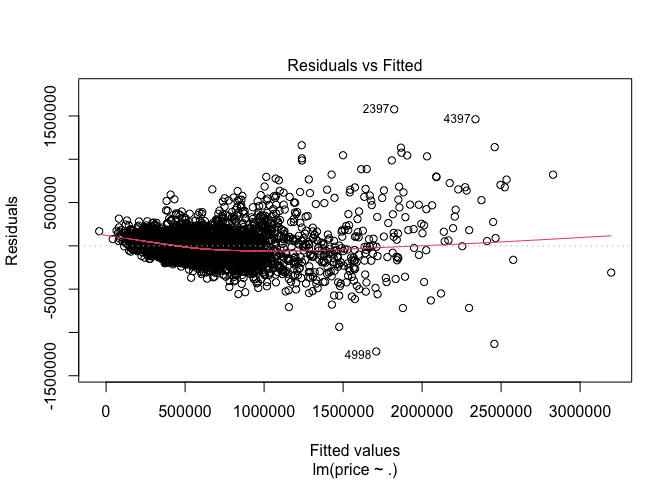<!-- -->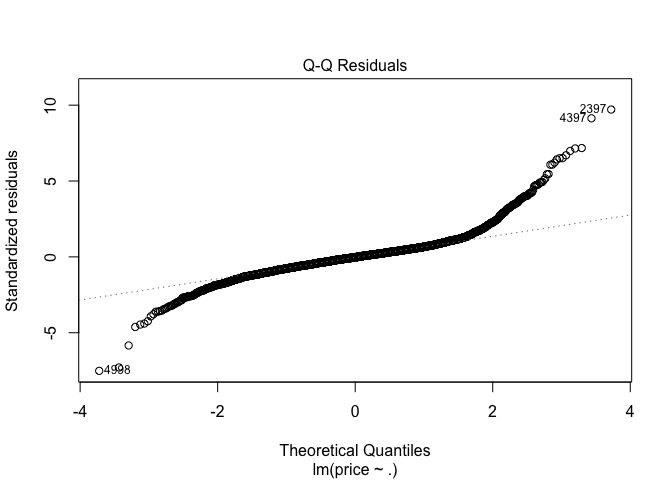<!-- -->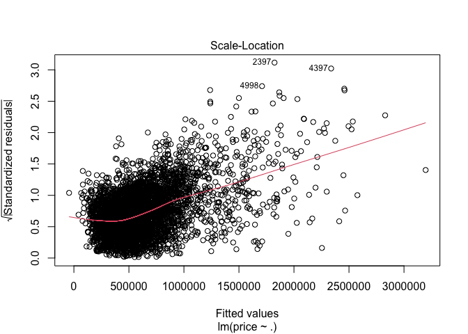<!-- -->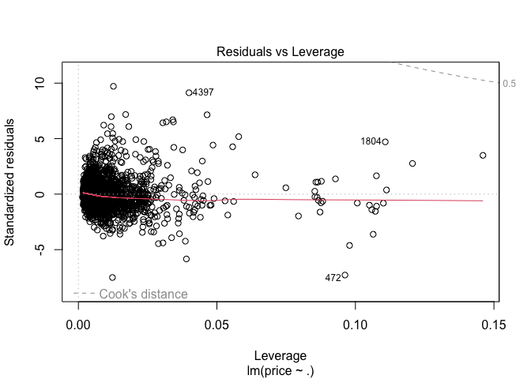<!-- -->

```r
## first regression model from last step
seattle.test1 <-
  seattle.test %>%
  mutate(regression = "baseline regression", # add a column indicating the type of regression model used
         price.predict = predict(lm22, seattle.test), # predict house prices using the trained regression model
         # calculate the difference between predicted and actual house prices
         price.error = price.predict - price,
         # calculate the absolute difference between predicted and actual house prices
         price.AbsError = abs(price.predict - price),
         # calculate the absolute percentage error
         price.APE = round((abs(price.predict - price)) / price * 100, digits = 2))

mean(seattle.test1$price.AbsError) # 94490.7
```

```
## [1] 94490.7
```

```r
mean(seattle.test1$price.APE) # 19.10%
```

```
## [1] 19.09763
```

```r
## remove "year_used"
lm23 <- lm(price ~ .-year_used, data = seattle.train)
summary(lm23) # adjusted R-squared = 0.8019
```

```
## 
## Call:
## lm(formula = price ~ . - year_used, data = seattle.train)
## 
## Residuals:
##      Min       1Q   Median       3Q      Max 
## -1223340   -85031    -4483    68770  1577655 
## 
## Coefficients:
##                       Estimate    Std. Error t value             Pr(>|t|)    
## (Intercept)         44774.2114   103673.0555   0.432             0.665848    
## reno_dum1           34273.3973     8986.5395   3.814             0.000138 ***
## bedrooms           -19069.3889     3034.4287  -6.284     0.00000000035697 ***
## bath_dummany       145065.1239    23519.6099   6.168     0.00000000074635 ***
## sqft_living           218.1903        4.6261  47.165 < 0.0000000000000002 ***
## sqft_lot                6.3880        0.7365   8.674 < 0.0000000000000002 ***
## floor_catregular   -81107.6024    17120.9388  -4.737     0.00000222498090 ***
## water_dum1         454341.4035    35246.0299  12.891 < 0.0000000000000002 ***
## view_cat1           82217.3598    15135.3919   5.432     0.00000005830329 ***
## view_cat2           45594.5387     9354.1385   4.874     0.00000112567858 ***
## view_cat3          113688.3491    12889.1937   8.820 < 0.0000000000000002 ***
## view_cat4          241365.2528    19675.5617  12.267 < 0.0000000000000002 ***
## condition_cat2     181498.7324    52693.3144   3.444             0.000577 ***
## condition_cat3     168506.7977    47448.8220   3.551             0.000387 ***
## condition_cat4     189766.6210    47612.1754   3.986     0.00006824001545 ***
## condition_cat5     237672.7323    47884.2139   4.963     0.00000071519883 ***
## grade_dumhigh      370890.1452    12948.4837  28.644 < 0.0000000000000002 ***
## pop_den          63702237.2855 21559121.9196   2.955             0.003144 ** 
## white_share          3364.5165      249.7050  13.474 < 0.0000000000000002 ***
## elder_dep            3967.7285      409.4486   9.690 < 0.0000000000000002 ***
## median_hh_income        0.6679        0.1406   4.752     0.00000206905966 ***
## employ_rate         -3867.3439      997.9155  -3.875             0.000108 ***
## sch_catDD2         130012.2956    11115.8054  11.696 < 0.0000000000000002 ***
## sch_catDD3         154736.9028    10275.0647  15.059 < 0.0000000000000002 ***
## sch_catDD4         235807.1485    14390.7383  16.386 < 0.0000000000000002 ***
## sch_catDD5         214018.5643    11014.7015  19.430 < 0.0000000000000002 ***
## sch_catDD6          -3901.4576     7863.3942  -0.496             0.619807    
## sch_catDD7          98926.5027    14307.3294   6.914     0.00000000000528 ***
## park_cat1            7962.9135     5494.7649   1.449             0.147349    
## park_cat2           23340.0013    10429.7841   2.238             0.025276 *  
## park_cat3          111138.3458    21620.5262   5.140     0.00000028450411 ***
## park_cat4          329350.0174    52440.1128   6.280     0.00000000036584 ***
## med_dis1               -5.7176        1.1037  -5.180     0.00000023009442 ***
## shop_dis1              -3.9864        0.7754  -5.141     0.00000028335173 ***
## crime_c              -132.9735       40.8087  -3.258             0.001128 ** 
## ---
## Signif. codes:  0 '***' 0.001 '**' 0.01 '*' 0.05 '.' 0.1 ' ' 1
## 
## Residual standard error: 163500 on 5038 degrees of freedom
##   (1 observation deleted due to missingness)
## Multiple R-squared:  0.8032,	Adjusted R-squared:  0.8019 
## F-statistic: 604.8 on 34 and 5038 DF,  p-value: < 0.00000000000000022
```

```r
seattle.test2 <-
  seattle.test %>%
  mutate(regression = "baseline regression", # add a column indicating the type of regression model used
         price.predict = predict(lm23, seattle.test), # predict house prices using the trained regression model
         # calculate the difference between predicted and actual house prices
         price.error = price.predict - price,
         # calculate the absolute difference between predicted and actual house prices
         price.AbsError = abs(price.predict - price),
         # calculate the absolute percentage error
         price.APE = round((abs(price.predict - price)) / price * 100, digits = 2))

mean(seattle.test2$price.AbsError) # 94371.65
```

```
## [1] 94371.65
```

```r
mean(seattle.test2$price.APE) # 19.05%
```

```
## [1] 19.04999
```

```r
seattle.train <- seattle.train %>%
  select(-year_used)

## remove "crime_c"
lm24 <- lm(price ~ .-crime_c, data = seattle.train)
summary(lm24) # adjusted R-squared = 0.8015
```

```
## 
## Call:
## lm(formula = price ~ . - crime_c, data = seattle.train)
## 
## Residuals:
##      Min       1Q   Median       3Q      Max 
## -1216927   -83996    -4285    68964  1578499 
## 
## Coefficients:
##                       Estimate    Std. Error t value             Pr(>|t|)    
## (Intercept)         12216.7149   103288.8785   0.118             0.905853    
## reno_dum1           35356.3889     8988.9572   3.933      0.0000849088653 ***
## bedrooms           -19210.3920     3037.0142  -6.325      0.0000000002744 ***
## bath_dummany       142928.6570    23532.8946   6.074      0.0000000013427 ***
## sqft_living           218.9635        4.6245  47.349 < 0.0000000000000002 ***
## sqft_lot                6.7725        0.7277   9.307 < 0.0000000000000002 ***
## floor_catregular   -78808.9595    17122.7165  -4.603      0.0000042750365 ***
## water_dum1         450526.5873    35260.1819  12.777 < 0.0000000000000002 ***
## view_cat1           82911.8663    15148.3267   5.473      0.0000000463024 ***
## view_cat2           46806.2373     9355.6596   5.003      0.0000005836733 ***
## view_cat3          114150.7191    12900.7063   8.848 < 0.0000000000000002 ***
## view_cat4          241014.9535    19694.0355  12.238 < 0.0000000000000002 ***
## condition_cat2     180521.4892    52742.7221   3.423             0.000625 ***
## condition_cat3     168158.9632    47493.9613   3.541             0.000403 ***
## condition_cat4     190596.2157    47656.9093   3.999      0.0000644287378 ***
## condition_cat5     238610.3176    47929.0234   4.978      0.0000006624595 ***
## grade_dumhigh      370130.6355    12958.7346  28.562 < 0.0000000000000002 ***
## pop_den          45428960.3139 20836837.1763   2.180             0.029287 *  
## white_share          3370.9645      249.9353  13.487 < 0.0000000000000002 ***
## elder_dep            3993.7652      409.7611   9.747 < 0.0000000000000002 ***
## median_hh_income        0.7464        0.1386   5.385      0.0000000758537 ***
## employ_rate         -3736.6047      998.0596  -3.744             0.000183 ***
## sch_catDD2         129025.6144    11122.2793  11.601 < 0.0000000000000002 ***
## sch_catDD3         154091.4125    10282.9541  14.985 < 0.0000000000000002 ***
## sch_catDD4         233590.3298    14388.3593  16.235 < 0.0000000000000002 ***
## sch_catDD5         208441.9267    10891.3094  19.138 < 0.0000000000000002 ***
## sch_catDD6          -2721.8235     7862.5488  -0.346             0.729225    
## sch_catDD7          97519.6613    14314.4544   6.813      0.0000000000107 ***
## park_cat1            8391.7394     5498.4284   1.526             0.127021    
## park_cat2           23388.8287    10439.7219   2.240             0.025110 *  
## park_cat3          110933.9240    21641.0580   5.126      0.0000003068862 ***
## park_cat4          331257.5234    52486.8626   6.311      0.0000000003005 ***
## med_dis1               -5.3098        1.0976  -4.837      0.0000013544557 ***
## shop_dis1              -3.8952        0.7756  -5.022      0.0000005287812 ***
## ---
## Signif. codes:  0 '***' 0.001 '**' 0.01 '*' 0.05 '.' 0.1 ' ' 1
## 
## Residual standard error: 163600 on 5039 degrees of freedom
##   (1 observation deleted due to missingness)
## Multiple R-squared:  0.8028,	Adjusted R-squared:  0.8015 
## F-statistic: 621.7 on 33 and 5039 DF,  p-value: < 0.00000000000000022
```

```r
seattle.test3 <-
  seattle.test %>%
  mutate(regression = "baseline regression", # add a column indicating the type of regression model used
         price.predict = predict(lm24, seattle.test), # predict house prices using the trained regression model
         # calculate the difference between predicted and actual house prices
         price.error = price.predict - price,
         # calculate the absolute difference between predicted and actual house prices
         price.AbsError = abs(price.predict - price),
         # calculate the absolute percentage error
         price.APE = round((abs(price.predict - price)) / price * 100, digits = 2))

mean(seattle.test3$price.AbsError) # 94189.17
```

```
## [1] 94189.17
```

```r
mean(seattle.test3$price.APE) # 19.00%
```

```
## [1] 18.99858
```

```r
seattle.train <- seattle.train %>%
  select(-crime_c)

## remove "employ_rate"
lm25 <- lm(price ~ .-employ_rate, data = seattle.train)
summary(lm25) # adjusted R-squared = 0.8005
```

```
## 
## Call:
## lm(formula = price ~ . - employ_rate, data = seattle.train)
## 
## Residuals:
##      Min       1Q   Median       3Q      Max 
## -1221464   -84343    -4204    68758  1591170 
## 
## Coefficients:
##                       Estimate    Std. Error t value             Pr(>|t|)    
## (Intercept)       -308280.4798    55795.9806  -5.525       0.000000034576 ***
## reno_dum1           36437.6625     9009.6228   4.044       0.000053262405 ***
## bedrooms           -20054.9520     3039.6818  -6.598       0.000000000046 ***
## bath_dummany       143806.6344    23592.8659   6.095       0.000000001173 ***
## sqft_living           220.4305        4.6264  47.646 < 0.0000000000000002 ***
## sqft_lot                6.5006        0.7206   9.022 < 0.0000000000000002 ***
## floor_catregular   -77231.4323    17163.8205  -4.500       0.000006959179 ***
## water_dum1         428758.1788    35057.2009  12.230 < 0.0000000000000002 ***
## view_cat1           82139.7766    15185.4508   5.409       0.000000066264 ***
## view_cat2           46409.4345     9378.1731   4.949       0.000000771567 ***
## view_cat3          113920.7718    12933.5154   8.808 < 0.0000000000000002 ***
## view_cat4          239977.2328    19743.2941  12.155 < 0.0000000000000002 ***
## condition_cat2     183234.5003    52873.5569   3.466             0.000534 ***
## condition_cat3     166095.4220    47614.5865   3.488             0.000490 ***
## condition_cat4     189499.8033    47779.1385   3.966       0.000074052054 ***
## condition_cat5     237386.9887    48051.8458   4.940       0.000000805551 ***
## grade_dumhigh      372860.6456    12981.7509  28.722 < 0.0000000000000002 ***
## pop_den          38602395.9586 20835616.8572   1.853             0.063982 .  
## white_share          3122.3894      242.4968  12.876 < 0.0000000000000002 ***
## elder_dep            3786.4469      407.6739   9.288 < 0.0000000000000002 ***
## median_hh_income        0.6842        0.1380   4.958       0.000000733932 ***
## sch_catDD2         124277.4943    11109.8229  11.186 < 0.0000000000000002 ***
## sch_catDD3         149915.9440    10271.2152  14.596 < 0.0000000000000002 ***
## sch_catDD4         224739.4363    14294.5540  15.722 < 0.0000000000000002 ***
## sch_catDD5         202157.6108    10839.9930  18.649 < 0.0000000000000002 ***
## sch_catDD6          -6622.3694     7841.6032  -0.845             0.398420    
## sch_catDD7          92736.1435    14320.3902   6.476       0.000000000103 ***
## park_cat1            9061.4044     5502.6213   1.647             0.099673 .  
## park_cat2           25789.4206    10446.2412   2.469             0.013591 *  
## park_cat3          112276.0331    21690.7599   5.176       0.000000235224 ***
## park_cat4          331478.5223    52618.5620   6.300       0.000000000324 ***
## med_dis1               -5.6043        1.0986  -5.101       0.000000349749 ***
## shop_dis1              -3.6279        0.7754  -4.679       0.000002965162 ***
## ---
## Signif. codes:  0 '***' 0.001 '**' 0.01 '*' 0.05 '.' 0.1 ' ' 1
## 
## Residual standard error: 164000 on 5041 degrees of freedom
## Multiple R-squared:  0.8018,	Adjusted R-squared:  0.8005 
## F-statistic: 637.1 on 32 and 5041 DF,  p-value: < 0.00000000000000022
```

```r
seattle.test4 <-
  seattle.test %>%
  mutate(regression = "baseline regression", # add a column indicating the type of regression model used
         price.predict = predict(lm25, seattle.test), # predict house prices using the trained regression model
         # calculate the difference between predicted and actual house prices
         price.error = price.predict - price,
         # calculate the absolute difference between predicted and actual house prices
         price.AbsError = abs(price.predict - price),
         # calculate the absolute percentage error
         price.APE = round((abs(price.predict - price)) / price * 100, digits = 2))

mean(seattle.test4$price.AbsError) # 93891.87
```

```
## [1] 93891.87
```

```r
mean(seattle.test4$price.APE) # 18.93%
```

```
## [1] 18.93019
```

```r
seattle.train <- seattle.train %>%
  select(-employ_rate)

## remove "med_dis1"
lm26 <- lm(price ~ .-med_dis1, data = seattle.train)
summary(lm26) # adjusted R-squared = 0.7995
```

```
## 
## Call:
## lm(formula = price ~ . - med_dis1, data = seattle.train)
## 
## Residuals:
##      Min       1Q   Median       3Q      Max 
## -1233686   -85791    -3665    69743  1585386 
## 
## Coefficients:
##                       Estimate    Std. Error t value             Pr(>|t|)    
## (Intercept)       -321501.2129    55873.8930  -5.754      0.0000000092273 ***
## reno_dum1           35902.1015     9031.3388   3.975      0.0000712796236 ***
## bedrooms           -20101.0800     3047.2018  -6.597      0.0000000000464 ***
## bath_dummany       148007.8815    23636.9236   6.262      0.0000000004123 ***
## sqft_living           220.2939        4.6378  47.499 < 0.0000000000000002 ***
## sqft_lot                6.2011        0.7199   8.613 < 0.0000000000000002 ***
## floor_catregular   -78425.8519    17204.7579  -4.558      0.0000052768221 ***
## water_dum1         427419.2924    35143.1011  12.162 < 0.0000000000000002 ***
## view_cat1           79016.9320    15210.7113   5.195      0.0000002129832 ***
## view_cat2           45595.6795     9400.0556   4.851      0.0000012680893 ***
## view_cat3          111498.0897    12956.8255   8.605 < 0.0000000000000002 ***
## view_cat4          230571.1506    19705.7215  11.701 < 0.0000000000000002 ***
## condition_cat2     185703.5840    53002.3768   3.504             0.000463 ***
## condition_cat3     168299.3954    47730.6286   3.526             0.000426 ***
## condition_cat4     192170.0949    47894.6788   4.012      0.0000609889446 ***
## condition_cat5     238939.0511    48169.9710   4.960      0.0000007268420 ***
## grade_dumhigh      376229.3089    12997.0765  28.947 < 0.0000000000000002 ***
## pop_den          43425154.7862 20865742.6779   2.081             0.037469 *  
## white_share          3075.4960      242.9231  12.660 < 0.0000000000000002 ***
## elder_dep            3542.5934      405.8651   8.729 < 0.0000000000000002 ***
## median_hh_income        0.6532        0.1382   4.726      0.0000023510840 ***
## sch_catDD2         136371.5517    10880.8167  12.533 < 0.0000000000000002 ***
## sch_catDD3         160963.3356    10065.2010  15.992 < 0.0000000000000002 ***
## sch_catDD4         242898.0802    13878.5628  17.502 < 0.0000000000000002 ***
## sch_catDD5         217046.0870    10465.5733  20.739 < 0.0000000000000002 ***
## sch_catDD6          -6471.5594     7860.9818  -0.823             0.410404    
## sch_catDD7         115368.0774    13649.5740   8.452 < 0.0000000000000002 ***
## park_cat1            9284.6755     5516.0843   1.683             0.092398 .  
## park_cat2           25327.3914    10471.7373   2.419             0.015614 *  
## park_cat3          110425.9124    21741.4781   5.079      0.0000003930083 ***
## park_cat4          331581.4173    52748.9670   6.286      0.0000000003531 ***
## shop_dis1              -4.8771        0.7376  -6.612      0.0000000000418 ***
## ---
## Signif. codes:  0 '***' 0.001 '**' 0.01 '*' 0.05 '.' 0.1 ' ' 1
## 
## Residual standard error: 164400 on 5042 degrees of freedom
## Multiple R-squared:  0.8007,	Adjusted R-squared:  0.7995 
## F-statistic: 653.6 on 31 and 5042 DF,  p-value: < 0.00000000000000022
```

```r
seattle.test5 <-
  seattle.test %>%
  mutate(regression = "baseline regression", # add a column indicating the type of regression model used
         price.predict = predict(lm26, seattle.test), # predict house prices using the trained regression model
         # calculate the difference between predicted and actual house prices
         price.error = price.predict - price,
         # calculate the absolute difference between predicted and actual house prices
         price.AbsError = abs(price.predict - price),
         # calculate the absolute percentage error
         price.APE = round((abs(price.predict - price)) / price * 100, digits = 2))

mean(seattle.test5$price.AbsError) # 93529.29
```

```
## [1] 93529.29
```

```r
mean(seattle.test5$price.APE) # 18.79%
```

```
## [1] 18.7864
```

```r
seattle.train <- seattle.train %>%
  select(-med_dis1)

## remove "elder_dep"
lm27 <- lm(price ~ .-elder_dep, data = seattle.train)
summary(lm27) # adjusted R-squared = 0.7965
```

```
## 
## Call:
## lm(formula = price ~ . - elder_dep, data = seattle.train)
## 
## Residuals:
##      Min       1Q   Median       3Q      Max 
## -1234692   -85358    -3666    68707  1658340 
## 
## Coefficients:
##                       Estimate    Std. Error t value             Pr(>|t|)    
## (Intercept)       -272451.5007    56003.4564  -4.865  0.00000117997470586 ***
## reno_dum1           34911.5560     9097.6961   3.837             0.000126 ***
## bedrooms           -22074.4825     3061.3721  -7.211  0.00000000000063937 ***
## bath_dummany       153105.3435    23805.2055   6.432  0.00000000013794718 ***
## sqft_living           224.3714        4.6485  48.267 < 0.0000000000000002 ***
## sqft_lot                6.6848        0.7231   9.244 < 0.0000000000000002 ***
## floor_catregular   -75414.0555    17329.0511  -4.352  0.00001376397197188 ***
## water_dum1         417066.0818    35383.9368  11.787 < 0.0000000000000002 ***
## view_cat1           83171.1183    15316.1781   5.430  0.00000005890385517 ***
## view_cat2           47560.0334     9467.1553   5.024  0.00000052437875850 ***
## view_cat3          114924.8540    13047.0622   8.808 < 0.0000000000000002 ***
## view_cat4          233956.9912    19848.2288  11.787 < 0.0000000000000002 ***
## condition_cat2     195683.5290    53383.5990   3.666             0.000249 ***
## condition_cat3     180217.0218    48065.4454   3.749             0.000179 ***
## condition_cat4     204834.3545    48228.2467   4.247  0.00002203691615612 ***
## condition_cat5     250334.3332    48509.9024   5.160  0.00000025576412456 ***
## grade_dumhigh      382751.3939    13071.9489  29.280 < 0.0000000000000002 ***
## pop_den          -7653276.3596 20177088.1750  -0.379             0.704477    
## white_share          3007.3663      244.6009  12.295 < 0.0000000000000002 ***
## median_hh_income        0.9002        0.1363   6.606  0.00000000004365030 ***
## sch_catDD2         119262.9498    10782.3042  11.061 < 0.0000000000000002 ***
## sch_catDD3         145388.8417     9979.3487  14.569 < 0.0000000000000002 ***
## sch_catDD4         225929.0625    13843.7846  16.320 < 0.0000000000000002 ***
## sch_catDD5         209609.0175    10508.3010  19.947 < 0.0000000000000002 ***
## sch_catDD6         -16034.4543     7842.0739  -2.045             0.040939 *  
## sch_catDD7         109916.4170    13736.5456   8.002  0.00000000000000151 ***
## park_cat1            9103.0341     5557.0127   1.638             0.101460    
## park_cat2           25743.5024    10549.4014   2.440             0.014710 *  
## park_cat3           99922.4472    21869.3769   4.569  0.00000501609096949 ***
## park_cat4          324585.8001    53134.5984   6.109  0.00000000107949934 ***
## shop_dis1              -4.8471        0.7431  -6.523  0.00000000007557991 ***
## ---
## Signif. codes:  0 '***' 0.001 '**' 0.01 '*' 0.05 '.' 0.1 ' ' 1
## 
## Residual standard error: 165700 on 5043 degrees of freedom
## Multiple R-squared:  0.7977,	Adjusted R-squared:  0.7965 
## F-statistic: 662.9 on 30 and 5043 DF,  p-value: < 0.00000000000000022
```

```r
seattle.test6 <-
  seattle.test %>%
  mutate(regression = "baseline regression", # add a column indicating the type of regression model used
         price.predict = predict(lm27, seattle.test), # predict house prices using the trained regression model
         # calculate the difference between predicted and actual house prices
         price.error = price.predict - price,
         # calculate the absolute difference between predicted and actual house prices
         price.AbsError = abs(price.predict - price),
         # calculate the absolute percentage error
         price.APE = round((abs(price.predict - price)) / price * 100, digits = 2))

mean(seattle.test6$price.AbsError) # 93115.74
```

```
## [1] 93115.74
```

```r
mean(seattle.test6$price.APE) # 18.59%
```

```
## [1] 18.58886
```

```r
seattle.train <- seattle.train %>%
  select(-elder_dep)

## remove "pop_den"
lm28 <- lm(price ~ .-pop_den, data = seattle.train)
summary(lm28) # adjusted R-squared = 0.7965
```

```
## 
## Call:
## lm(formula = price ~ . - pop_den, data = seattle.train)
## 
## Residuals:
##      Min       1Q   Median       3Q      Max 
## -1234831   -85428    -4078    69031  1659275 
## 
## Coefficients:
##                      Estimate   Std. Error t value             Pr(>|t|)    
## (Intercept)      -276812.2750   54806.0416  -5.051  0.00000045555737144 ***
## reno_dum1          34899.7251    9096.8705   3.836             0.000126 ***
## bedrooms          -22090.7097    3060.8134  -7.217  0.00000000000060931 ***
## bath_dummany      153071.4566   23803.0175   6.431  0.00000000013869625 ***
## sqft_living          224.4480       4.6437  48.333 < 0.0000000000000002 ***
## sqft_lot               6.7067       0.7208   9.305 < 0.0000000000000002 ***
## floor_catregular  -75014.3926   17295.5199  -4.337  0.00001471146309733 ***
## water_dum1        416634.6354   35362.6480  11.782 < 0.0000000000000002 ***
## view_cat1          83317.0021   15310.0489   5.442  0.00000005518200072 ***
## view_cat2          47522.7101    9465.8405   5.020  0.00000053326770689 ***
## view_cat3         114881.5406   13045.4553   8.806 < 0.0000000000000002 ***
## view_cat4         233763.7367   19840.0045  11.782 < 0.0000000000000002 ***
## condition_cat2    195936.2786   53374.9098   3.671             0.000244 ***
## condition_cat3    180516.6262   48054.8761   3.756             0.000174 ***
## condition_cat4    205155.4132   48216.7259   4.255  0.00002129714097857 ***
## condition_cat5    250656.0453   48498.3707   5.168  0.00000024529216351 ***
## grade_dumhigh     382731.7072   13070.7365  29.282 < 0.0000000000000002 ***
## white_share         3001.1351     244.0279  12.298 < 0.0000000000000002 ***
## median_hh_income       0.9195       0.1265   7.269  0.00000000000041645 ***
## sch_catDD2        117923.9940   10187.2182  11.576 < 0.0000000000000002 ***
## sch_catDD3        144399.5673    9631.6848  14.992 < 0.0000000000000002 ***
## sch_catDD4        223635.7091   12452.6136  17.959 < 0.0000000000000002 ***
## sch_catDD5        208396.2027   10009.1764  20.821 < 0.0000000000000002 ***
## sch_catDD6        -16002.4543    7840.9545  -2.041             0.041315 *  
## sch_catDD7        109123.1432   13575.2534   8.038  0.00000000000000112 ***
## park_cat1           9236.8747    5545.3279   1.666             0.095834 .  
## park_cat2          26179.9150   10485.5817   2.497             0.012565 *  
## park_cat3         100675.7026   21777.1764   4.623  0.00000387686080150 ***
## park_cat4         324921.7780   53122.7059   6.116  0.00000000102903418 ***
## shop_dis1             -4.7537       0.7010  -6.781  0.00000000001328162 ***
## ---
## Signif. codes:  0 '***' 0.001 '**' 0.01 '*' 0.05 '.' 0.1 ' ' 1
## 
## Residual standard error: 165600 on 5044 degrees of freedom
## Multiple R-squared:  0.7977,	Adjusted R-squared:  0.7965 
## F-statistic: 685.9 on 29 and 5044 DF,  p-value: < 0.00000000000000022
```

```r
seattle.test7 <-
  seattle.test %>%
  mutate(regression = "baseline regression", # add a column indicating the type of regression model used
         price.predict = predict(lm28, seattle.test), # predict house prices using the trained regression model
         # calculate the difference between predicted and actual house prices
         price.error = price.predict - price,
         # calculate the absolute difference between predicted and actual house prices
         price.AbsError = abs(price.predict - price),
         # calculate the absolute percentage error
         price.APE = round((abs(price.predict - price)) / price * 100, digits = 2))

mean(seattle.test7$price.AbsError) # 93073.76
```

```
## [1] 93073.76
```

```r
mean(seattle.test7$price.APE) # 18.57%
```

```
## [1] 18.57366
```

```r
seattle.train <- seattle.train %>%
  select(-pop_den)
```

## Cross Validation


```r
# without fixed effect
set.seed(1)
fitControl <- trainControl(method = "cv", number = 100)

seattle.cv <- 
  train(price ~ ., data = house_lm %>% select(price, reno_dum, bedrooms, bath_dum,
                                              sqft_living, sqft_lot, floor_cat,
                                              water_dum, view_cat, condition_cat,
                                              grade_dum, white_share, median_hh_income,
                                              sch_cat, park_cat, shop_dis1),
     method = "lm", trControl = fitControl, na.action = na.pass)

seattle.cv
```

```
## Linear Regression 
## 
## 6738 samples
##   15 predictor
## 
## No pre-processing
## Resampling: Cross-Validated (100 fold) 
## Summary of sample sizes: 6672, 6672, 6670, 6671, 6671, 6670, ... 
## Resampling results:
## 
##   RMSE      Rsquared   MAE     
##   156596.6  0.7841069  105199.9
## 
## Tuning parameter 'intercept' was held constant at a value of TRUE
```

```r
# with fixed effect
set.seed(1)
fitControl <- trainControl(method = "cv", number = 100)

seattle.neigh.cv <- 
  train(price ~ ., data = house_lm %>% select(price, reno_dum, bedrooms, bath_dum,
                                              sqft_living, sqft_lot, floor_cat,
                                              water_dum, view_cat, condition_cat,
                                              grade_dum, white_share, median_hh_income,
                                              sch_cat, park_cat, shop_dis1, T_NAME),
     method = "lm", trControl = fitControl, na.action = na.pass)

seattle.neigh.cv
```

```
## Linear Regression 
## 
## 6738 samples
##   16 predictor
## 
## No pre-processing
## Resampling: Cross-Validated (100 fold) 
## Summary of sample sizes: 6672, 6672, 6670, 6671, 6671, 6670, ... 
## Resampling results:
## 
##   RMSE      Rsquared   MAE     
##   143402.3  0.8181754  94901.39
## 
## Tuning parameter 'intercept' was held constant at a value of TRUE
```

## Final Model


```r
lm.final <- lm(price ~ reno_dum + bedrooms + bath_dum + sqft_living + sqft_lot +
                 floor_cat + water_dum + view_cat + condition_cat + grade_dum +
                 white_share + median_hh_income + sch_cat + park_cat + shop_dis1 +
                 T_NAME, data = house_lm)
summary(lm.final)
```

```
## 
## Call:
## lm(formula = price ~ reno_dum + bedrooms + bath_dum + sqft_living + 
##     sqft_lot + floor_cat + water_dum + view_cat + condition_cat + 
##     grade_dum + white_share + median_hh_income + sch_cat + park_cat + 
##     shop_dis1 + T_NAME, data = house_lm)
## 
## Residuals:
##      Min       1Q   Median       3Q      Max 
## -1181468   -66571     -313    58798  1624167 
## 
## Coefficients: (4 not defined because of singularities)
##                                                        Estimate   Std. Error
## (Intercept)                                        -521475.0330   96392.8095
## reno_dum1                                            37797.5266    7334.0086
## bedrooms                                            -11810.2991    2123.4915
## bath_dummany                                        140033.3636   20730.1786
## sqft_living                                            197.7536       3.5473
## sqft_lot                                                 8.6158       0.6182
## floor_catregular                                    -60976.3039   14976.8438
## water_dum1                                          426940.5315   31144.5477
## view_cat1                                            76252.2898   12774.3795
## view_cat2                                            50934.1704    7928.4350
## view_cat3                                           134582.8259   11243.6039
## view_cat4                                           256616.2870   17340.9521
## condition_cat2                                      178062.3242   46251.4472
## condition_cat3                                      187396.2614   42123.1295
## condition_cat4                                      210545.5774   42226.7818
## condition_cat5                                      248318.1114   42425.2154
## grade_dumhigh                                       338938.1833   11076.6243
## white_share                                           7031.1052    1581.6650
## median_hh_income                                        -0.4510       0.6345
## sch_catDD2                                           77628.9669   25428.9147
## sch_catDD3                                            6339.9912   24037.4632
## sch_catDD4                                           44170.3057   33081.6364
## sch_catDD5                                           89834.1393   37795.8545
## sch_catDD6                                          -24537.1741   35823.5445
## sch_catDD7                                          152189.1300   32047.1954
## park_cat1                                             7431.2429    4435.7959
## park_cat2                                            15977.3663    9016.5768
## park_cat3                                           102455.8720   18810.4784
## park_cat4                                           304527.5662   46936.5315
## shop_dis1                                                1.5684       1.4699
## T_NAMECensus Tract 10, King County, Washington      102638.9669   42520.4451
## T_NAMECensus Tract 100.01, King County, Washington   48117.1306   53154.9237
## T_NAMECensus Tract 100.02, King County, Washington  -49264.8802   32781.5742
## T_NAMECensus Tract 101, King County, Washington      38413.2763   32997.5151
## T_NAMECensus Tract 102, King County, Washington    -107392.4796   24824.4047
## T_NAMECensus Tract 103, King County, Washington      18103.8977   35288.3284
## T_NAMECensus Tract 104.01, King County, Washington  120538.6632   74681.3432
## T_NAMECensus Tract 104.02, King County, Washington   90009.4098   63928.1430
## T_NAMECensus Tract 105, King County, Washington      -7475.5607   20801.8240
## T_NAMECensus Tract 106, King County, Washington      25622.1892   17252.7875
## T_NAMECensus Tract 107.01, King County, Washington  101644.0541   48795.6820
## T_NAMECensus Tract 107.02, King County, Washington  255957.9717   69600.3552
## T_NAMECensus Tract 108, King County, Washington      71716.1957   50574.1329
## T_NAMECensus Tract 109, King County, Washington    -135339.0625   52130.9090
## T_NAMECensus Tract 11, King County, Washington      -19626.0179   36703.0439
## T_NAMECensus Tract 110.01, King County, Washington  101974.9785   69386.6536
## T_NAMECensus Tract 110.02, King County, Washington  175097.9121   83739.5033
## T_NAMECensus Tract 111.01, King County, Washington   24736.6027   60353.2992
## T_NAMECensus Tract 111.02, King County, Washington  -54026.2461   36168.3267
## T_NAMECensus Tract 112, King County, Washington     -72064.1987   41010.1863
## T_NAMECensus Tract 113, King County, Washington      24566.1550   38880.7251
## T_NAMECensus Tract 114.01, King County, Washington   53792.8436   39956.6231
## T_NAMECensus Tract 114.02, King County, Washington   62733.0649   39830.5527
## T_NAMECensus Tract 115, King County, Washington     -10372.2385   20041.5632
## T_NAMECensus Tract 116, King County, Washington     -39461.8832   18225.4332
## T_NAMECensus Tract 117, King County, Washington      53778.4918   73536.1796
## T_NAMECensus Tract 118, King County, Washington     -60766.1194   47512.6497
## T_NAMECensus Tract 119, King County, Washington     -56720.3244   65524.4342
## T_NAMECensus Tract 12, King County, Washington       38118.9799   34308.7700
## T_NAMECensus Tract 120, King County, Washington     -87480.6489   20618.5218
## T_NAMECensus Tract 121, King County, Washington    -124952.6063   34095.4269
## T_NAMECensus Tract 13, King County, Washington       35835.5470   29434.4989
## T_NAMECensus Tract 14, King County, Washington      -55415.3148   41905.6184
## T_NAMECensus Tract 15, King County, Washington     -166627.0276   56555.0655
## T_NAMECensus Tract 16, King County, Washington       -9959.7523   42314.1070
## T_NAMECensus Tract 17.01, King County, Washington    46645.2284   33590.3329
## T_NAMECensus Tract 17.02, King County, Washington     5780.1838   35766.9670
## T_NAMECensus Tract 18, King County, Washington       21442.6031   34683.5449
## T_NAMECensus Tract 19, King County, Washington       57140.1184   32335.4593
## T_NAMECensus Tract 2, King County, Washington        12442.2573   26103.7085
## T_NAMECensus Tract 20, King County, Washington      -18720.8122   40930.5705
## T_NAMECensus Tract 21, King County, Washington       32351.9942   40811.1597
## T_NAMECensus Tract 22, King County, Washington       51673.9069   52559.4791
## T_NAMECensus Tract 24, King County, Washington       50119.3479   49144.2475
## T_NAMECensus Tract 25, King County, Washington       12974.5012   52044.4016
## T_NAMECensus Tract 26, King County, Washington       46955.8819   45655.3468
## T_NAMECensus Tract 260.01, King County, Washington  -14742.9715  153405.3345
## T_NAMECensus Tract 265, King County, Washington     103747.8737  155029.1103
## T_NAMECensus Tract 27, King County, Washington       73661.9190   48246.0107
## T_NAMECensus Tract 28, King County, Washington      -56494.5465   50023.1090
## T_NAMECensus Tract 29, King County, Washington      -43507.1788   52955.2526
## T_NAMECensus Tract 3, King County, Washington       -47323.1462   33795.3342
## T_NAMECensus Tract 30, King County, Washington      -63604.1730   48776.6768
## T_NAMECensus Tract 31, King County, Washington     -102024.3850   53801.3849
## T_NAMECensus Tract 32, King County, Washington      -31306.3463   50482.3442
## T_NAMECensus Tract 33, King County, Washington      -32633.4643   47619.4614
## T_NAMECensus Tract 34, King County, Washington      -43781.4421   50147.8233
## T_NAMECensus Tract 35, King County, Washington         955.2373   48584.4162
## T_NAMECensus Tract 36, King County, Washington      129022.5532   41505.7708
## T_NAMECensus Tract 38, King County, Washington       97993.3448   52644.3453
## T_NAMECensus Tract 39, King County, Washington       26010.6788   51618.7929
## T_NAMECensus Tract 4.01, King County, Washington     57254.8499   34329.0178
## T_NAMECensus Tract 4.02, King County, Washington    -80979.5600   38616.1031
## T_NAMECensus Tract 40, King County, Washington      206216.8718   46359.8571
## T_NAMECensus Tract 41, King County, Washington      362983.9549   56247.7835
## T_NAMECensus Tract 42, King County, Washington      112286.8658   49411.7090
## T_NAMECensus Tract 43.01, King County, Washington   133089.2793   43022.6645
## T_NAMECensus Tract 43.02, King County, Washington   226517.0767  108533.4889
## T_NAMECensus Tract 44, King County, Washington      121315.0108   50999.8656
## T_NAMECensus Tract 45, King County, Washington       70894.5303   48843.7927
## T_NAMECensus Tract 46, King County, Washington       90769.7967   54258.4689
## T_NAMECensus Tract 47, King County, Washington      -19272.3979   47474.7208
## T_NAMECensus Tract 48, King County, Washington      -49171.8455   53296.6739
## T_NAMECensus Tract 49, King County, Washington       22253.6204   51758.3001
## T_NAMECensus Tract 5, King County, Washington       -89087.6413   49938.9694
## T_NAMECensus Tract 50, King County, Washington       55681.5277   54052.9122
## T_NAMECensus Tract 51, King County, Washington      180934.1329   51078.4642
## T_NAMECensus Tract 52, King County, Washington      253866.7391   40747.8964
## T_NAMECensus Tract 53.01, King County, Washington   392224.8541  108123.3808
## T_NAMECensus Tract 54, King County, Washington      106197.1968   46676.2805
## T_NAMECensus Tract 56, King County, Washington       52668.9417   65646.1187
## T_NAMECensus Tract 57, King County, Washington      -28260.3092   47235.1476
## T_NAMECensus Tract 58.01, King County, Washington   -19335.5624   43780.3347
## T_NAMECensus Tract 58.02, King County, Washington    11001.8441   44549.4015
## T_NAMECensus Tract 59, King County, Washington       98057.7979   49599.0768
## T_NAMECensus Tract 6, King County, Washington        14937.2536   27480.5148
## T_NAMECensus Tract 60, King County, Washington      117443.9859   54542.9177
## T_NAMECensus Tract 61, King County, Washington      111207.4113   46312.6366
## T_NAMECensus Tract 62, King County, Washington      154327.7465   42774.6986
## T_NAMECensus Tract 63, King County, Washington      531486.7505   42288.9630
## T_NAMECensus Tract 64, King County, Washington      177903.2458   50157.3252
## T_NAMECensus Tract 65, King County, Washington      232999.1245   52260.0204
## T_NAMECensus Tract 66, King County, Washington       41277.4844   47440.3794
## T_NAMECensus Tract 67, King County, Washington      274260.2935   52391.1270
## T_NAMECensus Tract 68, King County, Washington      225406.1674   56409.0972
## T_NAMECensus Tract 69, King County, Washington      190034.9133   55318.5826
## T_NAMECensus Tract 7, King County, Washington        23747.6071   30587.5245
## T_NAMECensus Tract 70, King County, Washington      380320.1194   55010.5529
## T_NAMECensus Tract 74.01, King County, Washington    55900.7571   75775.7500
## T_NAMECensus Tract 75, King County, Washington      150557.4041   49677.3550
## T_NAMECensus Tract 76, King County, Washington      167254.4654   46973.4644
## T_NAMECensus Tract 77, King County, Washington       81526.9767   32044.2438
## T_NAMECensus Tract 78, King County, Washington      264885.3178   43514.4724
## T_NAMECensus Tract 79, King County, Washington       47049.2303   45182.3803
## T_NAMECensus Tract 8, King County, Washington       -70371.9264   41470.4266
## T_NAMECensus Tract 86, King County, Washington      102828.6323   49976.2202
## T_NAMECensus Tract 87, King County, Washington      106614.5025   34009.6858
## T_NAMECensus Tract 88, King County, Washington       57186.6964   31833.4850
## T_NAMECensus Tract 89, King County, Washington      153529.7430   36788.4761
## T_NAMECensus Tract 9, King County, Washington       -86847.9905   53140.3712
## T_NAMECensus Tract 90, King County, Washington      154452.9482   55095.0565
## T_NAMECensus Tract 93, King County, Washington      -67438.5862   45116.6644
## T_NAMECensus Tract 94, King County, Washington      146342.4417   45786.2189
## T_NAMECensus Tract 95, King County, Washington               NA           NA
## T_NAMECensus Tract 96, King County, Washington       56829.8088   20918.0691
## T_NAMECensus Tract 97.01, King County, Washington     6470.0767   21332.5891
## T_NAMECensus Tract 97.02, King County, Washington            NA           NA
## T_NAMECensus Tract 98, King County, Washington               NA           NA
## T_NAMECensus Tract 99, King County, Washington               NA           NA
##                                                    t value             Pr(>|t|)
## (Intercept)                                         -5.410     0.00000006527959
## reno_dum1                                            5.154     0.00000026277510
## bedrooms                                            -5.562     0.00000002775827
## bath_dummany                                         6.755     0.00000000001550
## sqft_living                                         55.748 < 0.0000000000000002
## sqft_lot                                            13.937 < 0.0000000000000002
## floor_catregular                                    -4.071     0.00004728382609
## water_dum1                                          13.708 < 0.0000000000000002
## view_cat1                                            5.969     0.00000000250867
## view_cat2                                            6.424     0.00000000014177
## view_cat3                                           11.970 < 0.0000000000000002
## view_cat4                                           14.798 < 0.0000000000000002
## condition_cat2                                       3.850             0.000119
## condition_cat3                                       4.449     0.00000877808678
## condition_cat4                                       4.986     0.00000063195200
## condition_cat5                                       5.853     0.00000000505733
## grade_dumhigh                                       30.599 < 0.0000000000000002
## white_share                                          4.445     0.00000891730313
## median_hh_income                                    -0.711             0.477271
## sch_catDD2                                           3.053             0.002276
## sch_catDD3                                           0.264             0.791977
## sch_catDD4                                           1.335             0.181860
## sch_catDD5                                           2.377             0.017491
## sch_catDD6                                          -0.685             0.493402
## sch_catDD7                                           4.749     0.00000208843477
## park_cat1                                            1.675             0.093925
## park_cat2                                            1.772             0.076441
## park_cat3                                            5.447     0.00000005315332
## park_cat4                                            6.488     0.00000000009325
## shop_dis1                                            1.067             0.286026
## T_NAMECensus Tract 10, King County, Washington       2.414             0.015811
## T_NAMECensus Tract 100.01, King County, Washington   0.905             0.365380
## T_NAMECensus Tract 100.02, King County, Washington  -1.503             0.132933
## T_NAMECensus Tract 101, King County, Washington      1.164             0.244415
## T_NAMECensus Tract 102, King County, Washington     -4.326     0.00001540225561
## T_NAMECensus Tract 103, King County, Washington      0.513             0.607949
## T_NAMECensus Tract 104.01, King County, Washington   1.614             0.106567
## T_NAMECensus Tract 104.02, King County, Washington   1.408             0.159185
## T_NAMECensus Tract 105, King County, Washington     -0.359             0.719329
## T_NAMECensus Tract 106, King County, Washington      1.485             0.137564
## T_NAMECensus Tract 107.01, King County, Washington   2.083             0.037285
## T_NAMECensus Tract 107.02, King County, Washington   3.678             0.000237
## T_NAMECensus Tract 108, King County, Washington      1.418             0.156226
## T_NAMECensus Tract 109, King County, Washington     -2.596             0.009449
## T_NAMECensus Tract 11, King County, Washington      -0.535             0.592858
## T_NAMECensus Tract 110.01, King County, Washington   1.470             0.141701
## T_NAMECensus Tract 110.02, King County, Washington   2.091             0.036568
## T_NAMECensus Tract 111.01, King County, Washington   0.410             0.681920
## T_NAMECensus Tract 111.02, King County, Washington  -1.494             0.135290
## T_NAMECensus Tract 112, King County, Washington     -1.757             0.078926
## T_NAMECensus Tract 113, King County, Washington      0.632             0.527517
## T_NAMECensus Tract 114.01, King County, Washington   1.346             0.178258
## T_NAMECensus Tract 114.02, King County, Washington   1.575             0.115305
## T_NAMECensus Tract 115, King County, Washington     -0.518             0.604799
## T_NAMECensus Tract 116, King County, Washington     -2.165             0.030407
## T_NAMECensus Tract 117, King County, Washington      0.731             0.464610
## T_NAMECensus Tract 118, King County, Washington     -1.279             0.200961
## T_NAMECensus Tract 119, King County, Washington     -0.866             0.386721
## T_NAMECensus Tract 12, King County, Washington       1.111             0.266585
## T_NAMECensus Tract 120, King County, Washington     -4.243     0.00002237528515
## T_NAMECensus Tract 121, King County, Washington     -3.665             0.000249
## T_NAMECensus Tract 13, King County, Washington       1.217             0.223470
## T_NAMECensus Tract 14, King County, Washington      -1.322             0.186086
## T_NAMECensus Tract 15, King County, Washington      -2.946             0.003227
## T_NAMECensus Tract 16, King County, Washington      -0.235             0.813924
## T_NAMECensus Tract 17.01, King County, Washington    1.389             0.164986
## T_NAMECensus Tract 17.02, King County, Washington    0.162             0.871620
## T_NAMECensus Tract 18, King County, Washington       0.618             0.536441
## T_NAMECensus Tract 19, King County, Washington       1.767             0.077257
## T_NAMECensus Tract 2, King County, Washington        0.477             0.633629
## T_NAMECensus Tract 20, King County, Washington      -0.457             0.647413
## T_NAMECensus Tract 21, King County, Washington       0.793             0.427967
## T_NAMECensus Tract 22, King County, Washington       0.983             0.325569
## T_NAMECensus Tract 24, King County, Washington       1.020             0.307841
## T_NAMECensus Tract 25, King County, Washington       0.249             0.803139
## T_NAMECensus Tract 26, King County, Washington       1.028             0.303759
## T_NAMECensus Tract 260.01, King County, Washington  -0.096             0.923440
## T_NAMECensus Tract 265, King County, Washington      0.669             0.503381
## T_NAMECensus Tract 27, King County, Washington       1.527             0.126859
## T_NAMECensus Tract 28, King County, Washington      -1.129             0.258783
## T_NAMECensus Tract 29, King County, Washington      -0.822             0.411344
## T_NAMECensus Tract 3, King County, Washington       -1.400             0.161475
## T_NAMECensus Tract 30, King County, Washington      -1.304             0.192283
## T_NAMECensus Tract 31, King County, Washington      -1.896             0.057962
## T_NAMECensus Tract 32, King County, Washington      -0.620             0.535184
## T_NAMECensus Tract 33, King County, Washington      -0.685             0.493181
## T_NAMECensus Tract 34, King County, Washington      -0.873             0.382669
## T_NAMECensus Tract 35, King County, Washington       0.020             0.984314
## T_NAMECensus Tract 36, King County, Washington       3.109             0.001888
## T_NAMECensus Tract 38, King County, Washington       1.861             0.062729
## T_NAMECensus Tract 39, King County, Washington       0.504             0.614349
## T_NAMECensus Tract 4.01, King County, Washington     1.668             0.095398
## T_NAMECensus Tract 4.02, King County, Washington    -2.097             0.036028
## T_NAMECensus Tract 40, King County, Washington       4.448     0.00000880240046
## T_NAMECensus Tract 41, King County, Washington       6.453     0.00000000011721
## T_NAMECensus Tract 42, King County, Washington       2.272             0.023090
## T_NAMECensus Tract 43.01, King County, Washington    3.093             0.001987
## T_NAMECensus Tract 43.02, King County, Washington    2.087             0.036920
## T_NAMECensus Tract 44, King County, Washington       2.379             0.017401
## T_NAMECensus Tract 45, King County, Washington       1.451             0.146701
## T_NAMECensus Tract 46, King County, Washington       1.673             0.094392
## T_NAMECensus Tract 47, King County, Washington      -0.406             0.684792
## T_NAMECensus Tract 48, King County, Washington      -0.923             0.356246
## T_NAMECensus Tract 49, King County, Washington       0.430             0.667244
## T_NAMECensus Tract 5, King County, Washington       -1.784             0.074481
## T_NAMECensus Tract 50, King County, Washington       1.030             0.302987
## T_NAMECensus Tract 51, King County, Washington       3.542             0.000399
## T_NAMECensus Tract 52, King County, Washington       6.230     0.00000000049461
## T_NAMECensus Tract 53.01, King County, Washington    3.628             0.000288
## T_NAMECensus Tract 54, King County, Washington       2.275             0.022927
## T_NAMECensus Tract 56, King County, Washington       0.802             0.422399
## T_NAMECensus Tract 57, King County, Washington      -0.598             0.549667
## T_NAMECensus Tract 58.01, King County, Washington   -0.442             0.658757
## T_NAMECensus Tract 58.02, King County, Washington    0.247             0.804948
## T_NAMECensus Tract 59, King County, Washington       1.977             0.048082
## T_NAMECensus Tract 6, King County, Washington        0.544             0.586764
## T_NAMECensus Tract 60, King County, Washington       2.153             0.031336
## T_NAMECensus Tract 61, King County, Washington       2.401             0.016367
## T_NAMECensus Tract 62, King County, Washington       3.608             0.000311
## T_NAMECensus Tract 63, King County, Washington      12.568 < 0.0000000000000002
## T_NAMECensus Tract 64, King County, Washington       3.547             0.000392
## T_NAMECensus Tract 65, King County, Washington       4.458     0.00000839188546
## T_NAMECensus Tract 66, King County, Washington       0.870             0.384282
## T_NAMECensus Tract 67, King County, Washington       5.235     0.00000017021213
## T_NAMECensus Tract 68, King County, Washington       3.996     0.00006514599538
## T_NAMECensus Tract 69, King County, Washington       3.435             0.000596
## T_NAMECensus Tract 7, King County, Washington        0.776             0.437551
## T_NAMECensus Tract 70, King County, Washington       6.914     0.00000000000517
## T_NAMECensus Tract 74.01, King County, Washington    0.738             0.460715
## T_NAMECensus Tract 75, King County, Washington       3.031             0.002449
## T_NAMECensus Tract 76, King County, Washington       3.561             0.000373
## T_NAMECensus Tract 77, King County, Washington       2.544             0.010975
## T_NAMECensus Tract 78, King County, Washington       6.087     0.00000000121286
## T_NAMECensus Tract 79, King County, Washington       1.041             0.297766
## T_NAMECensus Tract 8, King County, Washington       -1.697             0.089759
## T_NAMECensus Tract 86, King County, Washington       2.058             0.039672
## T_NAMECensus Tract 87, King County, Washington       3.135             0.001727
## T_NAMECensus Tract 88, King County, Washington       1.796             0.072472
## T_NAMECensus Tract 89, King County, Washington       4.173     0.00003040648382
## T_NAMECensus Tract 9, King County, Washington       -1.634             0.102241
## T_NAMECensus Tract 90, King County, Washington       2.803             0.005072
## T_NAMECensus Tract 93, King County, Washington      -1.495             0.135025
## T_NAMECensus Tract 94, King County, Washington       3.196             0.001399
## T_NAMECensus Tract 95, King County, Washington          NA                   NA
## T_NAMECensus Tract 96, King County, Washington       2.717             0.006609
## T_NAMECensus Tract 97.01, King County, Washington    0.303             0.761674
## T_NAMECensus Tract 97.02, King County, Washington       NA                   NA
## T_NAMECensus Tract 98, King County, Washington          NA                   NA
## T_NAMECensus Tract 99, King County, Washington          NA                   NA
##                                                       
## (Intercept)                                        ***
## reno_dum1                                          ***
## bedrooms                                           ***
## bath_dummany                                       ***
## sqft_living                                        ***
## sqft_lot                                           ***
## floor_catregular                                   ***
## water_dum1                                         ***
## view_cat1                                          ***
## view_cat2                                          ***
## view_cat3                                          ***
## view_cat4                                          ***
## condition_cat2                                     ***
## condition_cat3                                     ***
## condition_cat4                                     ***
## condition_cat5                                     ***
## grade_dumhigh                                      ***
## white_share                                        ***
## median_hh_income                                      
## sch_catDD2                                         ** 
## sch_catDD3                                            
## sch_catDD4                                            
## sch_catDD5                                         *  
## sch_catDD6                                            
## sch_catDD7                                         ***
## park_cat1                                          .  
## park_cat2                                          .  
## park_cat3                                          ***
## park_cat4                                          ***
## shop_dis1                                             
## T_NAMECensus Tract 10, King County, Washington     *  
## T_NAMECensus Tract 100.01, King County, Washington    
## T_NAMECensus Tract 100.02, King County, Washington    
## T_NAMECensus Tract 101, King County, Washington       
## T_NAMECensus Tract 102, King County, Washington    ***
## T_NAMECensus Tract 103, King County, Washington       
## T_NAMECensus Tract 104.01, King County, Washington    
## T_NAMECensus Tract 104.02, King County, Washington    
## T_NAMECensus Tract 105, King County, Washington       
## T_NAMECensus Tract 106, King County, Washington       
## T_NAMECensus Tract 107.01, King County, Washington *  
## T_NAMECensus Tract 107.02, King County, Washington ***
## T_NAMECensus Tract 108, King County, Washington       
## T_NAMECensus Tract 109, King County, Washington    ** 
## T_NAMECensus Tract 11, King County, Washington        
## T_NAMECensus Tract 110.01, King County, Washington    
## T_NAMECensus Tract 110.02, King County, Washington *  
## T_NAMECensus Tract 111.01, King County, Washington    
## T_NAMECensus Tract 111.02, King County, Washington    
## T_NAMECensus Tract 112, King County, Washington    .  
## T_NAMECensus Tract 113, King County, Washington       
## T_NAMECensus Tract 114.01, King County, Washington    
## T_NAMECensus Tract 114.02, King County, Washington    
## T_NAMECensus Tract 115, King County, Washington       
## T_NAMECensus Tract 116, King County, Washington    *  
## T_NAMECensus Tract 117, King County, Washington       
## T_NAMECensus Tract 118, King County, Washington       
## T_NAMECensus Tract 119, King County, Washington       
## T_NAMECensus Tract 12, King County, Washington        
## T_NAMECensus Tract 120, King County, Washington    ***
## T_NAMECensus Tract 121, King County, Washington    ***
## T_NAMECensus Tract 13, King County, Washington        
## T_NAMECensus Tract 14, King County, Washington        
## T_NAMECensus Tract 15, King County, Washington     ** 
## T_NAMECensus Tract 16, King County, Washington        
## T_NAMECensus Tract 17.01, King County, Washington     
## T_NAMECensus Tract 17.02, King County, Washington     
## T_NAMECensus Tract 18, King County, Washington        
## T_NAMECensus Tract 19, King County, Washington     .  
## T_NAMECensus Tract 2, King County, Washington         
## T_NAMECensus Tract 20, King County, Washington        
## T_NAMECensus Tract 21, King County, Washington        
## T_NAMECensus Tract 22, King County, Washington        
## T_NAMECensus Tract 24, King County, Washington        
## T_NAMECensus Tract 25, King County, Washington        
## T_NAMECensus Tract 26, King County, Washington        
## T_NAMECensus Tract 260.01, King County, Washington    
## T_NAMECensus Tract 265, King County, Washington       
## T_NAMECensus Tract 27, King County, Washington        
## T_NAMECensus Tract 28, King County, Washington        
## T_NAMECensus Tract 29, King County, Washington        
## T_NAMECensus Tract 3, King County, Washington         
## T_NAMECensus Tract 30, King County, Washington        
## T_NAMECensus Tract 31, King County, Washington     .  
## T_NAMECensus Tract 32, King County, Washington        
## T_NAMECensus Tract 33, King County, Washington        
## T_NAMECensus Tract 34, King County, Washington        
## T_NAMECensus Tract 35, King County, Washington        
## T_NAMECensus Tract 36, King County, Washington     ** 
## T_NAMECensus Tract 38, King County, Washington     .  
## T_NAMECensus Tract 39, King County, Washington        
## T_NAMECensus Tract 4.01, King County, Washington   .  
## T_NAMECensus Tract 4.02, King County, Washington   *  
## T_NAMECensus Tract 40, King County, Washington     ***
## T_NAMECensus Tract 41, King County, Washington     ***
## T_NAMECensus Tract 42, King County, Washington     *  
## T_NAMECensus Tract 43.01, King County, Washington  ** 
## T_NAMECensus Tract 43.02, King County, Washington  *  
## T_NAMECensus Tract 44, King County, Washington     *  
## T_NAMECensus Tract 45, King County, Washington        
## T_NAMECensus Tract 46, King County, Washington     .  
## T_NAMECensus Tract 47, King County, Washington        
## T_NAMECensus Tract 48, King County, Washington        
## T_NAMECensus Tract 49, King County, Washington        
## T_NAMECensus Tract 5, King County, Washington      .  
## T_NAMECensus Tract 50, King County, Washington        
## T_NAMECensus Tract 51, King County, Washington     ***
## T_NAMECensus Tract 52, King County, Washington     ***
## T_NAMECensus Tract 53.01, King County, Washington  ***
## T_NAMECensus Tract 54, King County, Washington     *  
## T_NAMECensus Tract 56, King County, Washington        
## T_NAMECensus Tract 57, King County, Washington        
## T_NAMECensus Tract 58.01, King County, Washington     
## T_NAMECensus Tract 58.02, King County, Washington     
## T_NAMECensus Tract 59, King County, Washington     *  
## T_NAMECensus Tract 6, King County, Washington         
## T_NAMECensus Tract 60, King County, Washington     *  
## T_NAMECensus Tract 61, King County, Washington     *  
## T_NAMECensus Tract 62, King County, Washington     ***
## T_NAMECensus Tract 63, King County, Washington     ***
## T_NAMECensus Tract 64, King County, Washington     ***
## T_NAMECensus Tract 65, King County, Washington     ***
## T_NAMECensus Tract 66, King County, Washington        
## T_NAMECensus Tract 67, King County, Washington     ***
## T_NAMECensus Tract 68, King County, Washington     ***
## T_NAMECensus Tract 69, King County, Washington     ***
## T_NAMECensus Tract 7, King County, Washington         
## T_NAMECensus Tract 70, King County, Washington     ***
## T_NAMECensus Tract 74.01, King County, Washington     
## T_NAMECensus Tract 75, King County, Washington     ** 
## T_NAMECensus Tract 76, King County, Washington     ***
## T_NAMECensus Tract 77, King County, Washington     *  
## T_NAMECensus Tract 78, King County, Washington     ***
## T_NAMECensus Tract 79, King County, Washington        
## T_NAMECensus Tract 8, King County, Washington      .  
## T_NAMECensus Tract 86, King County, Washington     *  
## T_NAMECensus Tract 87, King County, Washington     ** 
## T_NAMECensus Tract 88, King County, Washington     .  
## T_NAMECensus Tract 89, King County, Washington     ***
## T_NAMECensus Tract 9, King County, Washington         
## T_NAMECensus Tract 90, King County, Washington     ** 
## T_NAMECensus Tract 93, King County, Washington        
## T_NAMECensus Tract 94, King County, Washington     ** 
## T_NAMECensus Tract 95, King County, Washington        
## T_NAMECensus Tract 96, King County, Washington     ** 
## T_NAMECensus Tract 97.01, King County, Washington     
## T_NAMECensus Tract 97.02, King County, Washington     
## T_NAMECensus Tract 98, King County, Washington        
## T_NAMECensus Tract 99, King County, Washington        
## ---
## Signif. codes:  0 '***' 0.001 '**' 0.01 '*' 0.05 '.' 0.1 ' ' 1
## 
## Residual standard error: 143800 on 6593 degrees of freedom
## Multiple R-squared:  0.8264,	Adjusted R-squared:  0.8226 
## F-statistic: 217.9 on 144 and 6593 DF,  p-value: < 0.00000000000000022
```

```r
plot(lm.final)
```

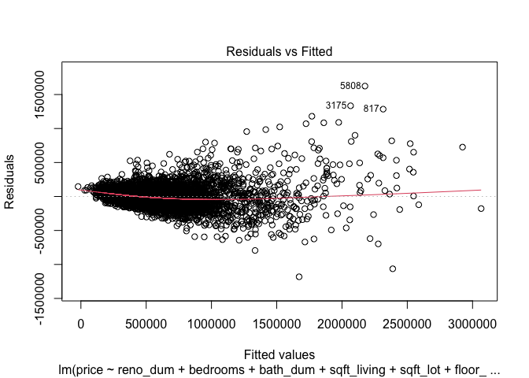<!-- -->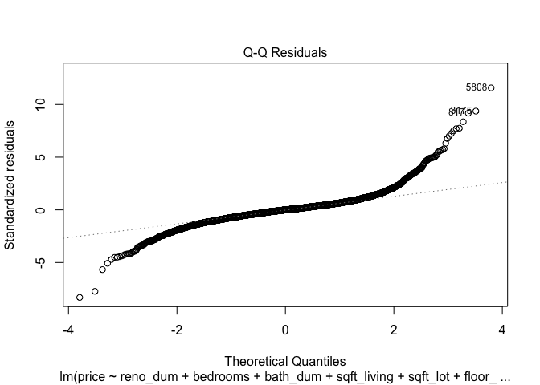<!-- -->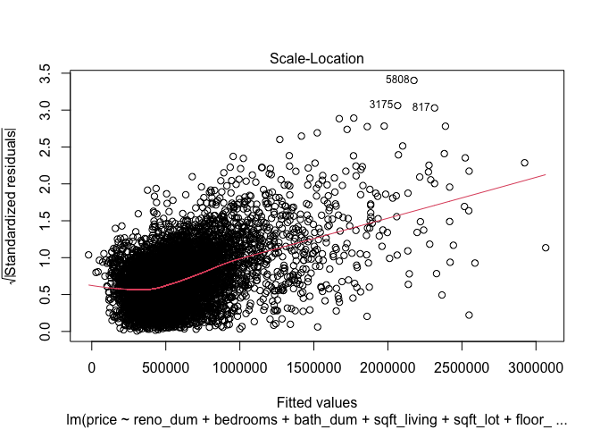<!-- -->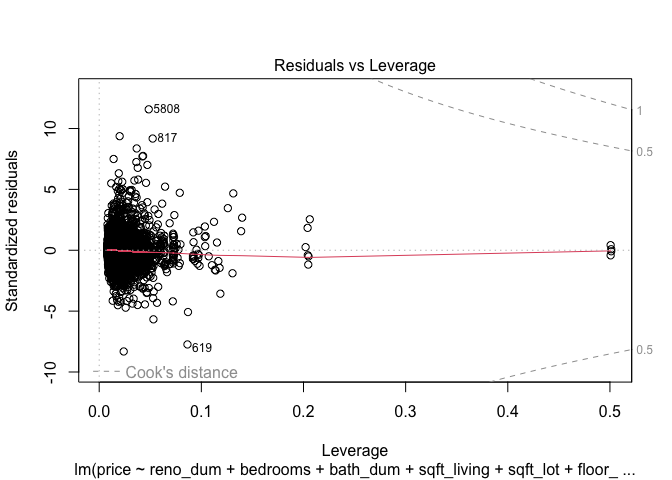<!-- -->

## Visualize Model Results

### Predicted Prices vs. Observed Prices


### Map of Residuals


# Conclusion

